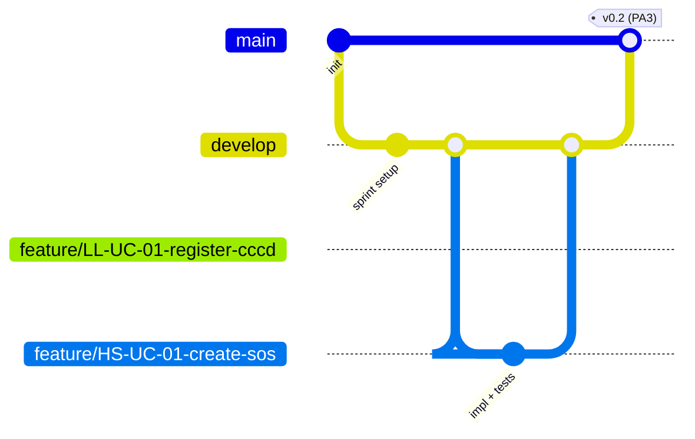

# LifeLine — Coding Conventions
> **Document Purpose**: Foundation input for Spec-Kit `Constitution.md`
> **Project**: LifeLine — Comprehensive Blood Donation Platform
> **Team**: Sanguine (Team 05) | CSC13002
> **Derived From**: `ProjectPlan.md` (team structure, sprint cadence, small-team/no-budget constraints), `SystemArchitecture.md`
> **Version**: 1.0 (Draft for Spec-Kit ingestion)

---

## 1. Guiding Principles

Because Sanguine is a **5-person, full-stack team** working across **two runtimes (Node.js core + Python AI service)** with **no dedicated QA/DevOps role** and a **13-week deadline**, these conventions optimize for:

1. **Predictability over cleverness** — anyone on the team can open any module and understand it in minutes.
2. **Parallel-safe boundaries** — Functional Groups (FGs) map to isolated folders/modules so 5 people can work concurrently without constant merge conflicts (per `ProjectPlan.md §4.4` FG ownership table).
3. **Traceability to Spec-Kit artifacts** — every module/branch/commit should be traceable back to a Use Case ID (e.g., `LL-UC-07`, `HS-UC-01`) so Spec-Kit-generated tests and specs stay aligned with code.

---

## 2. Naming Conventions

### 2.1 General Rules
| Element | Convention | Example |
| :--- | :--- | :--- |
| Variables, function names (JavaScript) | `camelCase` | `getDonorEligibility()`, `campaignCapacity` |
| Variables, function names (Python) | `snake_case` | `get_ranked_donors()`, `search_radius_km` |
| Classes / React Components | `PascalCase` | `CampaignCard.jsx`, `SOSEvaluationService` |
| Constants (immutable, config-level) | `UPPER_SNAKE_CASE` | `DONATION_INTERVAL_DAYS`, `MAX_LOGIN_ATTEMPTS` |
| MongoDB collections | `snake_case`, plural | `donor_profiles`, `sos_evaluation_logs` |
| Mongoose model names | `PascalCase`, singular | `DonorProfile`, `SOSEvaluationLog` |
| REST endpoints | `kebab-case`, plural nouns, versioned | `/api/v1/sos-requests`, `/api/v1/blood-bags` |
| Environment variables | `UPPER_SNAKE_CASE` | `MONGODB_URI`, `CLOUDINARY_API_KEY` |
| Files (React components) | `PascalCase.jsx` | `AppointmentDetail.jsx` |
| Files (non-component JavaScript) | `camelCase.js` | `sosEvaluationService.js` |
| Files (Python) | `snake_case.py` | `sos_matching_engine.py` |
| Boolean variables/fields | prefixed `is`/`has`/`can` | `isEligible`, `hasConsent`, `canBroadcast` |
| Git branches | see §4 | `feature/LL-UC-07-schedule-appointment` |

### 2.2 Domain-Specific Naming
To keep code searchable against the Use-Case Spec and this schema, **use the exact original English terms from the source documents** — do not invent synonyms:

- Use `SOSRequest`, not `EmergencyRequest` or `UrgentRequest`.
- Use `ETicket`, not `Ticket` or `QRTicket`.
- Use `ScreeningForm`, not `HealthForm`.
- Use `DigitalDonorRecord`, not `DonorRecord` or `Roster`.
- Use `bloodType` (not `bloodGroup`) for donor/bag fields, matching `DatabaseSchema.md`; reserve `targetBloodGroups` only for the Campaign entity's array field, matching the source Use-Case wording.

### 2.3 Commit Messages
Conventional Commits, referencing the Use Case ID where applicable:

```
<type>(<scope>): <short description> [<UC-ID>]

feat(booking): enforce 84-day eligibility rule [LL-UC-07]
fix(sos): correct radius expansion increment [SYS-UC-04]
docs(architecture): update SOS sequence diagram
chore(ci): add lint step to GitHub Actions
```
Types: `feat`, `fix`, `docs`, `refactor`, `test`, `chore`, `style`, `perf`.

---

## 3. Project Folder Structure

This section follows the **actual repository layout already in use on the `dev` branch** (top-level `docs/` for artifacts, top-level `src/` for code, `.specify/` for Spec-Kit's own state). The module boundaries from `SystemArchitecture.md §4` are nested **inside** `src/`, and Spec-Kit's generated feature artifacts (`spec.md`, `plan.md`, `tasks.md`, etc.) live in a new `src/specs/` folder rather than mixed into `docs/`.

```
lifeline/
├── docs/                              # human-authored project documentation
│   ├── requirements/                  # vision document, use cases
│   │   ├── vision.md
│   │   ├── UseCaseSpec.md
│   │   └── Proposal.md
│   ├── analysis-and-design/           # software architecture, diagrams, UI design
│   │   ├── SystemArchitecture.md
│   │   ├── DatabaseSchema.md
│   │   └── ui-design/                 # wireframes, mockups, Figma exports
│   ├── management/                    # planning docs & reports, one folder per PA (sprint)
│   │   ├── PA1/
│   │   │   ├── Proposal.pdf
│   │   │   ├── Sprint 1 Planning Meeting Minutes.pdf
│   │   │   ├── Sprint 1 Planning Report.pdf
│   │   │   ├── Sprint 1 Review Report.pdf
│   │   │   ├── Weekly Scrum Meeting Minutes.pdf
│   │   │   ├── survey.pdf
│   │   │   └── teamcontract.pdf
│   │   ├── PA2/
│   │   ├── PA3/
│   │   └── ...
│   └── test/                          # test plan, test cases, test reports
│
├── src/                                # all source code
│   ├── frontend/                       # React + Tailwind CSS SPA
│   │   ├── src/
│   │   │   ├── modules/                # 1 folder per Functional Group (mirrors backend)
│   │   │   │   ├── auth-account/
│   │   │   │   ├── booking-location/
│   │   │   │   ├── campaign-mgmt/
│   │   │   │   ├── blood-inventory/
│   │   │   │   ├── sos-request/
│   │   │   │   ├── notifications/
│   │   │   │   ├── impact-tracking/
│   │   │   │   ├── ai-chatbot/
│   │   │   │   ├── content-news/
│   │   │   │   └── admin/
│   │   │   │       # each module folder: components/, hooks/, api/, types/
│   │   │   ├── shared/                 # cross-module UI kit, shared hooks, utils
│   │   │   │   ├── components/
│   │   │   │   ├── hooks/
│   │   │   │   └── lib/
│   │   │   ├── routes/                 # route definitions per role (Donor/Staff/Hospital/Admin)
│   │   │   ├── i18n/                   # en.json, vi.json
│   │   │   └── App.jsx
│   │   └── package.json
│   │
│   ├── backend-core/                   # Node.js modular monolith
│   │   ├── src/
│   │   │   ├── modules/                # 1 folder per Functional Group
│   │   │   │   ├── auth-account/
│   │   │   │   │   ├── auth-account.routes.js
│   │   │   │   │   ├── auth-account.controller.js
│   │   │   │   │   ├── auth-account.service.js
│   │   │   │   │   ├── auth-account.model.js
│   │   │   │   │   └── auth-account.test.js
│   │   │   │   ├── booking-location/
│   │   │   │   ├── campaign-mgmt/
│   │   │   │   ├── blood-inventory/
│   │   │   │   ├── sos-request/
│   │   │   │   ├── notification-engine/
│   │   │   │   ├── impact-tracking/
│   │   │   │   ├── automation/         # ScreeningForm, ETicket, DigitalDonorRecord
│   │   │   │   ├── content-news/
│   │   │   │   ├── admin/
│   │   │   │   └── ai-gateway/         # thin proxy to Python AI service
│   │   │   ├── shared/                 # middleware, error handlers, validators, constants
│   │   │   ├── config/                 # env loading, DB connection, queue setup
│   │   │   └── app.js
│   │   ├── tests/                      # integration tests (module-crossing flows, e.g. SOS end-to-end)
│   │   └── package.json
│   │
│   ├── ai-service/                     # Python FastAPI AI/ML service
│   │   ├── app/
│   │   │   ├── chatbot/                # RAG pipeline (CB-UC-01)
│   │   │   ├── ocr/                    # CCCD/Passport extraction (LL-UC-01)
│   │   │   ├── sos_matching/           # scoring & prioritization (SYS-UC-04)
│   │   │   ├── shared/                 # embeddings client, LLM client, config
│   │   │   └── main.py
│   │   ├── tests/
│   │   └── requirements.txt
│   │
│   └── specs/                          # Spec-Kit generated artifacts, one folder per feature
│       ├── LL-UC-01-register-cccd/
│       │   ├── spec.md
│       │   ├── plan.md
│       │   └── tasks.md
│       ├── HS-UC-01-create-sos-request/
│       │   ├── spec.md
│       │   ├── plan.md
│       │   └── tasks.md
│       └── ...                         # 1 subfolder per Spec-Kit feature run, named after the owning UC-ID
│
├── .specify/                           # Spec-Kit internal state (generated by `speckit` CLI, do not hand-edit)
│   └── memory/
│       └── constitution.md             # generated FROM SystemArchitecture.md + CodingConventions.md
│
├── .github/workflows/                  # CI pipelines (lint, test, build)
├── .gitignore
└── README.md
```

**Notes on this structure:**
- `docs/analysis-and-design/` is the canonical home for `SystemArchitecture.md` and `DatabaseSchema.md` — these are the two files that feed `.specify/memory/constitution.md` and `src/specs/*/spec.md` when running Spec-Kit.
- `docs/requirements/` is the canonical home for `vision.md`, `UseCaseSpec.md`, and `Proposal.md` (the inputs already provided).
- `src/specs/` is new versus the earlier draft: each Spec-Kit run against a Use Case (or a cluster of related Use Cases) gets its own subfolder named after the driving UC-ID, so `spec.md`/`plan.md`/`tasks.md` stay traceable back to `docs/requirements/UseCaseSpec.md` and don't collide across features as the team runs Spec-Kit repeatedly through the sprints.
- `.specify/memory/constitution.md` is Spec-Kit-managed; humans should edit `SystemArchitecture.md` and `CodingConventions.md` in `docs/analysis-and-design/` and regenerate the constitution, rather than hand-editing it directly.

**Rule of thumb:** if a change touches only one Functional Group's folder in `src/frontend/`, `src/backend-core/`, and/or `src/ai-service/`, it should be reviewable and mergeable independently of other FGs' work.

---

## 4. Git Branching Strategy (Git Flow, simplified for a 5-person academic team)

### 4.1 Branch Types

| Branch | Purpose | Naming | Merges Into |
| :--- | :--- | :--- | :--- |
| `main` | Always deployable; tagged per sprint release (v0.1, v0.2 …) | — | — |
| `develop` | Integration branch; latest completed work for the current sprint | — | `main` (end of sprint) |
| `feature/*` | One Functional Group's use case(s) | `feature/<UC-ID>-<short-desc>` e.g. `feature/LL-UC-01-register-cccd` | `develop` |
| `bugfix/*` | Non-urgent fix found during a sprint | `bugfix/<UC-ID>-<short-desc>` | `develop` |
| `hotfix/*` | Urgent fix needed on `main` (e.g., demo-breaking bug) | `hotfix/<short-desc>` | `main` **and** `develop` |
| `docs/*` | Documentation-only changes (Vision, Spec-Kit artifacts) | `docs/<short-desc>` | `develop` |

### 4.2 Workflow



1. Every sprint (PA), create/refresh `develop` from `main`.
2. Each contributor branches `feature/<UC-ID>-<desc>` off `develop` for the Use Case(s) they own (per the FG ownership table in `ProjectPlan.md §4.4`).
3. Open a Pull Request into `develop` **only when**: code builds, unit tests for the touched module pass, and the PR description links the relevant Use Case ID(s).
4. **At least one other team member reviews and approves** before merge (5-person team → simple 1-reviewer rule, no bottleneck).
5. At the end of each sprint, `develop` is merged into `main` and tagged (matches `ProjectPlan.md §4.3` release table: v0.1 Alpha at PA3, etc.).
6. `hotfix/*` branches are the only branches allowed to merge directly into `main` outside the sprint-end merge, and must also be merged back into `develop` immediately.

### 4.3 Pull Request Rules
- PR title format: `[<UC-ID>] <short description>` (e.g., `[BC-UC-15] Implement Stock In flow`).
- No direct commits to `main` or `develop` — all changes go through a PR.
- CI (lint + unit tests) must pass before merge is allowed.
- Cross-module PRs (touching more than one FG folder) require review from an owner of **each** affected module.

---

## 5. Code Style & Quality Baseline

| Concern | Tooling / Rule |
| :--- | :--- |
| JavaScript linting | ESLint (Airbnb or Standard config) + Prettier, enforced via pre-commit hook (Husky) |
| Python linting | Ruff or Flake8 + Black formatter |
| Type safety | Plain JavaScript on the Node.js core and React frontend, per standard MERN convention; runtime input validation is done via Zod/Joi schemas (see "API contracts" below) rather than compile-time types. JSDoc comments (`@param`, `@returns`) are encouraged on service/controller functions to document expected shapes for editor autocomplete, without requiring a build step. Pydantic models are still used on the FastAPI (Python) AI service, since Python type hints there are idiomatic and add no extra tooling. |
| Testing | Jest (Node.js core, ≥1 test per module's core business rule, e.g. 84-day validation, duplicate booking check); Pytest (AI service) |
| API contracts | Every module exposes its Express routes + Zod/Joi schemas as the single source of truth for request/response validation (this is what replaces compile-time typing on the JS side); Spec-Kit `Tasks.md` generation should reference these schemas rather than duplicating them |
| Secrets | Never committed; `.env.example` checked in, real `.env` gitignored; secrets managed via hosting provider's environment variable UI (Render/Vercel) given the no-budget constraint (no dedicated secrets manager) |
| Error handling | Centralized error middleware (Node core) returning a consistent JSON error shape `{ code, message, details }`; no silent catch blocks |
| Logging | Structured (JSON) logs via `pino` (Node) / standard `logging` (Python); never log passwords, full CCCD numbers, or raw QR payloads (`NFR-S-03`) |

---

## 6. Definition of Done (per Use Case / Feature)

A Functional Group's use case is considered "done" for a sprint only when:

1. Code lives in the correct module folder (per §3) and follows naming conventions (§2).
2. Basic Flow **and** documented Alternative Flows from the Use-Case Spec are implemented or explicitly deferred with a linked issue.
3. Unit tests cover the core business rule(s) referenced in "Special Requirements" (e.g., NFR performance/security constraints).
4. PR merged into `develop` following the review rule in §4.3.
5. Relevant Spec-Kit artifact (`spec.md` / `tasks.md` entry) is updated or regenerated to reflect the implemented behavior.

---

## 7. Open Items for Team Confirmation

- **Decided**: the team uses **plain JavaScript** (ES2022+, CommonJS or ESM — pick one and apply consistently) across `frontend` and `backend-core`, matching standard MERN convention and `ProjectPlan.md` risk R4 (team still learning React/MongoDB/JavaScript). Type-related bugs across modules are mitigated instead via: (1) Zod/Joi request/response validation at every route boundary, (2) JSDoc annotations on shared service functions, and (3) the module-boundary rule in §3 that limits how much cross-module surface area any one contributor touches.
-  **Decided** : the team uses a single monorepo . `frontend/`, `backend-core/`, and `ai-service/` all live inside the same Git repository (as laid out in §3), sharing one main/ develop history and one set of Pull Requests. This is the right fit given the team's size (5 people) and the semester timeline: a single PR can span a backend change and its matching frontend/AI-service consumer without coordinating across multiple repos, and there is only one clone/checkout to keep in sync. GitHub Actions workflows under `.github/workflows/` should still use `paths:` filters (eg, only run the Python test job when files under `src/ai-service/**` change) so CI stays fast despite the shared repo.