# LifeLine — Database Schema
> **Document Purpose**: Foundation input for Spec-Kit `Spec.md`
> **Project**: LifeLine — Comprehensive Blood Donation Platform
> **Database**: MongoDB Atlas (document model; relationships expressed via ObjectId references + selective embedding)
> **Derived From**: `UseCaseSpec.md` (entities/fields extracted from Basic/Alternative Flows), `vision.md`, `Proposal.md`
> **Version**: 1.0 (Draft for Spec-Kit ingestion)

---

## 1. Entity-Relationship Diagram

```mermaid
erDiagram
    USER ||--o| DONOR_PROFILE : "extends (role=Donor)"
    USER ||--o| STAFF_PROFILE : "extends (role=BloodCenterStaff/HospitalStaff)"
    USER ||--o{ AUDIT_LOG : "performs"
    USER ||--o{ NOTIFICATION : "receives"

    BLOOD_CENTER ||--o{ STAFF_PROFILE : employs
    BLOOD_CENTER ||--o{ CAMPAIGN : organizes
    BLOOD_CENTER ||--o{ BLOOD_BAG : stores
    HOSPITAL ||--o{ STAFF_PROFILE : employs
    HOSPITAL ||--o{ SOS_REQUEST : submits

    DONOR_PROFILE ||--o{ APPOINTMENT : books
    DONOR_PROFILE ||--o{ DONATION_TIMELINE_ENTRY : has
    DONOR_PROFILE ||--o{ BADGE : earns
    DONOR_PROFILE ||--o| DONOR_LEVEL : has
    DONOR_PROFILE ||--o| NOTIFICATION_PREFERENCE : configures
    DONOR_PROFILE ||--o{ CHAT_CONVERSATION : starts
    DONOR_PROFILE ||--o| BLOOD_BAG : "is source of"

    CAMPAIGN ||--o{ APPOINTMENT : "receives bookings for"
    CAMPAIGN ||--o{ BLOOD_BAG : "yields (donor source)"

    APPOINTMENT ||--|| SCREENING_FORM : generates
    APPOINTMENT ||--|| E_TICKET : generates
    APPOINTMENT ||--|| DIGITAL_DONOR_RECORD : generates

    SOS_REQUEST ||--|| SOS_EVALUATION_LOG : "evaluated via"
    SOS_EVALUATION_LOG }o--o{ BLOOD_CENTER : ranks
    SOS_EVALUATION_LOG }o--o{ DONOR_PROFILE : ranks

    STAFF_PROFILE ||--o{ ARTICLE : authors
    ARTICLE ||--o{ NOTIFICATION : triggers

    CHAT_CONVERSATION ||--o{ CHAT_MESSAGE : contains
    KNOWLEDGE_BASE_DOC ||--o{ CHAT_MESSAGE : "retrieved for (RAG)"

    ROLE ||--o{ PERMISSION : grants
    USER }o--|| ROLE : "assigned"

    USER {
        ObjectId _id PK
        string idDocumentNumber UK
        string email UK
        string phone
        string passwordHash
        string role "Donor|BloodCenterStaff|HospitalStaff|Administrator"
        string accountStatus "PendingVerification|Active|Suspended"
        date createdAt
        date lastLoginAt
    }

    DONOR_PROFILE {
        ObjectId _id PK
        ObjectId userId FK
        string fullName
        date dateOfBirth
        string bloodType
        string address
        GeoJSONPoint location "2dsphere indexed"
        date lastDonationDate
        int totalDonations
        int xp
        int donorLevel
        boolean emergencyOptIn
        string avatarUrl "Cloudinary"
    }

    STAFF_PROFILE {
        ObjectId _id PK
        ObjectId userId FK
        string organizationType "BloodCenter|Hospital"
        ObjectId organizationId FK
        string position
    }

    BLOOD_CENTER {
        ObjectId _id PK
        string name
        string address
        GeoJSONPoint location "2dsphere indexed"
        string contactPhone
        string operatingHours
    }

    HOSPITAL {
        ObjectId _id PK
        string name
        string address
        GeoJSONPoint location "2dsphere indexed"
        string contactPhone
        boolean isVerified
    }

    CAMPAIGN {
        ObjectId _id PK
        ObjectId bloodCenterId FK
        string name
        string venue
        GeoJSONPoint location "2dsphere indexed"
        date startDateTime
        date endDateTime
        array targetBloodGroups
        int capacity
        int registeredCount
        string status "Draft|Active|Full|Closed|Cancelled"
        date createdAt
    }

    APPOINTMENT {
        ObjectId _id PK
        ObjectId donorId FK
        ObjectId campaignId FK
        date appointmentDate
        string timeSlot
        string status "Scheduled|CheckedIn|Completed|Cancelled|NoShow"
        ObjectId screeningFormId FK
        ObjectId eTicketId FK
        date createdAt
    }

    SCREENING_FORM {
        ObjectId _id PK
        ObjectId appointmentId FK
        object medicalHistory
        string currentHealthStatus
        string recentTravel
        string medicationHistory
        boolean consentGiven
        string eligibilityFlag "Eligible|RequiresReview"
        date submittedAt
    }

    E_TICKET {
        ObjectId _id PK
        ObjectId appointmentId FK
        string ticketCode UK
        string qrPayloadSigned "asymmetric-signed payload"
        string fileUrl "Cloudinary PDF/Image"
        date issuedAt
    }

    DIGITAL_DONOR_RECORD {
        ObjectId _id PK
        ObjectId appointmentId FK
        ObjectId donorId FK
        object screeningSummary
        string donationStatus "Registered|CheckedIn|Eligible|Completed|Ineligible"
        string clinicalNotes
        date lastUpdatedAt
    }

    BLOOD_BAG {
        ObjectId _id PK
        string bagCode UK
        ObjectId bloodCenterId FK
        string bloodType
        float volumeMl
        date collectionDate
        date expiryDate
        string storageLocation
        string status "Available|Reserved|Used|Expired|Discarded"
        ObjectId donorSourceId FK "nullable"
        ObjectId campaignSourceId FK "nullable"
        object testResults
        array statusHistory
    }

    SOS_REQUEST {
        ObjectId _id PK
        ObjectId hospitalId FK
        ObjectId createdByStaffId FK
        string bloodType
        float requiredQuantityMl
        string urgencyLevel "Critical|High|Medium"
        string patientReference
        date fulfillmentDeadline
        string status "Pending|EvaluationInProgress|NotificationsDispatched|Fulfilled|Expired|Cancelled|EvaluationFailed"
        date createdAt
    }

    SOS_EVALUATION_LOG {
        ObjectId _id PK
        ObjectId sosRequestId FK
        array rankedBloodCenters "centerId, score, inventoryVolume, distanceKm"
        array rankedDonors "donorId, score, distanceKm, lastDonationDate, engagementTier"
        float searchRadiusKmUsed
        int radiusExpansionCount
        object notificationDeliveryStats
        date evaluatedAt
        boolean immutable "true (append-only)"
    }

    NOTIFICATION {
        ObjectId _id PK
        ObjectId recipientUserId FK
        string type "Routine|SOS|Campaign|System"
        string channel "Email|WebPush"
        string title
        string body
        ObjectId sourceRefId "polymorphic: Appointment/Campaign/SOSRequest/Article"
        string sourceRefType
        string deliveryStatus "Pending|Sent|Failed|Retried"
        date createdAt
        date readAt
    }

    NOTIFICATION_PREFERENCE {
        ObjectId _id PK
        ObjectId donorId FK
        boolean sosEmergencyAlerts
        boolean appointmentUpdates
        boolean campaignNews
        date updatedAt
    }

    ARTICLE {
        ObjectId _id PK
        ObjectId authorStaffId FK
        string title
        string bodyContent
        array imageUrls "Cloudinary"
        string status "Draft|Published|Unpublished"
        date publishedAt
    }

    DONATION_TIMELINE_ENTRY {
        ObjectId _id PK
        ObjectId donorId FK
        string eventType "Registration|EligibilityConfirmed|DonationCompleted|RecoveryFollowUp|AchievementUnlocked"
        ObjectId relatedRefId
        date eventDate
        string description
    }

    BADGE {
        ObjectId _id PK
        ObjectId donorId FK
        string badgeType "FirstDonation|FiveDonations|EmergencyResponder|LoyalDonor"
        date awardedAt
    }

    DONOR_LEVEL {
        ObjectId _id PK
        ObjectId donorId FK
        int currentLevel
        int currentXp
        int xpToNextLevel
        string treeStage
    }

    CHAT_CONVERSATION {
        ObjectId _id PK
        ObjectId donorId FK "nullable for anonymous"
        date startedAt
        date lastActivityAt
        string status "Active|TimedOut|Closed"
    }

    CHAT_MESSAGE {
        ObjectId _id PK
        ObjectId conversationId FK
        string sender "User|AI"
        string contentText
        object richContent "campaign card, action buttons"
        float confidenceScore
        date sentAt
    }

    KNOWLEDGE_BASE_DOC {
        ObjectId _id PK
        string title
        string sourceContent
        array embeddingVector "Atlas Vector Search index"
        string category "Eligibility|PreDonation|PostDonation|General"
        date updatedAt
    }

    ROLE {
        ObjectId _id PK
        string name "Donor|BloodCenterStaff|HospitalStaff|Administrator"
        array permissionIds FK
    }

    PERMISSION {
        ObjectId _id PK
        string action
        string resource
    }

    AUDIT_LOG {
        ObjectId _id PK
        ObjectId actorUserId FK
        string action
        string resourceType
        ObjectId resourceId
        object previousValue
        object newValue
        date timestamp
        boolean immutable "true (append-only)"
    }

    SYSTEM_CONFIGURATION {
        ObjectId _id PK
        string key UK
        object value
        string description
        date updatedAt
        ObjectId updatedByAdminId FK
    }
```

---

## 2. Entity Definitions (Field-Level Detail)

### 2.1 `User` (base authentication entity — collection: `users`)
Traced to LL-UC-01, LL-UC-02, LL-UC-04, AD-UC-01/02.

| Field | Type | Notes |
| :--- | :--- | :--- |
| `_id` | ObjectId | PK |
| `idDocumentNumber` | string, unique, indexed | Used as login identifier (LL-UC-02); AF-02 in LL-UC-01 checks duplicates on this field |
| `email` | string, unique, indexed | Verification + notifications |
| `phone` | string | Contact / SOS targeting |
| `passwordHash` | string | bcrypt, per Special Requirements of LL-UC-01 |
| `role` | enum(`Donor`,`BloodCenterStaff`,`HospitalStaff`,`Administrator`) | Drives RBAC (System User Roles table, Proposal §4) |
| `accountStatus` | enum(`PendingVerification`,`Active`,`Suspended`) | LL-UC-02 AF-02/AF-03; AD-UC-02 |
| `failedLoginAttempts` | int | LL-UC-02 AF-05 lockout |
| `sessionExpiresAt` | date | `NFR-S-05`: 30-min inactivity expiry |
| `createdAt` / `updatedAt` | date | audit |

### 2.2 `DonorProfile` (collection: `donor_profiles`)
Traced to LL-UC-05, DN-UC-01/02/03, CB-UC-01 AF-02.

| Field | Type | Notes |
| :--- | :--- | :--- |
| `userId` | ObjectId FK → User | 1:1 |
| `fullName`, `dateOfBirth` | string / date | Extracted via OCR at registration (LL-UC-01) |
| `bloodType` | string | Used in eligibility, map filters, SOS matching |
| `address` | string | Profile Management (Proposal §3.1.1) |
| `location` | GeoJSON Point, `2dsphere` indexed | Powers LL-UC-06 map & SYS-UC-04 donor radius search |
| `lastDonationDate` | date | Drives 84-day rule validation (LL-UC-07 Step 3) |
| `totalDonations` | int | Donation Timeline / Statistics |
| `xp`, `donorLevel` | int | Gamification (DN-UC-03) |
| `emergencyOptIn` | boolean | SYS-UC-04 business rule: "notification must be opt-in" |
| `avatarUrl` | string (Cloudinary URL) | Profile display |

### 2.3 `Campaign` (collection: `campaigns`)
Traced to BC-UC-01…03, LL-UC-06.

| Field | Type | Notes |
| :--- | :--- | :--- |
| `bloodCenterId` | ObjectId FK → BloodCenter | Organizer |
| `name`, `venue` | string | BC-UC-01 Step 4 |
| `location` | GeoJSON Point, `2dsphere` indexed | Map discovery, crowding-level markers |
| `startDateTime`, `endDateTime` | date | Schedule |
| `targetBloodGroups` | array\<string\> | Configured per campaign |
| `capacity`, `registeredCount` | int | Enforces registration limits (BC-UC-01, AF-04 in LL-UC-06 "Full Capacity") |
| `status` | enum(`Draft`,`Active`,`Full`,`Closed`,`Cancelled`) | Drives map marker color/crowding |

### 2.4 `Appointment` (collection: `appointments`)
Traced to LL-UC-07, LL-UC-08, LL-UC-09.

| Field | Type | Notes |
| :--- | :--- | :--- |
| `donorId` | ObjectId FK → DonorProfile | |
| `campaignId` | ObjectId FK → Campaign | |
| `appointmentDate`, `timeSlot` | date / string | LL-UC-07 Step 2 |
| `status` | enum(`Scheduled`,`CheckedIn`,`Completed`,`Cancelled`,`NoShow`) | Mirrors Digital Donor Record lifecycle |
| `screeningFormId` | ObjectId FK → ScreeningForm | 1:1, generated by SYS-UC-01 |
| `eTicketId` | ObjectId FK → ETicket | 1:1, generated by SYS-UC-02 |
| **Unique constraint** | `(donorId, overlapping time window)` | Enforced at application layer per LL-UC-07 Step 4 (duplicate booking check) |

### 2.5 `ScreeningForm` (collection: `screening_forms`)
Traced to SYS-UC-01, LL-UC-07 Steps 5–6.

| Field | Type | Notes |
| :--- | :--- | :--- |
| `appointmentId` | ObjectId FK → Appointment | 1:1 |
| `medicalHistory` | object | Free-form structured health data |
| `currentHealthStatus`, `recentTravel`, `medicationHistory` | string | Per vision §5.4.1 |
| `consentGiven` | boolean | Required before booking finalization |
| `eligibilityFlag` | enum(`Eligible`,`RequiresReview`) | Auto-computed, feeds Digital Donor Record |

### 2.6 `ETicket` (collection: `e_tickets`)
Traced to SYS-UC-02, LL-UC-10.

| Field | Type | Notes |
| :--- | :--- | :--- |
| `appointmentId` | ObjectId FK → Appointment | 1:1 |
| `ticketCode` | string, unique | Human-readable ID |
| `qrPayloadSigned` | string | Asymmetrically signed payload (anti-forgery, per Special Requirements) |
| `fileUrl` | string (Cloudinary) | PDF/Image download (LL-UC-10) |
| `issuedAt` | date | |

### 2.7 `DigitalDonorRecord` (collection: `digital_donor_records`)
Traced to SYS-UC-03.

| Field | Type | Notes |
| :--- | :--- | :--- |
| `appointmentId`, `donorId` | ObjectId FK | Cross-linked per vision §5.4.2 |
| `screeningSummary` | object | Consolidated from ScreeningForm |
| `donationStatus` | enum(`Registered`,`CheckedIn`,`Eligible`,`Completed`,`Ineligible`) | Real-time updatable by staff |
| `clinicalNotes` | string | On-site staff annotations |

### 2.8 `BloodBag` (collection: `blood_bags`)
Traced to BC-UC-12…17.

| Field | Type | Notes |
| :--- | :--- | :--- |
| `bagCode` | string, unique, system-generated | BC-UC-15 Step 8 |
| `bloodCenterId` | ObjectId FK → BloodCenter | Storage owner |
| `bloodType`, `volumeMl` | string / float | |
| `collectionDate`, `expiryDate` | date | Validated: expiry > collection (BC-UC-15 AF-02) |
| `storageLocation` | string | |
| `status` | enum(`Available`,`Reserved`,`Used`,`Expired`,`Discarded`) | State machine; Expired bags are view-only (BC-UC-14 AF-02) |
| `donorSourceId` | ObjectId FK → DonorProfile, nullable | "donor source" filter in BC-UC-13 |
| `campaignSourceId` | ObjectId FK → Campaign, nullable | |
| `testResults` | object | Displayed in BC-UC-14 |
| `statusHistory` | array\<{status, changedBy, changedAt}\> | Immutable audit trail, BC-UC-14 |

### 2.9 `SOSRequest` (collection: `sos_requests`)
Traced to HS-UC-01…03.

| Field | Type | Notes |
| :--- | :--- | :--- |
| `hospitalId` | ObjectId FK → Hospital | |
| `createdByStaffId` | ObjectId FK → StaffProfile | |
| `bloodType`, `requiredQuantityMl`, `urgencyLevel` | string / float / enum | HS-UC-01 Step 6 |
| `patientReference` | string | |
| `fulfillmentDeadline` | date | |
| `status` | enum(`Pending`,`EvaluationInProgress`,`NotificationsDispatched`,`Fulfilled`,`Expired`,`Cancelled`,`EvaluationFailed`) | Drives HS-UC-02 monitoring |

### 2.10 `SOSEvaluationLog` (collection: `sos_evaluation_logs`)
Traced to SYS-UC-04. **Append-only / immutable** per `NFR-S-04`.

| Field | Type | Notes |
| :--- | :--- | :--- |
| `sosRequestId` | ObjectId FK → SOSRequest | 1:1 per evaluation run (re-evaluations create new log entries, AF-03) |
| `rankedBloodCenters` | array\<{centerId, score, inventoryVolume, distanceKm}\> | Composite score per Proposal §3.4.2 |
| `rankedDonors` | array\<{donorId, score, distanceKm, lastDonationDate, engagementTier}\> | |
| `searchRadiusKmUsed`, `radiusExpansionCount` | float / int | AF-02 radius expansion tracking |
| `notificationDeliveryStats` | object | Success/failure counts per SYS-UC-05 |

### 2.11 `Notification` (collection: `notifications`)
Traced to NT-UC-01/02, SOS-UC-01/02.

| Field | Type | Notes |
| :--- | :--- | :--- |
| `recipientUserId` | ObjectId FK → User | |
| `type` | enum(`Routine`,`SOS`,`Campaign`,`System`) | Determines visual treatment (`NFR-U-03`) |
| `channel` | enum(`Email`,`WebPush`) | Channel: enum(Email, WebPush) |
| `sourceRefId` / `sourceRefType` | ObjectId / string | Polymorphic link to Appointment/Campaign/SOSRequest/Article |
| `deliveryStatus` | enum(`Pending`,`Sent`,`Failed`,`Retried`) | NT-UC-01 AF-02 fallback/retry |

### 2.12 `NotificationPreference` (collection: `notification_preferences`)
Traced to NT-UC-02.

| Field | Type | Notes |
| :--- | :--- | :--- |
| `donorId` | ObjectId FK → DonorProfile | 1:1 |
| `sosEmergencyAlerts`, `appointmentUpdates`, `campaignNews` | boolean | Exactly the 3 toggles specified in NT-UC-02 Step 5 |

### 2.13 `Article` (collection: `articles`)
Traced to BC-UC-08…11, NF-UC-01/02.

| Field | Type | Notes |
| :--- | :--- | :--- |
| `authorStaffId` | ObjectId FK → StaffProfile | |
| `title`, `bodyContent` | string | |
| `imageUrls` | array\<string\> (Cloudinary) | |
| `status` | enum(`Draft`,`Published`,`Unpublished`) | Drives 404 modal in NF-UC-02 AF-01 when unpublished |

### 2.14 `DonationTimelineEntry`, `Badge`, `DonorLevel`
Traced to DN-UC-01/02/03 (Gamification / Journey).

| Entity | Key Fields | Notes |
| :--- | :--- | :--- |
| `DonationTimelineEntry` | `donorId`, `eventType`, `relatedRefId`, `eventDate` | Chronological feed of registrations/eligibility/completions/follow-ups |
| `Badge` | `donorId`, `badgeType`, `awardedAt` | Auto-awarded on milestone events |
| `DonorLevel` | `donorId`, `currentLevel`, `currentXp`, `treeStage` | 1:1 with DonorProfile; could be embedded, kept separate for update-frequency isolation |

### 2.15 `ChatConversation` / `ChatMessage` / `KnowledgeBaseDoc`
Traced to CB-UC-01.

| Entity | Key Fields | Notes |
| :--- | :--- | :--- |
| `ChatConversation` | `donorId` (nullable — anonymous allowed), `status` | AF-05 session timeout preserves history visually |
| `ChatMessage` | `conversationId`, `sender`, `contentText`, `richContent` | `richContent` holds Campaign Card / action buttons (AF-03) |
| `KnowledgeBaseDoc` | `title`, `sourceContent`, `embeddingVector`, `category` | Curated medical knowledge base for RAG retrieval; managed outside donor-facing CRUD (content team / admin ingestion pipeline) |

### 2.16 `Role`, `Permission`, `AuditLog`, `SystemConfiguration`
Traced to AD-UC-01…06.

| Entity | Key Fields | Notes |
| :--- | :--- | :--- |
| `Role` | `name`, `permissionIds` | AD-UC-03 |
| `Permission` | `action`, `resource` | Fine-grained RBAC |
| `AuditLog` | `actorUserId`, `action`, `resourceType/Id`, `previousValue`, `newValue`, `timestamp` | **Immutable**, per `NFR-S-04`; backs AD-UC-04 |
| `SystemConfiguration` | `key` (e.g., `donationIntervalDays=84`, `sosInitialRadiusKm`, `sosMaxRadiusKm`), `value` | AD-UC-05/06; referenced by SYS-UC-04's configurable radius rule |

---

## 3. Indexing Notes

| Collection | Index | Purpose |
| :--- | :--- | :--- |
| `users` | unique on `idDocumentNumber`, unique on `email` | Prevent duplicate accounts (LL-UC-01 AF-02/AF-03) |
| `donor_profiles` | `2dsphere` on `location`; compound on `(bloodType, emergencyOptIn)` | SOS donor matching radius queries |
| `campaigns` | `2dsphere` on `location`; index on `status` | Map discovery, "Active only" filter |
| `blood_bags` | compound on `(bloodCenterId, bloodType, status)`; index on `expiryDate` | Inventory statistics, near-expiry warnings (BC-UC-17) |
| `sos_requests` | index on `status`, `hospitalId` | HS-UC-02 monitoring dashboard |
| `notifications` | compound on `(recipientUserId, createdAt desc)` | Notification Center feed (NT-UC-01) |
| `knowledge_base_docs` | Atlas Vector Search index on `embeddingVector` | RAG retrieval for CB-UC-01 |
| `audit_logs` | index on `(resourceType, resourceId, timestamp)` | Fast audit trail lookup, append-only (no update/delete allowed at app layer) |

---

## 4. Notes on Modeling Choices

- **Document model, not strict 3NF**: Some read-heavy aggregates (e.g., `Campaign.registeredCount`, `Notification.sourceRefType` polymorphism) are denormalized deliberately to avoid expensive joins in MongoDB, consistent with `NFR-P-05` (page load ≤3s).
- **Append-only collections** (`sos_evaluation_logs`, `audit_logs`) are modeled as insert-only; the application layer must never issue `update`/`delete` on these to satisfy `NFR-S-04` and `NFR-R-04`.
- **Polymorphic references** (`Notification.sourceRefType`) are used instead of separate notification tables per source, since all notification types share the same delivery/read lifecycle.
- **Open question**: Should `DigitalDonorRecord` be merged into `Appointment` as embedded sub-document instead of a separate collection? Kept separate here because it has an independent update cadence (updated by Blood Center staff on-site, post-booking) and a distinct permission boundary (staff-only write) — recommend confirming with the team before Spec-Kit generates models.
