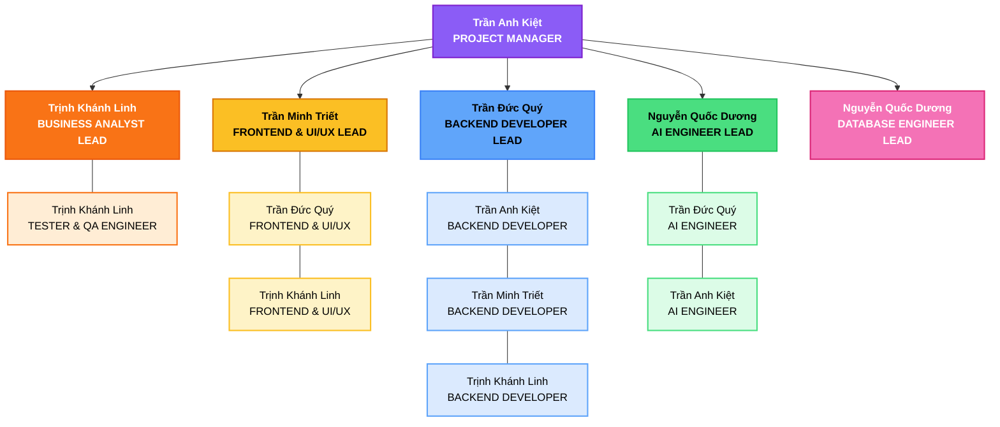

# LifeLine — Comprehensive Blood Donation Platform
> **Document**: Project Plan  
> **Course**: CSC13002 - Introduction to Software Engineering
> **Team**: Sanguine (Team 05)  
> **Version**: 1.2 | **Date**: 11/07/2026  

*Author: Trần Anh Kiệt  |  Reviewer: Trịnh Khánh Linh  |  Editor: Trần Anh Kiệt*

# Table Of Contents
* [LifeLine — Comprehensive Blood Donation Platform](#lifeline--comprehensive-blood-donation-platform)
* [Table Of Contents](#table-of-contents)
* [Revision History](#revision-history)
* [1. Introduction](#1-introduction)
* [2. Project Overview](#2-project-overview)
   * [2.1 Project Purpose, Scope, and Objectives](#21-project-purpose-scope-and-objectives)
   * [2.2 Assumptions and Constraints](#22-assumptions-and-constraints)
* [3. Project Organization](#3-project-organization)
   * [3.1 Team Structure](#31-team-structure)
   * [3.2 Team Roles and Responsibilities](#32-team-roles-and-responsibilities)
   * [3.3 Risk Management](#33-risk-management)
* [4. Project Plan](#4-project-plan)
   * [4.1 Project Schedule Overview](#41-project-schedule-overview)
   * [4.2 Detailed Sprint Plans](#42-detailed-sprint-plans)
      * [4.2.1 Sprint 1 (PA1) – 25 May 2026 to 07 June 2026](#421-sprint-1-pa1--25-may-2026-to-07-june-2026)
      * [4.2.2 Sprint 2 (PA2) – 08 June 2026 to 21 June 2026](#422-sprint-2-pa2--08-june-2026-to-21-june-2026)
      * [4.2.3 Sprint 3 (PA3) – 22 June 2026 to 12 July 2026](#423-sprint-3-pa3--22-june-2026-to-12-july-2026)
      * [4.2.4 Sprint 4 (PA4) – 13 July 2026 to 02 August 2026](#424-sprint-4-pa4--13-july-2026-to-02-august-2026)
      * [4.2.5 Sprint 5 (PA5) – 03 August 2026 to 23 August 2026](#425-sprint-5-pa5--03-august-2026-to-23-august-2026)
   * [4.3 Build Plan](#43-build-plan)
   * [4.4 Functional Groups Implementation Mapping](#44-functional-groups-implementation-mapping)

# Revision History

| Date       | Version | Description                                                                     | Author        |
| :--------- | :------ | :------------------------------------------------------------------------------ | :------------ |
| 05/06/2026 | 1.0     | Initial draft – Project Plan (Roles, Responsibilities, Schedule, Build Plan)    | Trần Anh Kiệt |
| 12/06/2026 | 1.1     | Initial draft – Project Plan (Introduction, Project Overview,  Risk Management) | Trần Anh Kiệt |
| 11/07/2026 | 1.2     | Refined headings, Added due date for tasks | Trần Anh Kiệt |

# 1. Introduction

This document describes the overall plan for the development of LifeLine, a web-based blood donation management platform, developed by Team Sanguine (Group 05) as part of the CSC13002 Introduction to Software Engineering course. It covers the project organization, sprint schedule, risk management strategy, and build plan to guide the team throughout the development lifecycle.

The project applies the Scrum framework, organized into five sprints each corresponding to one Project Assignment (PA1 through PA5). This document serves as the top-level plan used by the Project Manager to direct the team and track progress. It will be updated incrementally as the project evolves and TA feedback is incorporated in subsequent PAs.

The following people use this Project Plan:

+ **The Project Manager** uses it to plan the sprint schedule and resource allocation, and to track progress against milestones.
+ **Team members** use it to understand their responsibilities, task deadlines, and dependencies on other team members’ work.
+  **The Teaching Assistant and course instructors** use it to evaluate the team’s planning quality and provide feedback for subsequent PAs.

# 2. Project Overview

## 2.1 Project Purpose, Scope, and Objectives

The purpose of this project is to develop LifeLine, a modern web-based blood donation management platform that connects donors, blood donation centers, and hospitals within a unified ecosystem. The platform addresses the fragmented and manual nature of current blood donation processes by providing online registration, appointment booking, donation tracking, and emergency blood request notifications.

The scope of the project includes the design and full-stack development of a responsive web application supporting three primary user roles: Donors, Blood Center Staff, and Hospital Staff. The system will also include an AI-powered Q&A assistant for donor guidance, a gamification layer for donor engagement, blood inventory management, and an SOS emergency broadcast system.

The key objectives are:

+ To provide a seamless, accessible platform for donors to register, book appointments, track their donation history, and receive personalized support.

+ To enable blood donation centers to manage campaigns, donor check-ins via QR code, blood inventory, and donor communications from a centralized interface.

+ To allow hospitals to submit SOS blood requests that are instantly broadcast to eligible donors and blood centers via push notifications and email.

+ To integrate an AI-powered donor assistant that provides eligibility guidance, pre- and post-donation advice, and answers frequently asked questions.

+ To foster long-term donor engagement through gamification features including milestone badges, achievement levels, and progress-tracking visualizations.

The final deliverables will include:

+ A fully functional, responsive web application covering all 14 functional groups.

+ A backend system supporting donor records, campaign management, blood inventory, SOS broadcasting, and AI assistant integration.

+ Complete project documentation including Vision Document, Use-Case Model & Specifications, Software Architecture, Test Plan, and Reflective Report.

+ Spec Kit artifacts (constitution.md, generated test cases) for all implemented functional groups.

## 2.2 Assumptions and Constraints

Key assumptions are:

+ Target users (donors, blood center staff, hospital staff, admin) have basic familiarity with web-based applications and smartphones.

+ All five team members will remain available and actively contribute throughout the entire project duration.

+ The team will receive regular feedback from the Teaching Assistant and instructors to validate alignment with course requirements.

+ Third-party services (Maps API, push notification provider, LLM/AI API) will remain accessible and stable throughout development.

Key constraints are:

+ The project has no budget; development will rely exclusively on free-tier and open-source tools.

+ The team is small (five members), requiring efficient task distribution and cross-functional collaboration across all layers of the stack.

+ The project must be completed within the semester timeline (approximately 13 weeks, May 25 – August 22, 2026), with all five PAs submitted on schedule.

+ The platform will be developed and tested primarily on commonly used devices (laptops and smartphones) and will target modern web browsers.

# 3. Project Organization

This section defines the organizational structure of the Sanguine team for the LifeLine project. All members act as full-stack engineers; the roles below indicate each member's primary leadership area while everyone contributes across the stack.

## 3.1 Team Structure

## 3.2 Team Roles and Responsibilities

| Member                              | Primary Role                          | Responsibilities                                                                                                                                                                          |
| :---------------------------------- | :------------------------------------ | :---------------------------------------------------------------------------------------------------------------------------------------------------------------------------------------- |
| **Trần Anh Kiệt**                   | Project Manager                       | Project planning, sprint management, task assignment in Jira, team coordination, meeting organization, progress tracking, communication with TA/instructor, support back-end development. |
| **Trịnh Khánh Linh**                | Business Analyst                      | Requirements gathering and analysis, user story creation, use case documentation, stakeholder communication, maintaining project documentation.                                           |
| **Trần Minh Triết, Trần Đức Quý**   | Frontend Devel- oper & UI/UX Designer | Design wireframes and mockups, create user interfaces, ensure responsive design, improve user experience, implement frontend functionalities and API integration.                         |
| **Trần Đức Quý, Trần Anh Kiệt**     | Backend Developer                     | Design and implement APIs, business logic development, authentication and authorization, server-side processing, integration with database and AI modules.                                |
| **Nguyễn Quốc Dương, Trần Đức Quý** | AI Engineer                           | Research and implement AI-powered features, train or integrate AI models, optimize AI performance, support intelligent recommendation and chatbot functionalities.                        |
| **Nguyễn Quốc Dương**               | Database Engineer                     | Database design, schema management, query optimization, data consistency, backup and security management.                                                                                 |
| **Trịnh Khánh Linh**                | Tester & QA Engineer                  | Unit testing, frontend testing, backend testing, test case creation, bug reporting, quality assurance, validation of system requirements.                                                 |

*Note: All team members are expected to participate in all phases of development. Roles indicate the primary area of expertise and leadership, not exclusivity. All members must register for AI coding accounts (GitHub Copilot for Students, Cursor) per PA1 requirements.*

## 3.3 Risk Management

| ID | Risk Description | Probability | Impact | Exposure | Mitigation Strategy |
| :---- | :---- | :---- | :---- | :---- | :---- |
| R1 | Stakeholder requirements may be incomplete, unclear, or change during development, leading to features that do not fully satisfy user needs.  | Medium | High | High | Conduct regular requirement reviews, validate requirements with stakeholders, and maintain up-to-date documentation using Spec-Kit.  |
| R2 | Project scope may expand beyond the planned schedule due to additional features or requirement changes.  | Medium | High | High | Prioritize core functionalities and defer non-essential features to future releases. Review project scope regularly during sprint planning.  |
| R3 | Team members may become unavailable or withdraw during development, affecting project continuity and productivity.  | Low | High | Medium | Document all tasks in Jira, perform knowledge sharing, and ensure all members can contribute across multiple project areas.  |
| R4 | Team members may require additional time to learn and apply technologies such as React, MongoDB, JavaScript, and Java  | Medium | Medium | Medium | Allocate learning time in early sprints, encourage peer support, and utilize available learning resources and development tools.  |
| R5 | Integration issues between front-end, back-end, and database components may cause functionality errors or data inconsistencies.  | Medium | Medium | Medium | Define API specifications early, perform continuous integration testing, and validate system components throughout development.  |
| R6 | Sensitive donor information may be exposed due to improper credential management or security vulnerabilities.  | Low | High | Medium | Store credentials securely, use environment variables, implement access controls, and follow secure development practices.  |
| R7 | Third-party services such as Vercel, Hugging Face, email providers, or external APIs may experience downtime, service limitations, or policy changes.  | Medium | High | High | Monitor service availability, maintain backups, and prepare alternative deployment or service options when possible.  |
| R8 | System performance may degrade as the number of users, donation records, and blood requests increases.  | Low | Medium | Low | Optimize database queries, implement indexing strategies, and perform performance testing before deployment.  |
| R9 | Requirements validation may be insufficient, resulting in features that are implemented correctly but do not solve the actual problem.  | Medium | High | High | Conduct prototype demonstrations, stakeholder reviews, and user acceptance testing throughout development.  |

# 4. Project Plan

## 4.1 Project Schedule Overview

The project is organized into 5 Sprints, each corresponding to one Project Assignment (PA). The table below provides the high-level schedule.

| Sprint | Period               | Corresponding PA | Key Deliverables                                                                                            |
| :----- | :------------------- | :--------------- | :---------------------------------------------------------------------------------------------------------- |
| 1      | 25 May – 07 Jun 2026 | PA1              | Project Proposal, App Survey, Team Contract, Tools Setup, Spec Kit Research                                 |
| 2      | 08 Jun – 21 Jun 2026 | PA2              | Project Plan, Vision Document (all 14 FGs), Spec Kit Initialization, AI Usage Report                        |
| 3      | 22 Jun – 12 Jul 2026 | PA3              | UC Model & Specs for all 14 FGs, UI Prototypes, Implement FG1 (1.1 User Account Mgmt), v0.1 Alpha           |
| 4      | 13 Jul – 02 Aug 2026 | PA4              | Architecture Docs (C4 L1–L3, Deployment), Implement FG2 (1.2 Booking) + FG3 (2.1 Campaign Mgmt), v0.2 Beta |
| 5      | 03 Aug – 22 Aug 2026 | PA5              | Implement FG4–FG14 (remaining 11 FGs), Test Plan & Execution (≥50 TCs), Reflective Report, Final Demo, v1.0 |

## 4.2 Detailed Sprint Plans

### 4.2.1 Sprint 1 (PA1) – 25 May 2026 to 07 June 2026

Sprint 1 Goal: Complete all PA1 deliverables – Group Registration, Project Proposal, Existing App Survey, Team Contract, and Development Tools Setup. All members also complete self-learning on Spec Kit.

| Item              | Task              | Details                                                                                                                                                                                                                                 |
| :---------------- | :---------------- | :-------------------------------------------------------------------------------------------------------------------------------------------------------------------------------------------------------------------------------------- |
| Sprint Planning   | 29 May 2026 15:00 | Discussed priorities, deadlines, roles.                                                                                                                                                                                                 |
| Scrum Meeting #1 | 01 Jun 2026 18:00 | Reviewed weekend tasks. Delegated detailed feature write-ups for Project Proposal. Assigned mandatory Markdown template for all members.                                                                                                |
| Scrum Meeting #2 | 04 Jun 2026 18:30 | Reviewed all drafted sections. Assigned final tasks: Sec 1–2 (Linh), Sec 3 review (Dương+Triết), Sec 4 AI refinement (Quý), Sec 5 (Kiệt), Sec 6–10 (Dương), write final proposal (Linh+Quý). Added Spec Kit self-learning task for all. |
| Sprint Review     | 06 Jun 2026       | Review final PA1 deliverables before submission.                                                                                                                                                                                        |

| TASK                                        | OUTCOME                       | Week 1 (May 25–31) |           |           |           |           |           |           | Week 2 (Jun 1–7) |           |           |           |           |           |           |
| :------------------------------------------ | :---------------------------- | ------------------ | --------- | --------- | --------- | --------- | --------- | --------- | ---------------- | --------- | --------- | --------- | --------- | --------- | --------- |
|                                             |                               | **25/05**          | **26/05** | **27/05** | **28/05** | **29/05** | **30/05** | **31/05** | **01/06**        | **02/06** | **03/06** | **04/06** | **05/06** | **06/06** | **07/06** |
| Sprint Planning Meeting                     | *Meeting minutes*             |                    |           |           |           | ✦         |           |           |                  |           |           |           |           |           |           |
| Group Registration & Tools Setup            | *Jira, GitHub, Zalo, AI accs* |                    |           |           |           | ✦         | ✦         | ✦         |                  |           |           |           |           |           |           |
| Outline Survey Report & Existing App Survey | *Survey report*               |                    |           |           |           | ✦         | ✦         | ✦         |                  |           |           |           |           |           |           |
| Final Survey Report                         | *Survey report*               |                    |           |           |           | ✦         | ✦         | ✦         | ✦                |           |           |           |           |           |           |
| Team Contract                               | *Contract document*           |                    |           |           |           | ✦         | ✦         | ✦         |                  |           |           |           |           |           |           |
| Create User Survey Google Form              | *Google Form*                 |                    |           |           |           | ✦         | ✦         | ✦         |                  |           |           |           |           |           |           |
| Outline Project Proposal                    | *Proposal outline*            |                    |           |           |           | ✦         | ✦         |           |                  |           |           |           |           |           |           |
| Draft Proposal's Features                   | *Feature write-up*            |                    |           |           |           |           |           |           | ✦                | ✦         |           |           |           |           |           |
| Analyze User Survey Responses               | *Survey analysis*             |                    |           |           |           |           |           |           | ✦                | ✦         | ✦         | ✦         | ✦         |           |           |
| 1st Advisory Teacher Meeting                | *Presentation documents*      |                    |           |           |           |           |           |           | ✦                | ✦         | ✦         |           |           |           |           |
| Draft Project Proposal                      | *Project Proposal Draft*      |                    |           |           |           |           |           |           |                  |           |           | ✦         | ✦         |           |           |
| Self-learning: Spec Kit – All members       | *Spec Kit doc*                |                    |           |           |           |           |           |           |                  |           |           | ✦         | ✦         |           |           |
| Finalize & compile Project Proposal         | *Final proposal PDF/MD*       |                    |           |           |           |           |           |           |                  |           |           | ✦         | ✦         | ✦         |           |
| Sprint Review Meeting                       | *Review report*               |                    |           |           |           |           |           |           |                  |           |           |           |           | ✦         |           |
| Self-learning: ReactJS, TailwindCSS, NodeJS | Training evidence/screenshots | ✦                  | ✦         | ✦         | ✦         | ✦         | ✦         | ✦         | ✦                | ✦         | ✦         | ✦         | ✦         | ✦         | ✦         |
| Self-learning: HTML, CSS, JavaScript        | Training evidence/screenshots | ✦                  | ✦         | ✦         | ✦         | ✦         | ✦         | ✦         | ✦                | ✦         | ✦         | ✦         | ✦         | ✦         | ✦         |

Deliverables: PA1 submission zip – Project Proposal (MD+PDF), Existing App Survey (MD+PDF), Team Contract (MD+PDF), Git repository structure, Jira task screenshots, AI coding account evidence, Spec Kit self-learning documentation.

### 4.2.2 Sprint 2 (PA2) – 08 June 2026 to 21 June 2026

Sprint 2 Goal: Produce the initial Project Plan and Vision Document covering all 14 functional groups; initialize Spec Kit on GitHub; complete all meeting documentation and AI usage reporting.

| TASK                                                         | OUTCOME                         | Week 3 (Jun 8–14) |           |           |           |           |           |           | Week 4 (Jun 15–21) |           |           |           |           |           |           |
| :----------------------------------------------------------- | :------------------------------ | ----------------- | --------- | --------- | --------- | --------- | --------- | --------- | ------------------ | --------- | --------- | --------- | --------- | --------- | --------- |
|                                                              |                                 | **08/06**         | **09/06** | **10/06** | **11/06** | **12/06** | **13/06** | **14/06** | **15/06**          | **16/06** | **17/06** | **18/06** | **19/06** | **20/06** | **21/06** |
| Sprint Planning Meeting                                      | *Meeting minutes*               | ✦                 |           |           |           |           |           |           |                    |           |           |           |           |           |           |
| Draft Project Plan (Intro, Overview, Org, Schedule)          | *Project Plan doc*              | ✦                 | ✦         | ✦         | ✦         | ✦         |           |           |                    |           |           |           |           |           |           |
| Vision Doc – Intro, Positioning, Problem Statement           | *Vision doc sections*           | ✦                 | ✦         | ✦         | ✦         | ✦         |           |           |                    |           |           |           |           |           |           |
| Vision Doc – Stakeholders, User Summary, Environment         | *Vision doc sections*           |                   |           | ✦         | ✦         | ✦         | ✦         | ✦         |                    |           |           |           |           |           |           |
| Vision Doc – Product Features (all 14 FGs, 3–5 sent. each)   | *Feature descriptions*          |                   |           | ✦         | ✦         | ✦         | ✦         | ✦         | ✦                  | ✦         |           |           |           |           |           |
| Vision Doc – Non-Functional Requirements                     | *NFR section*                   |                   |           |           |           |           | ✦         | ✦         | ✦                  | ✦         |           |           |           |           |           |
| Vision Doc – Workflow Diagrams: Donor Booking flow (Mermaid) | *Workflow diagram*              |                   |           |           |           |           |           | ✦         | ✦                  | ✦         | ✦         | ✦         |           |           |           |
| Vision Doc – Workflow Diagrams: SOS Emergency flow (Mermaid) | *Workflow diagram*              |                   |           |           |           |           |           | ✦         | ✦                  | ✦         | ✦         | ✦         |           |           |           |
| Spec Kit – Setup GitHub repo & run init commands             | *constitution.md + init files* | ✦                 | ✦         | ✦         | ✦         | ✦         | ✦         |           |                    |           |           |           |           |           |           |
| Spec Kit Training (YouTube tutorials) – All members          | *Training evidence/screenshots* | ✦                 | ✦         | ✦         | ✦         | ✦         | ✦         | ✦         |                    |           |           |           |           |           |           |
| Scrum Meeting #1                                            | *Meeting minutes*               |                   |           |           |           |           |           |           |                    | ✦         |           |           |           |           |           |
| Scrum Meeting #2                                            | *Meeting minutes*               |                   |           |           |           |           |           |           |                    |           |           | ✦         |           |           |           |
| AI Usage Report                                              | *AI usage log*                  |                   |           |           |           |           |           |           |                    |           |           |           | ✦         | ✦         |           |
| Sprint Review Meeting                                        | *Review report*                 |                   |           |           |           |           |           |           |                    |           |           |           |           |           | ✦         |

| Task | Owner | Due Date |
| :------------------------------------------------------------------------------- | :----------------------- | :---- |
| Project Plan – Intro, Project Overview | Kiệt (lead) | 12/06/2026 |
| Project Plan – Project Organization, Schedule, Build Plan | Kiệt + all members | 12/06/2026 |
| Vision Doc – Intro, Positioning, Problem Statement | Linh | 12/06/2026 |
| Vision Doc – Stakeholders, User Summary | Linh | 14/06/2026 |
| Vision Doc – Features: 1.1 User Account Mgmt, 1.2 Booking | Kiệt | 16/06/2026 |
| Vision Doc – Features: 1.3 Q&A AI, 1.4 News & Notifications | Quý | 16/06/2026 |
| Vision Doc – Features: 1.5 Donation Impact, 1.6 Community | Linh | 16/06/2026 |
| Vision Doc – Features: 2.1 Campaign Mgmt, 2.2 Communication, 2.3 Blood Inventory | Triết | 16/06/2026 |
| Vision Doc – Features: 3.1 SOS Hospital | Dương | 16/06/2026 |
| Vision Doc – Features: 4.1 User Automations, 4.2 BC Automations, 4.3 Notification Service | Triết | 16/06/2026 |
| Vision Doc – NFR + Workflow Diagrams (Mermaid) | Quý + Kiệt + Triết | 18/06/2026 |
| Spec Kit GitHub setup + constitution.md | All members individually | 13/06/2026 |
| AI Usage Report | Quý + All members | 20/06/2026 |

Deliverables: PA2 submission – Project Plan (MD+PDF), Vision Document (MD+PDF), Spec Kit artifacts (constitution.md + init files), Meeting minutes, Jira screenshots, AI Usage Report, Git log.

### 4.2.3 Sprint 3 (PA3) – 22 June 2026 to 12 July 2026

Sprint 3 Goal: Deliver revised documents (Changes.md), complete use-case model and specifications with UI prototypes for all 14 functional groups, implement FG1 (1.1 User Account Management) end-to-end using Spec Kit, and produce v0.1 Alpha build.

| TASK                                                               | OUTCOME                              | Week 5 (Jun 22–28) |           |           |           |           |           |           | Week 6 (Jun 29–Jul 5) |           |           |           |           |           |           | Week 7 (Jul 6–12) |           |           |           |           |           |           |
| :----------------------------------------------------------------- | :----------------------------------- | ------------------ | --------- | --------- | --------- | --------- | --------- | --------- | ---------------------- | --------- | --------- | --------- | --------- | --------- | --------- | ----------------- | --------- | --------- | --------- | --------- | --------- | --------- |
|                                                                    |                                      | **22/06**          | **23/06** | **24/06** | **25/06** | **26/06** | **27/06** | **28/06** | **29/06**              | **30/06** | **01/07** | **02/07** | **03/07** | **04/07** | **05/07** | **06/07**         | **07/07** | **08/07** | **09/07** | **10/07** | **11/07** | **12/07** |
| Sprint Planning Meeting                                            | *Meeting minutes*                    | ✦                  |           |           |           |           |           |           |                        |           |           |           |           |           |           |                   |           |           |           |           |           |           |
| Revise Project Plan – 2nd submission + Changes.md                 | *Updated plan + Changes.md*         | ✦                  | ✦         | ✦         |           |           |           |           |                        |           |           |           |           |           |           |                   |           |           |           |           |           |           |
| Detailed Vision Doc – 2nd submission + Changes.md                 | *Updated vision doc*                 | ✦                  | ✦         | ✦         | ✦         |           |           |           |                        |           |           |           |           |           |           |                   |           |           |           |           |           |           |
| UC Diagrams – User Features (1.1–1.6) [Mermaid]                  | *UC diagrams*                        |                    | ✦         | ✦         | ✦         | ✦         | ✦         | ✦         |                        |           |           |           |           |           |           |                   |           |           |           |           |           |           |
| UC Diagrams – Blood Center (2.1–2.3) + Hospital (3.1) [Mermaid] | *UC diagrams*                        |                    | ✦         | ✦         | ✦         | ✦         | ✦         | ✦         |                        |           |           |           |           |           |           |                   |           |           |           |           |           |           |
| UC Diagrams – System Automations (4.1–4.3) [Mermaid]             | *UC diagrams*                        |                    |           | ✦         | ✦         | ✦         | ✦         | ✦         |                        |           |           |           |           |           |           |                   |           |           |           |           |           |           |
| UC Diagrams – Admin Features (5.1) [Mermaid]                     | *UC diagrams*                        |                    |           | ✦         | ✦         | ✦         | ✦         | ✦         |                        |           |           |           |           |           |           |                   |           |           |           |           |           |           |
| UC Spec – 1.1 User Account Mgmt                                    | *UC spec + prototype*               |                    |           |           | ✦         | ✦         | ✦         | ✦         | ✦                      | ✦         | ✦         | ✦         |           |           |           |                   |           |           |           |           |           |           |
| UC Spec – 1.2 Donation Booking & Location                          | *UC spec + prototype*               |                    |           |           | ✦         | ✦         | ✦         | ✦         | ✦                      | ✦         | ✦         | ✦         |           |           |           |                   |           |           |           |           |           |           |
| UC Spec – 1.3 Q&A AI                                              | *UC spec + prototype*               |                    |           |           | ✦         | ✦         | ✦         | ✦         | ✦                      | ✦         | ✦         | ✦         |           |           |           |                   |           |           |           |           |           |           |
| UC Spec – 1.4 News, Notifications & SOS Alerts                     | *UC spec + prototype*               |                    |           |           | ✦         | ✦         | ✦         | ✦         | ✦                      | ✦         | ✦         | ✦         |           |           |           |                   |           |           |           |           |           |           |
| UC Spec – 1.5 Donation Impact & Tracking                           | *UC spec + prototype*               |                    |           |           |           | ✦         | ✦         | ✦         | ✦                      | ✦         | ✦         | ✦         | ✦         |           |           |                   |           |           |           |           |           |           |
| UC Spec – 1.6 Community                                            | *UC spec + prototype*               |                    |           |           |           | ✦         | ✦         | ✦         | ✦                      | ✦         | ✦         |           |           |           |           |                   |           |           |           |           |           |           |
| UC Spec – 2.1 Campaign & Donor Mgmt + QR scan                     | *UC spec + prototype*               |                    |           |           |           | ✦         | ✦         | ✦         | ✦                      | ✦         | ✦         | ✦         | ✦         |           |           |                   |           |           |           |           |           |           |
| UC Spec – 2.2 Communication & Engagement Mgmt                      | *UC spec + prototype*               |                    |           |           |           | ✦         | ✦         | ✦         | ✦                      | ✦         | ✦         | ✦         | ✦         |           |           |                   |           |           |           |           |           |           |
| UC Spec – 2.3 Blood Inventory & Emergency Coordination             | *UC spec + prototype*               |                    |           |           |           | ✦         | ✦         | ✦         | ✦                      | ✦         | ✦         | ✦         | ✦         |           |           |                   |           |           |           |           |           |           |
| UC Spec – 3.1 Emergency SOS Request (Hospital)                     | *UC spec + prototype*               |                    |           |           |           | ✦         | ✦         | ✦         | ✦                      | ✦         | ✦         | ✦         | ✦         |           |           |                   |           |           |           |           |           |           |
| UC Spec – 4.1 User Automations + 4.2 BC Automations + 4.3 Notification Service               | *UC spec + prototype*               |                    |           |           |           | ✦         | ✦         | ✦         | ✦                      | ✦         | ✦         | ✦         | ✦         |           |           |                   |           |           |           |           |           |           |
| UC Spec - 5.1 Admin Features                                      | *UC spec + prototype*               |                    |           |           |           | ✦         | ✦         | ✦         | ✦                      | ✦         | ✦         | ✦         | ✦         |           |           |                   |           |           |           |           |           |           |
| UI Prototypes for all 14 FGs (Figma/v0/Bolt)                       | *Prototype screenshots*              |                    |           |           |           |           | ✦         | ✦         | ✦                      | ✦         | ✦         | ✦         | ✦         | ✦         | ✦         | ✦                 | ✦         |           |           |           |           |           |
| FE setup: React + Tailwind CSS project scaffold                   | *Project scaffold*                   | ✦                  | ✦         | ✦         | ✦         | ✦         |           |           |                        |           |           |           |           |           |           |                   |           |           |           |           |           |           |
| BE setup: Node.js + Python API scaffold                           | *API scaffold*                       | ✦                  | ✦         | ✦         | ✦         | ✦         |           |           |                        |           |           |           |           |           |           |                   |           |           |           |           |           |           |
| DB setup: MongoDB schemas (User, Donation, Campaign, Blood Bag...) | *DB schema*                          |                    |           | ✦         | ✦         | ✦         | ✦         | ✦         |                        |           |           |           |           |           |           |                   |           |           |           |           |           |           |
| Implement FG1 – 1.1 User Account Mgmt (full-stack, Spec Kit)       | *Working code + Spec Kit artifacts* |                    |           |           |           | ✦         | ✦         | ✦         | ✦                      | ✦         | ✦         | ✦         | ✦         | ✦         | ✦         | ✦                 | ✦         |           |           |           |           |           |
| Video demo – FG1 (YouTube Unlisted)                                | *YouTube link*                       |                    |           |           |           |           |           |           |                        |           |           |           |           |           |           |                   |           | ✦         | ✦         | ✦         |           |           |
| AI Usage Report + Weekly Report                                   | *Reports*                            |                    |           |           |           |           |           |           |                        |           |           |           |           |           |           |                   |           |           |           | ✦         | ✦         | ✦         |
| Sprint Review Meeting                                              | *Review report*                      |                    |           |           |           |           |           |           |                        |           |           |           |           |           |           |                   |           |           |           |           |           | ✦         |
| Scrum Meeting #1                                                  | *Meeting minutes*                    |                    |           |           |           |           |           | ✦         |                        |           |           |           |           |           |           |                   |           |           |           |           |           |           |
| Scrum Meeting #2                                                  | *Meeting minutes*                    |                    |           |           |           |           |           |           |                        |           |           |           |           |           | ✦         |                   |           |           |           |           |           |           |

| Task | Owner | Due Date |
| :--------------------------------------------------------------------------------- | :----------------------------------------- | :---- |
| Revised Project Plan + Vision Doc (Changes.md) | Kiệt (plan), Linh (vision) | 25/06/2026 |
| UC Diagrams – User Features 1.1–1.6 (Mermaid) | Linh, Kiệt , Quý | 28/06/2026 |
| UC Diagrams – Blood Center 2.1–2.3 + Hospital 3.1 (Mermaid) | Triết, Dương | 28/06/2026 |
| UC Diagrams – System Automations 4.1–4.3 (Mermaid) | Triết | 28/06/2026 |
| UC Diagrams – Admin Features 5.1 (Mermaid) | Kiệt | 28/06/2026 |
| UC Spec – 1.1 User Account Mgmt (Registration, OTP, Login, History) | Kiệt | 02/07/2026 |
| UC Spec – 1.2 Donation Booking & Location Services | Kiệt | 02/07/2026 |
| UC Spec – 1.3 Q&A AI (chatbot, eligibility, pre/post guidance, redirection) | Quý | 02/07/2026 |
| UC Spec – 1.4 News, Notifications & SOS Emergency Alerts | Quý | 02/07/2026 |
| UC Spec – 1.5 Donation Impact & Tracking (Journey, gamification, badges) | Linh | 03/07/2026 |
| UC Spec – 1.6 Community (Fanpage Redirect, smart handling) | Linh | 01/07/2026 |
| UC Spec – 2.1 Campaign & Donor Mgmt (event creation, QR scan, screening) | Triết | 03/07/2026 |
| UC Spec – 2.2 Communication & Engagement Mgmt (CMS, broadcast) | Triết | 03/07/2026 |
| UC Spec – 2.3 Blood Inventory & Emergency Coordination | Triết | 03/07/2026 |
| UC Spec – 3.1 Emergency SOS Request Mgmt (Hospital) | Dương | 03/07/2026 |
| UC Spec – 4.1 User Automations + 4.2 BC Automations + 4.3 Notification Service | Triết | 03/07/2026 |
| UC Spec – 5.1 Admin Features | Kiệt | 03/07/2026 |
| UI Prototypes for all UCs (Figma/v0/Bolt) | Triết (FE lead), each member for their UCs | 07/07/2026 |
| FG1 Implementation – 1.1 User Account Mgmt (React + Node.js + MongoDB, Spec Kit) | Kiệt (BE) + Triết (FE) + Dương (DB) | 07/07/2026 |
| Video demo FG1 (YouTube Unlisted) | All members | 10/07/2026 |

Deliverables: PA3 submission – Changes.md, UC Model (MD+PDF), UC Specs + prototype screenshots for all 14 FGs (MD+PDF), Source code FG1 (no node_modules), Spec Kit artifacts, YouTube demo link, Meeting minutes, Jira screenshots, AI Usage Report, Git log.

### 4.2.4 Sprint 4 (PA4) – 13 July 2026 to 02 August 2026

Sprint 4 Goal: Revise use-case specifications (all 14 FGs), produce complete software architecture documentation (C4 L1–L3, Deployment), implement FG2 (1.2 Donation Booking & Location) and FG3 (2.1 Blood Center Campaign & Donor Management) end-to-end using Spec Kit, and produce v0.2 Beta build.

| TASK                                                           | OUTCOME                              | Week 8 (Jul 13–19) |           |           |           |           |           |           | Week 9 (Jul 20–26) |           |           |           |           |           |           | Week 10 (Jul 27–Aug 2) |           |           |           |           |           |           |
| :------------------------------------------------------------- | :----------------------------------- | ------------------ | --------- | --------- | --------- | --------- | --------- | --------- | ------------------ | --------- | --------- | --------- | --------- | --------- | --------- | ----------------------- | --------- | --------- | --------- | --------- | --------- | --------- |
|                                                                |                                      | **13/07**          | **14/07** | **15/07** | **16/07** | **17/07** | **18/07** | **19/07** | **20/07**          | **21/07** | **22/07** | **23/07** | **24/07** | **25/07** | **26/07** | **27/07**               | **28/07** | **29/07** | **30/07** | **31/07** | **01/08** | **02/08** |
| Sprint Planning Meeting                                        | *Meeting minutes*                    | ✦                  |           |           |           |           |           |           |                    |           |           |           |           |           |           |                         |           |           |           |           |           |           |
| Revised UC Spec – all 14 FGs, address TA feedback (Changes.md) | *Updated UC specs + Changes.md*     | ✦                  | ✦         | ✦         | ✦         |           |           |           |                    |           |           |           |           |           |           |                         |           |           |           |           |           |           |
| Architecture Doc – Tech Stack description                      | *Architecture doc section*           | ✦                  | ✦         | ✦         | ✦         |           |           |           |                    |           |           |           |           |           |           |                         |           |           |           |           |           |           |
| C4 L1 – System Context Diagram (Mermaid) + explanation        | *Context diagram*                    |                    | ✦         | ✦         | ✦         | ✦         | ✦         |           |                    |           |           |           |           |           |           |                         |           |           |           |           |           |           |
| C4 L2 – Container Diagram (Mermaid) + descriptions            | *Container diagram*                  |                    |           |           | ✦         | ✦         | ✦         | ✦         | ✦                  | ✦         |           |           |           |           |           |                         |           |           |           |           |           |           |
| C4 L3 – Component Diagram: Frontend (Mermaid)                  | *Component diagram FE*               |                    |           |           |           |           | ✦         | ✦         | ✦                  | ✦         | ✦         | ✦         |           |           |           |                         |           |           |           |           |           |           |
| C4 L3 – Component Diagram: Backend (Mermaid)                   | *Component diagram BE*               |                    |           |           |           |           | ✦         | ✦         | ✦                  | ✦         | ✦         | ✦         |           |           |           |                         |           |           |           |           |           |           |
| Deployment Diagram (Mermaid) + node descriptions              | *Deployment diagram*                 |                    |           |           |           |           |           |           | ✦                  | ✦         | ✦         | ✦         | ✦         |           |           |                         |           |           |           |           |           |           |
| Implement FG2 – 1.2 Donation Booking & Location                | *Working code + Spec Kit artifacts* |                    |           | ✦         | ✦         | ✦         | ✦         | ✦         | ✦                  | ✦         | ✦         | ✦         | ✦         | ✦         | ✦         |                         |           |           |           |           |           |           |
| Implement FG3 – 2.1 Blood Center Campaign & Donor Mgmt         | *Working code + Spec Kit artifacts* |                    |           |           |           |           |           | ✦         | ✦                  | ✦         | ✦         | ✦         | ✦         | ✦         | ✦         | ✦                       | ✦         | ✦         | ✦         |           |           |           |
| Spec Kit generated test cases – FG2 & FG3                      | *Test case files*                    |                    |           |           |           |           |           |           |                    |           |           | ✦         | ✦         | ✦         | ✦         | ✦                       | ✦         | ✦         |           |           |           |           |
| Video demo – FG2 & FG3 (YouTube Unlisted)                      | *YouTube link*                       |                    |           |           |           |           |           |           |                    |           |           |           |           |           |           |                         |           |           | ✦         | ✦         | ✦         |           |
| AI Usage Report + Weekly Report                               | *Reports*                            |                    |           |           |           |           |           |           |                    |           |           |           |           |           |           |                         |           |           |           | ✦         | ✦         | ✦         |
| Sprint Review Meeting                                          | *Review report*                      |                    |           |           |           |           |           |           |                    |           |           |           |           |           |           |                         |           |           |           |           |           | ✦         |
| Scrum Meeting #1                                              | *Meeting minuutes*                   |                    |           |           |           |           |           | ✦         |                    |           |           |           |           |           |           |                         |           |           |           |           |           |           |
| Srcum Meeting #2                                              | *Meeting minutes*                    |                    |           |           |           |           |           |           |                    |           |           |           |           |           | ✦         |                         |           |           |           |           |           |           |

| Task | Owner | Due Date |
| :---- | :---- | :---- |
| Revised UC Specs – all 14 FGs (Changes.md) | Linh (lead), all members review their own sections | 16/07/2026 |
| Tech Stack description + C4 L1 System Context Diagram | Kiệt | 18/07/2026 |
| C4 L2 Container Diagram + descriptions | Dương + Kiệt | 21/07/2026 |
| C4 L3 Component Diagram – Frontend | Quý | 23/07/2026 |
| C4 L3 Component Diagram – Backend | Kiệt | 23/07/2026 |
| Deployment Diagram + node descriptions | Triết | 24/07/2026 |
| FG2 – 1.2 Donation Booking & Location (Map, QR ticket, 84-day, Spec Kit) | Kiệt (BE) + Triết (FE) + Dương (DB) | 26/07/2026 |
| FG3 – 2.1 Blood Center Campaign & Donor Mgmt (Event, QR scan, Screening, Spec Kit) | Triết (FE) + Kiệt (BE) + Dương (DB) | 30/07/2026 |
| Include Spec Kit generated test cases (FG2, FG3) | All members | 29/07/2026 |
| Video demo FG2 + FG3 (YouTube Unlisted) | All members | 01/08/2026 |

Deliverables: PA4 submission – Changes.md, Architecture doc (C4 L1–L3 + Deployment, MD+PDF), Source code FG2+FG3, Spec Kit artifacts, generated test cases, YouTube demo link, Meeting minutes, Jira screenshots, AI Usage Report, Git log.

### 4.2.5 Sprint 5 (PA5) – 03 August 2026 to 23 August 2026

Sprint 5 Goal: Implement all remaining functional groups (FG4–FG14), review and refine all Spec Kit test cases, write and execute test plan (≥50 test cases across ≥5 use cases including AI feature testing), produce bug reports, compile reflective report, and deliver the final product demo (15 minutes live).

| TASK                                                           | OUTCOME                     | Week 11 (Aug 3–9) |           |           |           |           |           |           | Week 12 (Aug 10–16) |           |           |           |           |           |           | Week 13 (Aug 17–23) |           |           |           |           |           |           |
| :------------------------------------------------------------- | :-------------------------- | ----------------- | --------- | --------- | --------- | --------- | --------- | --------- | ------------------- | --------- | --------- | --------- | --------- | --------- | --------- | ------------------- | --------- | --------- | --------- | --------- | --------- | --------- |
|                                                                |                             | **03/08**         | **04/08** | **05/08** | **06/08** | **07/08** | **08/08** | **09/08** | **10/08**           | **11/08** | **12/08** | **13/08** | **14/08** | **15/08** | **16/08** | **17/08**           | **18/08** | **19/08** | **20/08** | **21/08** | **22/08** | **23/08** |
| Sprint Planning Meeting                                        | *Meeting minutes*           | ✦                 |           |           |           |           |           |           |                     |           |           |           |           |           |           |                     |           |           |           |           |           |           |
| FG4 – 1.3 Q&A AI Chatbot                                      | *Working code + artifacts* | ✦                 | ✦         | ✦         | ✦         | ✦         | ✦         | ✦         | ✦                   | ✦         | ✦         |           |           |           |           |                     |           |           |           |           |           |           |
| FG5 – 1.4 News, Notifications & SOS Emergency Alerts           | *Working code + artifacts* | ✦                 | ✦         | ✦         | ✦         | ✦         | ✦         | ✦         | ✦                   | ✦         | ✦         |           |           |           |           |                     |           |           |           |           |           |           |
| FG6 – 1.5 Donation Impact & Tracking / Journey                 | *Working code + artifacts* |                   | ✦         | ✦         | ✦         | ✦         | ✦         | ✦         | ✦                   | ✦         | ✦         | ✦         |           |           |           |                     |           |           |           |           |           |           |
| FG7 – 1.6 Community Fanpage Redirect                           | *Working code + artifacts* |                   | ✦         | ✦         | ✦         | ✦         | ✦         | ✦         |                     |           |           |           |           |           |           |                     |           |           |           |           |           |           |
| FG8 – 2.2 Communication & Engagement Mgmt                      | *Working code + artifacts* |                   |           | ✦         | ✦         | ✦         | ✦         | ✦         | ✦                   | ✦         | ✦         | ✦         | ✦         |           |           |                     |           |           |           |           |           |           |
| FG9 – 2.3 Blood Inventory & Emergency Coordination             | *Working code + artifacts* |                   |           | ✦         | ✦         | ✦         | ✦         | ✦         | ✦                   | ✦         | ✦         | ✦         | ✦         |           |           |                     |           |           |           |           |           |           |
| FG10 – 3.1 Hospital SOS Request, Broadcast & Tracking          | *Working code + artifacts* |                   |           |           | ✦         | ✦         | ✦         | ✦         | ✦                   | ✦         | ✦         | ✦         | ✦         | ✦         |           |                     |           |           |           |           |           |           |
| FG11 – 4.1 User-Facing Automations                             | *Working code + artifacts* |                   |           |           | ✦         | ✦         | ✦         | ✦         | ✦                   | ✦         | ✦         | ✦         | ✦         | ✦         |           |                     |           |           |           |           |           |           |
| FG12 – 4.2 Blood Center Automations + FG13 – 4.3 Notification Service                           | *Working code + artifacts* |                   |           |           | ✦         | ✦         | ✦         | ✦         | ✦                   | ✦         | ✦         | ✦         | ✦         | ✦         |           |                     |           |           |           |           |           |           |
| FG14 – 5.1 Administrator Features                             | *Working code + artifacts* |                   |           |           | ✦         | ✦         | ✦         | ✦         | ✦                   | ✦         | ✦         | ✦         | ✦         | ✦         |           |                     |           |           |           |           |           |           |
| Review & refine all Spec Kit generated test cases              | *Refined test cases*        |                   |           |           |           | ✦         | ✦         | ✦         | ✦                   | ✦         | ✦         | ✦         |           |           |           |                     |           |           |           |           |           |           |
| Test Plan document                                             | *Test plan*                 |                   |           |           | ✦         | ✦         | ✦         | ✦         | ✦                   |           |           |           |           |           |           |                     |           |           |           |           |           |           |
| Write Test Cases (≥50, ≥5 use cases, incl. AI feature testing) | *Test case document*        |                   |           |           |           |           | ✦         | ✦         | ✦                   | ✦         | ✦         | ✦         | ✦         |           |           |                     |           |           |           |           |           |           |
| Test Execution – manual functional testing                     | *Test execution results*    |                   |           |           |           |           |           |           |                     |           | ✦         | ✦         | ✦         | ✦         | ✦         |                     |           |           |           |           |           |           |
| Bug Report                                                     | *Bug report document*       |                   |           |           |           |           |           |           |                     |           |           |           | ✦         | ✦         | ✦         | ✦                   |           |           |           |           |           |           |
| Final full-stack integration & QA                              | *Stable v1.0 build*         |                   |           |           |           |           |           |           |                     |           |           | ✦         | ✦         | ✦         | ✦         | ✦                   | ✦         | ✦         |           |           |           |           |
| Reflective Report – All members                                | *Reflective report*         |                   |           |           |           |           |           |           |                     |           |           |           |           |           | ✦         | ✦                   | ✦         | ✦         | ✦         |           |           |           |
| Final Submission package (update all PA1–PA5 docs)             | *PA5-GroupXX.zip*           |                   |           |           |           |           |           |           |                     |           |           |           |           |           |           |                     | ✦         | ✦         | ✦         | ✦         | ✦         |           |
| AI Usage Report (full project)                                 | *Complete AI log*           |                   |           |           |           |           |           |           |                     |           |           |           |           |           |           |                     |           | ✦         | ✦         | ✦         | ✦         |           |
| Final Product Demo (15 min live, all members)                  | *Demo session*              |                   |           |           |           |           |           |           |                     |           |           |           |           |           |           |                     |           |           |           | ✦         | ✦         | ✦         |
| Sprint Review Meeting                                          | *Review report*             |                   |           |           |           |           |           |           |                     |           |           |           |           |           |           |                     |           |           |           |           | ✦         |           |
| Scrum Meeting #1                                              | *Meeting minutes*           |                   |           |           |           |           |           | ✦         |                     |           |           |           |           |           |           |                     |           |           |           |           |           |           |
| Scrum Meeting #2                                              | *Meeting minutes*           |                   |           |           |           |           |           |           |                     |           |           |           |           |           | ✦         |                     |           |           |           |           |           |           |

| Task | Owner | Due Date |
| :---- | :---- | :---- |
| FG4 – 1.3 Q&A AI (conversational chatbot, eligibility, smart redirection) | Quý (AI+FE) + Dương (BE/Python) + Linh (FE) | 12/08/2026 |
| FG5 – 1.4 News, Notifications & SOS Emergency Alerts (push, email) | Kiệt (BE) + Quý (FE) + Linh (FE) | 12/08/2026 |
| FG6 – 1.5 Donation Impact & Tracking (statistics, badges, gamification, Journey) | Triết (FE) + Dương (DB) +Linh (BE + FE) | 13/08/2026 |
| FG7 – 1.6 Community Fanpage Redirect (smart redirect, error handling) | Linh (FE) | 09/08/2026 |
| FG8 – 2.2 Communication & Engagement Mgmt (CMS, automated reminders, broadcast) | Triết (FE+BE) + Kiệt (BE) + Linh (FE) | 14/08/2026 |
| FG9 – 2.3 Blood Inventory & Emergency Coordination (real-time tracking, auto SOS) | Triết (BE) + Kiệt (BE) + Dương (DB) + Linh (FE) | 14/08/2026 |
| FG10 – 3.1 Hospital SOS Request Mgmt (create, broadcast, supply confirm & track) | Dương (BE) + Quý (FE) | 15/08/2026 |
| FG11 – 4.1 User-Facing Automations (84-day rule, pre-screening form, e-ticket, SOS proximity alert) | Kiệt (BE) + Triết(BE) + Quý (FE) | 15/08/2026 |
| FG12 – 4.2 BC-Facing Automations (digital donor record, lifecycle comms, shelf life, SOS prioritization) + FG13 – 4.3 Notification Service | Triết(BE) + Kiệt (BE) + Quý(FE) | 15/08/2026 |
| FG14 – 5.1 Administrator Features | Triết (BE) + Kiệt (BE) + Quý (FE) | 15/08/2026 |
| Test Plan document | Linh (lead) | 10/08/2026 |
| Test Cases (≥50 across ≥5 UCs), review & refine Spec Kit generated | All members (Linh leads QA) | 14/08/2026 |
| Test Execution + Bug Report | Linh + all members | 17/08/2026 |
| Reflective Report (all sections + individual reflection) | All members individually | 20/08/2026 |
| Final submission package (update all PA1–PA5 docs) | Kiệt (lead) | 22/08/2026 |
| Final Product Demo (15 min live, all members present each ≥1 feature) | All members | 23/08/2026 |

Deliverables: PA5 submission – Complete source code (all 14 FGs), all Spec Kit artifacts, Test Plan + Test Cases + Execution Results + Bug Report (MD+PDF), Reflective Report (MD+PDF), updated PA1–PA5 docs, AI Usage Report, Git log, live demo.

## 4.3 Build Plan

The following releases are planned across the 5 sprints. Tech stack: React + Tailwind CSS (Frontend), Node.js + Python (Backend), MongoDB (Database).

| Sprint | Version | Type | Key Features / Deliverables |
| :---- | :---- | :---- | :---- |
| PA1 | – | Documentation | Project Proposal, Existing App Survey, Team Contract, Tools Setup |
| PA2 | – | Documentation | Project Plan, Vision Document (all 14 FGs), Spec Kit Initialization |
| PA3 | v0.1 – Alpha | First Working Build | UC Model + Specs + Prototypes for 14 FGs. FG1: 1.1 User Account Mgmt (React FE + Node.js BE + MongoDB) |
| PA4 | v0.2 – Beta | Extended Build | FG2: 1.2 Donation Booking & Location. FG3: 2.1 Campaign & Donor Mgmt. Architecture docs (C4 L1–L3, Deployment). Generated test cases. |
| PA5 | v1.0 – Final | Final Release | FG4–FG14: Q&A AI, Notifications, Journey, Community, Communication Mgmt, Blood Inventory, Hospital SOS, User Automations, BC Automations, Admin Features. Test plan, execution, bug report. Final demo. |

*Each build (PA3, PA4) is demonstrated via a YouTube (Unlisted) video demo with narration. The final v1.0 build is demonstrated live in the PA5 demo session.*

## 4.4 Functional Groups Implementation Mapping

The table below maps all 14 LifeLine functional groups (across all 5 feature sections) to their implementation sprint and responsible members.

| FG       | Functional Group                                                                                                                                                                              | Sprint  | Lead(s)            | Tech Focus                                    |
| :------- | :-------------------------------------------------------------------------------------------------------------------------------------------------------------------------------------------- | ------- | :----------------- | :-------------------------------------------- |
| **FG1**  | 1.1 User Account Mgmt – Registration (CCCD QR), OTP verification, Login, Password recovery, Profile Mgmt, Donation History & e-Certificates                                                   | **PA3** | Kiệt, Triết, Dương | React, Node.js, MongoDB,                      |
| **FG2**  | 1.2 Donation Booking & Location – Interactive Map, Location Discovery, Appointment Scheduling, QR e-Ticket generation, Booking Confirmation notification                                      | **PA4** | Kiệt, Triết, Dương | React, Maps API, Node.js, MongoDB             |
| **FG3**  | 2.1 Blood Center – Campaign & Donor Mgmt – Event creation, QR scan check-in, Eligibility evaluation (medical screening), Real-time profile updates, Session summary                           | **PA4** | Triết, Kiệt, Dương | React, Node.js, MongoDB, QR scan              |
| **FG4**  | 1.3 Donor Guidance & Q&A AI – AI-powered FAQ, Donation eligibility assessment, Pre/post-donation guidance, Conversational chatbot (multi-turn), Smart feature redirection                    | **PA5** | Quý, Dương         | React, Python (LLM API), MongoDB              |
| **FG5**  | 1.4 News, Notifications & Communication – News feed, Campaign announcements, Automated reminders (84-day eligibility), Notification preference management, SOS emergency alerts               | **PA5** | Kiệt, Quý          | React, Node.js, push notification service     |
| **FG6**  | 1.5 Donation Impact & Tracking (Journey) – Donation timeline, Personal contribution statistics, Milestone badges & achievements, Gamification progress tracking (donor levels, virtual trees) | **PA5** | Triết, Dương       | React, Node.js, MongoDB                       |
| **FG7**  | 1.6 Community – Donor community info display, Direct Facebook Fanpage link, Smart redirect (app vs browser), Error handling                                                                   | **PA5** | Triết              | React (redirect logic only)                   |
| **FG8**  | 2.2 Blood Center – Communication & Engagement Mgmt – Content publishing (CMS), Emergency announcements, Automated lifecycle communications                                                    | **PA5** | Triết, Kiệt        | React, Node.js, MongoDB                       |
| **FG9**  | 2.3 Blood Center – Blood Inventory & Emergency Coordination – Blood bag inventory tracking, Automated SOS processing (deduct stock, notify transport, <3 min)                                | **PA5** | Dương, Kiệt        | Python, Node.js, MongoDB                      |
| **FG10** | 3.1 Hospital – Emergency SOS Request Mgmt – SOS request creation & validation, Emergency alert broadcast (push/email), Supply confirmation & tracking                                     | **PA5** | Dương, Quý         | Python (AI priority), Node.js, React, MongoDB |
| **FG11** | 4.1 User-Facing Automations – 84-day interval validation, Pre-donation screening form generation, E-Ticket & QR generation, SOS proximity alerting                                            | **PA5** | Kiệt, Dương        | Node.js, Python, MongoDB                      |
| **FG12** | 4.2 Blood Center-Facing Automations – Digital donor record generation, Automated lifecycle communications, Shelf life monitoring & expiration alerts, SOS request evaluation & prioritization | **PA5** | Dương, Kiệt        | Python, Node.js, MongoDB                      |
| **FG13** | 4.3 Notification Service | **PA5** | Quý, Kiệt        | Python, Node.js, MongoDB                      |
| **FG14** | 5.1 Administrator Features - User account management, Role and permission management, System activity monitoring, System configuration management                                            | **PA5** | Kiệt, Triết        | Python, Node.js, MongoDB                      |
