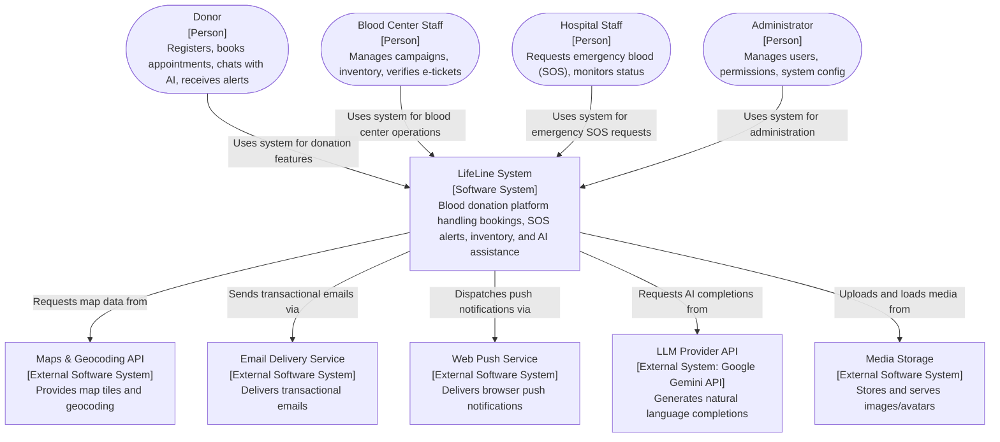
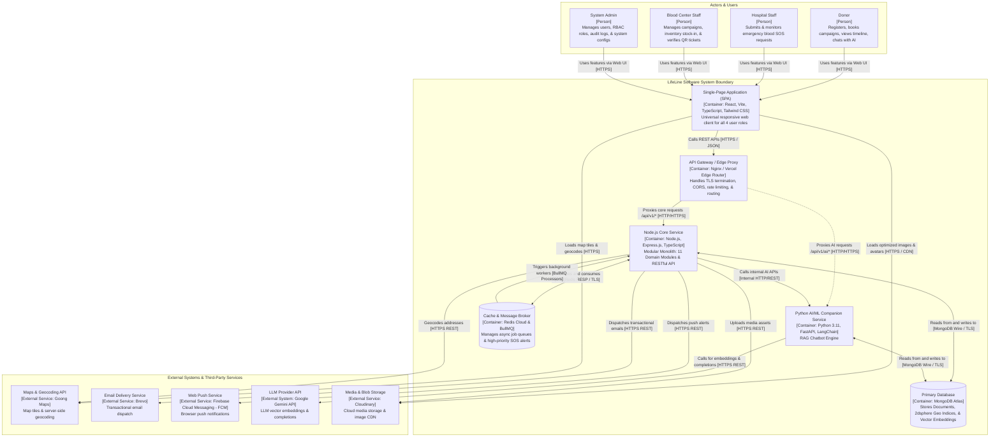
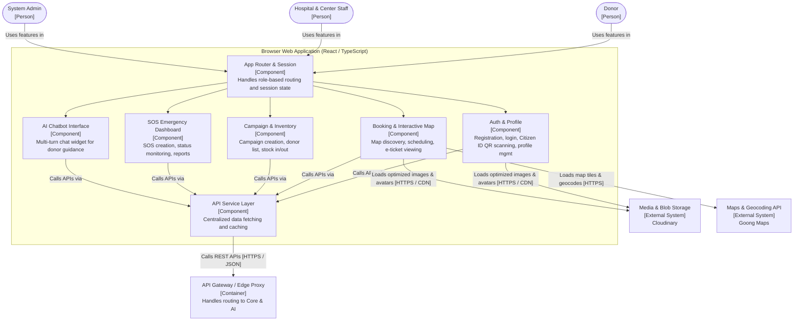
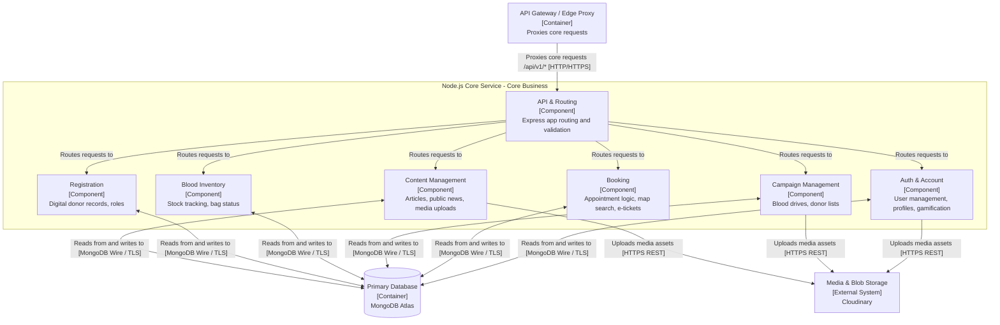
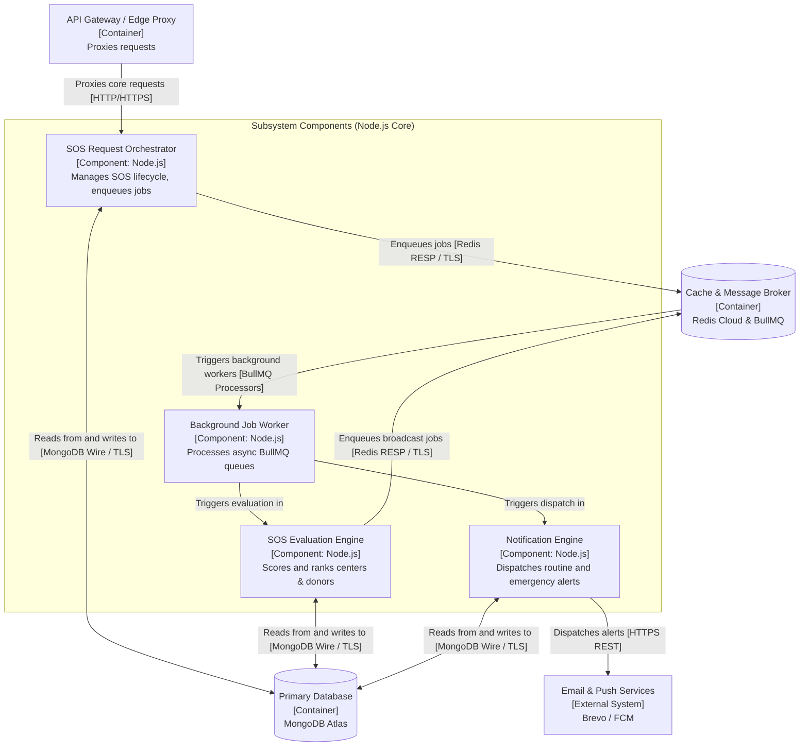
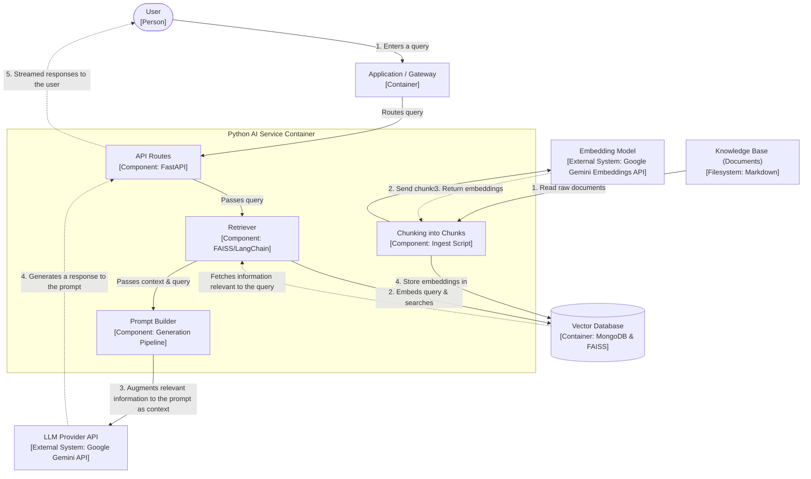
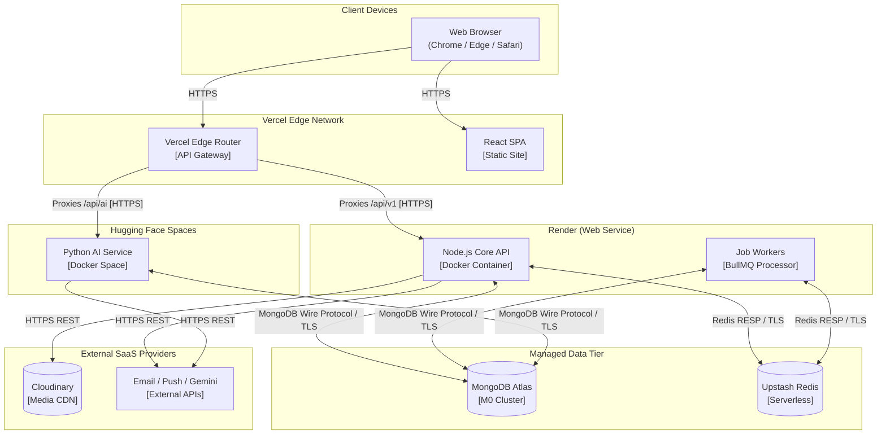

# LifeLine — Software Architecture Document

> **Document:** Software Architecture (PA4-2026, Section B & C & D)
> **Course:** CSC13002 – Introduction to Software Engineering
> **Team:** Sanguine (Group 05)
> **Version:** 1.2

---

## Revision History

| Date | Version | Description | Author |
| :--- | :--- | :--- | :--- |
| 27/07/2026 | 1.0 | Initial Software Architecture document for PA4: tech stack, C4 Level 1–3 diagrams, deployment diagram. | Trần Anh Kiệt |
| 07/08/2026 | 1.1 | Complete rewrite of architecture based on C4 Model standards, aligning strictly with `UseCaseSpec.md`, separating Subsystems from Core components, and refining the tech stack. | Trần Anh Kiệt |
| 26/08/2026 | 1.2 | Refined C4 components based on feedback: isolated RAG AI Service (4.4), unified Google Gemini provider, corrected SOS/Notification worker mappings, standardized terminology, and appended detailed folder structure. | Trần Anh Kiệt |

---

## Table of Contents

1. [Technology Stack](#1-technology-stack)
2. [C4 Model – Level 1: System Context Diagram](#2-c4-model--level-1-system-context-diagram)
3. [C4 Model – Level 2: Container Diagram](#3-c4-model--level-2-container-diagram)
4. [C4 Model – Level 3: Component Diagrams](#4-c4-model--level-3-component-diagrams)
   - [4.1 Component Diagram — Frontend (React SPA)](#41-component-diagram--frontend-react-spa)
   - [4.2 Component Diagram — Backend Core Business](#42-component-diagram--backend-core-business)
   - [4.3 Component Diagram — Subsystems (SOS, Notifications)](#43-component-diagram--subsystems-sos-notifications)
   - [4.4 Component Diagram — Python AI Service (RAG Pipeline)](#44-component-diagram--python-ai-service-rag-pipeline)
5. [Deployment Diagram](#5-deployment-diagram)
6. [Project Folder Structure](#6-project-folder-structure)

---

## 1. Technology Stack

*Author: Trần Anh Kiệt | Reviewer: Nguyễn Quốc Dương | Editor: Trần Anh Kiệt*

The technology stack is carefully selected to support the **Modular Monolith + Companion AI Service** architecture, ensuring it aligns with the 5-person team constraint and zero-budget requirements.

| Layer / Domain | Technology | Rationale & Usage |
| :--- | :--- | :--- |
| **Frontend Framework** | **React 19 (Vite) + TypeScript** | Enables rapid parallel development of user interfaces. TypeScript ensures type safety and shared interfaces with the backend. |
| **Frontend Styling** | **Tailwind CSS** | Utility-first CSS for fast, responsive web design adapting to mobile and desktop seamlessly (`NFR-U-01`). |
| **Frontend Libraries** | **React Query, i18next, jsQR, html2canvas** | Handles API caching, bilingual support (English/Vietnamese), client-side Citizen ID QR/file scanning, and e-ticket PDF generation. |
| **Backend Core** | **Node.js, Express 5, TypeScript** | A modular monolith for all CRUD operations, booking, and campaign management. Zod handles runtime validation. |
| **Database & ORM** | **MongoDB Atlas & Mongoose** | Document model fits varying entities. Provides `2dsphere` geospatial indexing for map/radius features. |
| **AI / ML Service** | **Python, FastAPI, LangChain** | Dedicated isolated service for intensive AI algorithms (RAG chatbot). |
| **Vector Store** | **MongoDB Atlas Vector Search** | Stores knowledge base embeddings for the AI Chatbot natively within the same database cluster. |
| **Background Jobs** | **Redis Cloud (Upstash) & BullMQ** | Handles asynchronous, high-priority SOS evaluation and notification dispatch decoupled from HTTP requests. |
| **Authentication** | **JWT & bcrypt** | Secures access with role-based JWTs and safely hashes user passwords. |
| **External APIs** | **Goong API, Cloudinary** | Map tiles and routing for donation centers. Cloudinary stores user avatars, campaign banners, QR images and general images. |
| **Notifications** | **Brevo (Email), FireBase (FCM)** | Free-tier services for delivering critical SOS alerts and routine transactional messages. |

---

## 2. C4 Model – Level 1: System Context Diagram

*Author: Trần Anh Kiệt | Reviewer: Nguyễn Quốc Dương | Editor: Trần Anh Kiệt*

### Main Flow
Users (Donors, Staff, and Administrators) interact with the LifeLine platform through a responsive web application to perform blood donation lifecycle activities—ranging from registration and booking to managing emergency SOS requests. LifeLine coordinates these activities by utilizing external providers for map data, email and push notifications, media storage, and Large Language Model (LLM) completions.



### System Context Descriptions

| System / Actor | Responsibility and services provided |
| :--- | :--- |
| **Donor** | Registers via Citizen ID, books appointments, downloads e-tickets, interacts with AI support, and responds to SOS alerts. |
| **Blood Center Staff** | Manages blood donation campaigns, verifies donor tickets, manages blood bag inventory, and publishes news. |
| **Hospital Staff** | Submits urgent SOS blood requests and monitors real-time matching and dispatch status. |
| **Administrator** | Oversees platform operation, manages user roles, monitors activity logs, and configures feature toggles. |
| **LifeLine System** | Core platform facilitating all interactions, matching, scheduling, and AI guidance for blood donation. |
| **Maps & Geocoding API** | Supplies map tiles and location geocoding for interactive maps (e.g., Goong). |
| **Email Delivery Service** | Third-party service (Brevo) that delivers transactional emails. |
| **Web Push Service** | Third-party service (Firebase Cloud Messaging) that delivers browser push notifications for emergency alerts. |
| **LLM Provider API** | Provides the AI reasoning engine (Google Gemini) for conversational support and RAG pipelines. |
| **Media Storage** | Cloud-based CDN (Cloudinary) for securely storing and serving images like avatars and campaign banners. |

---

## 3. C4 Model – Level 2: Container Diagram

*Author: Trần Anh Kiệt & Nguyễn Quốc Dương | Reviewer: Trần Minh Triết | Editor: Trần Anh Kiệt*

### Main Flow
The user navigates the React Single-Page Application (SPA), which routes API requests through an Edge Proxy to the backend. The Node.js Core handles standard CRUD operations, JWT authentication, and queues intensive asynchronous tasks. The Python AI Service acts as a dedicated worker for semantic search directly querying the shared MongoDB Atlas database. Background processors handle BullMQ jobs via Redis to guarantee non-blocking SOS alerts.



### Container Descriptions

| Container | Responsibility and services provided | Technology/framework | Communication |
| :--- | :--- | :--- | :--- |
| **Single-Page Application (SPA)** | Universal responsive web client delivering role-based UIs for all 4 user roles. Manages local state, maps, and client-side QR scanning. | React, Vite, TypeScript, Tailwind CSS | Calls REST APIs `[HTTPS / JSON]` via API Gateway; Loads map tiles & geocodes `[HTTPS]` from Maps API; Loads optimized images & avatars `[HTTPS / CDN]` from Media Storage. |
| **API Gateway / Edge Proxy** | Central reverse proxy handling TLS termination, CORS, rate limiting, and routing. | Nginx / Vercel Edge Router | Proxies core requests `/api/v1/* [HTTP/HTTPS]` to Node.js Core; Proxies AI requests `/api/v1/ai/* [HTTP/HTTPS]` to AI Companion Service. |
| **Node.js Core Service** | Modular monolith with 11 domain modules handling core business logic, REST APIs, and integrations. | Node.js, Express.js, TypeScript | Reads from and writes to `[MongoDB Wire / TLS]` Primary Database; Enqueues and consumes jobs `[Redis RESP / TLS]` with Cache & Queue; Uploads media assets `[HTTPS REST]` to Media Storage; Geocodes addresses `[HTTPS REST]` to Maps API; Dispatches transactional emails `[HTTPS REST]` to Email Delivery Service; Dispatches push alerts `[HTTPS REST]` to Web Push Service; Calls internal AI APIs `[Internal HTTP/REST]` to AI Companion Service. |
| **Python AI/ML Companion Service** | RAG Chatbot Engine dedicated microservice. | Python 3.11, FastAPI, LangChain | Reads from and writes to `[MongoDB Wire / TLS]` Primary Database; Calls for embeddings & completions `[HTTPS REST]` to LLM Provider API. |
| **Primary Database** | Stores Documents, 2dsphere Geo Indices, & Vector Embeddings. | MongoDB Atlas | Persists data for Node.js Core and Python AI/ML Service `[MongoDB Wire / TLS]`. |
| **Cache & Message Broker** | Manages async job queues & high-priority SOS alerts. | Redis Cloud & BullMQ | Triggers background workers `[BullMQ Processors]` in Node.js Core; Exchanges job data `[Redis RESP / TLS]`. |

---

## 4. C4 Model – Level 3: Component Diagrams

### 4.1 Component Diagram — Frontend (React SPA)

*Author: Trịnh Khánh Linh | Reviewer: Trần Minh Triết | Editor: Trịnh Khánh Linh*

#### Main Flow
A user loads the application and authenticates via the Auth & Profile component, storing a JWT session. They can then navigate to features based on their role: Donors browse the Booking & Map components, Center Staff access Campaign & Inventory, Hospital Staff monitor the SOS Dashboard, and Admins manage the system. All API interactions are routed through a centralized API Service Layer for caching and state consistency to the API Gateway. The SPA also directly connects to external services to load map tiles and media assets.



#### Frontend Component Descriptions

| Component | Responsibility and services provided | Representative code/modules | Relationships |
| :--- | :--- | :--- | :--- |
| **App Router & Session** | Mounts role-specific layouts, enforces protected routes, and holds JWT state. | `App.tsx`, `shared/contexts/AuthContext.tsx` | Validates roles; routes to specific feature portals. |
| **Auth & Profile** | User registration flows, file/camera QR Citizen ID parsing, and profile edits. | `modules/auth-account/components/LoginForm.tsx`, `RegisterCitizenIdPage.tsx` | Calls APIs via API Layer; Loads optimized images & avatars. |
| **Booking & Interactive Map** | Discovers donation points via maps, manages appointments, and displays e-tickets. | `modules/booking-location/pages/InteractiveMapPage.tsx`, `MyAppointmentPage.tsx` | Calls APIs via API Layer; Loads map tiles & geocodes; Loads optimized images. |
| **Campaign & Inventory** | Blood center tools to manage drives, verify donor tickets, and track blood bag lifecycle. | `modules/campaign-mgmt/pages/CampaignListPage.tsx`, `modules/blood-inventory/pages/StockInPage.tsx` | Calls APIs via API Layer. |
| **SOS Emergency Dashboard** | Hospital interface to trigger urgent blood requests and watch live dispatch status. | `modules/sos-requests/pages/CreateSOSRequestPage.tsx`, `SOSDashboardPage.tsx` | Calls APIs via API Layer. |
| **AI Chatbot Interface** | Persistent UI widget providing context-aware donation guidance via RAG. | `ChatbotWidget.tsx`, `MessageBubble.tsx` | Calls APIs via API Layer. |
| **API Service Layer** | Wraps `fetch` requests, handles JWT injection, caching (React Query), and error toasts. | `shared/api/apiClient.ts` | Calls REST APIs via API Gateway. |

---

### 4.2 Component Diagram — Backend Core Business

*Author: Trần Minh Triết | Reviewer: Nguyễn Quốc Dương | Editor: Trần Minh Triết*

#### Main Flow
Incoming requests from the API Gateway pass through the API & Routing layer, which initializes the Express application, parses payloads, and routes to appropriate domain modules. Standard core business actions—such as managing accounts, booking appointments, organizing campaigns, tracking inventory, handling registrations, and publishing content—are executed by their respective dedicated domain components. These components then read from and write to the shared MongoDB database to persist state, and upload assets to external media storage.



#### Backend Core Component Descriptions

| Component | Responsibility and services provided | Representative code/modules | Relationships |
| :--- | :--- | :--- | :--- |
| **API & Routing** | Express routers and initialization to parse bodies, and route to internal domains. | `app.ts`, `server.ts` | Entry point receiving proxy requests from API Gateway. |
| **Auth & Account** | Handles account state, profiles, login logic, and user gamification (badges, XP). | `modules/auth-account/auth-account.controller.ts`, `gamification.service.ts` | Reads from and writes to DB; Uploads media assets. |
| **Booking** | Manages donation scheduling, capacity checks, and e-tickets. | `modules/booking/controllers/booking.controller.ts`, `booking.service.ts` | Reads from and writes to DB. |
| **Campaign Management** | Oversees blood drives, participant rosters, and center operations. | `modules/campaign/controllers/campaign.controller.ts`, `campaign.service.ts` | Reads from and writes to DB; Uploads media assets. |
| **Blood Inventory** | Tracks blood bag lifecycle (Stock In/Out) and computes hospital availability. | `modules/blood-inventory/controllers/blood-inventory.controller.ts`, `blood-inventory.service.ts` | Reads from and writes to DB. |
| **Registration** | Manages digital donor records, role enforcements, and audit logs. | `modules/registration/controllers/registration.controller.ts`, `registration.service.ts` | Reads from and writes to DB. |
| **Content Management** | Oversees published articles, news, and direct image/media uploads. | `modules/content/controllers/article.controller.ts`, `upload.controller.ts` | Reads from and writes to DB; Uploads media assets. |

---

### 4.3 Component Diagram — Subsystems (SOS, Notifications)

*Author: Trần Anh Kiệt | Reviewer: Trần Đức Quý | Editor: Trần Anh Kiệt*

#### Main Flow
When a Hospital creates an SOS request, it is routed via the API Gateway to the SOS Request Orchestrator, which persists the request in MongoDB and enqueues an evaluation job in Redis. The Node.js Background Job Worker processes this queue and triggers the Node.js SOS Evaluation Engine, which computes geographic proximity and inventory to rank potential centers and donors. Once evaluated, broadcast jobs are enqueued for the Notification Engine to dispatch emergency alerts via external email and push providers.



#### Subsystem Component Descriptions

| Component | Responsibility and services provided | Representative code/modules | Relationships |
| :--- | :--- | :--- | :--- |
| **SOS Request Orchestrator** | Node.js entry point for SOS creation. Ensures request durability before passing off to queue. | `modules/sos-request/controllers/sos-request.controller.ts`, `sos-request.service.ts` | Reads from and writes to DB; Enqueues jobs. |
| **SOS Evaluation Engine** | Node.js logic computing composite scores based on geospatial distance, blood type, and inventory. | `modules/sos-request/services/sos-evaluation.service.ts` | Reads from and writes to DB; Enqueues jobs. |
| **Background Job Worker** | BullMQ processor consuming queue messages asynchronously for evaluation and notifications. | `modules/sos-request/jobs/sos-evaluation.processor.ts`, `modules/notification/jobs/notification.processor.ts` | Triggers background workers; Calls internal evaluation logic. |
| **Notification Engine** | Handles multi-channel dispatch (email, push) bypassing rate limits for urgent SOS alerts. | `modules/notification/services/notification.service.ts`, `email.service.ts`, `push.service.ts` | Reads from and writes to DB; Dispatches alerts. |

---

### 4.4 Component Diagram — Python AI Service (RAG Pipeline)

*Author: Trần Anh Kiệt | Reviewer: Trần Minh Triết | Editor: Trần Anh Kiệt*

#### Main Flow
The AI Service isolates the RAG (Retrieval-Augmented Generation) workflow. The data ingestion process starts with the **Knowledge Base (Documents)**, which is processed via **Chunking into Chunks**, followed by an **Embedding Model** to generate vectors, which are then stored into the **Vector Database**. At runtime, the workflow is: **1) User enters a query** -> **2) Retriever fetches information relevant to the query** (via embedding the query and searching the Vector Database) -> **3) relevant information is augmented to the prompt as context** -> **4) LLM generates a response to the prompt** -> **5) Streamed responses to the user**.



#### AI Service Component Descriptions

| Component | Responsibility and services provided | Representative code/modules | Relationships |
| :--- | :--- | :--- | :--- |
| **Ingestion Script** | Reads the raw `LifeLine_Knowledge_Base_Detailed.md`, processes the text into chunks, calls the embedding model, and stores the vectors into MongoDB. | `scripts/ingest_md.py` | Reads filesystem; Calls LLM for embeddings; Writes to DB. |
| **FastAPI Routes** | Exposes HTTP endpoints for chat completions, handling authentication middleware and asynchronous streaming responses. | `app/api/routes.py`, `app/middleware/auth.py` | Receives proxy traffic from Gateway; Invokes Pipeline. |
| **Generation Pipeline** | Orchestrates the agent workflow: checks semantic cache for common FAQs, builds the system prompt with context, and routes to the LLM. | `app/generation/pipeline.py` | Calls FAISS Retriever; Calls LLM for completions. |
| **FAISS Builder / Retriever** | Syncs vector embeddings from MongoDB into an optimized in-memory FAISS index to perform fast similarity searches for the RAG pipeline. | `app/services/faiss_builder.py`, `app/services/embeddings.py` | Reads from DB; Provides context chunks to Pipeline. |

---

## 5. Deployment Diagram

*Author: Trần Anh Kiệt | Reviewer: Trần Đức Quý | Editor: Trần Anh Kiệt*



### Node Descriptions

| Node | Hardware / Cloud Service | Container(s) Running | Communication Protocols |
| :--- | :--- | :--- | :--- |
| **Client Device** | End-user mobile or desktop hardware | Runs static SPA files | Connects to Vercel/CDN over HTTPS. |
| **Vercel Edge Network** | Vercel Free Tier (Global CDN & Edge Functions) | React SPA (Static) & Edge Router | Serves assets via HTTPS; Proxies API requests to Render & Hugging Face. |
| **Render Web Service** | Render Cloud (Container Hosting) | Node.js Core API & Job Workers | HTTPS from Vercel; TLS to MongoDB & Redis; HTTPS to External SaaS. |
| **Hugging Face Spaces** | Hugging Face (Docker Space Hosting) | Python AI/ML Service | HTTPS from Vercel; TLS to MongoDB; HTTPS to LLM APIs. |
| **MongoDB Atlas** | Managed MongoDB Cloud (M0 Free Tier) | Primary Database (Documents + Vectors) | Encrypted TCP (MongoDB Wire Protocol) from Render and Hugging Face. |
| **Upstash Redis** | Managed Serverless Redis | Redis (BullMQ Storage) | Encrypted TCP (Redis RESP) from Render Node.js instances. |
| **External Cloud SaaS** | Cloudinary, Brevo, Firebase, Google Gemini API | Media and Third-party systems | HTTPS from backend services. |

---


## 6. Project Folder Structure

*Author: Trần Anh Kiệt | Reviewer: Nguyễn Quốc Dương | Editor: Trần Anh Kiệt*

The LifeLine monorepo is organized to clearly separate the frontend React application, the Node.js core backend, and the Python AI service.

```text
SE-LifeLine-Project/
├── docs/                              # Project documentation
│   ├── requirements/                  # Vision document, use cases
│   ├── analysis-and-design/           # Software architecture, diagrams, UI design
│   ├── management/                    # Planning docs & reports
│   └── test/                          # Test plan, test cases, test reports
│
├── src/                               # All source code
│   ├── frontend/                      # React + Tailwind CSS SPA
│   │   ├── src/
│   │   │   ├── components/            # Global UI components
│   │   │   ├── data/                  # Static data or mocks
│   │   │   ├── i18n/                  # Internationalization (En/Vi)
│   │   │   ├── modules/               # Feature-based modules
│   │   │   │   ├── admin/
│   │   │   │   ├── auth-account/
│   │   │   │   ├── blood-inventory/
│   │   │   │   ├── booking-location/
│   │   │   │   ├── campaign-mgmt/
│   │   │   │   ├── chatbot/
│   │   │   │   ├── content-mgmt/
│   │   │   │   ├── dashboard/
│   │   │   │   ├── impact-tracking/
│   │   │   │   ├── landing-page/
│   │   │   │   ├── notifications/
│   │   │   │   └── sos-requests/
│   │   │   ├── routes/                # Route definitions per role
│   │   │   ├── services/              # API integration layer
│   │   │   ├── shared/                # Cross-module UI kit, shared hooks, utils
│   │   │   ├── types/                 # TypeScript interfaces
│   │   │   ├── utils/                 # Helper functions
│   │   │   ├── App.tsx                # Root application component
│   │   │   ├── index.css              # Global styles
│   │   │   └── main.tsx               # Application entry point
│   │   ├── index.html                 # HTML template
│   │   └── package.json
│   │
│   ├── backend-core/                  # Node.js modular monolith
│   │   ├── src/
│   │   │   ├── config/                # Environment and DB config
│   │   │   ├── modules/               # Domain modules
│   │   │   │   ├── admin/
│   │   │   │   ├── auth-account/
│   │   │   │   ├── blood-inventory/
│   │   │   │   ├── booking/
│   │   │   │   ├── campaign/
│   │   │   │   ├── chatbot/
│   │   │   │   ├── content/
│   │   │   │   ├── notification/
│   │   │   │   ├── registration/
│   │   │   │   └── sos-request/
│   │   │   ├── scripts/               # Setup scripts
│   │   │   ├── shared/                # Middleware, error handlers, validators
│   │   │   ├── utils/                 # Helper functions
│   │   │   ├── app.ts                 # Express App setup
│   │   │   ├── seed-accounts.ts       # Database seeder
│   │   │   └── server.ts              # Server entry point
│   │   ├── replace-health-tips.js     # Script utility
│   │   └── package.json
│   │
│   ├── ai-service/                    # Python FastAPI AI/ML service
│   │   ├── app/
│   │   │   ├── api/                   # API routes
│   │   │   ├── generation/            # RAG and LLM logic
│   │   │   ├── middleware/            # HTTP Middlewares
│   │   │   └── services/              # Core business logic for AI
│   │   ├── scripts/                   # Utility scripts
│   │   ├── main.py                    # Application entry point
│   │   ├── test_router.py             # Router tests
│   │   └── requirements.txt           # Python dependencies
│   │
│   └── specs/                         # Spec-Kit generated artifacts, one folder per feature
│       ├── LL-UC-01-register-cccd/
│       ├── HS-UC-01-create-sos-request/
│       └── ...                        # 1 subfolder per Spec-Kit feature run
│
├── .specify/                          # Spec-Kit internal state
├── .github/workflows/                 # CI pipelines (lint, test, build)
├── .gitignore
└── README.md
```