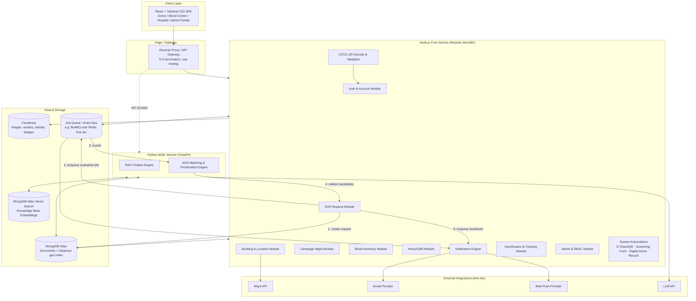
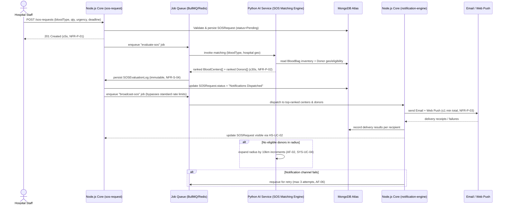
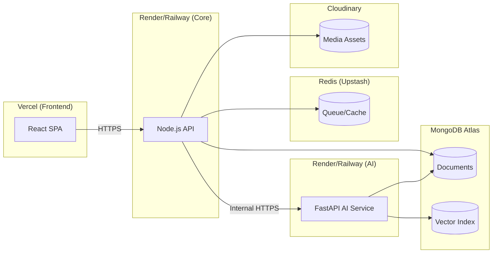

# LifeLine — System Architecture
> **Document Purpose**: Foundation input for Spec-Kit `Constitution.md`
> **Project**: LifeLine — Comprehensive Blood Donation Platform
> **Team**: Sanguine (Team 05) | CSC13002
> **Derived From**: `vision.md`, `Proposal.md`, `UseCaseSpec.md`, `ProjectPlan.md`
> **Version**: 1.0 (Draft for Spec-Kit ingestion)

---

## 1. Architectural Drivers (traced to source documents)

| Driver | Source | Architectural Implication |
| :--- | :--- | :--- |
| Team of 5 full-stack students, no dedicated DevOps/SRE role | ProjectPlan §3.1, §2.2 | Favor a single deployable unit per language runtime over many independently-deployed microservices |
| **No budget** — free-tier / open-source tools only | ProjectPlan §2.2 (Constraints) | All external services must have a workable free tier (MongoDB Atlas free cluster, Cloudinary free tier, free push notification / email providers) |
| 13-week semester timeline, 5 sprints | ProjectPlan §4.1 | Architecture must let sub-teams work on independent Functional Groups (FGs) in parallel without merge conflicts |
| `NFR-P-04`: 10,000 registered users, 10 concurrent users | vision.md §6.1 | Small-to-medium scale — a modular monolith is sufficient; true microservices would be over-engineering |
| `NFR-R-01`: 99.5% availability; `NFR-R-04`: SOS records must never be lost | vision.md §6.3 | SOS write-path needs durable persistence + async, retry-capable notification dispatch, decoupled from the request/response cycle |
| AI-Powered Donor Assistant (RAG chatbot), SOS Evaluation & Prioritization algorithm | vision.md §5.1.3, §5.4.2; ProjectPlan FG4/FG9/FG10/FG12 | These are Python's strengths (LLM SDKs, ML/vector tooling) — isolate them from the Node.js core as a **dedicated Python AI/ML service** |
| CCCD QR-code registration (LL-UC-01) — no Passport, no image/OCR scanning | vision.md §5.1.1, UseCaseSpec LL-UC-01 | This is a straightforward QR payload decode, not an AI/ML task — it belongs in the **Node.js Core** (Auth & Account module), not the Python AI service |
| `NFR-P-01/02/03`: SOS request processed ≤5s, matching ≤30s, notification delivered ≤1min | vision.md §6.1 | Requires an async job/event pipeline for SOS evaluation + broadcast, not a synchronous request chain |
| Interactive map, geo-radius donor/campaign matching | Proposal §3.1.2, vision §5.1.2, UC LL-UC-06, SYS-UC-04 | Needs geospatial query capability (`$geoNear` / `2dsphere` index) |
| Multi-turn AI chatbot with knowledge base retrieval | vision §5.1.3, UC CB-UC-01 | Needs a vector index over a curated medical/procedural knowledge base |
| Responsive web app, Chrome/Edge/Firefox/Safari (`NFR-U-01`, `NFR-U-04`) | vision.md §6.4 | Single responsive web frontend — no separate native mobile app required |

---

## 2. Architecture Style: **Modular Monolith + One Companion AI Service**

Given the team size, the zero budget, and the moderate scale target (10k users / 10 concurrent), full microservices would add operational overhead (service discovery, distributed tracing, N deployment pipelines) without a corresponding benefit. LifeLine instead uses:

- **One Node.js "Core" application** — modular monolith, organized by Functional Group (bounded module per domain), covering all CRUD-heavy, transactional, and user-facing flows.
- **One Python "AI/ML" service** — a separate deployable process exposing an internal API, covering the AI Chatbot (RAG) and the SOS Evaluation & Prioritization scoring algorithm.
- **A shared MongoDB Atlas cluster** (with Atlas Vector Search enabled) as the single system of record for both services.

This gives the team clear module boundaries for parallel sprint work (each FG owns a Node.js module + routes) while keeping deployment, environment configuration, and inter-service debugging to a minimum — one extra service, not thirteen.

---

## 3. Technology Stack

### 3.1 Frontend
| Layer | Technology | Rationale |
| :--- | :--- | :--- |
| Framework | **React** (Vite) | Matches ProjectPlan §3.1/§4.4 team skill set and sprint assignments (all FGs list React) |
| Styling | **Tailwind CSS** | Explicit in ProjectPlan §4.3 ("React + Tailwind CSS project scaffold"); utility-first speeds up a 5-person team building many screens in parallel |
| Markup | **HTML5**, semantic + responsive (mobile/tablet/desktop) | Required by `NFR-U-01` |
| State/data fetching | React Query (or SWR) + Context/Zustand for local UI state | Keeps server-state caching (campaign lists, inventory) separate from local UI state (map filters, chat session) |
| Maps | Goong API or TomTom Maps API or Mapbox GL JS (free tier) | Powers LL-UC-06 Interactive Map |
| i18n | i18next (English + Vietnamese) | Required by `NFR-U-02` |
| PDF/Image ticket rendering | `pdf-lib` / `html2canvas` (client) or generated server-side and streamed | Supports LL-UC-10 Download E-Ticket |

### 3.2 Backend — Node.js Core Service
| Layer | Technology | Rationale |
| :--- | :--- | :--- |
| Runtime/Framework | **Node.js + Express** | Matches ProjectPlan's explicit "Node.js" assignment across all 13 FGs |
| Language | JavaScript | Reduces integration bugs across 5 contributors working on different modules concurrently |
| ORM/ODM | Mongoose | Schema validation, hooks (e.g., auto-set `Available` status on Stock In), and population for relational-style queries over MongoDB |
| Auth | JWT (access + refresh tokens), bcrypt for password hashing | Matches LL-UC-01/02 special requirements (bcrypt, HTTPS, 30-min session expiry `NFR-S-05`) |
| Job queue | BullMQ + Redis (free tier, e.g., Upstash) | Decouples SOS evaluation/broadcast from the request thread to satisfy `NFR-P-01/02/03` |
| File upload handling | Multer → Cloudinary SDK | Campaign/article images, avatars |
| QR generation & signing | `qrcode` (generation) + asymmetric signing (Ed25519/ECDSA via Node `crypto`) | Satisfies "cryptographically signed QR" requirement in SYS-UC-02 / LL-UC-10 |
| CCCD QR decode & parsing | Client-side camera capture (`getUserMedia`) + `jsQR`/`zxing-js`, decoded payload validated server-side | Reads the CCCD's built-in QR code (per Circular 59/2021/TT-BCA format) for LL-UC-01 registration — a plain text-payload decode, no image recognition/OCR involved |
| Validation | Zod / Joi | Input validation for all creation forms (Campaign, SOS Request, Stock In, etc.) |
| API style | RESTful JSON, versioned (`/api/v1/...`) | Required by `NFR-STD-04` |

### 3.3 AI/ML Service (Python)
| Layer | Technology | Rationale |
| :--- | :--- | :--- |
| Framework | **FastAPI** | Async-first, strong typing (Pydantic), ideal for an isolated internal API consumed only by the Node.js core |
| RAG orchestration | LangChain or a lightweight custom retriever + LLM API (OpenAI/Gemini/Anthropic free-tier or academic credits) | Powers CB-UC-01 multi-turn chatbot with fallback and personalized guidance |
| Vector store | **MongoDB Atlas Vector Search** on a `knowledge_base` collection | Avoids standing up a second database (no budget); same cluster as the core data, simplifies ops |
| SOS Matching Engine | Custom scoring service (Python) using inventory + donor geo data pulled from MongoDB | Implements the composite ranking described in Proposal §3.4.2 / vision §5.4.2 (inventory volume, proximity, dispatch capacity / donor proximity, recency, engagement tier) |
| Inter-service auth | Internal service token (shared secret / mTLS if hosting allows) | The AI service is never exposed directly to the public internet — only reachable via the gateway/Node core |

### 3.4 Data & Storage
| Component | Technology | Rationale |
| :--- | :--- | :--- |
| Primary database | **MongoDB Atlas** (free M0 tier for dev, scale tier for prod if available via academic program) | Matches ProjectPlan §4.3/§4.4 explicit "MongoDB" assignment across all FGs; document model fits varied entities (screening forms, evaluation logs) well |
| Geospatial queries | MongoDB `2dsphere` index on Campaign/DonationPoint and Donor location fields | Powers LL-UC-06 map discovery and SYS-UC-04 donor radius expansion |
| Vector search | MongoDB Atlas Vector Search | RAG knowledge base retrieval, avoids a separate vector DB |
| Media/object storage | **Cloudinary** | Free tier; used for avatars, article images, campaign banners, badge icons |
| Cache / Queue broker | Redis (free tier, e.g., Upstash or Redis Cloud) | Backs BullMQ for SOS evaluation & notification jobs, and can cache hot reads (active campaign list, inventory summary) |
| Backups | MongoDB Atlas automated daily backups | Required by `NFR-R-02` |

### 3.5 Cross-Cutting / Infrastructure
| Concern | Technology / Approach | Rationale |
| :--- | :--- | :--- |
| Hosting (frontend) | Vercel / Netlify (free tier) | Static SPA hosting with CDN |
| Hosting (Node core) | Render / Railway / Fly.io / Hugging Face Spaces (free tier) | Free-tier container hosting matching "no budget" constraint |
| Hosting (Python AI service) | Render / Railway / Hugging Face Spaces (separate free-tier service) | Independent scaling & restart from the core, since LLM calls can be slow |
| Transport security | HTTPS/TLS everywhere (`NFR-S-01`, `NFR-STD-02`) | Enforced at the gateway/hosting-provider level |
| Email | Resend / SendGrid (free tier) | Verification emails, booking confirmations, routine reminders |
| Web push | Firebase Cloud Messaging (free) or Web Push API (VAPID, no vendor) | Routine + SOS push notifications |
| Logging/Audit | Structured logs (pino/winston) written to an immutable `audit_log` collection | Required by `NFR-S-04` (all SOS/account/status-change activity logged) |
| Monitoring | Basic uptime + error tracking (e.g., UptimeRobot free tier, Sentry free tier) | Supports `NFR-R-01` (99.5% availability) and AD-UC-04 System Activity Monitoring |
| CI/CD | GitHub Actions (free for public/academic repos) | Lint, test, build on PR; deploy on merge to `main`/`develop` |

---

## 4. Module Boundaries (Node.js Core)

Each module maps 1:1 to a Functional Group from `ProjectPlan.md §4.4`, owns its own routes/controllers/services/models, and communicates with other modules only through internal service calls (never direct cross-module DB writes) to keep the monolith "modular":

| Module | Owns Entities | Key Use Cases |
| :--- | :--- | :--- |
| `auth-account` (incl. CCCD QR decode) | User, DonorProfile | LL-UC-01…05 |
| `booking-location` | Appointment, DonationPoint (Campaign subset) | LL-UC-06…10 |
| `campaign-mgmt` | Campaign, DonorRegistration | BC-UC-01…07 |
| `content-news` | Article, Notification (CMS side) | NF-UC-01/02, BC-UC-08…11 |
| `blood-inventory` | BloodBag, InventoryAuditEntry | BC-UC-12…17 |
| `sos-request` | SOSRequest, SOSEvaluationLog | HS-UC-01…03, SYS-UC-04 (orchestration only; scoring delegated to AI service) |
| `notification-engine` | Notification, NotificationPreference | NT-UC-01/02, SOS-UC-01/02, SYS-UC-05 |
| `impact-tracking` | DonationTimelineEntry, Badge, DonorLevel | DN-UC-01…03 |
| `automation` | ScreeningForm, ETicket, DigitalDonorRecord | SYS-UC-01…03 |
| `admin` | Role, Permission, AuditLog, SystemConfig | AD-UC-01…06 |
| `ai-gateway` (thin proxy in Node) | — | Forwards CB-UC-01 chatbot calls to the Python AI service |

---

## 5. Key Inter-Module / Inter-Service Flow: SOS Emergency Alert

Traced directly from `HS-UC-01` → `SYS-UC-04` → `SYS-UC-05` and NFR-P-01/02/03:

**Design notes:**
- The evaluation step is delegated to the **Python AI service** because it hosts the scoring/ranking logic (composite score over inventory volume, proximity, dispatch capacity for centers; proximity, recency, engagement tier for donors) — this is the same service that also runs the RAG chatbot, keeping all "smart" logic in one place.
- The **queue** decouples request acceptance (must respond ≤5s) from evaluation (≤30s) and broadcast (≤1min), so each NFR is satisfied by a distinct, independently-timed pipeline stage rather than one long synchronous call.
- SOS notifications are marked to **bypass standard rate limits/queues** used for routine notifications (`NFR-U-03`, Proposal §3.3.1), which the Notification Engine implements as a separate high-priority queue lane rather than a different code path, to avoid duplicating delivery logic.
- All evaluation logs and delivery results are written as **append-only** documents to satisfy the immutability and audit requirements (`NFR-S-04`, `NFR-R-04`).

---

## 6. Deployment View (indicative)

---

## 7. Open Questions / Conflicts to Clarify With the Team

1. **Backend Architecture Split (Node.js & FastAPI): Confirmed.** Node.js serves as the primary backend orchestrating all standard non-AI Functional Groups (e.g., CRUD operations, booking, SOS orchestration, and campaign management). Python (FastAPI) is strictly designated as an auxiliary AI/ML service. It exclusively handles heavy computational algorithms (the AI Chatbot and SOS Matching Engine) and acts as an isolated internal microservice consumed only by the Node.js core, rather than being exposed directly to the Frontend.
2. QR Code Scanning & Input Mechanisms (BC-UC-07): **Confirmed.** The system accommodates different hardware capabilities by utilizing a hybrid input approach rather than relying solely on native webcams (getUserMedia):
    - **Mobile Users**: Will be provided with multiple input options, including direct camera capture, image upload, and file upload.
    - **Desktop Users**: Will utilize a file/image upload mechanism to submit the QR e-ticket for verification, bypassing the need for dedicated webcam integration.