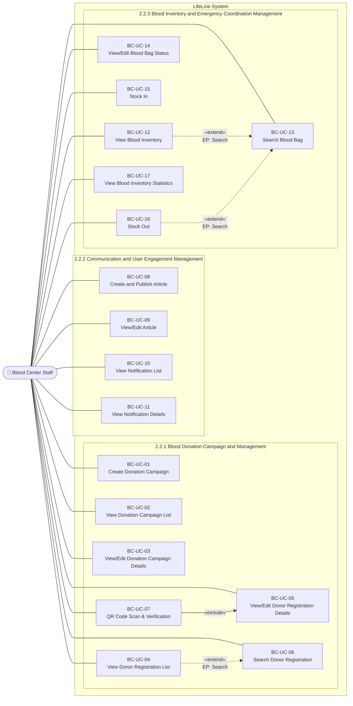
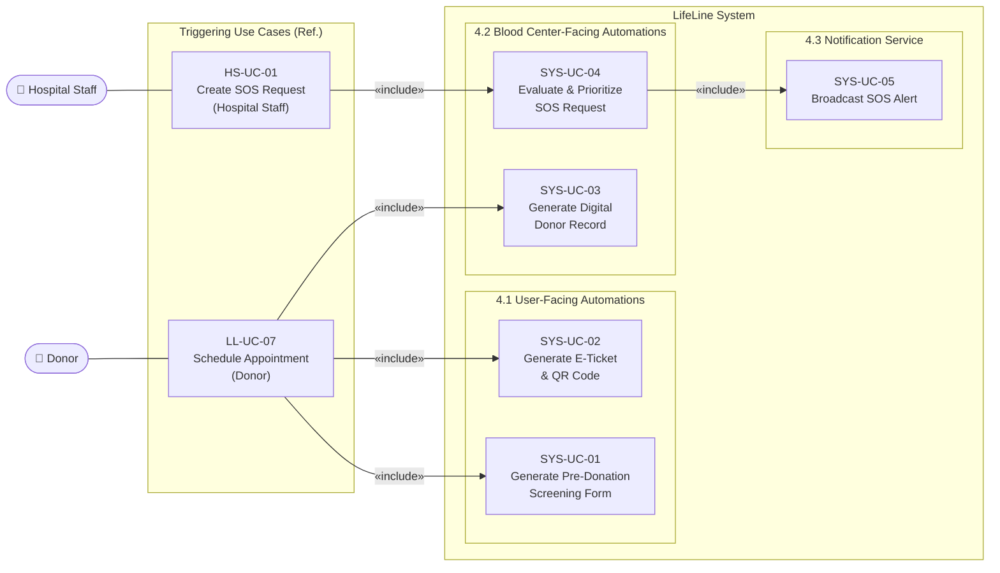
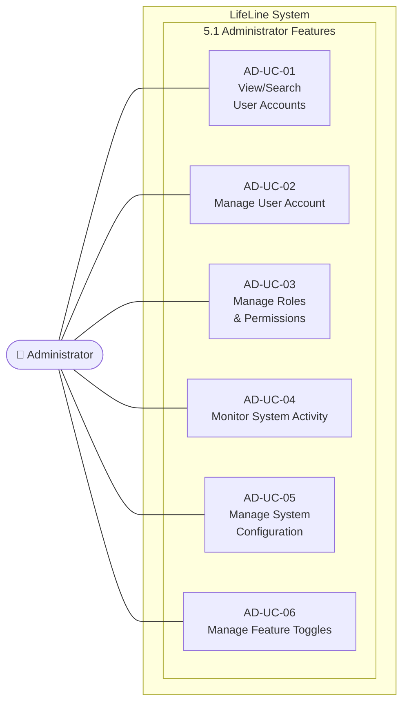

# LifeLine — Use-Case Specification
>**Document:** Use-Case Specification
>**Course:** CSC13002 - Introduction to Software Engineering
>**Team:** Sanguine (Group 05)
>**Version**: 1.5 | **Date**: 26/08/2026
---
# Table Of Contents

+ [LifeLine — Use-Case Specification](#lifeline--use-case-specification)

+ [Table Of Contents](#table-of-contents)

+ [Revision History](#revision-history)

+ [1. Use-case Model](#1-use-case-model)

    + [Diagram 1 — User Features](#diagram-1--user-features)

    + [Diagram 2 — Blood Center Staff Features](#diagram-2--blood-center-staff-features)

    + [Diagram 3 — Hospital Features](#diagram-3--hospital-features)

    + [Diagram 4 — System Automations](#diagram-4--system-automations)

    + [Diagram 5 — Administrator Features](#diagram-5--administrator-features)

    + [Full System Overview Diagram](#full-system-overview-diagram)

+ [2. Use-case Specifications](#2-use-case-specifications)

    + [2.1 User Features](#21-user-features)

        + [2.1.1 User Account Management](#211-user-account-management)

            + [LL-UC-01 Register via Citizen ID](#ll-uc-01-register-via-citizen-id)

            + [LL-UC-02 Login](#ll-uc-02-login)

            + [LL-UC-03 Logout](#ll-uc-03-logout)

            + [LL-UC-04 Reset Password](#ll-uc-04-reset-password)

            + [LL-UC-05 Manage Profile](#ll-uc-05-manage-profile)

        + [2.1.2 Donation Booking & Location Services](#212-donation-booking--location-services)

            + [LL-UC-06 Browse Interactive Map](#ll-uc-06-browse-interactive-map)

            + [LL-UC-07 Schedule Appointment](#ll-uc-07-schedule-appointment)

            + [LL-UC-08 View Appointment Details](#ll-uc-08-view-appointment-details)

            + [LL-UC-09 Cancel Appointment](#ll-uc-09-cancel-appointment)

            + [LL-UC-10 Download E-Ticket](#ll-uc-10-download-e-ticket)

        + [2.1.3 AI-Powered Conversational Support & Guidance](#213-ai-powered-conversational-support--guidance)

            + [CB-UC-01 Interact with AI Chatbot](#cb-uc-01-interact-with-ai-chatbot)

        + [2.1.4 News, Notifications & Communication](#214-news-notifications--communication)

            + [NF-UC-01 Browse News Feed](#nf-uc-01-browse-news-feed)

            + [NF-UC-02 View Article Details](#nf-uc-02-view-article-details)

            + [NT-UC-01 Receive Routine Notification](#nt-uc-01-receive-routine-notification)

            + [NT-UC-02 Manage Notification Preferences](#nt-uc-02-manage-notification-preferences)

            + [SOS-UC-01 Receive SOS Emergency Alert](#sos-uc-01-receive-sos-emergency-alert)

            + [SOS-UC-02 Respond to SOS Emergency Alert](#sos-uc-02-respond-to-sos-emergency-alert)

        + [2.1.5. Donation Impact & Tracking](#215-donation-impact--tracking)

            + [DN-UC-01 View Donation Timeline](#dn-uc-01-view-donation-timeline)

            + [DN-UC-02 View Achievement Progress](#dn-uc-02-view-achievement-progress)

            + [DN-UC-03 View Donor Level Progress](#dn-uc-03-view-donor-level-progress)

        + [2.1.6. Community](#216-community)

            + [CM-UC-01 Access Facebook Fanpage](#cm-uc-01-access-facebook-fanpage)

    + [2.2 Blood Center Features](#22-blood-center-features)

        + [2.2.1 Blood Donation Campaign and Management](#221-blood-donation-campaign-and-management)

            + [BC-UC-01 Create Donation Campaign](#bc-uc-01-create-donation-campaign)

            + [BC-UC-02 View Donation Campaign List](#bc-uc-02-view-donation-campaign-list)

            + [BC-UC-03 View/Edit Donation Campaign Details](#bc-uc-03-viewedit-donation-campaign-details)

            + [BC-UC-04 View Donor Registration List](#bc-uc-04-view-donor-registration-list)

            + [BC-UC-05 View/Edit Donor Registration Details](#bc-uc-05-viewedit-donor-registration-details)

            + [BC-UC-06 Search Donor Registration](#bc-uc-06-search-donor-registration)

            + [BC-UC-07 QR Code Scan & Verification](#bc-uc-07-qr-code-scan--verification)

        + [2.2.2 Communication and User Engagement Management](#222-communication-and-user-engagement-management)

            + [BC-UC-08 Create and Publish Article](#bc-uc-08-create-and-publish-article)

            + [BC-UC-09 View/Edit Article](#bc-uc-09-viewedit-article)

            + [BC-UC-10 View Notification List](#bc-uc-10-view-notification-list)

            + [BC-UC-11 View Notification Details](#bc-uc-11-view-notification-details)

        + [2.2.3 Blood Inventory and Emergency Coordination Management](#223-blood-inventory-and-emergency-coordination-management)

            + [BC-UC-12 View Blood Inventory](#bc-uc-12-view-blood-inventory)

            + [BC-UC-13 Search Blood Bag](#bc-uc-13-search-blood-bag)

            + [BC-UC-14 View/Edit Blood Bag Status](#bc-uc-14-viewedit-blood-bag-status)

            + [BC-UC-15 Stock In](#bc-uc-15-stock-in)

            + [BC-UC-16 Stock Out](#bc-uc-16-stock-out)

            + [BC-UC-17 View Blood Inventory Statistics](#bc-uc-17-view-blood-inventory-statistics)

    + [2.3 Hospital Features](#23-hospital-features)

        + [2.3.1 Emergency Blood SOS Request Management](#231-emergency-blood-sos-request-management)

            + [HS-UC-01 Create SOS Request](#hs-uc-01-create-sos-request)

            + [HS-UC-02 Monitor SOS Request](#hs-uc-02-monitor-sos-request)

            + [HS-UC-03 View SOS Reports](#hs-uc-03-view-sos-reports)

    + [2.4 System Features](#24-system-features)

        + [2.4.1 User-Facing Automations](#241-user-facing-automations)

            + [SYS-UC-01 Generate Pre-Donation Screening Form](#sys-uc-01-generate-pre-donation-screening-form)

            + [SYS-UC-02 Generate E-Ticket & QR Code](#sys-uc-02-generate-e-ticket--qr-code)

        + [2.4.2 Blood Center-Facing Automations](#242-blood-center-facing-automations)

            + [SYS-UC-03 Generate Digital Donor Record](#sys-uc-03-generate-digital-donor-record)

            + [SYS-UC-04 Evaluate & Prioritize SOS Request](#sys-uc-04-evaluate--prioritize-sos-request)

        + [2.4.3 Notification Service](#243-notification-service)

            + [SYS-UC-05 Broadcast SOS Alert](#sys-uc-05-broadcast-sos-alert)

    + [2.5 Administrator Features](#25-administrator-features)

        + [2.5.1 System and User Management](#251-system-and-user-management)

            + [AD-UC-01 View/Search User Accounts](#ad-uc-01-viewsearch-user-accounts)

            + [AD-UC-02 Manage User Account](#ad-uc-02-manage-user-account)

            + [AD-UC-03 Manage Roles & Permissions](#ad-uc-03-manage-roles--permissions)

            + [AD-UC-04 Monitor System Activity](#ad-uc-04-monitor-system-activity)

            + [AD-UC-05 Manage System Configuration](#ad-uc-05-manage-system-configuration)

            + [AD-UC-06 Manage Feature Toggles](#ad-uc-06-manage-feature-toggles)

# Revision History
| Date       | Version | Description                                                                               | Author        |
| :--------- | :------ | :---------------------------------------------------------------------------------------- | :------------ |
| 23/06/2026 | 1.0     | Compiled Use Case Diagrams and Use Case Specifications (Pending UI prototypes insertion). | Trần Anh Kiệt |
| 23/07/2026 | 1.1     | Refactored Use-Case models: removed invalid UI-navigation `<<extend>>` relationships across diagrams per instructor feedback. | Trần Anh Kiệt & Trần Minh Triết |
| 07/08/2026 | 1.2     | Fixed typos, corrected Alternative Flow step references, added missing UI prototype notes, removed invalid System actor, and reversed <<extend>> relationship direction per instructor feedback. | Trịnh Khánh Linh |
| 26/08/2026 | 1.3     | Full synchronization and alignment across all 5 Diagrams and 52 Use Cases (LL-UC-01 to LL-UC-10, CB-UC-01, NF-UC-01..02, NT-UC-01..02, SOS-UC-01..02, DN-UC-01..03, CM-UC-01, BC-UC-01 to BC-UC-17, HS-UC-01 to HS-UC-03, SYS-UC-01 to SYS-UC-05, AD-UC-01 to AD-UC-06) with the completed full-stack codebase, covering React 19 SPA, Node.js Core modular monolith, Python FastAPI companion AI service, BullMQ queues, and MongoDB Atlas. | Trần Anh Kiệt, Nguyễn Quốc Dương, Trần Đức Quý, Trần Minh Triết, Trịnh Khánh Linh |
| 26/08/2026 | 1.4     | Reconciled all specifications with implemented behavior on `dev`: active portal roles, Donor-first account lifecycle, Pending appointment approval, non-cryptographic stored QR verification, SOS fulfillment lifecycle, fixed system roles, eight configuration keys, four feature toggles, and shared Hospital content/notification screens. Removed unsupported behavioral claims while preserving all prototype-image references for the companion image package. | Development Team |
| 26/08/2026 | 1.5     | Re-audited BC-UC-01 through BC-UC-17 against the current Blood Center frontend, API routes, services, and MongoDB models. Integrated supported material from `UseCase_BloodCenter_Updated.md`; corrected campaign/bag code formats and qualified partial batch processing, side-effect atomicity, state transitions, fixed stock thresholds, and authorization gaps. | Development Team |

> **Implementation baseline:** This document describes behavior present in the `dev` branch on 26/08/2026. It does not claim production hosting SLAs, cryptographic QR signing, server-side JWT revocation, custom roles, automated backups, or features that only appeared in obsolete prototypes.
# 1. Use-case Model
---
## Diagram 1 — User Features

*Author: Trần Anh Kiệt  |  Reviewer: Trịnh Khánh Linh  |  Editor: Trần Anh Kiệt*

> Covers sections **1.1 User Account Management**, **1.2 Donation Booking & Location Services**, **1.3 AI-Powered Conversational Support**, **1.4 News, Notifications & Communication**, **1.5 Donation Impact & Tracking**, **1.6 Community**.

```mermaid

%%{init: {'theme': 'default', 'themeVariables': {'fontSize': '14px'}}}%%
graph LR

    %% ── Actors ──────────────────────────────────────────
    Donor(["👤 Donor"])
    NE(["⚙️ Notification Engine<br>(supporting actor)"])

    subgraph SYS ["LifeLine System — User Features"]
        direction TB

        %% ── 1.1 User Account Management ────────────────
        subgraph UAM ["1.1 User Account Management"]
            UC01["LL-UC-01<br>Register via Citizen ID"]
            UC02["LL-UC-02<br>Login"]
            UC03["LL-UC-03<br>Logout"]
            UC04["LL-UC-04<br>Reset Password"]
            UC05["LL-UC-05<br>Manage Profile"]
        end

        %% ── 1.2 Donation Booking & Location ────────────
        subgraph DBS ["1.2 Donation Booking & Location Services"]
            UC06["LL-UC-06<br>Browse Interactive Map"]
            UC07["LL-UC-07<br>Schedule Appointment"]
            UC08["LL-UC-08<br>View Appointment Details"]
            UC09["LL-UC-09<br>Cancel Appointment"]
            UC10["LL-UC-10<br>Download E-Ticket"]
        end

        %% ── 1.3 AI Chatbot ──────────────────────────────
        subgraph AI ["1.3 AI-Powered Conversational Support"]
            CBUC01["CB-UC-01<br>Interact with AI Chatbot"]
        end

        %% ── 1.4 News, Notifications & Communication ────
        subgraph NNC ["1.4 News, Notifications & Communication"]
            NFUC01["NF-UC-01<br>Browse News Feed"]
            NFUC02["NF-UC-02<br>View Article Details"]
            NTUC01["NT-UC-01<br>Receive Routine Notification"]
            NTUC02["NT-UC-02<br>Manage Notification Preferences"]
            SOSUC01["SOS-UC-01<br>Receive SOS Emergency Alert"]
            SOSUC02["SOS-UC-02<br>Respond to SOS Emergency Alert"]
        end

        %% ── 1.5 Donation Impact & Tracking ─────────────
        subgraph DIT ["1.5 Donation Impact & Tracking"]
            DNUC01["DN-UC-01<br>View Donation Timeline"]
            DNUC02["DN-UC-02<br>View Achievement Progress"]
            DNUC03["DN-UC-03<br>View Donor Level Progress"]
        end

        %% ── 1.6 Community ───────────────────────────────
        subgraph COM ["1.6 Community"]
            CMUC01["CM-UC-01<br>Access Facebook Fanpage"]
        end
    end

    %% ── External reference use cases (declared as «include» targets  ──
    subgraph EXT ["(Ref.) System Features — see System Features diagram"]
        SYSUC01["SYS-UC-01<br>Generate Pre-Donation<br>Screening Form"]
        SYSUC02["SYS-UC-02<br>Generate E-Ticket<br>& QR Code"]
        SYSUC03["SYS-UC-03<br>Generate Digital<br>Donor Record"]
    end

    %% ── Actor associations ──────────────────────────────
    Donor --- UC01
    Donor --- UC02
    Donor --- UC03
    Donor --- UC04
    Donor --- UC05
    Donor --- UC06
    Donor --- UC07
    Donor --- UC08
    Donor --- UC09
    Donor --- UC10
    Donor --- CBUC01
    Donor --- NFUC01
    Donor --- NFUC02
    Donor --- NTUC01
    Donor --- NTUC02
    Donor --- SOSUC01
    Donor --- SOSUC02
    Donor --- DNUC01
    Donor --- DNUC02
    Donor --- DNUC03
    Donor --- CMUC01

    NE --- NTUC01
    NE --- SOSUC01

    %% ── Relationships ───────────────────────────────────

    %% include (Bắt buộc phải chạy)
    UC07 -- "«include»" --> SYSUC01
    UC07 -- "«include»" --> SYSUC02
    UC07 -- "«include»" --> SYSUC03

    %% extend (Tùy chọn, có điều kiện, chèn vào luồng cơ sở)
    UC02 -. "«extend»" .-> UC04
    UC08 -. "«extend»" .-> UC09
    UC08 -. "«extend»" .-> UC10
    SOSUC01 -. "«extend»" .-> SOSUC02

    %% ── Styling for out-of-scope reference nodes ────────
    classDef extRef fill:#f5f5f5,stroke:#999,stroke-dasharray: 4 3,color:#666;
    class SYSUC01,SYSUC02,SYSUC03 extRef;
    style EXT fill:#fafafa,stroke:#bbb,stroke-dasharray: 4 3;

```

---
## Diagram 2 — Blood Center Staff Features

*Author: Trần Minh Triết  |  Reviewer: Trần Anh Kiệt  |  Editor: Trần Minh Triết*

> Covers sections **2.2.1 Blood Donation Campaign and Management**, **2.2.2 Communication and User Engagement Management**, **2.2.3 Blood Inventory and Emergency Coordination Management**.

---
## Diagram 3 — Hospital Features

*Author: Nguyễn Quốc Dương  |  Reviewer: Trần Anh Kiệt  |  Editor: Nguyễn Quốc Dương*

> Covers section **3.1 Emergency Blood SOS Request Management**.

---
## Diagram 4 — System Automations

*Author: Trần Anh Kiệt  |  Reviewer: Trịnh Khánh Linh  |  Editor: Trần Anh Kiệt*

> Covers sections **4.1 User-Facing Automations** and **4.2 Blood Center-Facing Automations**.

---
## Diagram 5 — Administrator Features

*Author: Trần Anh Kiệt  |  Reviewer: Trần Đức Quý  |  Editor: Trần Anh Kiệt*

> Covers section **5.1 Administrator Features**.

---
## Full System Overview Diagram

*Author: Trần Anh Kiệt  |  Reviewer: Trịnh Khánh Linh  |  Editor: Trần Anh Kiệt*

> High-level view of all actors and their primary functional groups within the LifeLine system. Covers functional groups **2.1.1 → 2.5.1**. Individual use cases are omitted at this level — see Diagrams 1–5 for full detail.

```mermaid
%%{init: {'theme': 'default', 'themeVariables': {'fontSize': '13px'}}}%%
graph TB

    %% ── Actors ──────────────────────────────────────────
    Donor(["👤 Donor"])
    BCS(["👤 Blood Center Staff"])
    HS(["👤 Hospital Staff"])
    Admin(["👤 Administrator"])
    NE(["⚙️ Notification Engine<br>(supporting actor)"])

    subgraph LL ["LifeLine System Boundary"]
        direction LR

        subgraph UF ["2.1 User Features"]
            UAM["2.1.1 User Account Management<br>(LL-UC-01 → LL-UC-05)"]
            DBS["2.1.2 Donation Booking & Location Services<br>(LL-UC-06 → LL-UC-10)"]
            AI["2.1.3 AI-Powered Conversational Support & Guidance<br>(CB-UC-01)"]
            NNC["2.1.4 News, Notifications & Communication<br>(NF-UC-01..02, NT-UC-01..02,<br>SOS-UC-01..02)"]
            DIT["2.1.5 Donation Impact & Tracking<br>(DN-UC-01 → DN-UC-03)"]
            COM["2.1.6 Community<br>(CM-UC-01)"]
        end

        subgraph BCF ["2.2 Blood Center Features"]
            CAM["2.2.1 Blood Donation Campaign and Management<br>(BC-UC-01 → BC-UC-07)"]
            CMS["2.2.2 Communication and User Engagement Management<br>(BC-UC-08 → BC-UC-11)"]
            INV["2.2.3 Blood Inventory and Emergency Coordination Management<br>(BC-UC-12 → BC-UC-17)"]
        end

        subgraph HSF ["2.3 Hospital Features"]
            SOSM["2.3.1 Emergency Blood SOS Request Management<br>(HS-UC-01 → HS-UC-03)"]
        end

        subgraph SYSF ["2.4 System Features"]
            UFA["2.4.1 User-Facing Automations<br>(SYS-UC-01, SYS-UC-02)"]
            BCA["2.4.2 Blood Center-Facing Automations<br>(SYS-UC-03, SYS-UC-04)"]
            NOTIF["2.4.3 Notification Service<br>(SYS-UC-05)"]
        end

        subgraph ADMF ["2.5 Administrator Features"]
            ADMG["2.5.1 System and User Management<br>(AD-UC-01 → AD-UC-06)"]
        end
    end

    %% ── Actor → Feature Group ───────────────────────────
    Donor --- UAM
    Donor --- DBS
    Donor --- AI
    Donor --- NNC
    Donor --- DIT
    Donor --- COM

    BCS --- CAM
    BCS --- CMS
    BCS --- INV

    HS --- SOSM

    Admin --- ADMG

    NE --- NNC

    %% ── Cross-group dependencies (per «include»/related-UC relations) ──
    DBS -- "«include»" --> UFA
    DBS -- "«include»" --> BCA
    SOSM -- "«include»" --> BCA
    BCA -- "«include»" --> NOTIF
    NOTIF -. "broadcasts to" .-> NNC
```

---
# 2. Use-case Specifications
## 2.1 User Features

### 2.1.1 User Account Management

*Author: Trần Anh Kiệt  |  Reviewer: Trịnh Khánh Linh  |  Editor: Trần Anh Kiệt*

#### LL-UC-01: Register via Citizen ID

| Field | Content |
| :---- | :---- |
| **Use Case ID** | LL-UC-01 |
| **Use Case Name** | Register via Citizen ID |
| **Primary Actor(s)** | Donor |
| **Description** | Allows a new user to create a verified donor account by scanning their Citizen Identity Card (CCCD) QR code. The system automatically extracts and pre-fills personal data, after which the user completes their profile and activates the account via a verification email. |
| **Preconditions** | 1. The user does not have an existing account in the system.  2. The user has access to a valid CCCD.  3. The registration service and QR Scanning service are operational. |
| **Trigger** | The user navigates to the registration page and selects **Register with Citizen ID**. |
| **Basic Flow (Main Success Scenario)** | **1.** User navigates to the registration page.  **2.** System prompts the user to scan the CCCD QR code.  **3.** User scans the CCCD QR code.  **4.** System invokes the QR Scanning service to extract personal information to prefill (full name, date of birth, ID number).  **5.** System pre-fills the registration form with extracted data.  **6.** User reviews the pre-filled information and enters additional details: email address, phone number, and password.  **7.** User clicks the **Register** button.  **8.** System validates all entered information.  **9.** System creates the donor account in a pending state.  **10.** System sends a verification email to the provided address.  **11.** User opens the email and clicks the verification link.  **12.** System activates the account and redirects the user to the login page with a success message.  **13.** Use case ends successfully. |
| **Alternative Flows** | **AF-01: QR Scanning Extraction Fails (Step 5)**  1. The QR Scanning service cannot extract information from the provided document image (poor quality, glare, or unsupported format).  2. System displays an error message and prompts the user to retake or re-upload the QR image.  3. Return to Step 3.   **AF-02: Duplicate Identity Document Detected (Step 9)**  1. System detects that the provided CCCD is already linked to an existing account.  2. System displays an error message indicating the document is already registered.  3. System suggests the user log in or contact support.  4. Use case ends.   **AF-03: Duplicate Email Address (Step 9)**  1. System detects that the provided email address is already in use.  2. System displays an error message next to the email field.  3. User enters a different email address.  4. Return to Step 8.   **AF-04: Invalid or Missing Required Fields (Step 9)**  1. System detects invalid input (e.g., incorrect email format, password below strength requirement, missing required field).  2. System highlights the invalid field(s) with error messages.  3. User corrects the invalid input.  4. Return to Step 8.   **AF-05: Verification Email Not Received (Step 12)**  1. User does not receive the verification email within a reasonable time.  2. User clicks the **Resend Verification Email** button on the pending confirmation page.  3. System resends the verification email.  4. Return to Step 12.   **AF-06: Verification Link Expired (Step 12)**  1. User clicks a verification link that has expired (valid for 24 hours).  2. System displays an error message indicating the link is no longer valid.  3. System prompts the user to request a new verification email.  4. Return to Step 11.   **AF-07: User Cancels Registration (Step 7)**  1. User navigates away from the registration page before clicking **Register**.  2. System shows box with 2 options discarding all entered information or continuing registration.  3. Use case ends. |
| **Postconditions** | **Success:** - A new verified donor account is created and activated. - The donor profile is stored with identity-verified personal information. - The donor can log in and access all platform features.   **Failure:** - No account is created. - No data is persisted in the system. |
| **Special Requirements** | **Security:** Passwords are hashed with bcrypt and must satisfy backend validation. Identity fields are uniqueness-checked and protected by authenticated/authorized endpoints after registration. HTTPS depends on deployment TLS termination.   **Reliability:** Account and donor-profile creation must not leave a partially initialized identity.   **Usability:** QR-extracted fields and required fields are clearly identified before submission. |
| **Related Use Cases** | None |

---

#### LL-UC-02: Login

| Field | Content |
| :---- | :---- |
| **Use Case ID** | LL-UC-02 |
| **Use Case Name** | Login |
| **Primary Actor(s)** | Donor, Blood Center Staff, Hospital Staff, Administrator |
| **Description** | Allows a registered user to authenticate using a CCCD number or email, password, and an assigned portal role. The selected role becomes the active role in the 30-minute JWT and controls portal routing and permissions for that session. |
| **Preconditions** | 1. The user has a verified and active account in the system.  2. The authentication service is operational. |
| **Trigger** | The user navigates to the login page and clicks the **Login** button. |
| **Basic Flow (Main Success Scenario)** | **1.** User navigates to the shared login page. **2.** User selects Donor, Blood Center Staff, Hospital Staff, or Administrator. **3.** User enters their CCCD number/email and password. **4.** System verifies credentials, account state, and that the selected role is assigned to the account. **5.** System issues a signed JWT with the selected active role and a 30-minute expiry. **6.** Client stores the access token and user context in local storage. **7.** System redirects to the matching portal home page. **8.** Use case ends successfully. |
| **Alternative Flows** | **AF-01: Incorrect Credentials (Step 4)** — System displays a generic invalid-credentials message and increments the failed-attempt counter.  **AF-02: Role Not Assigned (Step 4)** — System rejects login and explains that the account has not been granted the selected portal role.  **AF-03: Account Pending Verification or Suspended (Step 4)** — System blocks login and displays the applicable account-state message.  **AF-04: Ten Failed Attempts (Step 4)** — System temporarily suspends the account for 15 minutes; a subsequent successful check after the lock expires restores Active state.  **AF-05: Forgot Password (Step 3)** — User follows LL-UC-04. |
| **Postconditions** | **Success:** - The user is authenticated and has an active session. - The user is redirected to their personal dashboard.   **Failure:** - No session is created. - The user remains on the login page. |
| **Special Requirements** | Passwords are checked with bcrypt. JWTs expire 30 minutes after issue. The backend validates the active token role against current assigned roles on every protected request. The current client uses local storage rather than HTTP-only cookies. |
| **Related Use Cases** | **Extended by:** Reset Password (LL-UC-04)   *Extension Point: "Forgot Password", before credential submission; trigger condition: the actor selects the Forgot Password link (see AF-05).* |

---

#### LL-UC-03: Logout

| Field | Content |
| :---- | :---- |
| **Use Case ID** | LL-UC-03 |
| **Use Case Name** | Logout |
| **Primary Actor(s)** | Donor, Blood Center Staff, Hospital Staff, Administrator |
| **Description** | Allows an authenticated user to clear the browser's local authenticated context and leave the protected portal. |
| **Preconditions** | 1. The user is currently logged in and has an active session. |
| **Trigger** | The user clicks the **Sign Out** button available from the personal account dashboard in the platform. |
| **Basic Flow (Main Success Scenario)** | **1.** User clicks the Sign Out control. **2.** Client removes `accessToken`, active user data and reset token from local storage. **3.** Client clears authentication state and redirects away from the protected portal. **4.** Use case ends successfully. |
| **Alternative Flows** | **AF-01: Token Already Expired** — An API response with HTTP 401 causes the client interceptor to clear the same local authentication data and return the user to login. |
| **Postconditions** | The browser no longer retains the local authenticated context. The current implementation does not maintain a server-side token revocation list, so an already issued token remains cryptographically valid until its 30-minute expiry. |
| **Special Requirements** | All locally stored authentication and password-reset state must be cleared together. |
| **Related Use Cases** | None |

---

#### LL-UC-04: Reset Password

| Field | Content |
| :---- | :---- |
| **Use Case ID** | LL-UC-04 |
| **Use Case Name** | Reset Password |
| **Primary Actor(s)** | Donor |
| **Description** | Allows a registered user who has forgotten their password to securely reset it by verifying their identity via a One-Time Password (OTP) sent to their registered email address. |
| **Preconditions** | 1. The user has a verified and active account in the system.  2. The user has access to their registered email address.  3. The OTP delivery service (email) is operational. |
| **Trigger** | The user clicks the **Forgot Password?** link on the login page. |
| **Basic Flow (Main Success Scenario)** | **1.** User clicks the **Forgot Password?** link on the login page.  **2.** System displays the password reset initiation form.  **3.** User enters their registered email address.  **4.** User clicks the **Send OTP** button.  **5.** System verifies that the provided contact information is associated with an existing account.  **6.** System generates a time-limited OTP and sends it to the user's registered email.  **7.** System prompts the user to enter the OTP.  **8.** User enters the received OTP.  **9.** System validates the OTP.  **10.** System displays the new password creation form.  **11.** User enters a new password and confirms it.  **12.** User clicks the **Confirm** button.  **13.** System validates the new password against strength requirements and confirms the two fields match.  **14.** System updates the account password.  **15.** System displays a success message and redirects the user to the login page.  **16.** Use case ends successfully. |
| **Alternative Flows** | **AF-01: Contact Information Not Found (Step 5)**  1. System cannot find any account associated with the provided email or CCCD number.  2. System displays an error message: **"This ID number is not registered in our system."** or **“No account found with this contact information. Please try again.”**  3. User enters a different email or CCCD Number.  4. Return to Step 4.   **AF-02: OTP Not Received (Step 8)**  1. User does not receive the OTP within a reasonable time.  2. User clicks the **Resend Code** button.  3. System generates and sends a new OTP, invalidating the previous one.  4. Return to Step 7.   **AF-03: Invalid OTP Entered (Step 9)**  1. System detects that the entered OTP does not match or is incorrect.  2. System displays an error message indicating the OTP is invalid.  3. User re-enters the OTP or requests a new one.  4. Return to Step 8.   **AF-04: OTP Expired (Step 9)**  1. System detects that the OTP has exceeded its validity period (e.g., 10 minutes).  2. System displays an error message: "OTP has expired."  3. System prompts the user to request a new OTP.  4. Return to Step 4.   **AF-05: Too Many OTP Attempts (Step 9)**  1. System detects the user has entered an incorrect OTP too many consecutive times.  2. System invalidates the current OTP session and temporarily blocks further attempts.  3. System displays an appropriate message.  4. Use case ends.   **AF-06: New Password Fails Validation (Step 13)**  1. System detects the new password does not meet strength requirements, or the two password fields do not match.  2. System displays specific error messages next to the relevant fields.  3. User corrects the password input.  4. Return to Step 12.   **AF-07: User Cancels Reset (Any Step)**  1. User navigates away from the reset password flow before completion.  2. System discards the active OTP session.  3. Use case ends. |
| **Postconditions** | **Success:** - The user's account password is successfully updated. - The old password is no longer valid. - The user is redirected to the login page to authenticate with the new password.   **Failure:** - The password is not changed. - The user's account remains accessible with the original password. |
| **Special Requirements** | **Security:** OTP expiry and one-time use are enforced by the reset service; the new password passes the same backend password policy. Transport encryption depends on deployment TLS termination.   **Usability:** The UI states that the code is sent to the registered email without revealing whether an unrelated address has an account. |
| **Related Use Cases** | **Extend:** Login (LL-UC-02)   *Extension Point: "Forgot Password" on LL-UC-02 (Basic Flow Step 2); triggered only when the actor clicks Forgot Password?. The login process remains complete and valid even if this extension is never executed.* |

---

#### LL-UC-05: Manage Profile

| Field | Content |
| :---- | :---- |
| **Use Case ID** | LL-UC-05 |
| **Use Case Name** | Manage Profile |
| **Primary Actor(s)** | Donor |
| **Description** | Allows an authenticated donor to view and update their personal profile information, including contact details such as phone number, email address, and residential address. The donor’s profile dashboard also displays key summary information such as blood type and upcoming donation schedule. |
| **Preconditions** | 1. The actor is authenticated and has an active session.  2. For a Donor: the Donor is accessing their own profile. |
| **Trigger** | The actor navigates to the **My Profile** section from the main dashboard. |
| **Basic Flow (Main Success Scenario)** | **1.** Donor navigates to their My Profile page from the dashboard.  **2.** System displays the current profile information: full name, date of birth, ID number (read-only), blood type, email address, phone number, residential address, and key summary statistics (total donations, next eligible donation date).  **3.** Donor clicks the **Edit Profile** button.  **4.** System displays the editable profile fields (email address, phone number, residential address).  **5.** Donor modifies one or more fields.  **6.** Donor clicks the **Save** button.  **7.** System validates the entered information.  **8.** System updates the profile record in the database.  **9.** System displays a success message confirming the update.  **10.** Use case ends successfully. |
| **Alternative Flows** | **AF-01: Invalid Field Input (Step 7)**  1. System detects invalid input (e.g., incorrect email format, phone number not meeting length requirements).  2. System highlights the invalid field(s) with error messages.  3. Donor corrects the invalid input.  4. Return to Step 6.   **AF-02: Duplicate Email Address (Step 7)**  1. System detects that the newly entered email address is already associated with another account.  2. System displays an error message next to the email field.  3. Donor enters a different email address.  4. Return to Step 6.   **AF-03: Missing Required Field (Step 7)**  1. System detects that a required field has been cleared or left empty.  2. System displays an error message indicating the required field(s).  3. Donor fills in the missing information.  4. Return to Step 6.   **AF-04: Donor Cancels Edit (Step 5)**  1. Donor clicks the **Cancel** button before saving changes.  2. System discards all unsaved modifications.  3. System returns the profile page to the read-only view.  4. Use case ends.   **AF-05: System Error on Save (Step 8)**  1. System encounters an error while saving the profile update.  2. System displays an error message and advises the user to retry.  3. Use case ends without saving changes. |
| **Postconditions** | **Success:** - The donor's profile information is updated in the database. - The updated information is immediately reflected on the profile page and used for all subsequent platform operations (e.g., emergency alert targeting).   **Failure:** - No profile data is changed. - The previous profile information is retained. |
| **Special Requirements** | **Security:** Identity-verified fields are read-only in profile and account-management workflows; profile mutation requires authentication and ownership. Transport encryption depends on deployment TLS termination.   **Usability:** Read-only identity fields are visually distinguished from editable contact/current-address fields. |
| **Related Use Cases** | None |

---

### 2.1.2 Donation Booking & Location Services

*Author: Trần Anh Kiệt  |  Reviewer: Trịnh Khánh Linh  |  Editor: Trần Anh Kiệt*

#### LL-UC-06: Browse Interactive Map

| Field | Content |
| :---- | :---- |
| **Use Case ID** | LL-UC-06 |
| **Use Case Name** | Browse Interactive Map |
| **Primary Actor(s)** | Donor |
| **Description** | Allows a donor to explore nearby blood donation points and active campaigns on an interactive map interface. The donor can apply filters such as distance radius and crowding level to identify convenient and available donation locations, with all data pulled live from the campaign database. |
| **Preconditions** | 1. The donor is authenticated and logged into the system.  2. The mapping service and live campaign data feed are operational.  3. The donor's device supports location services, or the donor can manually input a location. |
| **Trigger** | The donor navigates to the **Map** section from the main dashboard or booking module. |
| **Basic Flow (Main Success Scenario)** | **1.** Donor navigates to the interactive map page.  **2.** System requests the donor's current location (with permission) or defaults to a city-level view.  **3.** Donor grants location permission.  **4.** System retrieves and displays all currently active donation points and campaigns on the map, centered on the donor's location.  **5.** Each map marker displays a brief summary (location name, next available slot, crowding level).  **6.** Donor optionally applies filters (search radius, blood type needed, crowding level, date range).  **7.** System updates the map markers and a side-panel list to reflect the selected filters.  **8.** Donor clicks on a map marker or list item to view the full details of a specific donation point or campaign.  **9.** System displays the detail panel: location name, address, operating hours, available time slots, target blood groups, and current registration count vs. capacity.  **10.** Donor proceeds to schedule an appointment or closes the detail panel to continue browsing.  **11.** Use case ends successfully. |
| **Alternative Flows** | **AF-01: Location Permission Denied (Step 3)**  1. Donor denies the location permission request.  2. System displays a manual location input field (city, district, or address).  3. Donor enters their preferred location manually.  4. Return to Step 4.   **AF-02: No Donation Points Found in Area (Step 4 or Step 7)**  1. System finds no active donation points or campaigns within the selected area or matching the applied filters.  2. System displays an informational message: "No donation points found for the selected criteria."  3. System suggests expanding the search radius or adjusting filters.  4. Donor modifies the filters or search area.  5. Return to Step 7.   **AF-03: Map Service Unavailable (Step 4)**  1. The mapping service fails to load (network error or service outage).  2. System displays an error message and falls back to a text-based list view of available donation points.  3. Donor may browse the list view and click on an entry to view its details.  4. Use case continues from Step 9 via the list view.   **AF-04: Donation Point at Full Capacity (Step 9)**  1. Donor views the detail panel of a donation point that has reached its participant capacity.  2. System clearly indicates "Registration Closed – Full Capacity" on the detail panel.  3. The **Book Appointment** button is disabled for this location.  4. Donor returns to the map to select a different location.  5. Return to Step 8. |
| **Postconditions** | **Success:** - The donor has viewed available donation points and campaigns on the map. - The donor may proceed to schedule an appointment at a selected location.   **Failure:** - No donation points are displayed; the donor is informed and guided to adjust their search criteria. |
| **Special Requirements** | **Usability:** Map/list controls separate campaign and hospital results, markers distinguish location type/state, and the layout adapts to mobile, tablet, and desktop.   **Reliability:** Campaign results come from the current API response; external base-map/provider availability is handled with visible loading/error states. |
| **Related Use Cases** | None |

---

#### LL-UC-07: Schedule Appointment

| Field | Content |
| :---- | :---- |
| **Use Case ID** | LL-UC-07 |
| **Use Case Name** | Schedule Appointment |
| **Primary Actor(s)** | Donor |
| **Description** | Enables a donor to select a blood donation campaign, date, and time slot, complete the pre-donation questionnaire, and submit an appointment for Blood Center Staff review. A newly created appointment is **Pending**; an E-Ticket is created only after staff confirms it. |
| **Preconditions** | 1. The donor is authenticated in the Donor portal.  2. The donor has selected an active campaign from the map or campaign list.  3. The campaign has remaining capacity and the requested time is valid. |
| **Trigger** | The donor clicks the **Book Appointment** button from the donation point detail panel (LL-UC-06) or from the **Schedule Another** button from the “My Appointment” (LL-UC-08) Dashboard. |
| **Basic Flow (Main Success Scenario)** | **1.** System displays the selected campaign and scheduling form.  **2.** Donor selects a date and time.  **3.** System validates the donation interval and donor eligibility data available to the service.  **4.** System rejects a duplicate active booking for the same donor and campaign.  **5.** System presents the pre-donation questionnaire.  **6.** Donor completes the required answers.  **7.** Donor reviews the campaign, schedule, blood type, and questionnaire.  **8.** Donor submits the booking.  **9.** System stores the appointment with status **Pending** and links the screening answers.  **10.** The Pending appointment appears in the donor and Blood Center Staff appointment lists.  **11.** Blood Center Staff later confirms or rejects the request; confirmation triggers SYS-UC-02.  **12.** Use case ends successfully. |
| **Alternative Flows** | **AF-01: 84-Day Waiting Period Not Met (Step 3)**  1. System determines that fewer than 84 days have passed since the donor's last donation.  2. System blocks the booking and displays an error message indicating the date from which the donor will next be eligible.  3. Use case ends.   **AF-02: Duplicate Booking Detected (Step 4)**  1. System detects that the donor already has an existing confirmed appointment for an overlapping period.  2. System displays a warning message indicating the conflicting existing appointment.  3. Donor is redirected to view their existing appointment (LL-UC-08).  4. Use case ends.   **AF-03: Health Screening Form Incomplete (Step 6)**  1. Donor attempts to proceed without completing all required fields on the health screening form.  2. System highlights the missing required fields.  3. Donor completes the missing fields.  4. Return to Step 6.   **AF-04: Selected Time Slot Becomes Unavailable (Step 9)**  1. Between the donor selecting the time slot and confirming, the slot is taken by another donor.  2. System detects the slot is no longer available during the save operation.  3. System displays a message: "This time slot is no longer available."  4. System returns the donor to the time slot selection view with updated availability.  5. Return to Step 2.   **AF-05: Campaign Reaches Full Capacity Before Confirmation (Step 9)**  1. The selected campaign reaches its participant capacity between the donor's selection and confirmation.  2. System detects the capacity is full during the save operation.  3. System displays a message: "This campaign is now fully booked."  4. System redirects the donor to the map view to find an alternative location.  5. Return to LL-UC-06.   **AF-06: Donor Cancels Booking (Any Step Before Step 8)**  1. Donor clicks the **Cancel** button at any step of the booking process.  2. System discards all entered information and the generated health screening form.  3. System returns the donor to the map view or campaign list.  4. Use case ends.   **AF-07: System Error on Save (Step 9)**  1. System encounters an error while attempting to save the appointment record.  2. System displays an error message and advises the donor to retry.  3. No partial booking is saved.  4. Use case ends. |
| **Postconditions** | **Success:** - A Pending appointment and its screening data are stored. - The booking is visible to the donor and responsible blood center. - No E-Ticket exists until staff confirmation.  **Failure:** - No partial appointment is retained when creation fails. |
| **Special Requirements** | **Business Rules:** The configured minimum donation interval is enforced. A donor cannot create duplicate active bookings for the same campaign. Campaign capacity is rechecked by the backend.   **Security:** Only the authenticated donor may submit their own appointment. |
| **Related Use Cases** | **Include:** Generate Pre-Donation Screening Form (SYS-UC-01) and initial Generate Digital Donor Record (SYS-UC-03)  **Followed by after staff confirmation:** Generate E-Ticket & QR Code (SYS-UC-02) |

---

#### LL-UC-08: View Appointment Details

| Field | Content |
| :---- | :---- |
| **Use Case ID** | LL-UC-08 |
| **Use Case Name** | View Appointment Details |
| **Primary Actor(s)** | Donor |
| **Description** | Allows an authenticated donor to view Pending, Confirmed, Completed, Rejected, or Cancelled appointments. Confirmed appointments expose their stored E-Ticket and QR image; eligible active appointments can be cancelled. |
| **Preconditions** | 1. The donor is authenticated in the Donor portal.  2. The selected appointment belongs to that donor. |
| **Trigger** | The donor clicks on a specific appointment entry from their “My Appointments” Dashboard |
| **Basic Flow (Main Success Scenario)** | **1.** Donor opens **My Appointments**.  **2.** System loads only that donor's appointments.  **3.** Donor selects an appointment.  **4.** System displays campaign/location, schedule, blood type, current status, and screening summary.  **5.** If status is Confirmed and an E-Ticket exists, the ticket and QR download action are shown.  **6.** If the appointment is cancellable, the cancellation action is shown.  **7.** Use case ends successfully. |
| **Alternative Flows** | **AF-01: No Appointments Found (Step 2)**  1. The donor has no appointment records in the system (neither upcoming nor past).  2. System displays an informational message: "You have no scheduled appointments."  3. System provides a shortcut link to the booking flow.  4. Use case ends.   **AF-02: Appointment Has Been Cancelled (Step 4)**  1. The donor views an appointment that was previously cancelled (by the donor or by the organization).  2. System displays the appointment with a "Cancelled" status badge.  3. The user cannot interact with other buttons like cancel button or download QR code button.  4. Use case ends.   **AF-03: Appointment Record Not Found (Step 4)**  1. System cannot retrieve the appointment record (e.g., deleted or invalid ID).  2. System displays an error message.  3. Donor is returned to the appointment list.  4. Use case ends. |
| **Postconditions** | **Success:** - The donor has successfully viewed the full details of the selected appointment.   **Failure:** - No appointment details are displayed; the donor is returned to the appointments list. |
| **Special Requirements** | **Security:** A donor may only view their own appointment records.   **Usability:** Appointment status and the reason for rejection/cancellation are displayed clearly; ticket actions are hidden when no valid ticket exists. |
| **Related Use Cases** | **Extended by:** Download E-Ticket (LL-UC-10) when a stored ticket exists for a Confirmed appointment.  **Extended by:** Cancel Appointment (LL-UC-09) when the Pending or Confirmed appointment satisfies the cancellation rule. |

---

#### LL-UC-09: Cancel Appointment

| Field | Content |
| :---- | :---- |
| **Use Case ID** | LL-UC-09 |
| **Use Case Name** | Cancel Appointment |
| **Primary Actor(s)** | Donor |
| **Description** | Allows a donor to cancel their own Pending or Confirmed upcoming appointment. Cancellation releases campaign/time-slot capacity, marks the linked donor record Cancelled, and invalidates an existing E-Ticket. |
| **Preconditions** | 1. The donor is authenticated in the Donor portal.  2. The appointment belongs to the donor and is not already Cancelled, Completed, or NoShow.  3. The cancellation deadline rule permits cancellation. |
| **Trigger** | The donor clicks the **Cancel Appointment** button from the appointment detail view (LL-UC-08). |
| **Basic Flow (Main Success Scenario)** | **1.** Donor clicks **Cancel Appointment**.  **2.** System displays a confirmation dialog.  **3.** Donor confirms.  **4.** Backend verifies ownership, status, and deadline.  **5.** Within one transaction, system marks the appointment Cancelled, decrements campaign/time-slot registration counts, marks the linked digital donor record Cancelled, and invalidates an existing E-Ticket payload.  **6.** System displays the updated status.  **7.** Use case ends successfully. |
| **Alternative Flows** | **AF-01: Donor Declines Confirmation (Step 3)**  1. Donor clicks **No, Keep Appointment** in the confirmation dialog.  2. System closes the dialog and returns to the appointment detail view without making any changes.  3. Use case ends.   **AF-02: Cancellation Deadline Passed (Step 1)**  1. System detects that the appointment is within the cancellation deadline window (e.g., less than 24 hours before the scheduled time).  2. System displays a warning message: "This appointment cannot be cancelled as it is less than 24 hours away. Please contact the donation center directly."  3. The **Cancel Appointment** button is disabled.  4. Use case ends.   **AF-03: Appointment Already Cancelled (Step 1)**  1. System detects that the appointment has already been cancelled.  2. The **Cancel Appointment** button is not displayed; the appointment shows a "Cancelled" status.  3. Use case does not trigger.   **AF-04: System Error on Cancellation (Step 4)**  1. System encounters an error while updating the appointment status.  2. System displays an error message and advises the donor to retry.  3. No changes are made to the appointment record.  4. Use case ends. |
| **Postconditions** | **Success:** The appointment and linked donor record are Cancelled, capacity is released, and any E-Ticket payload is invalidated.  **Failure:** The prior appointment, capacity, donor-record, and ticket state remain unchanged. |
| **Special Requirements** | **Business Rules:** Cancellation is blocked within 24 hours of the appointment unless the booking was created no more than 30 minutes earlier.   **Reliability:** Appointment, campaign capacity, donor record, and ticket invalidation are updated transactionally. |
| **Related Use Cases** | **Extend:** View Appointment Details (LL-UC-08)   *Extension Point: "Cancel Action" on LL-UC-08 (Basic Flow Step 6); LL-UC-08 remains complete and meaningful even if the donor never cancels; it is invoked from exactly one single location (the Cancel button on the details page), with no other independent entry points.*|

---

#### LL-UC-10: Download E-Ticket

| Field | Content |
| :---- | :---- |
| **Use Case ID** | LL-UC-10 |
| **Use Case Name** | Download E-Ticket |
| **Primary Actor(s)** | Donor |
| **Description** | Allows a donor to download the QR image from the stored E-Ticket of their own Confirmed appointment for offline check-in. |
| **Preconditions** | 1. The donor is authenticated and logged into the system.  2. The donor is viewing the detail page of a confirmed appointment (LL-UC-08).  3. An e-ticket has been previously generated for the appointment (by SYS-UC-02). |
| **Trigger** | The donor clicks the **Download E-Ticket** button on the appointment detail page (LL-UC-08). |
| **Basic Flow (Main Success Scenario)** | **1.** Donor clicks the QR download action.  **2.** System retrieves the E-Ticket owned by the donor for the selected Confirmed appointment.  **3.** Client downloads the stored QR image.  **4.** Use case ends successfully. |
| **Alternative Flows** | **AF-01: Ticket Not Available**  1. Appointment is Pending, Rejected, Cancelled, or has no E-Ticket.  2. System hides the action or reports that a ticket is not available.  3. Use case ends.   **AF-02: Retrieval or Download Failure**  1. System cannot retrieve the stored ticket or the browser cannot download the image.  2. System displays an error and allows retry. |
| **Postconditions** | **Success:** The stored QR image is downloaded to the donor's device for check-in.  **Failure:** No image is downloaded and the donor sees an error/not-ready state. |
| **Special Requirements** | **Security:** The endpoint verifies appointment ownership and resolves the QR payload against stored E-Ticket data. The current `SIGNED-` payload prefix is an identifier convention, not a cryptographic signature.   **Usability:** The QR image must remain legible on mobile and when downloaded. |
| **Related Use Cases** | **Extend:** View Appointment Details (LL-UC-08); condition: the appointment is Confirmed and its E-Ticket exists. |

---

### 2.1.3 AI-Powered Conversational Support & Guidance

*Author: Trần Đức Quý  |  Reviewer: Trần Anh Kiệt  |  Editor: Trần Đức Quý*
#### CB-UC-01: Interact with AI Chatbot

| Field | Content |
| :--- | :--- |
| **Use Case ID** | CB-UC-01 |
| **Use Case Name** | Interact with AI Chatbot |
| **Primary Actor(s)** | Donor |
| **Description** | Allows donors to engage in multi-turn conversations with an AI-powered chatbot via a floating widget to receive instant, context-aware answers regarding blood donation. The chatbot provides personalized guidance for authenticated donors, can display rich media (campaign cards), and intelligently redirects users to relevant platform features (such as appointment booking) via inline action buttons. |
| **Preconditions** | 1. Donor is accessing the platform (authentication is optional for general inquiries but required for personalized guidance). 2. The AI chatbot feature is enabled in system toggles and the FastAPI AI service is operational. |
| **Trigger** | Donor clicks on the floating **AI Chatbot widget** icon located at the bottom-right corner of the screen. |
| **Basic Flow (Main Success Scenario)** | **1.** Donor clicks the floating AI Chatbot widget icon at the bottom-right of the screen. **2.** System expands the interactive floating chat popover window over the current page view. **3.** System displays a welcome message along with suggested question chips (e.g., "Tôi có đủ điều kiện để hiến máu không?", "Bao lâu thì tôi có thể hiến máu lại?", "Trước khi hiến máu cần chuẩn bị gì?"). **4.** Donor types a question in the input field OR clicks one of the suggested question chips. **5.** System sends the query to the AI Service, performing RAG vector search over the medical knowledge base. **6.** System streams the response tokens in real-time via Server-Sent Events (SSE), displaying formatted text, medical disclaimers, or rich Campaign action cards. **7.** Donor may ask follow-up questions, typed or selected via quick-reply chips. **8.** Steps 4–7 repeat for a multi-turn conversation. **9.** Donor clicks the close/minimize button on the chat widget header. **10.** System collapses the chat window back into the floating widget icon, preserving recent conversation history. Use case ends. |
| **Alternative Flows** | **AF-01: AI Cannot Determine Answer / Fallback (Step 6)** 1. AI cannot retrieve sufficient context from the knowledge base to answer. 2. System displays a standardized fallback message: "Xin lỗi, tôi chưa có đủ thông tin để trả lời câu hỏi này. Bạn có thể thử:". 3. System provides specific quick-reply options as bullet points: "Định dạng lại câu hỏi của bạn", "Đặt câu hỏi chung về hiến máu", "Liên hệ hỗ trợ trực tiếp". 4. Donor selects an option or rephrases. 5. Return to Step 5.  **AF-02: Personalized Guidance for Authenticated Donor (Step 4)** 1. An authenticated donor asks about their eligibility or next donation date. 2. System identifies the donor session and retrieves their profile and last donation history. 3. AI generates a personalized response displaying a card with: Blood Type, Last Donation Date, 84-day rule eligibility status, and tailored pre-donation preparation tips. 4. System displays the tailored guidance. 5. Return to Step 7.  **AF-03: Platform Feature Navigation via Rich Card (Step 6)** 1. The AI determines the user is looking for nearby campaigns or wants to book an appointment. 2. System displays a response featuring a rich **Campaign Card** with details (e.g., Campaign Name, Address, Operating Time). 3. The card includes an action button: "**Đăng ký**" (Book Appointment). 4. Donor clicks the action button. 5. System navigates the donor directly to the appointment scheduling wizard. 6. Use case ends.  **AF-04: Chatbot Service Maintenance / Unavailable (Step 2)** 1. System detects the AI chatbot service is undergoing maintenance or unreachable. 2. System displays a maintenance overlay inside the chat widget with a robot icon: "Chatbot đang bảo trì. Chúng tôi đang nâng cấp hệ thống để phục vụ bạn tốt hơn. Vui lòng quay lại sau ít phút." 3. A red "**Thử lại**" (Retry) button is provided. 4. Donor may click retry or collapse the widget. 5. Use case ends.  **AF-05: Conversation Timeout / Preserved Context (Step 7)** 1. Donor is inactive for an extended period. 2. System detects the session timeout. 3. System disables the text input field and displays a divider "Khởi tạo cuộc hội thoại mới". 4. System *preserves the full conversation history visually* in the widget, allowing the donor to review past messages and start a new session. |
| **Postconditions** | **Success:** - Donor receives immediate AI-powered guidance. - Conversation history is visually preserved in the widget. **Failure:** - A maintenance or error state is displayed within the widget. |
| **Special Requirements** | **Usability:** The floating widget must persist across all pages, support draggable positioning, toggle expand/collapse smoothly, and display clear suggested question chips. Rich campaign cards must include direct action links. |
| **Related Use Cases** | None |

---
### 2.1.4: News, Notifications & Communication

*Author: Trần Đức Quý  |  Reviewer: Trần Anh Kiệt  |  Editor: Trần Đức Quý*
#### NF-UC-01: Browse News Feed

| Field | Content |
| :--- | :--- |
| **Use Case ID** | NF-UC-01 |
| **Use Case Name** | Browse News Feed |
| **Primary Actor(s)** | Donor |
| **Description** | Allows donors to browse the platform's public news feed containing blood donation campaigns, health tips, and educational content. The feed supports filtering by specific content categories and uses pagination. |
| **Preconditions** | 1. Published articles exist. 2. The news service is available. |
| **Trigger** | Donor selects **News Feed** from the main navigation sidebar. |
| **Basic Flow (Main Success Scenario)** | **1.** Donor selects **News Feed** from the sidebar navigation. **2.** System displays the main News Feed page. **3.** System retrieves and displays published articles as dynamic cards, showing: - Article thumbnail image. - Category Tag (e.g., "Health Tips", "Campaigns", "Community"). - Title. - Short snippet/excerpt. - Publication date and read time (e.g., "5 min read"). - A red "**Read Full Article ->**" link. **4.** Articles are displayed in reverse chronological order. **5.** Donor may select a category filter tab (e.g., "**All**", "**Campaigns**", "**Health Tips**") at the top. **6.** System filters articles based on the selection. **7.** Donor clicks the "Read Full Article" link on an article card. **8.** Use case continues in **"View Article Details"** (NF-UC-02). |
| **Alternative Flows** | **AF-01: No Published Articles (Step 2)** 1. System finds no articles. 2. System displays a specific empty state graphic with the heading "Chưa có bài viết nào" and body text "Hiện tại chưa có bài viết nào được xuất bản. Hãy quay lại sau nhé!". 3. Use case ends.  **AF-02: No Articles Match Filter (Step 6)** 1. System finds no articles matching the selected category. 2. System displays a specific "Không tìm thấy bài viết" (No articles found) graphic and message identifying the specific empty category (e.g., "Không có bài viết nào trong danh mục 'Campaigns'."). 3. System provides two action links: "**Xóa bộ lọc**" (Clear Filter) and "**Xem tất cả ->**" (View All). 4. Donor clicks an option. 5. Return to Step 5 (with updated filter state). |
| **Postconditions** | **Success:** Filtered list of articles is displayed. **Failure:** Empty state message or error is displayed. |
| **Special Requirements** | **Usability:** Filtering tabs must provide immediate visual feedback (active state). Article cards must emphasize the category tag and "Read Full Article" link. The empty filter state must clearly identify *which* category is empty. |
| **Related Use Cases** | None |

---
#### NF-UC-02: View Article Details

| Field | Content |
| :--- | :--- |
| **Use Case ID** | NF-UC-02 |
| **Use Case Name** | View Article Details |
| **Primary Actor(s)** | Donor |
| **Description** | Allows donors to view the full content of a published article. |
| **Preconditions** | The selected article must be published. |
| **Trigger** | Donor clicks the "**Read Full Article ->**" link on an article card in the News Feed (NF-UC-01). |
| **Basic Flow (Main Success Scenario)** | **1.** Donor selects an article from the news feed. **2.** System retrieves the full article content. **3.** System displays the detailed article page, including title, full text, and high-resolution images. **4.** Donor may click a "**<- Back to News Feed**" link to return. **5.** Use case ends successfully. |
| **Alternative Flows** | **AF-01: Article Not Found / 404 Modal (Step 2)** 1. System cannot locate the requested article (e.g., it was unpublished after selection). 2. System does *not* display a new page but rather a prominent **"Article Not Found" Modal Overlay** on top of the blurred current screen. 3. The modal displays an image icon and the message "This article has been removed or is no longer published. (Error 404)". 4. The modal provides a distinct red "**<- Back to News Feed**" button. 5. Donor clicks the button. 6. Modal closes, and the donor is confirmed to be on the News Feed page. 7. Use case ends. |
| **Postconditions** | **Success:** Article is displayed. **Failure:** 404 modal with return option is displayed. |
| **Special Requirements** | **Usability:** The "Article Not Found" state must be presented as a centered modal overlay to provide clear feedback without full context loss. The modal must have a single, clear path back to the feed. |
| **Related Use Cases** | None |

---
#### NT-UC-01: Receive Routine Notification

| Field | Content |
| :--- | :--- |
| **Use Case ID** | NT-UC-01 |
| **Use Case Name** | Receive Routine Notification |
| **Primary Actor(s)** | Donor, Notification Engine (supporting actor) |
| **Description** | Allows donors to receive automated routine notifications dispatched by the Notification Engine. Notifications include appointment reminders, campaign announcements, and profile verifications. |
| **Preconditions** | 1. Donor is registered and has a valid account. 2. A notification-triggering event has occurred. 3. Donor's notification preferences allow the notification type. |
| **Trigger** | The Notification Engine detects a scheduled or event-driven trigger. |
| **Basic Flow (Main Success Scenario)** | **1.** The Notification Engine detects a notification-triggering event. **2.** The system identifies target donor(s). **3.** The system dispatches the notification. **4.** Donor navigates to the **Notifications** center sidebar. **5.** System displays the notification center. The left panel includes a Search bar and filter tabs (**"All"**, **"Alerts"**, **"Updates"**). **6.** System displays the notification as a card under the notification list with an appropriate icon (e.g., Calendar for appointments, Megaphone for campaigns, Shield for profile verification) and a timestamp (e.g., "1h ago"). **7.** Donor clicks on the routine notification card. **8.** System navigates the donor to the corresponding platform feature (e.g., My Appointments page, News Feed detail) to view the full context. **9.** Use case ends successfully. |
| **Alternative Flows** | **AF-01: Donor Has Disabled Notification Type (Step 3)** 1. Donor has disabled the specific notification type in their preferences. 2. System skips notification delivery for this donor. 3. Use case ends.  **AF-02: Delivery Failure Fallback (Step 5)** 1. System detects a delivery failure for a notification (e.g., email service down). 2. System displays a yellow warning banner at the top of the notification list: "1 notification being resent...". 3. The specific notification card displays an inline red error message (e.g., "Email delivery failed — sent via push instead"). 4. System attempts automatic redelivery in the background. 5. Use case continues. |
| **Postconditions** | **Success:** Notification is delivered and displayed in the Notification Center. **Failure / Fallback:** A delivery error banner and inline error text are displayed while the system retries. |
| **Special Requirements** | **Usability:** Notifications must be visually categorized by icons to distinguish routine alerts from SOS alerts easily. |
| **Related Use Cases** | None |

---
#### NT-UC-02: Manage Notification Preferences

| Field | Content |
| :--- | :--- |
| **Use Case ID** | NT-UC-02 |
| **Use Case Name** | Manage Notification Preferences |
| **Primary Actor(s)** | Donor |
| **Description** | Allows authenticated donors to configure which notification types they wish to receive. *Integrated directly into the bottom of the Notification Center view, not a separate settings page.* |
| **Preconditions** | Donor is authenticated. |
| **Trigger** | Donor opens the **Notifications** center sidebar. |
| **Basic Flow (Main Success Scenario)** | **1.** Donor selects **Notifications** from the sidebar navigation. **2.** System opens the Notification Center sidebar displaying the notification list. **3.** Donor scrolls past notifications to the bottom section. **4.** System retrieves and displays the donor's current preferences as toggle switches. **5.** Donor uses the toggle switches to enable/disable specific notification types: - **SOS Emergency Alerts** - **Appointment Updates** - **Campaign News** **6.** System immediately validates and saves the updated preferences upon toggle change (no separate 'Save' button is required). **7.** Use case ends. |
| **Alternative Flows** | **AF-01: Toggle Save Failure (Step 6)** 1. System fails to save the updated preference due to a connection issue. 2. The toggle visually reverts to its previous state without changing the configuration. 3. Use case ends. |
| **Postconditions** | **Success:** Notification preferences are updated immediately. **Failure:** Toggle reverts, preferences unchanged. |
| **Special Requirements** | **Usability:** Preference toggles must be integrated directly into the bottom of the Notification Center sidebar for quick access. Changes must be saved automatically upon toggle interaction. |
| **Related Use Cases** | None |

---
#### SOS-UC-01: Receive SOS Emergency Alert

| Field | Content |
| :--- | :--- |
| **Use Case ID** | SOS-UC-01 |
| **Use Case Name** | Receive SOS Emergency Alert |
| **Primary Actor(s)** | Donor, Notification Engine |
| **Description** | Allows eligible donors to receive urgent SOS emergency blood request alerts triggered by verified hospitals during critical blood shortages. These alerts are highly prioritized and visually distinct. |
| **Preconditions** | 1. Valid approved SOS request exists. 2. Donor matches targeting criteria (blood type, location, eligibility). 3. Notification Engine operational. |
| **Trigger** | Triggered by Broadcast SOS Alert (SYS-UC-05). |
| **Basic Flow (Main Success Scenario)** | **1.** System identifies an eligible donor. **2.** System prepares the SOS alert content with high-priority flagging. **3.** System dispatches the alert via configured channels. **4.** Donor receives the SOS alert. In the in-app **Notification Center**, the alert appears as a prominent **Red text/icon** card with the title "Critical SOS Alert" and a brief description (e.g., "Urgent blood donation needed at Bệnh viện Chợ Rẫy..."). **5.** Donor clicks the notification card. **6.** Use case continues in **"Respond to SOS Emergency Alert"** (SOS-UC-02) if the donor takes action. |
| **Alternative Flows** | **AF-01: Alert Dispatch/Delivery Failure (Step 3)** 1. System encounters an error while preparing or dispatching the SOS alert (e.g., service or channel failure). 2. System logs the failure internally for monitoring. 3. No alert is delivered to the donor; use case ends without donor awareness. *(No UI artifact — failure is not surfaced to the Donor.)* |
| **Postconditions** | **Success:** SOS alert is delivered and formatted urgently in UI. **Failure:** Delivery failed. |
| **Special Requirements** | **Usability:** In-app, SOS alerts must be visually distinct from routine notifications using red text/icons and specific terminology ("Critical SOS Alert"). |
| **Related Use Cases** | **Extended by:** Respond to SOS Emergency Alert (SOS-UC-02)   *Extension Point: "Donor Action", at Basic Flow Step 5 of SOS-UC-01; triggered when the Donor clicks on the warning notification instead of dismissing it.*|

---
#### SOS-UC-02: Respond to SOS Emergency Alert

| Field | Content |
| :--- | :--- |
| **Use Case ID** | SOS-UC-02 |
| **Use Case Name** | Respond to SOS Emergency Alert |
| **Primary Actor(s)** | Donor |
| **Description** | Allows donors who received an SOS alert to view details, verify current eligibility, confirm their willingness to donate, and receive immediate next-step instructions. |
| **Preconditions** | Donor authenticated, SOS alert received (SOS-UC-01). |
| **Trigger** | Donor clicks on the SOS Emergency Alert card in the Notification Center. |
| **Basic Flow (Main Success Scenario)** | **1.** Donor clicks the Critical SOS Alert card. **2.** System expands the alert into the detail view *within the right panel*. **3.** System displays all detailed SOS request info: - Emergency Request heading with **Case ID** (e.g., #2026-00201-CHOFAY) and prominent red **TYPE O-** badge. - **Requirement Details:** Text description and a mini Map preview (e.g., "Bệnh viện Chợ Rẫy"). - **Required By:** Deadline (e.g., "ASAP (Next 2 hours)"). - **Preparation & Impact:** Bulleted points at the bottom. **4.** Donor reviews details. **5.** Donor clicks the prominent red **"I Can Help"** button. **6.** System verifies final eligibility. **7.** System records the positive response. **8.** System replaces the detail card with a dedicated **Response Confirmation screen**. **9.** This confirmation screen displays: - Green heart icon and "**Thank you!**" message. - Dedicated "**Next Steps**" section with actionable instructions: Location (Bệnh viện Chợ Rẫy - Emergency Department), Arrive before time, Bring (ID card), Note. - Two primary action buttons: "**Get Directions**" and "**Call Hospital**". **10.** System sends a follow-up confirmation (email/in-app notification). **11.** Use case ends successfully. |
| **Alternative Flows** | **AF-01: Donor Declines / Dismisses (Step 5)** 1. Donor clicks the **Dismiss** button. 2. System collapses the alert, preserving it in the list. 3. Use case ends.  **AF-02: Donor Ineligible Upon Final Verification (Step 6)** 1. System re-verification reveals the donor is actually ineligible. 2. System displays a dedicated **Yellow warning panel screen**. 3. Screen displays an alert icon with "**Not Eligible to Donate**". 4. System shows the specific reason (e.g., "Last donation 20/05/2026. You need to wait 36 more days.") and the "**Next eligible: 12/08/2026**" box. 5. A visual **Progress Bar** (e.g., 48/84 days) is shown to illustrate the waiting period. 6. An "**Understood**" button is provided at the bottom. 7. Use case ends.  **AF-03: SOS Request Already Fulfilled (Step 6)** 1. System detects request fulfilled. 2. System displays a confirmation screen with a green shield icon and heading "Emergency Request Fulfilled". 3. System displays body text: "Thank you! This emergency blood request has collected enough blood bags from other volunteers. Your readiness is a great motivation for the medical team." 4. A "Back to List" button is provided. 5. Use case ends.  **AF-04: Call Hospital (Step 9)** 1. Donor clicks the **"Call Hospital"** button. 2. System launches the external phone dialer application with the hospital's priority number pre-filled. 3. Use case continues at Step 9.  **AF-05: Get Directions (Step 9)** 1. Donor clicks the **"Get Directions"** button. 2. System launches external map application. 3. Use case continues at Step 9. |
| **Postconditions** | **Success:** Response recorded, clear "Next Steps" with map/call actions are displayed. **Ineligible:** Yellow warning panel with progress bar and next eligible date is displayed. |
| **Special Requirements** | **Usability:** The response interface must provide immediate visual confirmation of the location map. The confirmation screen must prioritize the two action buttons (Directions, Call Hospital). The Ineligible state *must* include the visual progress bar and exact date. |
| **Related Use Cases** | **Extend:** Receive SOS Emergency Alert (SOS-UC-01)   *Extension Point: "Donor Action", at Basic Flow Step 5 of SOS-UC-01; triggered when the Donor clicks on the warning notification instead of dismissing it.* |

---
### 2.1.5. Donation Impact & Tracking

*Author: Trịnh Khánh Linh  |  Reviewer: Trần Anh Kiệt  |  Editor: Trịnh Khánh Linh*
#### DN-UC-01: View Donation Timeline

| Field |  Content |
| -------------------------------------- | -------------------------------------------------------------------------------------------------------------------------------------------------------------------------------------------------------------------------------------------------------------------------------------------------------------------------------------------------------------------------------------------------------------------------------------------------------------------------------------------------------------------------- |
| **Use Case ID**| DN-UC-01|
| **Use Case Name**| View Donation Timeline|
| **Primary Actor(s)**| Donor|
| **Description**| Allows donors to view a chronological record of their blood donation journey, including appointment registrations, eligibility confirmations, completed donations, recovery follow-ups, and achievement unlocks.|
| **Preconditions**| 1. Donor is authenticated and logged into the system.   2. The donor account exists.   3. Donation history data is available in the system.|
| **Trigger**| Donor opens My Profile and selects the Donation Timeline tab.|
| **Basic Flow (Main Success Scenario)** | **1.** Donor accesses the **My Profile** page.  **2.** Donor selects the **Donation Timeline** tab.  **3.** System retrieves the donor's donation history records.  **4.** System displays the donation timeline in chronological order.   **5.** The timeline displays milestones such as completed donations, achievement unlocks, and enrollment events.   **6.** Donor reviews the timeline information.  **7.** Donor may click the **View Full History** button to view additional donation records.   **8.** Use case ends successfully.|
| **Alternative Flows**                  | **AF-01: No Donation History Available (Step 3)** 1. System finds no donation history records.  2. System displays a message indicating that no donation activities are available. 3. Donor remains on the **Donation Timeline** tab. 4. Use case ends.  **AF-02: Data Retrieval Failure (Step 3)** 1. System fails to retrieve donation history data. 2. System displays an error message. 3. Donor clicks the **Retry** button. 4. If the operation succeeds, the system resumes the Basic Flow at Step **4**. 5. Otherwise, the donor remains on the **Donation Timeline** tab. 6. Use case ends.|
| **Postconditions**| **Success:**   - Donation timeline is displayed.   - Donor can review their donation journey.   **Failure:**   - Donation timeline is not displayed.   - Donor cannot access donation history information.|
| **Special Requirements**               | **Security:** Only authenticated donors can access their donation timeline.   **Usability:** Timeline information should be presented in a clear chronological format.   **Reliability:** Timeline data must accurately reflect donor activities.|
| **Related Use Cases**| None|

---
#### DN-UC-02: View Achievement Progress

| Field| Content|
| -------------------------------------- | ------------------------------------------------------------------------------------------------------------------------------------------------------------------------------------------------------------------------------------------------------------------------------------------------------------------------------------------------------------------------------------------------------------------------- |
| **Use Case ID**| DN-UC-02|
| **Use Case Name**| View Achievement Progress|
| **Primary Actor(s)**| Donor|
| **Description**| Allows donors to view earned achievement badges and track milestone accomplishments based on their donation activities.|
| **Preconditions**| 1. Donor is authenticated and logged into the system.   2. The donor account exists.   3. Achievement data is available in the system.|
| **Trigger**| Donor opens My Profile and selects the Achievements tab.|
| **Basic Flow (Main Success Scenario)** | **1.** Donor accesses the **My Profile** page. **2.** Donor selects the **Achievements** tab. **3.** System retrieves the donor's achievement information. **4.** System displays earned badges, locked badges, and achievement statistics. **5.** System displays badge descriptions and milestone information. **6.** Donor reviews the achievement progress. **7.** Use case ends successfully.  |
| **Alternative Flows**| **AF-01: No Achievements Earned (Step 3)** 1. System finds no earned achievements. 2. System displays a message encouraging the donor to participate in future donation activities. 3. Donor remains on the **Achievements** tab. 4. Use case ends.  **AF-02: Data Retrieval Failure (Step 3)** 1. System fails to retrieve achievement information. 2. System displays an error message. 3. Donor clicks the **Retry** button. 4. If the operation succeeds, the system resumes the Basic Flow at Step **4**. 5. Otherwise, the donor remains on the **Achievements** tab. 1. Use case ends. |
| **Postconditions**| **Success:**   - Achievement information is displayed.   - Donor can review earned badges and milestones.   **Failure:**   - Achievement information is not displayed.|
| **Special Requirements**| **Security:** Only authenticated donors can access their achievements.   **Usability:** Earned and locked badges should be visually distinguishable.   **Reliability:** Achievement data must accurately reflect donor activities.|
| **Related Use Cases**| None|

---
#### DN-UC-03: View Donor Level Progress

| Field| Content|
| -------------------------------------- | ------------------------------------------------------------------------------------------------------------------------------------------------------------------------------------------------------------------------------------------------------------------------------------------------------------------------------------------------------------------------------------------------------------------------------------------------------------------------------------- |
| **Use Case ID**| DN-UC-03|
| **Use Case Name**| View Donor Level Progress|
| **Primary Actor(s)**| Donor|
| **Description**| Allows donors to view their current donor level, experience points, and progress toward higher levels.|
| **Preconditions**| 1. Donor is authenticated and logged into the system.   2. The donor account exists.   3. Gamification service is available.|
| **Trigger**|Donor opens My Profile and selects the Donor Level tab.|
| **Basic Flow (Main Success Scenario)** | **1.** Donor accesses the **My Profile** page. **2.** Donor selects the **Donor Level** tab. **3.** System retrieves the donor's level information. **4.** System displays the donor's current level, experience points, and progress toward the next level. **5.** System displays level progression information and available rewards. **6.** Donor reviews the donor level information. **7.** Use case ends successfully.|
| **Alternative Flows**| **AF-01: Data Retrieval Failure (Step 3)** 1. System fails to retrieve donor level information. 2. System displays an error message. 3. Donor clicks the **Retry** button. 4. If the operation succeeds, the system resumes the Basic Flow at Step **4**. 5. Otherwise, the donor remains on the **Donor Level** tab. 6. Use case ends. |
| **Postconditions**| **Success:**   - Donor level information is displayed.   - Donor can review progress toward higher levels.   **Failure:**   - Level information is not displayed.|
| **Special Requirements**| **Security:** Only authenticated donors can access their level information.   **Usability:** Progress indicators should be easy to understand and visually appealing.   **Reliability:** Experience points and levels must be calculated accurately.|
| **Related Use Cases**| None|

---
### 2.1.6. Community

*Author: Trịnh Khánh Linh  |  Reviewer: Trần Anh Kiệt  |  Editor: Trịnh Khánh Linh*
#### CM-UC-01: Access Facebook Fanpage

| Field| Content|
| -------------------------------------- | -------------------------------------------------------------------------------------------------------------------------------------------------------------------------------------------------------------------------------------------------------------------------------------------------------------------------------------------------------------------------------------------------------------------------- |
| **Use Case ID**| CM-UC-01|
| **Use Case Name**| Access Facebook Fanpage|
| **Primary Actor(s)**| Donor|
| **Description**| Allows donors to access the organization's official Facebook fanpage directly from the platform.|
| **Preconditions**| 1. Donor is accessing the platform.   2. The Facebook fanpage link is configured in the system.   3. Internet connection is available.|
| **Trigger**| Donor clicks Community in the sidebar.|
| **Basic Flow (Main Success Scenario)** | **1.** Donor clicks the **Community** menu in the sidebar. **2.** System opens the **Community** page. **3.** System displays the official LifeLine Facebook fanpage, community updates, featured stories, and the **Visit Facebook Page** button. **4.** Donor clicks the **Visit Facebook Page** button. **5.** System redirects the donor to the organization's official Facebook fanpage in a new browser tab or window. **6.** Donor views announcements, campaign promotions, educational content, and community interactions on Facebook. **7.** Use case ends successfully.                             |
| **Alternative Flows**| **AF-01: Invalid Fanpage URL (Step 5)** 1. System detects that the configured Facebook fanpage URL is invalid. 2. System displays an error message. 3. Donor remains on the **Community** page. 4. Use case ends.  **AF-02: External Service Unavailable (Step 5)** 1. Facebook service is unavailable or cannot be accessed. 2. System displays a notification message. 3. Donor may click the **Retry** button later. 4. Donor remains on the **Community** page. 5. Use case ends. |
| **Postconditions**| **Success:**   - Donor is redirected to the official Facebook fanpage.   **Failure:**   - Donor cannot access the Facebook fanpage.|
| **Special Requirements**| **Security:** The system must redirect users only to the official Facebook fanpage URL.   **Usability:** The Facebook link should be clearly visible and easy to access.   **Reliability:** The configured fanpage URL must remain valid and accessible.                                                                                      |
| **Related Use Cases**| None|

---
## 2.2 Blood Center Features

*Author: Trần Minh Triết  |  Reviewer: Trần Anh Kiệt  |  Editor: Trần Minh Triết*

### 2.2.1 Blood Donation Campaign and Management

#### BC-UC-01: Create Donation Campaign

| Field | Content |
| :--- | :--- |
| **Use Case ID** | **BC-UC-01** |
| **Use Case Name** | **Create Donation Campaign** |
| **Primary Actor(s)** | Blood Center Staff |
| **Description** | Allows blood center staff to create a new blood donation campaign by entering general campaign details, venue and schedule, priority blood groups, target volume in milliliters, and daily timeslot capacities. |
| **Preconditions** | 1. Staff is authenticated and logged into the system with role `BloodCenterStaff`. 2. Staff has permission to manage donation campaigns. 3. Campaign management service is operational. |
| **Trigger** | Staff clicks the **Tạo Chiến Dịch Mới** button on the **Quản Lý Chiến Dịch** Page. |
| **Basic Flow (Main Success Scenario)** | **1.** Staff opens the **Quản Lý Chiến Dịch** Page and clicks the **Tạo Chiến Dịch Mới** button. **2.** System displays the campaign creation form. **3.** Staff provides the general campaign details, including the campaign name, description, organizing venue, full address, operational date range, target blood volume in milliliters, contact person information, and priority blood groups. **4.** Staff configures the daily operational schedule by setting operational timeslots and allocating donor capacity for each campaign date. **5.** Staff submits the campaign for publication or saves it as a draft. **6.** The client validates date order, non-overlapping slots, and the 30-minute minimum duration; the API validates date order, positive capacity and minimum duration, calculates total capacity, and creates a record with a unique `CMP-YYYY-NNNN` campaign code. **7.** System displays a success notification and redirects staff to the **Quản Lý Chiến Dịch** Page. **8.** Use case ends successfully. |
| **Alternative Flows** | **AF-01: Invalid Date Range (Step 5)** 1. System detects that the Start Date is in the past or the End Date precedes the Start Date. 2. System displays inline validation error messages for the affected date fields. 3. Staff corrects the dates and resubmits. 4. Return to Step 5.  **AF-02: Overlapping or Invalid Timeslot (Step 5)** 1. System detects a timeslot with duration under 30 minutes, a start time already passed for today, or overlapping timeslots on the same date. 2. System displays an error notification identifying the invalid timeslot. 3. Staff adjusts the timeslot boundaries and resubmits. 4. Return to Step 5.  **AF-03: Staff Cancels Campaign Creation (Step 3-4)** 1. Staff clicks the cancel or back button before submitting. 2. System displays a confirmation dialog asking whether to discard unsaved information. 3. Staff confirms cancellation. 4. System discards unsaved data and navigates back to the **Quản Lý Chiến Dịch** Page. Use case ends.  **AF-04: Campaign Creation Failed (Step 6)** 1. System fails to save the campaign record due to a system or network error. 2. System displays an error notification. 3. Form data remains preserved for staff to review and retry. 4. Use case ends. |
| **Postconditions** | **Success:** - A new donation campaign is created with daily schedules and timeslots. - A non-Draft campaign may be exposed by campaign APIs and donor discovery views according to its dates, status, and coordinates. **Failure:** - No campaign record is created. - The client keeps entered data while the form remains mounted. |
| **Special Requirements** | **Security:** Creation requires an authenticated BloodCenterStaff or Administrator active role plus `campaign:create`. **Usability:** Total capacity recalculates as timeslots are modified. **Reliability:** The API validates the submitted record before a single campaign document is saved. Cross-field overlap validation currently resides in the client and must not be treated as a backend invariant. |
| **Related Use Cases** | None |

---

#### BC-UC-02: View Donation Campaign List

| Field | Content |
| :--- | :--- |
| **Use Case ID** | **BC-UC-02** |
| **Use Case Name** | **View Donation Campaign List** |
| **Primary Actor(s)** | Blood Center Staff |
| **Description** | Allows blood center staff to monitor donation campaigns and pending donor registrations through a dual-tab dashboard featuring KPI summary cards, keyword search, status/date filtering, and client-driven batch approval with E-Ticket issuance. |
| **Preconditions** | 1. Staff is authenticated and logged into the system with role `BloodCenterStaff`. 2. Staff has permission to access campaign information. 3. Campaign records exist in the system. |
| **Trigger** | Staff navigates to the **Quản Lý Chiến Dịch** Page. |
| **Basic Flow (Main Success Scenario)** | **1.** Staff accesses the **Quản Lý Chiến Dịch** Page. **2.** System retrieves campaign data and displays key performance summary cards showing total campaigns, active campaigns, total registrations, and pending approvals. **3.** System presents the **Danh Sách Chiến Dịch** tab containing search, date, and status filters alongside the campaign table with real-time registration progress. **4.** Staff reviews existing campaigns or switches to the **Đơn Đăng Ký Chờ Phê Duyệt** tab to inspect donor applications awaiting confirmation. **5.** Staff confirms individual registrations or performs batch approval to approve multiple pending donors simultaneously and issue electronic tickets (E-Tickets) with QR codes. **6.** Staff selects a campaign to inspect its detailed metrics (**BC-UC-03**). **7.** Use case ends successfully. |
| **Alternative Flows** | **AF-01: No Campaigns Available (Step 3 / 4)** 1. System finds no campaigns or registrations matching filter criteria. 2. System displays an empty state message. 3. Staff may create a new campaign or clear filters. Use case ends.  **AF-02: Filter and Search Campaigns (Step 3)** 1. Staff enters a keyword or applies date and status filters. 2. System queries and updates the table with matching campaigns. 3. Staff may clear filters to restore the default list. Return to Step 3.  **AF-03: Single Registration Rejection (Step 5)** 1. Staff clicks Reject for a Pending registration. 2. System requests a reason. 3. Staff confirms. 4. System updates the registration and attempts donor notification. Return to Step 4.  **AF-04: Batch Approval (Step 5)** 1. Staff confirms approval of the filtered Pending rows. 2. The client calls the single-confirm endpoint once per row. 3. Each successful request confirms that appointment and creates its E-Ticket/QR. 4. The UI reports success and failure counts; rows processed before a failure remain confirmed. Return to Step 4. |
| **Postconditions** | **Success:** - Campaign list and pending registrations are displayed accurately with real-time KPI metrics. - Approved registrations receive E-Tickets and status updates. **Failure:** - Campaign data is not displayed; error notification shown. |
| **Special Requirements** | **Security:** Campaign creation/update routes use role and permission middleware, but the appointment confirm/reject and registration mutation routes currently require authentication only; missing role, permission, organization, and ownership enforcement is an implementation gap. Citizen ID values are masked in the list UI. **Usability:** The dual-tab layout separates campaign overview from pending-registration triage. **Reliability:** Batch approval is not atomic and explicitly reports partial failures. Campaign counts can be resynchronized from active appointments. |
| **Related Use Cases** | None |

---

#### BC-UC-03: View/Edit Donation Campaign Details

| Field | Content |
| :--- | :--- |
| **Use Case ID** | **BC-UC-03** |
| **Use Case Name** | **View/Edit Donation Campaign Details** |
| **Primary Actor(s)** | Blood Center Staff |
| **Description** | Allows blood center staff to view detailed campaign metrics, daily timeslots, and venue information, and modify campaign parameters under strict business safety rules. |
| **Preconditions** | 1. Staff is authenticated and logged into the system with role `BloodCenterStaff`. 2. Staff has permission to manage campaigns. 3. The selected campaign exists in the system. |
| **Trigger** | Staff selects a campaign from the campaign list or navigates to the **Chi Tiết Chiến Dịch** Page. |
| **Basic Flow (Main Success Scenario)** | **1.** Staff selects a campaign from the campaign list on the **Quản Lý Chiến Dịch** Page. **2.** System displays the **Chi Tiết Chiến Dịch** Page presenting key metrics, daily timeslot fill rates, venue details, and contact information. **3.** Staff clicks the **Chỉnh sửa** button to modify campaign parameters. **4.** System opens the campaign editing form with the Start Date locked to protect booked appointments. **5.** Staff updates permissible campaign information, extends the End Date, or adjusts timeslot capacities. **6.** Staff submits the updated changes. **7.** System validates the updated schedule, ensures capacities accommodate registered donors, and saves the modifications. **8.** System displays a success notification and returns to the campaign details view. **9.** Use case ends successfully. |
| **Alternative Flows** | **AF-01: Campaign Finished or Cancelled (Step 3)** 1. Campaign status is Completed or Cancelled. 2. System disables the Edit button and displays a view-only status badge. 3. Staff can only inspect details; editing is permanently blocked. Use case ends.  **AF-02: Slot Capacity Below Existing Bookings (Step 5)** 1. Staff attempts to reduce a timeslot capacity below the number of already registered donors. 2. System displays an error notification indicating the slot cannot be reduced below current bookings. 3. Staff adjusts capacity value and resubmits. 4. Return to Step 5.  **AF-03: Staff Cancels Editing (Step 5)** 1. Staff clicks the cancel button before saving changes. 2. System displays confirmation dialog. 3. Staff confirms cancellation. 4. System discards unsaved edits and returns to the **Chi Tiết Chiến Dịch** Page. Use case ends.  **AF-04: Navigate to Donor Registrations (Step 2)** 1. Staff clicks the **Danh sách đăng ký** button. 2. System navigates directly to the **Danh Sách Đơn Đăng Ký** Page (**BC-UC-04**). Use case ends.  **AF-05: Update Failure (Step 7)** 1. System fails to save campaign modifications. 2. System displays an error notification. 3. No changes are saved. Use case ends. |
| **Postconditions** | **Success:** - Campaign details and regenerated daily timeslots are saved. - Existing appointment documents remain stored, while registered counts can be resynchronized. **Failure:** - The update is rejected or fails and the previous campaign document remains. |
| **Special Requirements** | **Security:** Update requires BloodCenterStaff or Administrator plus `campaign:edit`. **Usability:** The UI distinguishes overview metrics, daily schedules, and location details. **Reliability:** Ended/cancelled campaigns and an aggregate capacity below the current registered count are rejected. The service does not lock Start Date after registration and does not enforce every individual slot against its prior registered count; those member-document claims are not part of the implemented contract. |
| **Related Use Cases** | None |

---

#### BC-UC-04: View Donor Registration List

| Field | Content |
| :--- | :--- |
| **Use Case ID** | **BC-UC-04** |
| **Use Case Name** | **View Donor Registration List** |
| **Primary Actor(s)** | Blood Center Staff |
| **Description** | Allows blood center staff to view all donor registrations for a campaign, filter by operational date, timeslot, and status, and perform fast inline biochemical testing decisions. |
| **Preconditions** | 1. Staff is authenticated and logged into the system with role `BloodCenterStaff`. 2. Staff has permission to manage donor registrations. 3. Campaign records and registrations exist in the system. |
| **Trigger** | Staff navigates to the **Danh sách đăng ký** Page. |
| **Basic Flow (Main Success Scenario)** | **1.** Staff opens the **Danh sách đăng ký** Page for a selected campaign. **2.** System retrieves and displays the donor registrations along with search, date, timeslot, and status filtering controls. **3.** Staff reviews donor records, checking appointment times, preliminary survey evaluations, and registration lifecycle stages. **4.** For donors undergoing laboratory testing, staff can record biochemical test decisions (**Pass** or **Rejected**) directly on rows. **5.** When a test is marked as Passed, system automatically initiates stock-in (**BC-UC-15**) to create a blood bag in the inventory. **6.** Staff selects a donor record to view the full clinical examination profile (**BC-UC-05**). **7.** Use case ends successfully. |
| **Alternative Flows** | **AF-01: No Registration Records (Step 3)** 1. System finds no registrations matching filter criteria. 2. System displays an empty list message. 3. Staff remains on the registration list page. Use case ends.  **AF-02: Inline Biochemical Test Decision (Step 4)** 1. Staff clicks **Pass** or **Rejected** on a row in Examining status. 2. If donor blood type is Unknown, System prompts staff to select confirmed blood type before proceeding. 3. Staff confirms decision: &nbsp;&nbsp;&nbsp;&nbsp;- **Pass:** System marks registration Completed, automatically triggers Stock-In (**BC-UC-15**) to create blood bag in inventory, and displays success toast. &nbsp;&nbsp;&nbsp;&nbsp;- **Rejected:** System marks registration Completed with test failure and does not create an inventory bag. 4. Table row updates immediately without full page reload. Use case ends.  **AF-03: Launch QR Code Scanner (Step 2)** 1. Staff clicks the **Quét Mã QR** button. 2. System navigates to the **Quét Mã QR Điểm Danh** Page (**BC-UC-07**). Use case ends. |
| **Postconditions** | **Success:** - Registration records are filtered and displayed accurately. - Fast inline biochemical evaluation updates registration and automatically stocks in blood bag on Pass. **Failure:** - Registration records are not displayed; error notification shown. |
| **Special Requirements** | **Security:** The UI is in the Blood Center portal and masks Citizen ID, but the current registration endpoints authenticate without role, permission, or Blood Center ownership middleware; this is a known implementation gap. **Usability:** The list supports inline biochemical decisions. **Reliability:** A Pass attempts automatic stock-in. Stock-in/notification errors are caught and logged, so completion can succeed without the side effect and the operation is not guaranteed atomic. |
| **Related Use Cases** | **Extended by:** Search Donor Registration (BC-UC-06) *Extension Point: "Search" — inserted after Step 1, activated when staff enters a keyword or selects a filter.* |

---

#### BC-UC-05: View/Edit Donor Registration Details

| Field | Content |
| :--- | :--- |
| **Use Case ID** | **BC-UC-05** |
| **Use Case Name** | **View/Edit Donor Registration Details** |
| **Primary Actor(s)** | Blood Center Staff (Doctors & Medical Staff) |
| **Description** | Allows medical staff to conduct clinical health screening, record 4 mandatory physical vitals, select blood donation volume, resolve unknown blood types, record biochemical test outcomes, and automatically stock in collected blood bags. |
| **Preconditions** | 1. Staff is authenticated and logged into the system with role `BloodCenterStaff`. 2. Staff has permission to perform clinical screening and record medical data. 3. The selected donor registration record exists. |
| **Trigger** | Staff opens a registration record from the list, search results, or QR scan screen to access the **Khám Sàng Lọc & Chi Tiết Đơn Đăng Ký** Page. |
| **Basic Flow (Main Success Scenario)** | **1.** Staff opens the **Khám Sàng Lọc & Chi Tiết Đơn Đăng Ký** Page for a donor. **2.** System presents the donor medical profile, pre-donation survey responses, past donation history, and clinical screening section. **3.** Staff records the donor's physical vitals (blood pressure, weight, body temperature, hemoglobin level) and screening notes, then saves the examination. **4.** Staff evaluates the donor and approves eligibility for donation. **5.** Staff selects donation volume and proceeds with the blood collection process. **6.** Following collection, staff verifies laboratory test results and marks the blood sample as Passed. **7.** System completes the registration, locks the medical record, and automatically stocks the collected blood bag into inventory (**BC-UC-15**). **8.** System displays a confirmation notification. **9.** Use case ends successfully. |
| **Alternative Flows** | **AF-01: Missing Mandatory Clinical Vitals (Step 4)** 1. Staff attempts to approve donor as Eligible while one or more vitals are missing. 2. System blocks approval and displays an alert indicating all 4 vitals must be filled. 3. Staff enters missing vitals and saves. Return to Step 4.  **AF-02: Donor Ineligible during Screening (Step 4)** 1. Staff determines donor does not meet health requirements. 2. Staff clicks the Ineligible button and enters mandatory clinical rejection reason in modal. 3. System sets status to Ineligible, records notes, and sends health guidance to donor. 4. Use case ends.  **AF-03: Biochemical Sample Rejected (Step 6)** 1. Laboratory sample fails safety standards. 2. Staff records test failure in modal. 3. System marks registration Completed with test failure, does **not stock-in blood bag**, and notifies donor. 4. Use case ends.  **AF-04: Staff Cancels Clinical Screening (Step 3)** 1. Staff clicks cancel button before saving examination. 2. System displays confirmation dialog. 3. Staff confirms cancellation. 4. System discards unsaved vitals and restores previous state. Use case ends.  **AF-05: Record Update Failure (Step 7)** 1. System fails to save screening data or execute stock-in. 2. System displays an error notification. 3. No changes are saved. Use case ends. |
| **Postconditions** | **Success:** - Clinical vitals and examination results are recorded in the medical file. - On Pass: Registration is Completed and a blood bag is automatically created in inventory. - On Ineligible/Reject: Reasons are saved and guidance notifications sent to donor. **Failure:** - Registration state remains unchanged; error notification shown. |
| **Special Requirements** | **Security:** Screening changes create an audit record, but the route currently requires authentication only and does not enforce the intended staff role, permission, or organization ownership. **Usability:** The layout separates donor profile, history, and clinical input and identifies missing vitals. **Reliability:** All four vitals are required for an Eligible transition. A biochemical Pass attempts automatic stock-in, but the caught side-effect failure means end-to-end completion is not guaranteed. |
| **Related Use Cases** | **Included by:** QR Code Scan & Verification (**BC-UC-07**).|

---

#### BC-UC-06: Search Donor Registration

| Field | Content |
| :--- | :--- |
| **Use Case ID** | **BC-UC-06** |
| **Use Case Name** | **Search Donor Registration** |
| **Primary Actor(s)** | Blood Center Staff |
| **Description** | Allows blood center staff to quickly search for donor registrations within a campaign across donor name, phone number, Citizen ID, or registration code with instant debounce results. |
| **Preconditions** | 1. Staff is authenticated and logged into the system with role `BloodCenterStaff`. 2. Staff has permission to access donor registration data. 3. Registration list is displayed. |
| **Trigger** | Staff enters text into the search input or selects filter options on the **Danh Sách Đơn Đăng Ký** Page. |
| **Basic Flow (Main Success Scenario)** | **1.** Staff accesses the **Danh Sách Đơn Đăng Ký** Page. **2.** Staff enters search criteria (such as donor name, phone number, Citizen ID, or registration code) into the search bar. **3.** System performs a real-time multi-field search and updates the list with matching donor records. **4.** Staff selects a matching donor record to inspect their clinical details (**BC-UC-05**). **5.** Use case ends successfully. |
| **Alternative Flows** | **AF-01: No Matching Records Found (Step 3)** 1. System finds no registration records matching search criteria. 2. System displays an empty search results message. 3. Staff clears or adjusts search term. Return to Step 2. |
| **Postconditions** | **Success:** - Matching registration records are displayed accurately. - Staff can access donor clinical details rapidly. **Failure:** - Search results not displayed; error notification shown. |
| **Special Requirements** | **Security:** Search access follows staff authorization rules. Search activities are logged. **Usability:** Search bar supports multi-format input without requiring manual mode switching. **Reliability:** Search results accurately reflect the latest stored registration records. |
| **Related Use Cases** | **Extend:** View Donor Registration List (BC-UC-04) *Extension Point: "Search" — inserted after Step 1 of BC-UC-04, activated when staff enters a keyword or selects a filter.* |

---

#### BC-UC-07: QR Code Scan & Verification

| Field | Content |
| :--- | :--- |
| **Use Case ID** | **BC-UC-07** |
| **Use Case Name** | **QR Code Scan & Verification** |
| **Primary Actor(s)** | Blood Center Staff |
| **Description** | Allows blood center staff to verify and check in arriving donors using manual input, QR image upload, or live camera scan, verifying active campaign schedules and routing to clinical screening. |
| **Preconditions** | 1. Staff is authenticated and logged into the system with role `BloodCenterStaff`. 2. Staff has permission to perform donor check-ins. 3. Donor has registered and possesses a valid E-Ticket QR code or Citizen ID. |
| **Trigger** | Staff navigates to the **Quét Mã QR Điểm Danh** Page. |
| **Basic Flow (Main Success Scenario)** | **1.** Staff opens the **Quét Mã QR Điểm Danh** Page. **2.** Staff verifies the arriving donor by scanning the QR code, uploading a ticket image, or manually entering the Citizen ID or ticket code. **3.** System validates the ticket against the active campaign schedule and updates the registration status to CheckedIn. **4.** System displays the donor verification result card and confirmation message. **5.** Staff clicks the action link to open the donor's clinical examination file directly (**BC-UC-05**). **6.** Use case ends successfully. |
| **Alternative Flows** | **AF-01: Campaign Not Active (Step 3)** 1. Ticket belongs to a campaign that has not started yet. 2. System displays a warning notification indicating the campaign is not active. 3. Use case ends.  **AF-02: Ticket Cancelled or Rejected (Step 3)** 1. Registration ticket is in Cancelled or Rejected status. 2. System displays an error notification and blocks check-in. 3. Use case ends.  **AF-03: Invalid QR Code or Different Campaign (Step 3)** 1. QR code cannot be decoded or belongs to another campaign. 2. System displays an error notification and hides donor profile for privacy. 3. Staff clicks the rescan button and retries. Return to Step 2.  **AF-04: Scanner Service Failure (Step 2)** 1. System fails to activate camera scanner. 2. System displays an error notification. 3. Staff switches to manual input or image upload method. Return to Step 2. |
| **Postconditions** | **Success:** - Registration is updated to CheckedIn status with recorded timestamp. - Staff is routed directly to clinical screening file. **Failure:** - Check-in is rejected; error message displayed. |
| **Special Requirements** | **Security:** The service validates ticket/appointment/campaign state and an optional target campaign, but the route currently requires authentication only and lacks staff-role, permission, and Blood Center ownership middleware. **Usability:** Manual entry, image decoding with `jsQR`, and live camera scanning are implemented. **Reliability:** Ticket values marked Invalidated/Expired and cross-campaign mismatches are rejected. |
| **Related Use Cases** | **Includes:** View/Edit Donor Registration Details (**BC-UC-05**). |

---

### 2.2.2 Communication and User Engagement Management

#### BC-UC-08: Create and Publish Article

| Field | Content |
| :--- | :--- |
| **Use Case ID** | **BC-UC-08** |
| **Use Case Name** | **Create and Publish Article** |
| **Primary Actor(s)** | Blood Center Staff, Hospital Staff, Administrator |
| **Description** | Allows authorized management-portal staff to compose, autosave, schedule, or publish news, health education articles, and alerts with audience targeting. |
| **Preconditions** | 1. Staff is authenticated with an active BloodCenterStaff, HospitalStaff, or Administrator portal role. 2. Active role has `content:create`; publishing/scheduling additionally requires `content:publish`. 3. News feature is enabled. |
| **Trigger** | Staff clicks the **Tạo Bài Viết Mới** button on the **Quản Lý Nội Dung** Page. |
| **Basic Flow (Main Success Scenario)** | **1.** Staff opens the **Quản Lý Nội Dung** Page and clicks the **Tạo Bài Viết Mới** button. **2.** System displays the article editor with an active background autosave indicator. **3.** Staff writes the article title, selects category and publication status, attaches media, selects target audience groups, sets optional scheduling, and composes the article body. **4.** System continuously autosaves draft changes in the background. **5.** Staff publishes the article (or saves it as a draft). **6.** System validates the article, stores the content, and makes it available to the target audience according to its status. **7.** System displays a success notification and redirects to the **Quản Lý Nội Dung** Page. **8.** Use case ends successfully. |
| **Alternative Flows** | **AF-01: Missing Required Title (Step 6)** 1. Staff submits without entering an article title. 2. System displays a validation error and highlights the title field. 3. Staff enters title and resubmits. Return to Step 5.  **AF-02: Staff Cancels with Unsaved Changes (Step 3-5)** 1. Staff clicks cancel or back button with unsaved modifications. 2. System displays confirmation modal asking whether to discard unsaved changes. 3. Staff selects Discard Changes (navigates away) or Continue Editing (returns to form). 4. Use case ends.  **AF-03: Publishing Failure (Step 6)** 1. System fails to save the article. 2. System displays an error notification. 3. Staff may review content and retry. Use case ends. |
| **Postconditions** | **Success:** - Article is created and published publicly (if Published) or stored as draft. **Failure:** - Article is not saved; error notification shown. |
| **Special Requirements** | **Security:** Only authorized staff can publish public content. All publishing activities are logged. **Usability:** Autosave engine prevents accidental data loss. Supports target audience multi-segmentation. **Reliability:** Article content and media attachments must be stored reliably and rendered consistently on public portal. |
| **Related Use Cases** | None |

---

#### BC-UC-09: View/Edit Article

| Field | Content |
| :--- | :--- |
| **Use Case ID** | **BC-UC-09** |
| **Use Case Name** | **View/Edit Article** |
| **Primary Actor(s)** | Blood Center Staff, Hospital Staff, Administrator |
| **Description** | Allows authorized management-portal staff to view, edit, publish/schedule, or delete articles according to the active role's content permissions. |
| **Preconditions** | 1. Staff is authenticated with an active BloodCenterStaff, HospitalStaff, or Administrator portal role. 2. Active role has the required content permission. 3. News feature is enabled and the selected article exists. |
| **Trigger** | Staff selects an article card on the **Quản Lý Nội Dung** Page. |
| **Basic Flow (Main Success Scenario)** | **1.** Staff opens the **Quản Lý Nội Dung** Page and selects an article. **2.** System displays the **Chi Tiết Bài Viết** Page showing article content and metadata. **3.** Staff enables editing mode to update article content, category, visibility, or audience settings. **4.** Staff saves the modifications. **5.** System validates and updates the article record in the database. **6.** System displays a success notification and returns to view mode. **7.** Use case ends successfully. |
| **Alternative Flows** | **AF-01: Delete Article (Step 2)** 1. Staff clicks the delete article button. 2. System displays confirmation modal. 3. Staff confirms deletion. 4. System permanently removes article from database, displays success notification, and redirects to the **Quản Lý Nội Dung** Page. 5. Use case ends.  **AF-02: Staff Cancels Editing (Step 3)** 1. Staff cancels editing before saving changes. 2. System discards unsaved edits and restores original content. 3. Use case ends.  **AF-03: Article Not Found (Step 2)** 1. System cannot retrieve the selected article. 2. System displays an error notification and redirects to article list. 3. Use case ends.  **AF-04: Update Failure (Step 5)** 1. System fails to save article changes. 2. System displays an error notification. 3. No changes are saved. Use case ends. |
| **Postconditions** | **Success:** - Article content is updated or permanently removed from the system. **Failure:** - Article remains unchanged; error notification shown. |
| **Special Requirements** | **Security:** Only authorized staff can modify or delete articles. Deletion requires explicit modal confirmation. **Usability:** Smooth toggling between view mode and inline edit mode. **Reliability:** Article content remains consistent across all public and internal views after updates. |
| **Related Use Cases** | None |

---

#### BC-UC-10: View Notification List

| Field | Content |
| :--- | :--- |
| **Use Case ID** | **BC-UC-10** |
| **Use Case Name** | **View Notification List** |
| **Primary Actor(s)** | Blood Center Staff, Hospital Staff, Administrator |
| **Description** | Allows each authenticated management user to view only notifications addressed to their user account, filter them, mark them read, and follow valid deep links. SOS audience rules determine which roles receive each SOS notification kind. |
| **Preconditions** | 1. Staff is authenticated in a management portal. 2. Notification service is operational. |
| **Trigger** | Staff navigates to the **Thông Báo & Cảnh Báo** Page. |
| **Basic Flow (Main Success Scenario)** | **1.** Staff navigates to the **Thông Báo & Cảnh Báo** Page. **2.** System displays all incoming notifications, highlighting urgent SOS emergency requests alongside routine notices. **3.** Staff filters notifications by type or read status, or marks all unread notifications as read. **4.** For urgent SOS requests, staff can click the direct action link to transition immediately to emergency coordination. **5.** Staff selects a notification to inspect its complete details (**BC-UC-11**). **6.** Use case ends successfully. |
| **Alternative Flows** | **AF-01: No Notifications Available (Step 2)** 1. System finds no notifications. 2. System displays an empty notification list message. 3. Use case ends.  **AF-02: Mark All Notifications as Read (Step 3)** 1. Staff clicks the mark all as read button. 2. System updates all unread notifications to Read status and resets unread counter to 0. 3. Toast notification confirms update. Return to Step 3.  **AF-03: Delete Notification (Step 3)** 1. Staff clicks trash icon on a notification card. 2. System displays confirmation dialog. 3. Staff confirms deletion. 4. System removes notification from list. Use case ends. |
| **Postconditions** | **Success:** - Notification list displayed with visual classification and emergency SOS prioritization. **Failure:** - Notifications are not displayed; error notification shown. |
| **Special Requirements** | **Security:** A user can retrieve, mark read, or delete only their own notifications. SOS recipient roles are enforced when notifications are created.  **Usability:** SOS items are visually distinct and deep links are resolved for the current portal role.  **Reliability:** Lists are ordered chronologically and expose persisted delivery/read state. |
| **Related Use Cases** | None. |

---

#### BC-UC-11: View Notification Details

| Field | Content |
| :--- | --- |
| **Use Case ID** | **BC-UC-11** |
| **Use Case Name** | **View Notification Details** |
| **Primary Actor(s)** | Blood Center Staff, Hospital Staff, Administrator |
| **Description** | Allows the notification owner to open a notification detail modal, mark it read, and follow a role-appropriate action link. |
| **Preconditions** | 1. Staff is authenticated. 2. The selected notification belongs to the authenticated user. |
| **Trigger** | Staff selects a notification from the list on the **Thông Báo & Cảnh Báo** Page or opens directly via deep link `?id=...`. |
| **Basic Flow (Main Success Scenario)** | **1.** Staff selects a notification on the **Thông Báo & Cảnh Báo** Page (or accesses via deep link). **2.** System marks the notification as read and opens the detail modal. **3.** System displays the notification sender, timestamp, detailed message, and related action links. **4.** Staff reviews the notification and closes the modal or follows the action link. **5.** Use case ends successfully. |
| **Alternative Flows** | **AF-01: Notification Not Found (Step 1)** 1. System cannot locate the selected notification. 2. System displays an error notification. 3. Staff returns to notification list. Use case ends.  **AF-02: Deep Link Access (Step 1)** 1. Staff opens notification via direct URL containing parameter `?id=...`. 2. System automatically locates notification, marks it as read, and opens detail modal. 3. Return to Step 3. |
| **Postconditions** | **Success:** - Full notification content displayed and status updated to Read in database. **Failure:** - Notification not found; error message displayed. |
| **Special Requirements** | **Security:** Only authorized staff can view notification details. **Usability:** Automatically marks notification as read upon inspection and supports deep link URL navigation. **Reliability:** Read status is synchronized consistently across all client sessions. |
| **Related Use Cases** | None. |

---

### 2.2.3 Blood Inventory and Emergency Coordination Management

#### BC-UC-12: View Blood Inventory

| Field | Content |
| :--- | --- |
| **Use Case ID** | **BC-UC-12** |
| **Use Case Name** | **View Blood Inventory** |
| **Primary Actor(s)** | Blood Center Staff |
| **Description** | Allows blood center staff to view whole blood inventory records, review KPI metrics, filter by blood type, status, and date range, and observe FEFO expiry warnings. |
| **Preconditions** | 1. Staff is authenticated and logged into the system with role `BloodCenterStaff`. 2. Staff has permission to access inventory management. 3. Blood inventory records exist in the system. |
| **Trigger** | Staff navigates to the **Quản Lý Kho Máu** Page. |
| **Basic Flow (Main Success Scenario)** | **1.** Staff navigates to the **Quản Lý Kho Máu** Page. **2.** System retrieves inventory data and displays summary metrics for total bags, available stock, near-expiry units, and dispatched bags. **3.** System displays the blood inventory table with FEFO (First-Expired, First-Out) expiry indicators and storage locations. **4.** Staff filters inventory by blood type, status, or intake date range. **5.** Staff selects a blood bag to inspect its lifecycle history and status (**BC-UC-14**). **6.** Use case ends successfully. |
| **Alternative Flows** | **AF-01: No Inventory Records Available (Step 3)** 1. System finds no blood bag records in database. 2. System displays empty inventory state message. 3. Use case ends.  **AF-02: Quick Action Navigation (Step 2)** 1. Staff clicks **Nhập Kho** $\rightarrow$ Navigates to the **Nhập Kho** Page (**BC-UC-15**). 2. Staff clicks **Xuất Kho** $\rightarrow$ Navigates to the **Xuất Kho** Page (**BC-UC-16**). 3. Staff clicks **Thống Kê** $\rightarrow$ Navigates to the **Thống Kê Kho Máu** Page (**BC-UC-17**). 4. Use case ends. |
| **Postconditions** | **Success:** - Inventory table and KPI summary cards accurately display latest stock state. **Failure:** - Inventory data is not displayed; error notification shown. |
| **Special Requirements** | **Security:** Only authorized blood center inventory officers can access inventory records. **Usability:** Near-expiry blood bags ($\le 7$ days) are visually highlighted using FEFO badges to prioritize dispatch. **Reliability:** Inventory counts and bag statuses must reflect actual stock data accurately at the time of query. |
| **Related Use Cases** | **Extended by:** Search Blood Bag (BC-UC-13) *Extension Point: "Search" — inserted after Step 6, activated when staff enters a keyword or selects a filter.* |

---

#### BC-UC-13: Search Blood Bag

| Field | Content |
| :--- | --- |
| **Use Case ID** | **BC-UC-13** |
| **Use Case Name** | **Search Blood Bag** |
| **Primary Actor(s)** | Blood Center Staff |
| **Description** | Allows staff to search for blood bags in real time across bag code and storage location combined with blood type, status, and date range filters. |
| **Preconditions** | 1. Staff is authenticated and logged into the system with role `BloodCenterStaff`. 2. Staff has permission to access inventory data. 3. Inventory records exist in the system. |
| **Trigger** | Staff enters text into the search input or selects filter options on the **Quản Lý Kho Máu** Page. |
| **Basic Flow (Main Success Scenario)** | **1.** Staff accesses the **Quản Lý Kho Máu** Page. **2.** Staff enters search criteria (such as blood bag code or storage compartment) and applies filter options. **3.** System queries the database in real time and displays matching blood bags. **4.** Staff selects a blood bag entry to inspect its details (**BC-UC-14**). **5.** Use case ends successfully. |
| **Alternative Flows** | **AF-01: No Matching Blood Bags Found (Step 3)** 1. No blood bags match search criteria. 2. System displays no matching results message. 3. Staff adjusts search query. Return to Step 2.  **AF-02: Clear Search Filters (Step 2)** 1. Staff clicks the clear filter button. 2. System clears search text, resets filters to default, and reloads full inventory list. 3. Return to Step 2. |
| **Postconditions** | **Success:** - List of blood bags matching criteria is displayed accurately. **Failure:** - Search results not displayed; error notification shown. |
| **Special Requirements** | **Security:** Only authorized staff can search detailed inventory records. **Usability:** Supports seamless combination of real-time text search and blood type filter buttons. **Reliability:** Search results accurately reflect current inventory status. |
| **Related Use Cases** | **Extend:** View Blood Inventory (BC-UC-12) *Extension Point: "Search" — inserted after Step 6 of BC-UC-12, activated when staff enters a keyword or selects a filter.*  **Extend:** Stock Out (BC-UC-16) *Extension Point: "Search" — inserted after Step 3 of BC-UC-16, activated when staff enters a keyword or selects filter criteria to narrow down the blood bag list before selection.* |

---

#### BC-UC-14: View/Edit Blood Bag Status

| Field | Content |
| :--- | --- |
| **Use Case ID** | **BC-UC-14** |
| **Use Case Name** | **View/Edit Blood Bag Status** |
| **Primary Actor(s)** | Blood Center Staff |
| **Description** | Allows authorized management staff to inspect blood bag details, trace available donor/campaign sources, view status history, and request a status update with a mandatory reason. |
| **Preconditions** | 1. Staff is authenticated and logged into the system with role `BloodCenterStaff`. 2. Staff has permission to view and update blood bag records. 3. The selected blood bag exists in the system. |
| **Trigger** | Staff selects a blood bag from the inventory table or search results to open the **Chi Tiết Túi Máu** Page. |
| **Basic Flow (Main Success Scenario)** | **1.** Staff opens the **Chi Tiết Túi Máu** Page for a selected blood bag. **2.** System displays donor traceability, campaign source, technical specifications, and the chronological status audit trail. **3.** Staff initiates a status update. **4.** System presents permissible target statuses based on the bag's current state. **5.** Staff clicks **Cập nhật trạng thái** button to select the new status, enters a mandatory status change reason, and confirms the update. **6.** System validates the transition, updates the inventory record, and appends an entry to the audit log. **7.** System displays a success notification and refreshes the bag details. **8.** Use case ends successfully. |
| **Alternative Flows** | **AF-01: Protected Status (Step 3)** 1. A Used or Discarded bag cannot change to another status. 2. An Expired bag may remain Expired or transition to Discarded only. 3. System rejects any other requested transition. Use case ends.  **AF-02: Missing Reason (Step 5)** 1. Staff submits without a non-empty reason. 2. Client/API validation rejects the request. Return to Step 4.  **AF-03: Status Update Failure (Step 6)** 1. System fails to update the bag. 2. System displays an error notification. 3. No change is saved. Use case ends. |
| **Postconditions** | **Success:** - New blood bag status saved successfully. - Status change recorded in audit log with staff identity and timestamp. **Failure:** - Blood bag status remains unchanged; error notification shown. |
| **Special Requirements** | **Security:** The route accepts BloodCenterStaff, HospitalStaff, or Administrator but currently lacks an `inventory:edit` permission check and organization ownership scope. A reason and actor display name are recorded in status history. **Usability:** Detail and status history are presented separately. **Reliability:** Only the implemented terminal protections above are enforced; arbitrary transitions among other states are not restricted by a complete finite-state machine. |
| **Related Use Cases** | None. |

---

#### BC-UC-15: Stock In

| Field | Content |
| :--- | --- |
| **Use Case ID** | **BC-UC-15** |
| **Use Case Name** | **Stock In** |
| **Primary Actor(s)** | Blood Center Staff |
| **Description** | Allows blood center staff to register one or more collected blood bags into inventory via a dynamic multi-row batch form with automated bag code generation. |
| **Preconditions** | 1. Staff is authenticated and logged into the system with role `BloodCenterStaff`. 2. Staff has permission to perform stock-in operations. 3. Stock-in service is operational. |
| **Trigger** | Staff clicks the **Nhập Kho** button on the **Quản Lý Kho Máu** Page or triggered automatically upon biochemical test Pass (**BC-UC-05**). |
| **Basic Flow (Main Success Scenario)** | **1.** Staff navigates to the **Nhập Kho** Page; a separate automatic path may be attempted after clinical Pass in **BC-UC-05**. **2.** System displays the batch stock-in form. **3.** Staff enters blood type, volume, collection date, expiry date, and storage location for one or more rows. **4.** Staff confirms submission. **5.** Schema validation checks required fields and positive volume. The service generates a random code in the current `BB-2026-NNNN` format and assigns Available. **6.** The service saves rows sequentially and returns the created records. **7.** The UI reports success and returns to inventory. |
| **Alternative Flows** | **AF-01: Invalid Entry Information (Step 5)** 1. System detects invalid information in one or more entries (e.g., non-positive volume or expiry date on or before collection date). 2. System displays validation error messages identifying affected rows. 3. Staff corrects information and resubmits. 4. Return to Step 4.  **AF-02: Staff Cancels Stock In (Step 3-4)** 1. Staff clicks the cancel button before submitting. 2. System displays confirmation dialog asking whether to discard entries. 3. Staff confirms cancellation. 4. System discards unsaved entries and returns to the **Quản Lý Kho Máu** Page. Use case ends.  **AF-03: Stock In Failure (Step 5)** 1. System fails to save blood bag records. 2. System displays an error notification. 3. No blood bags are added. Use case ends. |
| **Postconditions** | **Success:** - Submitted blood bags are stored with Available status. **Failure:** - The failing row is not saved; rows saved earlier in the same request may remain. |
| **Special Requirements** | **Security:** Stock-in accepts BloodCenterStaff, HospitalStaff, or Administrator with `inventory:stock_in`; organization scope is not consistently enforced by the service. **Usability:** The client provides a dynamic multi-row form. **Reliability:** A unique database index detects code collision, but random-code generation has no retry and the sequential loop is not atomic. |
| **Related Use Cases** | None |

---

#### BC-UC-16: Stock Out

| Field | Content |
| :--- | --- |
| **Use Case ID** | **BC-UC-16** |
| **Use Case Name** | **Stock Out** |
| **Primary Actor(s)** | Blood Center Staff |
| **Description** | Allows blood center staff to select available blood bags for dispatch or disposal with automated FEFO priority suggestions, specify stock-out reason, and record recipient notes. |
| **Preconditions** | 1. Staff is authenticated and logged into the system with role `BloodCenterStaff`. 2. Staff has permission to perform stock-out operations. 3. Available blood bags exist in inventory with status `Available`. |
| **Trigger** | Staff clicks the **Xuất Kho** button on the **Quản Lý Kho Máu** Page. |
| **Basic Flow (Main Success Scenario)** | **1.** Staff opens the **Xuất Kho** Page. **2.** System loads available blood bags sorted by expiry date in accordance with FEFO guidelines. **3.** System displays FEFO recommendations highlighting bags expiring within 7 days, allowing staff to select near-expiry units with a single click. **4.** Staff selects the blood bags to dispatch, specifies the stock-out reason (such as hospital dispatch, transfer, or disposal), and provides recipient notes. **5.** Staff confirms the stock-out operation. **6.** System updates the selected blood bags' status, logs the transaction in the audit history, and deducts them from available inventory. **7.** System displays a success notification and redirects to the **Quản Lý Kho Máu** Page. **8.** Use case ends successfully. |
| **Alternative Flows** | **AF-01: No Blood Bags Selected (Step 5)** 1. Staff clicks submit without selecting any blood bags. 2. System displays error notification prompting staff to select at least one bag. 3. Return to Step 4.  **AF-02: Staff Cancels Stock Out (Step 4-5)** 1. Staff clicks the cancel button with bags selected. 2. System displays confirmation dialog. 3. Staff confirms cancellation. 4. System discards selection and returns to the **Quản Lý Kho Máu** Page. Use case ends.  **AF-03: Stock Out Failure (Step 6)** 1. System fails to process stock-out transaction. 2. System displays an error notification. 3. Inventory remains unchanged. Use case ends. |
| **Postconditions** | **Success:** - Selected blood bags transitioned to Used/Discarded and deducted from available stock. - Stock-out audit record logged. **Failure:** - Inventory remains unchanged; error notification shown. |
| **Special Requirements** | **Security:** Only authorized staff can perform stock-out. Every transaction logs user identity, timestamp, and reason. **Usability:** Built-in FEFO recognition algorithm and 1-click near-expiry selection minimize manual effort and eliminate blood wastage. **Reliability:** Inventory count and total volume are strictly updated to prevent quantity discrepancies during dispatch. |
| **Related Use Cases** | **Extended by:** Search Blood Bag (BC-UC-13) *Extension Point: "Search" — inserted after Step 3, activated when staff enters a keyword or selects filter criteria to narrow down the blood bag list before selection.* |

---

#### BC-UC-17: View Blood Inventory Statistics

| Field | Content |
| :--- | --- |
| **Use Case ID** | **BC-UC-17** |
| **Use Case Name** | **View Blood Inventory Statistics** |
| **Primary Actor(s)** | Blood Center Staff |
| **Description** | Allows authorized management staff to view inventory summary cards and blood-group distributions by both available-unit count and milliliter volume, including near-expiry and fixed low-stock indicators. |
| **Preconditions** | 1. Staff is authenticated and logged into the system with role `BloodCenterStaff`. 2. Staff has permission to access inventory statistics. 3. Inventory data is available in the system. |
| **Trigger** | Staff clicks the **Thống Kê** button on the **Quản Lý Kho Máu** Page. |
| **Basic Flow (Main Success Scenario)** | **1.** Staff clicks the **Thống Kê** button on the **Quản Lý Kho Máu** Page. **2.** System calculates and displays inventory analytics, including shortage alerts, key summary metrics, blood group distribution charts, and detailed breakdown tables. **3.** Staff toggles between Unit Count and Volume (ml) views to analyze stock levels. **4.** Staff reviews statistical indicators to support inventory planning and emergency coordination. **5.** Use case ends successfully. |
| **Alternative Flows** | **AF-01: Low Stock / Critical Shortage Warning (Step 2)** 1. System detects one or more blood types below safe reserve thresholds. 2. System highlights affected blood types with Critical (Red Alert) or Low Stock visual badges and suggests organizing emergency donation campaigns. 3. Return to Step 3.  **AF-02: Near-Expiry Warning (Step 2)** 1. System detects blood units approaching expiry date within 7 days. 2. System displays warning indicator showing count of near-expiry units. 3. Return to Step 3.  **AF-03: Toggle Chart Display Mode (Step 3)** 1. Staff clicks the volume display button. 2. Charts smoothly re-render to display total volume in milliliters. 3. Staff clicks the unit count button to return to bag count view. 4. Return to Step 4.  **AF-04: No Statistical Data Available (Step 2)** 1. System finds no inventory data. 2. System displays empty state message. 3. Use case ends. |
| **Postconditions** | **Success:** - Statistics calculated from the queried inventory snapshot are rendered. **Failure:** - Statistical data is unavailable and an error state is shown. |
| **Special Requirements** | **Security:** Statistics require an authenticated BloodCenterStaff, HospitalStaff, or Administrator with `inventory:read`; organization scoping includes unassigned legacy bags as well as the selected center. **Usability:** The UI can present unit and volume views with color-coded shortage states. **Reliability:** Near-expiry means Available with 0–7 days remaining. Thresholds are fixed in code: Critical below 2 available bags and Low Stock below 5; they are not configurable safe-reserve values. |
| **Related Use Cases** | None |

---
## 2.3 Hospital Features

*Author: Nguyễn Quốc Dương  |  Reviewer: Trần Anh Kiệt  |  Editor: Nguyễn Quốc Dương*
### 2.3.1 Emergency Blood SOS Request Management
#### HS-UC-01: Create SOS Request

| Item | Description |
| ---- | ---- |
| **Use-Case ID** | HS-UC-01 |
| **Use Case Name** | Create SOS Request |
| **Actor(s)** | Hospital Staff |
| **Description** | This use case enables Hospital Staff to create and submit an emergency blood request when urgent blood supplies are required. The request includes information such as blood type, required quantity, urgency level, patient reference information, and fulfillment deadline. The system validates the entered information and stores the SOS request for emergency coordination activities. Upon successful creation, the system initiates the SOS alert process. |
| **Preconditions** | • Hospital Staff is authenticated.   • Hospital Staff has permission to manage SOS requests. |
| **Basic Flow (Main Success Scenario)** | **1.** Hospital Staff opens the SOS Dashboard.  **2.** Hospital Staff opens the SOS Requests page from the navigation menu. **3.** The system displays the SOS Request List. **4.** Hospital Staff clicks the Create SOS Request button. **5.** The system displays the Create SOS Request form. **6.** Hospital Staff enters the required information, including: • Blood Type • Required Quantity • Urgency Level • Patient Reference Information • Fulfillment Deadline **7.** Hospital Staff reviews the entered information. **8.** Hospital Staff clicks the Submit Request button. **9.** The system validates the submitted information. **10.** The system creates the SOS request, assigns a unique Request ID, and stores the request. **11.** The system sets the request status to Pending. **12.** The system automatically triggers Evaluate & Prioritize SOS Request (SYS-UC-04) to identify matching donors and centers. **13.** The system displays a success message and redirects Hospital Staff to the SOS Request List with the newly created request displayed. |
| **Alternative Flows** | **AF-1 Missing Required Information (Step 8)** 1. The system detects missing required fields. 2. The system highlights the missing fields and displays validation messages. 3. Hospital Staff completes the required information. 4. Resume at Step 7.  **AF-2 Invalid Input Data (Step 8)** 1. The system detects invalid values. 2. The system displays validation error messages. 3. Hospital Staff updates the invalid information. 4. Resume at Step 7.  **AF-3 User Cancels Operation (Step 5-7)** 1. Hospital Staff clicks Cancel or closes the form. 2. The system asks for confirmation if unsaved changes exist. 3. Hospital Staff confirms the cancellation. 4. The system discards unsaved information. 5. The system returns to the SOS Request List. 6. The use case ends.  **AF-4 System Failure** 1. The system encounters an unexpected error. 2. The system displays an error message. 3. No SOS request is created. 4. The use case ends. |
| **Postconditions** | **Success:**   • SOS request is successfully stored.   • A unique Request ID is generated.   • Request status is set to Pending.      **Failure:**   • No SOS request is created. |
| **Special Requirements** | • Only an active HospitalStaff portal role with `sos:create` and a valid Hospital assignment can create the request.  • The SOS feature toggle is checked before the endpoint runs.  • Request creation and evaluation dispatch are audited/logged.  • The form is responsive for desktop, tablet, and mobile layouts. |
| **Related Use Cases** | **Include:** Evaluate & Prioritize SOS Request (SYS-UC-04) |

---
#### HS-UC-02: Monitor SOS Request

| Item | Description |
| ---- | ---- |
| **Use-Case ID** | HS-UC-02 |
| **Use Case Name** | Monitor SOS Request |
| **Actor(s)** | Hospital Staff |
| **Description** | Allows Hospital Staff to monitor their hospital's SOS lifecycle, search/filter requests, inspect evaluation and response data, cancel or reopen eligible requests, confirm inventory shipments received, and record direct donor handoffs. |
| **Preconditions** | • Hospital Staff is authenticated. |
| **Basic Flow (Main Success Scenario)** | **1.** Hospital Staff opens the SOS dashboard.  **2.** System lists requests scoped to the staff member's assigned Hospital with Request ID, patient reference, blood type, quantity, urgency, status, and creation time.  **3.** Staff searches by Request ID or patient reference and filters by blood type, urgency, or status.  **4.** Staff opens a request to review request data, evaluation counts, donor responses, shipments, fulfilled quantity, and remaining quantity.  **5.** UI exposes only actions valid for the live status and deadline. |
| **Alternative Flows** | **AF-01: Cancel or Reopen**  Authorized Hospital Staff can cancel an active request or reopen an eligible Expired/Cancelled request; re-opening resets active timing and requeues evaluation.   **AF-02: Receive Blood Center Shipment**  Staff confirms a specific in-transit shipment, or the request's inventory delivery, as received; fulfillment totals/status are recalculated.   **AF-03: Record Direct Donation**  Staff looks up a donor using fast-track code, CCCD, phone, or name and records a walk-in/direct contribution to the SOS request.   **AF-04: Stale or Unauthorized Action**  Backend rejects actions invalid for the current status, another Hospital, an expired request, or a disabled SOS feature; UI refreshes the live state and explains the reason. |
| **Postconditions** | • No data is modified.   • Hospital Staff obtains updated SOS request information. |
| **Special Requirements** | • Backend ownership and organization checks remain authoritative even when a stale browser page is restored with Back navigation.  • Live SOS status is reloaded before showing response/detail actions.  • The dashboard supports responsive desktop, tablet, and mobile layouts. |
| **Related Use Cases** | None |

---
#### HS-UC-03: View SOS Reports

| Item | Description |
| ---- | ---- |
| **Use-Case ID** | HS-UC-03 |
| **Use Case Name** | View SOS Reports |
| **Actor(s)** | Hospital Staff |
| **Description** | This use case enables Hospital Staff to review historical SOS request information and reporting data. Reports support operational analysis, performance evaluation, and future planning activities related to emergency blood requests. |
| **Preconditions** | • Hospital Staff is authenticated.   • Historical SOS request data exists. |
| **Basic Flow (Main Success Scenario)** | **1.** Hospital Staff opens the Reports page from the navigation menu. **2.** The system displays the SOS Report Dashboard. **3.** Hospital Staff selects report criteria, including one or more of: • Date range • Blood type • Request status • Urgency level **4.** Hospital Staff clicks the Generate Report button. **5.** The system generates the report. **6.** The system displays report charts, summary statistics, and detailed tables. **7.** Hospital Staff reviews the report results. |
| **Alternative Flows** | **AF-1 No Matching Data (Step 5)** 1. The system finds no data matching the selected criteria. 2. The system displays a No data found message. 3. Hospital Staff modifies the report criteria. 4. Resume at Step 4.  **AF-2 Report Generation Failure (Step 5)** 1. The system encounters an error. 2. The system displays an error message. 3. Hospital Staff clicks Retry. 4. Resume at Step 4. |
| **Postconditions** | • Requested report is displayed successfully.   • No operational data is modified. |
| **Special Requirements** | • Report access is controlled by the active HospitalStaff role and SOS read permission.  • Results are scoped to the assigned Hospital.  • Vietnamese is the completed interface language; partial English resources do not constitute full bilingual coverage. |
| **Related Use Cases** | None |

---
## 2.4 System Features

*Author: Trần Anh Kiệt  |  Reviewer: Trịnh Khánh Linh  |  Editor: Trần Anh Kiệt*
### 2.4.1 User-Facing Automations
#### SYS-UC-01: Generate Pre-Donation Screening Form

| Field | Content |
| ---- | ---- |
| **Use Case ID** | SYS-UC-01 |
| **Use Case Name** | Generate Pre-Donation Screening Form |
| **Primary Actor(s)** | System (automated) |
| **Description** | Automatically generates a personalized, digital pre-donation health screening form after a donor selects a time slot and campaign during the appointment scheduling flow. The form is displayed inline within the booking process, collects the donor's current medical and eligibility information, and links the completed form to the appointment record. This automation reduces paperwork, minimizes data entry errors, and streamlines the eligibility screening process at the donation venue. |
| **Preconditions** | 1. The donor has successfully selected a donation campaign, date, and time slot in LL-UC-07 (Step 2). 2. The system has confirmed that the 84-day waiting period is satisfied and no duplicate booking exists (LL-UC-07, Steps 3–4). 3. The screening form template service is operational and the latest form template is available. |
| **Trigger** | System automatically invokes this process at Step 5 of LL-UC-07: Schedule Appointment, immediately after eligibility and duplicate checks pass. |
| **Basic Flow (Main Success Scenario)** | **1.** System retrieves the current, active pre-donation health screening form template from the template store. **2.** System personalizes the form by pre-populating fields with available donor profile data (blood type, date of birth, ID number) and the selected campaign information (venue, date, time). **3.** System renders the personalized form and displays it inline within the appointment scheduling flow (LL-UC-07, Step 5). **4.** Donor completes the health screening form (medical history, current health status, recent travel history, current medications, consent declaration). **5.** Donor submits the completed form as part of confirming the booking (LL-UC-07, Step 8). **6.** System validates that all required screening fields have been completed. **7.** System saves the completed form as a new screening record in the database, linked to the donor's account and the specific appointment. **8.** System returns control to LL-UC-07 to proceed with appointment finalization (Step 9). **9.** Use case ends successfully. |
| **Alternative Flows** | **AF-01: Screening Form Template Not Found (Step 1)** 1. System cannot retrieve the active form template (service failure or no published template exists). 2. System logs the error internally and displays a warning to the donor: "Health screening form is temporarily unavailable. Please try again later." 3. System blocks the appointment booking from proceeding until the template is available. 4. Use case ends. LL-UC-07 is also blocked at Step 5.  **AF-02: Required Screening Fields Incomplete (Step 6)** 1. System detects that one or more required screening fields have not been filled in by the donor. 2. System highlights the missing required fields and displays a validation message. 3. Donor completes the missing fields. 4. Return to Step 5.  **AF-03: Donor Indicates Ineligibility via Screening Response (Step 6)** 1. System detects a response that automatically indicates ineligibility for donation (e.g., donor is currently ill, has donated within 84 days via another platform, or has a disqualifying medical condition). 2. System displays a message informing the donor of the detected ineligibility and the reason. 3. System blocks the appointment booking from proceeding. 4. System recommends the donor consult a healthcare provider if needed. 5. Use case ends.  **AF-04: System Failure During Form Save (Step 7)** 1. System encounters an error while saving the completed screening record to the database. 2. System displays an error message advising the donor to retry. 3. The completed form data is retained in the user's session temporarily. 4. Donor may retry submission. 5. Return to Step 5.  **AF-05: Donor Abandons Booking Before Completing Form (Step 4)** 1. Donor navigates away from the booking flow or clicks Cancel before completing the form. 2. System discards the unsaved screening form data. 3. No screening record is created. 4. LL-UC-07 AF-06 (Donor Cancels Booking) is invoked. 5. Use case ends. |
| **Postconditions** | **Success:** - A completed pre-donation health screening record is created and stored in the database. - The screening record is linked to both the donor's account and the specific appointment record. - The completed form is accessible to blood center staff during check-in (via BC-UC-05: View/Edit Registration Details). - Control is returned to LL-UC-07 to proceed with appointment confirmation and e-ticket generation. **Failure:** - No screening record is created. - The appointment booking in LL-UC-07 is blocked and not completed. |
| **Special Requirements** | **Business Rules:** Booking uses the active screening template and the configured donation interval; Administrator UI does not expose arbitrary medical-rule editing.  **Security:** Screening records are accessed through donor ownership or authorized Blood Center workflows. Transport encryption depends on deployment TLS termination.  **Reliability:** Screening, appointment, donor record, and capacity changes are committed in one booking transaction.  **Usability:** Required answers and rejection reasons are displayed clearly. |
| **Related Use Cases** | **Included by:** Schedule Appointment (LL-UC-07)  |

> *Note: The UI prototype for this automation is embedded within LL-UC-07 (Schedule Appointment).*

---
#### SYS-UC-02: Generate E-Ticket & QR Code

| Field | Content |
| ---- | ---- |
| **Use Case ID** | SYS-UC-02 |
| **Use Case Name** | Generate E-Ticket & QR Code |
| **Primary Actor(s)** | System (automated) |
| **Description** | Creates the stored E-Ticket and QR image when Blood Center Staff confirms a Pending appointment. The QR payload uses the implemented `SIGNED-{ticketCode}` convention and is verified by lookup against stored records; asymmetric cryptographic signing is not implemented. |
| **Preconditions** | 1. A Pending appointment and linked screening data exist.  2. Blood Center Staff invokes the confirmation endpoint for an appointment they are allowed to manage. |
| **Trigger** | Blood Center Staff confirms a Pending appointment. |
| **Basic Flow (Main Success Scenario)** | **1.** Backend loads the Pending appointment.  **2.** System generates a unique `TK-{timestamp}-{random}` ticket code and `SIGNED-{ticketCode}` payload.  **3.** System renders a QR image and attempts to upload it to Cloudinary; a fallback URL is retained if upload is unavailable.  **4.** System stores the E-Ticket, links it to the appointment, changes the appointment to Confirmed, and creates/updates the digital donor record.  **5.** System creates an in-app confirmation notification and attempts to send the configured confirmation email containing appointment/ticket information and QR URL.  **6.** Donor can retrieve the stored ticket through LL-UC-10. |
| **Alternative Flows** | **AF-01: Appointment Not Pending or Not Found**  Backend rejects the confirmation and does not create a duplicate ticket.   **AF-02: QR Upload Failure**  System records a fallback image URL and continues the confirmation flow.   **AF-03: Email Failure**  Email failure is logged without rolling back the confirmed appointment or stored E-Ticket. |
| **Postconditions** | **Success:** The appointment is Confirmed; one stored E-Ticket and linked digital donor record exist; notification delivery has been attempted.  **Failure:** The transaction does not leave duplicate appointment/ticket records. |
| **Special Requirements** | **Security:** Donor ticket retrieval is ownership-scoped and Blood Center verification resolves the supplied payload against the stored ticket and appointment/campaign data. The prefix is not a digital signature.  **Reliability:** Confirmation uses database consistency controls and avoids generating a second E-Ticket for an already-linked appointment. |
| **Related Use Cases** | **Follows:** Schedule Appointment (LL-UC-07)  **Supports:** Download E-Ticket (LL-UC-10), QR Code Scan & Verification (BC-UC-07), Generate Digital Donor Record (SYS-UC-03) |

> *Note: The UI prototype for this automation is embedded within LL-UC-07 (Schedule Appointment).*

---
### 2.4.2 Blood Center-Facing Automations
#### SYS-UC-03: Generate Digital Donor Record

| Field | Content |
| ---- | ---- |
| **Use Case ID** | SYS-UC-03 |
| **Use Case Name** | Generate Digital Donor Record |
| **Primary Actor(s)** | System (automated) |
| **Description** | Creates the initial digital donor record in the same transaction as a Pending appointment, then updates that record as Blood Center Staff confirms, checks in, evaluates, completes, rejects, cancels, or marks the donor NoShow. |
| **Preconditions** | A valid donor, campaign, screening submission, and appointment-creation transaction are available. |
| **Trigger** | Appointment creation creates the Pending record; later appointment/registration operations update it. |
| **Basic Flow (Main Success Scenario)** | **1.** During appointment creation, system stores a DigitalDonorRecord linked by appointmentId and donorId with donationStatus Pending and a screening summary.  **2.** Campaign capacity and appointment are committed in the same transaction.  **3.** When Blood Center Staff confirms the appointment, the record becomes Confirmed.  **4.** Staff registration workflows subsequently maintain operational donation status, clinical notes, bag link, and update timestamp. |
| **Alternative Flows** | **AF-01: Booking Transaction Failure**  Appointment, screening, digital record, and capacity changes are rolled back together.   **AF-02: Cancellation**  The linked digital record becomes Cancelled when the donor cancels.   **AF-03: Duplicate or Missing Record**  Unique appointment linkage prevents duplicate records; staff operations report missing/inconsistent data instead of fabricating a second history entry. |
| **Postconditions** | **Success:** One digital donor record is linked to the appointment and reflects its current operational status.  **Failure:** No partial booking record is committed. |
| **Special Requirements** | **Security:** Management endpoints require the appropriate BloodCenterStaff permission and organization scope.  **Reliability:** Appointment creation uses a MongoDB transaction and a unique appointment linkage; later cancellation and confirmation synchronize record status. |
| **Related Use Cases** | **Created by:** Schedule Appointment (LL-UC-07)  **Updated by:** Generate E-Ticket & QR Code (SYS-UC-02), Blood Center registration workflows (BC-UC-04 to BC-UC-07) |

> *Note: The UI prototype for this automation is embedded within BC-UC-04 (View Donor Registration List).*

---
#### SYS-UC-04: Evaluate & Prioritize SOS Request

| Field | Content |
| ---- | ---- |
| **Use Case ID** | SYS-UC-04 |
| **Use Case Name** | Evaluate & Prioritize SOS Request |
| **Primary Actor(s)** | System (automated) |
| **Description** | Evaluates an active SOS request against blood-center inventory and geospatial donor profiles, stores ranked candidates in an immutable evaluation log, and invokes the broadcast service. |
| **Preconditions** | 1. SOS feature is enabled.  2. An active SOS request exists with a Hospital whose GeoJSON coordinates are available.  3. Blood bags, Blood Centers, Donor profiles, and accounts are queryable. |
| **Trigger** | Creation queues an evaluation job. Scheduled workers re-evaluate still-active, unexpired requests and expand the donor radius up to the configured maximum. |
| **Basic Flow (Main Success Scenario)** | **1.** System loads the request and configured initial/maximum donor radii.  **2.** It computes compatible donor blood types for the requested type.  **3.** Available compatible blood-bag volume is grouped by Blood Center.  **4.** Blood Centers within 50 km are scored as compatible available volume divided by distance.  **5.** Donor profiles within the current configured radius are filtered by compatible blood type and emergency opt-in, then restricted to Active, non-deleted accounts carrying the Donor base role.  **6.** Donors are scored using donor level, distance, and an exact-match multiplier of 1.0 versus 0.85 for compatible non-exact types.  **7.** System stores the ranked centers/donors, radius, expansion count, and evaluation timestamp.  **8.** System asynchronously invokes SYS-UC-05. |
| **Alternative Flows** | **AF-01: Maximum Radius Reached**  If the prior evaluation already used the maximum configured radius, system returns the latest log without creating a duplicate evaluation.   **AF-02: No Matching Centers or Donors**  System stores empty candidate arrays; broadcast records zero recipients without widening beyond the configured limit.   **AF-03: Missing Hospital Coordinates**  Evaluation fails with an explicit location error and the queued job is logged/retried.   **AF-04: SOS Disabled or No Longer Active**  Evaluation/broadcast is skipped when the feature is disabled, the deadline has passed, or status is no longer active. |
| **Postconditions** | **Success:** A new evaluation log records ranked candidates and radius state; broadcast is attempted and later records delivery counts.  **Failure:** Missing request/hospital coordinates or datastore errors are logged and the queue may retry according to its configured policy. |
| **Special Requirements** | **Business Rules:** Blood compatibility comes from the implemented compatibility helper. Donors must be geolocated, emergency-opted-in, Active, non-deleted, and have the Donor base role. Initial and maximum donor radii are administrator-configurable.  **Security:** Candidate location data is used for matching and is not included in recipient-facing lists.  **Reliability:** Re-evaluation stops at the configured maximum radius and queue job IDs prevent duplicate expansion work. |
| **Related Use Cases** | **Included by:** Create SOS Request (HS-UC-01) **Include:** Broadcast SOS Alert (SYS-UC-05) |

> *Note: The UI prototype for this automation is embedded within HS-UC-01 (Create SOS Request).*

---
### 2.4.3 Notification Service
#### SYS-UC-05: Broadcast SOS Alert

| Item | Description |
| ---- | ---- |
| **Use-Case ID** | SYS-UC-05 |
| **Use Case Name** | Broadcast SOS Alert |
| **Actor(s)** | Notification Service |
| **Description** | Distributes an active SOS request only to staff of ranked Blood Centers and ranked Donor-role accounts. Hospital Staff are not recipients of donor appeals or completion thank-you messages. Delivery uses stored in-app notifications and queued WebPush/email channels according to audience and preferences. |
| **Preconditions** | • A valid SOS request exists.   • Request status is Pending. |
| **Trigger** | Triggered automatically by Evaluate & Prioritize SOS Request (SYS-UC-04) after suitable blood centers and donors are identified. |
| **Basic Flow (Main Success Scenario)** | **1.** Broadcast service verifies that SOS is enabled and the request is active and unexpired.  **2.** It maps ranked Blood Centers to their BloodCenterStaff accounts and maps ranked donor candidates to Active Donor-role accounts.  **3.** Existing notifications for the same SOS/recipient are excluded.  **4.** Blood Center staff receive WebPush and InApp alerts; donors receive WebPush, InApp, and Email subject to their SOS/channel preferences.  **5.** Notification jobs are queued with retry/backoff; in-app records are persisted.  **6.** Request becomes NotificationsDispatched and delivery counts are saved in the evaluation log. |
| **Alternative Flows** | **AF-1 Notification Service Unavailable**   1. The Notification Service cannot be reached.   2. The system records the failure.   3. The system schedules a retry attempt.      **AF-2 Notification Delivery Failure**   1. Notification delivery fails.   2. The system records unsuccessful delivery attempts.   3. The request remains active for further notification attempts.      **AF-3 No Eligible Recipients Found**   1. The system cannot identify matching blood centers or donors.   2. The system records the event.   3. Hospital Staff is informed of the situation. |
| **Postconditions** | • Notification delivery results are recorded.   • Request notification status is updated. |
| **Special Requirements** | SOS delivery bypasses quiet hours but honors SOS and channel preferences. Audience-role checks prevent HospitalStaff-only accounts from receiving donor/center SOS notifications. Duplicate notification records are suppressed, queued jobs retry with backoff, and a disabled SOS toggle suppresses queued SOS delivery. |
| **Related Use Cases** |  **Included by:** Evaluate & Prioritize SOS Request (SYS-UC-04)|

> *Note: The UI prototype for this automation is embedded within SOS-UC-01 (Receive SOS Emergency Alert).*

---
## 2.5 Administrator Features

*Author: Trần Đức Quý  |  Reviewer: Trần Anh Kiệt  |  Editor: Trần Đức Quý*
### 2.5.1 System and User Management
#### AD-UC-01: View/Search User Accounts

| Field | Content |
| :--- | :--- |
| **Use Case ID** | AD-UC-01 |
| **Use Case Name** | View/Search User Accounts |
| **Primary Actor(s)** | Administrator |
| **Description** | Allows administrators to view a comprehensive list of all user accounts across all roles (Donor, Blood Center Staff, Hospital Staff) and search or filter by criteria including role, status, registration date, name, email, or ID number. The list supports pagination, column sorting, and result export via CSV. |
| **Preconditions** | 1. Administrator is authenticated and logged into the system.  2. Administrator has the "User Management" permission.  3. User account data exists in the system. |
| **Trigger** | Administrator navigates to the **User Management** page from the Admin Control Panel. |
| **Basic Flow (Main Success Scenario)** | **1.** Administrator navigates to the User Management page.  **2.** System retrieves and displays the user account list with columns: USERNAME, FULL NAME, ROLE, STATUS, REGISTRATION DATE, ACTIONS.  **3.** Administrator reviews the account list.  **4.** Administrator may enter a search keyword or apply filters (Role, Status, Date Range).  **5.** System processes the criteria and displays matching accounts.  **6.** Administrator may select a user account for further action using the outline icons in the ACTIONS column.  **7.** Use case continues in **"Manage User Account" (AD-UC-02)** if selected, or ends successfully. |
| **Alternative Flows** | **AF-01: No User Accounts Found (Step 2)**  1. System finds no user account records.  2. System displays an empty list message.  3. Use case ends.   **AF-02: No Matching Results (Step 5)**  1. System finds no accounts matching the search/filter criteria.  2. System displays a "No matching accounts found" message and an empty state icon.  3. Administrator may modify criteria or click the **Clear Filters** button.  4. Return to Step 4.   **AF-03: Data Retrieval Failure (Step 2)**  1. System fails to retrieve user account data.  2. System displays an error message.  3. Administrator may retry the operation.  4. Use case ends.   **AF-04: Export User Accounts List (Step 3)**  1. Administrator clicks the **Export CSV** button.  2. System generates a downloadable CSV file containing the current view of user accounts.  3. Administrator downloads the file.  4. Use case continues at Step 3. |
| **Postconditions** | **Success:**  - User account list is displayed (filtered or unfiltered).  - Administrator can access individual accounts for management.  **Failure:**  - User account list is not displayed. |
| **Special Requirements** | **Security:** Only administrators with "User Management" permission can access the user list. All access to user data must be logged.  **Usability:** The list should support column sorting. Status indicators should use clear visual styling (green = Active, red = Suspended). Multiple filters should be combinable with active filters clearly displayed.  **Reliability:** Account data must accurately reflect the current state. |
| **Related Use Cases** | None |

---
#### AD-UC-02: Manage User Account

| Field | Content |
| :--- | :--- |
| **Use Case ID** | AD-UC-02 |
| **Use Case Name** | Manage User Account |
| **Primary Actor(s)** | Administrator |
| **Description** | Allows administrators to create Donor accounts, update editable contact/status fields, grant at most one management role in addition to Donor, bind staff to a Hospital or Blood Center, soft-delete/restore accounts, and run a separate privacy-purge workflow. Identity fields sourced from CCCD remain immutable during account editing. |
| **Preconditions** | 1. Administrator is authenticated and logged into the system.  2. Administrator has the "User Management" permission.  3. For edit/delete: the target user account exists. |
| **Trigger** | Administrator clicks **Create Account** on the User Management page, or selects an existing account from the list. |
| **Basic Flow (Main Success Scenario)** | **1.** Administrator clicks **Create Account**.  **2.** System displays the identity/contact form with Donor selected and locked as the initial role.  **3.** Administrator enters full name, CCCD, email, phone, addresses, and initial password.  **4.** System validates formats and unique identity/email constraints.  **5.** System creates an Active Donor account and donor profile.  **6.** System records the audit event and displays the account in the list. |
| **Alternative Flows** | **AF-01: Grant or Change Management Access**  1. Administrator opens an existing Donor account.  2. Donor remains selected and cannot be removed.  3. Administrator optionally adds exactly one of BloodCenterStaff, HospitalStaff, or Administrator.  4. For HospitalStaff, a valid Hospital must be selected; for BloodCenterStaff, a valid Blood Center must be selected.  5. Administrator saves; backend validates the role combination and organization binding.   **AF-02: Edit Account**  1. Administrator may update email, phone, current address, status, role, and organization assignment.  2. Full name, CCCD, and permanent address are read-only.  3. System saves and audits valid changes.   **AF-03: Soft Delete and Restore**  1. Administrator provides the required reason and confirmation value to deactivate an account.  2. System preserves retained data and supports restoration while the account has not been privacy-purged.   **AF-04: Privacy Purge**  1. A suspended, non-Administrator target is selected.  2. Administrator provides reason, confirmation value, and admin password.  3. System redacts personal data in a MongoDB transaction; the account can no longer be restored.   **AF-05: Invalid Input or Protected Operation**  System rejects duplicate identity/email, an invalid role combination, a missing organization binding, self-deletion/purge, or an attempt to edit immutable identity fields. |
| **Postconditions** | **Success:** Account state, roles, and organization binding reflect the accepted action; the audit trail records the actor and change. Privacy-purged identity values are redacted and reusable where allowed.  **Failure:** No unauthorized or partially purged state is committed. |
| **Special Requirements** | **Security:** Donor is the mandatory base role; a user has at most one management role. Staff organization binding is mandatory. Immutable identity fields cannot be changed through this workflow. Privacy purge requires elevated confirmation and a transaction-capable MongoDB deployment. |
| **Related Use Cases** | None|

---
#### AD-UC-03: Manage Roles & Permissions

| Field | Content |
| :--- | :--- |
| **Use Case ID** | AD-UC-03 |
| **Use Case Name** | Manage Roles & Permissions |
| **Primary Actor(s)** | Administrator |
| **Description** | Allows administrators to view the four fixed system roles—Donor, BloodCenterStaff, HospitalStaff, and Administrator—and update the permission matrix for those existing roles. Custom role creation, renaming, and deletion are not implemented. |
| **Preconditions** | 1. Administrator is authenticated and logged into the system.  2. Administrator has the "Role Management" permission.  3. Role and permission definitions exist in the system. |
| **Trigger** | Administrator navigates to the **Role Management** page from the Admin Control Panel. |
| **Basic Flow (Main Success Scenario)** | **1.** Administrator navigates to the Role Management page.  **2.** System displays the System Roles list on the left and the detailed permission panel on the right.  **3.** Administrator selects a role from the list to view its detailed permissions, organized by category (e.g., Campaign Management, Inventory Management).  **4.** Administrator reviews the role permissions via toggle switches.  **5.** Use case ends successfully. |
| **Alternative Flows** | **AF-01: Update Permission Matrix**  1. Administrator selects a fixed role.  2. System shows permissions grouped by functional module.  3. Administrator checks or unchecks allowed permissions and clicks **Save Matrix**.  4. Backend validates the permission names, saves the set, and logs before/after values.   **AF-02: Administrator Protection**  The Administrator role must retain the complete available permission set; an incomplete Administrator matrix is rejected or normalized.   **AF-03: Save Failure**  System reports the error and retains the last persisted matrix. |
| **Postconditions** | **Success:** The selected fixed role has the persisted permission set and the change is audited.  **Failure:** The prior permission set remains active. |
| **Special Requirements** | **Security:** Role names and the four-role set are system-protected. Protected API routes evaluate both the active JWT role and its current permission set. |
| **Related Use Cases** |None|

---
#### AD-UC-04: Monitor System Activity

| Field | Content |
| :--- | :--- |
| **Use Case ID** | AD-UC-04 |
| **Use Case Name** | Monitor System Activity |
| **Primary Actor(s)** | Administrator |
| **Description** | Allows administrators to review persisted activity logs and dashboard/diagnostic summaries exposed by the admin APIs. Logs are read-only in the Admin UI; the repository does not define a certified retention period or tamper-proof external log store. |
| **Preconditions** | 1. Administrator is authenticated and logged into the system.  2. Administrator has the "System Monitoring" permission.  3. Activity log and system usage data exist in the system. |
| **Trigger** | Administrator navigates to the **Activity Logs** or **System Dashboard** page from the Admin Control Panel. |
| **Basic Flow (Main Success Scenario)** | **1.** Administrator navigates to the Activity Logs page (System Monitoring).  **2.** System displays the activity log in reverse chronological order with columns: TIMESTAMP, USER, ACTION TYPE, RESOURCE AFFECTED, IP ADDRESS, STATUS.  **3.** Administrator reviews the log entries.  **4.** Administrator may click on an entry to view detailed information (full action details, request metadata, before/after values for data modifications).  **5.** Use case ends successfully. |
| **Alternative Flows** | **AF-01: Search/Filter Activity Logs (Step 3)**  1. Administrator applies search criteria: User Role, Date Range.  2. System processes the criteria and displays matching log entries.  3. If no matching entries found, system displays a "No matching logs found" message.  4. Administrator may modify criteria or click Clear Filters.  5. Return to Step 3.   **AF-02: View System Usage Dashboard (Step 1)**  1. Administrator navigates to the System Dashboard page instead of Activity Logs.  2. System displays the dashboard with key metrics: Active Sessions, System Uptime, Error Rate, and New Registrations. The dashboard also includes charts for Peak Usage Periods, Feature Adoption Rates, and a System Health Indicators section.  3. Administrator may utilize the **Run Diagnostics** button within the System Health Indicators panel to test services.  4. System updates the dashboard for the selected range.  5. Use case ends.   **AF-03: Export Activity Logs (Step 3)**  1. Administrator clicks the **Export CSV** button.  2. System generates a downloadable CSV file containing the current view of activity logs.  3. Administrator downloads the file.  4. Use case continues at Step 3.   **AF-04: Data Retrieval Failure (Step 2)**  1. System fails to retrieve activity log data or dashboard metrics.  2. System displays an error message.  3. Administrator may retry the operation.  4. Use case ends. |
| **Postconditions** | **Success:**  - Activity logs and/or dashboard are displayed.  - Administrator can review and investigate system events.  - No log data is modified (read-only).  **Failure:**  - Activity logs or dashboard are not displayed. |
| **Special Requirements** | **Security:** Only authorized administrators can access log/diagnostic endpoints; the application exposes no Admin UI mutation for log records.  **Usability:** Filters, status styling, details, exports where implemented, and diagnostic provider states make operational evidence visible.  **Reliability:** Diagnostics distinguish configured, healthy, degraded, and unavailable dependencies; configuration alone is not reported as successful connectivity. |
| **Related Use Cases** | None |

---
#### AD-UC-05: Manage System Configuration

| Field | Content |
| :--- | :--- |
| **Use Case ID** | AD-UC-05 |
| **Use Case Name** | Manage System Configuration |
| **Primary Actor(s)** | Administrator |
| **Description** | Allows administrators to view and modify the eight implemented configuration values: minimum donation interval, minimum donor age, maximum donor age, default campaign capacity, initial SOS radius, maximum SOS radius, appointment reminder lead time, and automatic publication of scheduled articles. Numeric inputs save on blur; the Boolean article setting saves when toggled. |
| **Preconditions** | 1. Administrator is authenticated and logged into the system.  2. Administrator has the "System Configuration" permission.  3. Configuration data exists in the system. |
| **Trigger** | Administrator navigates to the **System Configuration** page from the Admin Control Panel. |
| **Basic Flow (Main Success Scenario)** | **1.** Administrator opens System Configuration.  **2.** System loads the eight whitelisted keys and groups them for display.  **3.** Administrator edits a numeric input and leaves the field, or changes the article auto-publish switch.  **4.** Client and backend validate the value.  **5.** Backend persists the configuration and records the before/after audit event.  **6.** UI confirms success and keeps the saved value. |
| **Alternative Flows** | **AF-01: View Only**  Administrator reviews values without changing them.   **AF-02: Invalid or Unknown Value**  Backend rejects a value outside its configured type/range or a key outside the whitelist; UI reports the validation error.   **AF-03: Save Failure**  UI reports the request failure and reloads or retains the last server value. |
| **Postconditions** | **Success:**  - Configuration values are displayed and/or updated via auto-save.  - Changes are applied to the platform.  - All changes are logged with before/after audit trail.  **Failure:**  - Configuration values remain unchanged. |
| **Special Requirements** | **Security:** Only an Administrator with the required configuration permission may update a whitelisted key; all updates are audited.  **Usability:** Labels, units, descriptions, and save/error feedback make the operational impact visible. |
| **Related Use Cases** | None |
---
#### AD-UC-06: Manage Feature Toggles

| Field | Content |
| :--- | :--- |
| **Use Case ID** | AD-UC-06 |
| **Use Case Name** | Manage Feature Toggles |
| **Primary Actor(s)** | Administrator |
| **Description** | Allows administrators to enable or disable the four implemented modules without redeployment: AI Chatbot Assistant (`ai_chatbot`), SOS Emergency Broadcast (`sos_emergency_alerts`), Gamification & Impact Tracking (`gamification_badges`), and Content & Educational News Feed (`news_content_portal`). |
| **Preconditions** | 1. Administrator is authenticated and logged into the system.  2. Administrator has the "System Configuration" permission.  3. Feature toggle definitions exist in the system. |
| **Trigger** | Administrator navigates to the **Feature Toggles** section. |
| **Basic Flow (Main Success Scenario)** | **1.** Administrator opens Feature Toggles.  **2.** System loads the four fixed feature definitions and current states.  **3.** Administrator changes one switch.  **4.** System asks for confirmation.  **5.** Backend persists the state and audits the actor, feature, previous state, and new state.  **6.** Protected backend endpoints and frontend guards use the updated state; disabled-feature responses are shown as feature-unavailable messages rather than generic permission errors. |
| **Alternative Flows** | **AF-01: Cancel Change**  Administrator cancels the confirmation dialog and the state remains unchanged.   **AF-02: Update Failure**  Backend rejects or cannot persist the change; UI restores the prior switch state and displays an error.   **AF-03: Disabled Feature Access**  A non-admin user follows a stale link or calls an endpoint for a disabled feature. The system returns the feature-disabled response and the UI explains that an administrator disabled the module. |
| **Postconditions** | **Success:**  - Feature toggle state is updated and applied immediately.  - Users experience the enabled/disabled feature in real-time.  - The action is logged for audit.  **Failure:**  - Feature toggle state remains unchanged. |
| **Special Requirements** | **Security:** Only an authorized Administrator may change toggle state; changes are audited.  **Usability:** Each card identifies the controlled services, current state, and last updater. Disabled-feature feedback must be distinct from an RBAC denial. |
| **Related Use Cases** | None |
