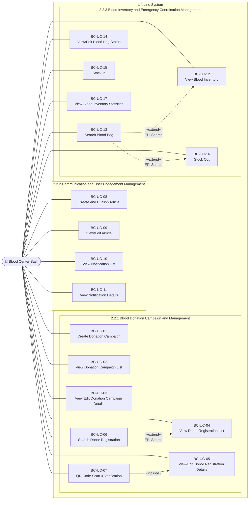
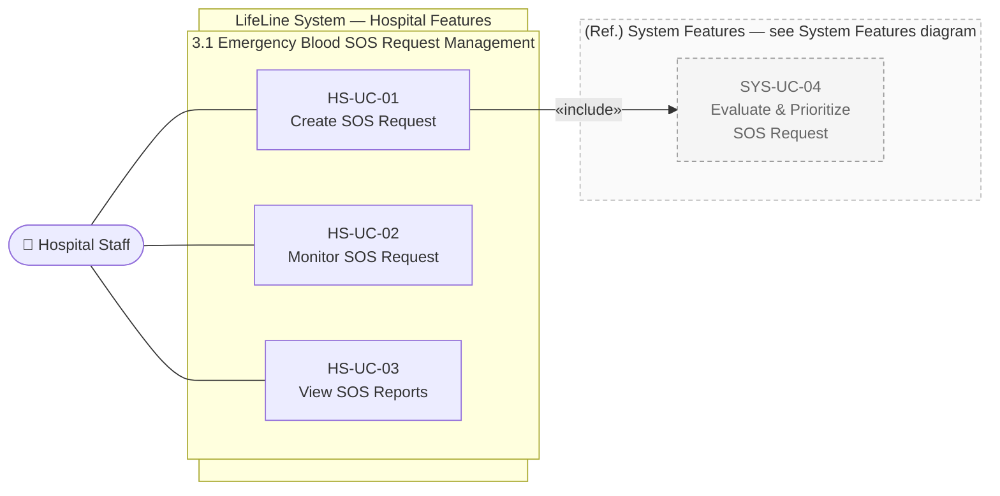
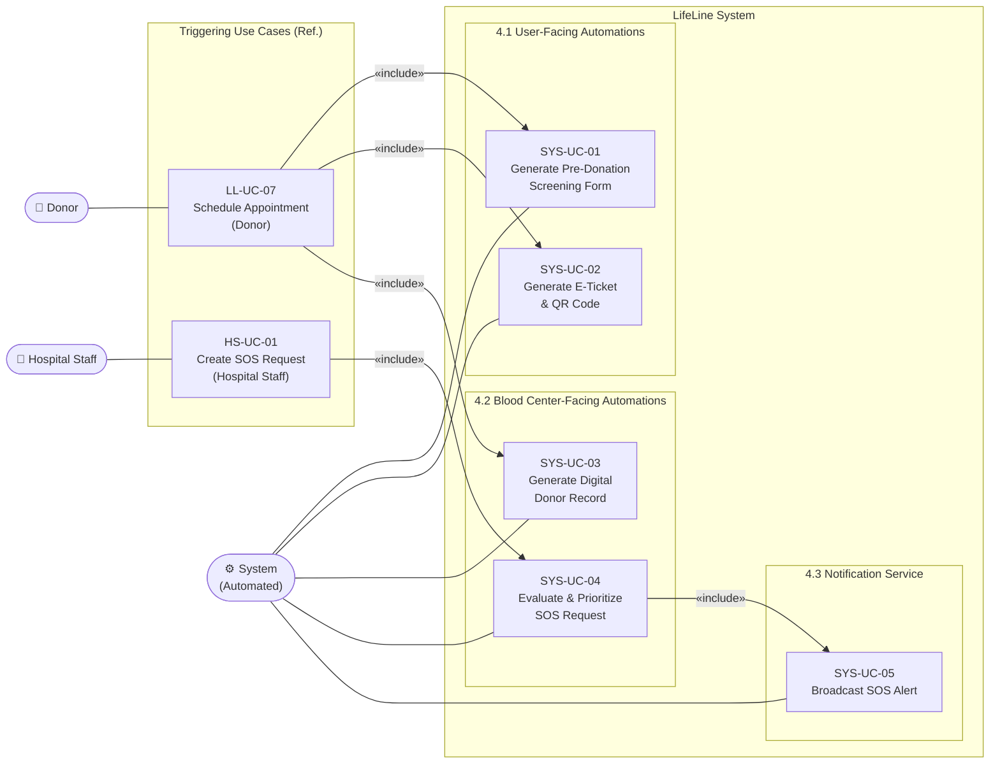

# LifeLine — Use-Case Specification
>**Document:** Use-Case Specification
>**Course:** CSC13002 - Introduction to Software Engineering
>**Team:** Sanguine (Group 05)
>**Version**: 1.1 | **Date**: 23/07/2026
---
# Table Of Contents

+ [LifeLine — Use-Case Specification](#lifeline--use-case-specification)

+ [Table Of Contents](#table-of-contents)

+ [Revision History](#revision-history)

+ [1. Use-case Model](#1-use-case-model)

    + [Diagram 1 — User Features](#diagram-1--user-features)

    + [Diagram 2 — Blood Center Staff Features](#diagram-2--blood-center-staff-features)

    + [Diagram 3 — Hospital Features](#diagram-3--hospital-features)

    + [Diagram 4 — System Automations](#diagram-4--system-automations)

    + [Diagram 5 — Administrator Features](#diagram-5--administrator-features)

    + [Full System Overview Diagram](#full-system-overview-diagram)

+ [2. Use-case Specifications](#2-use-case-specifications)

    + [2.1 User Features](#21-user-features)

        + [2.1.1 User Account Management](#211-user-account-management)

            + [LL-UC-01 Register via Citizen ID](#ll-uc-01-register-via-citizen-id)

            + [LL-UC-02 Login](#ll-uc-02-login)

            + [LL-UC-03 Logout](#ll-uc-03-logout)

            + [LL-UC-04 Reset Password](#ll-uc-04-reset-password)

            + [LL-UC-05 Manage Profile](#ll-uc-05-manage-profile)

        + [2.1.2 Donation Booking & Location Services](#212-donation-booking--location-services)

            + [LL-UC-06 Browse Interactive Map](#ll-uc-06-browse-interactive-map)

            + [LL-UC-07 Schedule Appointment](#ll-uc-07-schedule-appointment)

            + [LL-UC-08 View Appointment Details](#ll-uc-08-view-appointment-details)

            + [LL-UC-09 Cancel Appointment](#ll-uc-09-cancel-appointment)

            + [LL-UC-10 Download E-Ticket](#ll-uc-10-download-e-ticket)

        + [2.1.3 AI-Powered Conversational Support & Guidance](#213-ai-powered-conversational-support--guidance)

            + [CB-UC-01 Interact with AI Chatbot](#cb-uc-01-interact-with-ai-chatbot)

        + [2.1.4 News, Notifications & Communication](#214-news-notifications--communication)

            + [NF-UC-01 Browse News Feed](#nf-uc-01-browse-news-feed)

            + [NF-UC-02 View Article Details](#nf-uc-02-view-article-details)

            + [NT-UC-01 Receive Routine Notification](#nt-uc-01-receive-routine-notification)

            + [NT-UC-02 Manage Notification Preferences](#nt-uc-02-manage-notification-preferences)

            + [SOS-UC-01 Receive SOS Emergency Alert](#sos-uc-01-receive-sos-emergency-alert)

            + [SOS-UC-02 Respond to SOS Emergency Alert](#sos-uc-02-respond-to-sos-emergency-alert)

        + [2.1.5. Donation Impact & Tracking](#215-donation-impact--tracking)

            + [DN-UC-01 View Donation Timeline](#dn-uc-01-view-donation-timeline)

            + [DN-UC-02 View Achievement Progress](#dn-uc-02-view-achievement-progress)

            + [DN-UC-03 View Donor Level Progress](#dn-uc-03-view-donor-level-progress)

        + [2.1.6. Community](#216-community)

            + [CM-UC-01 Access Facebook Fanpage](#cm-uc-01-access-facebook-fanpage)

    + [2.2 Blood Center Features](#22-blood-center-features)

        + [2.2.1 Blood Donation Campaign and Management](#221-blood-donation-campaign-and-management)

            + [BC-UC-01 Create Donation Campaign](#bc-uc-01-create-donation-campaign)

            + [BC-UC-02 View Donation Campaign List](#bc-uc-02-view-donation-campaign-list)

            + [BC-UC-03 View/Edit Donation Campaign Details](#bc-uc-03-viewedit-donation-campaign-details)

            + [BC-UC-04 View Donor Registration List](#bc-uc-04-view-donor-registration-list)

            + [BC-UC-05 View/Edit Donor Registration Details](#bc-uc-05-viewedit-donor-registration-details)

            + [BC-UC-06 Search Donor Registration](#bc-uc-06-search-donor-registration)

            + [BC-UC-07 QR Code Scan & Verification](#bc-uc-07-qr-code-scan--verification)

        + [2.2.2 Communication and User Engagement Management](#222-communication-and-user-engagement-management)

            + [BC-UC-08 Create and Publish Article](#bc-uc-08-create-and-publish-article)

            + [BC-UC-09 View/Edit Article](#bc-uc-09-viewedit-article)

            + [BC-UC-10 View Notification List](#bc-uc-10-view-notification-list)

            + [BC-UC-11 View Notification Details](#bc-uc-11-view-notification-details)

        + [2.2.3 Blood Inventory and Emergency Coordination Management](#223-blood-inventory-and-emergency-coordination-management)

            + [BC-UC-12 View Blood Inventory](#bc-uc-12-view-blood-inventory)

            + [BC-UC-13 Search Blood Bag](#bc-uc-13-search-blood-bag)

            + [BC-UC-14 View/Edit Blood Bag Status](#bc-uc-14-viewedit-blood-bag-status)

            + [BC-UC-15 Stock In](#bc-uc-15-stock-in)

            + [BC-UC-16 Stock Out](#bc-uc-16-stock-out)

            + [BC-UC-17 View Blood Inventory Statistics](#bc-uc-17-view-blood-inventory-statistics)

    + [2.3 Hospital Features](#23-hospital-features)

        + [2.3.1 Emergency Blood SOS Request Management](#231-emergency-blood-sos-request-management)

            + [HS-UC-01 Create SOS Request](#hs-uc-01-create-sos-request)

            + [HS-UC-02 Monitor SOS Request](#hs-uc-02-monitor-sos-request)

            + [HS-UC-03 View SOS Reports](#hs-uc-03-view-sos-reports)

    + [2.4 System Features](#24-system-features)

        + [2.4.1 User-Facing Automations](#241-user-facing-automations)

            + [SYS-UC-01 Generate Pre-Donation Screening Form](#sys-uc-01-generate-pre-donation-screening-form)

            + [SYS-UC-02 Generate E-Ticket & QR Code](#sys-uc-02-generate-e-ticket--qr-code)

        + [2.4.2 Blood Center-Facing Automations](#242-blood-center-facing-automations)

            + [SYS-UC-03 Generate Digital Donor Record](#sys-uc-03-generate-digital-donor-record)

            + [SYS-UC-04 Evaluate & Prioritize SOS Request](#sys-uc-04-evaluate--prioritize-sos-request)

        + [2.4.3 Notification Service](#243-notification-service)

            + [SYS-UC-05 Broadcast SOS Alert](#sys-uc-05-broadcast-sos-alert)

    + [2.5 Administrator Features](#25-administrator-features)

        + [2.5.1 System and User Management](#251-system-and-user-management)

            + [AD-UC-01 View/Search User Accounts](#ad-uc-01-viewsearch-user-accounts)

            + [AD-UC-02 Manage User Account](#ad-uc-02-manage-user-account)

            + [AD-UC-03 Manage Roles & Permissions](#ad-uc-03-manage-roles--permissions)

            + [AD-UC-04 Monitor System Activity](#ad-uc-04-monitor-system-activity)

            + [AD-UC-05 Manage System Configuration](#ad-uc-05-manage-system-configuration)

            + [AD-UC-06 Manage Feature Toggles](#ad-uc-06-manage-feature-toggles)

# Revision History
| Date       | Version | Description                                                                               | Author        |
| :--------- | :------ | :---------------------------------------------------------------------------------------- | :------------ |
| 23/06/2026 | 1.0     | Compiled Use Case Diagrams and Use Case Specifications (Pending UI prototypes insertion). | Trần Anh Kiệt |
| 23/07/2026 | 1.1     | Refactored Use-Case models: removed invalid UI-navigation `<<extend>>` relationships across diagrams per instructor feedback. | Trần Anh Kiệt & Trần Minh Triết |
# 1. Use-case Model
---
## Diagram 1 — User Features

*Author: Trần Anh Kiệt  |  Reviewer: Trịnh Khánh Linh  |  Editor: Trần Anh Kiệt*

> Covers sections **1.1 User Account Management**, **1.2 Donation Booking & Location Services**, **1.3 AI-Powered Conversational Support**, **1.4 News, Notifications & Communication**, **1.5 Donation Impact & Tracking**, **1.6 Community**.

```mermaid

%%{init: {'theme': 'default', 'themeVariables': {'fontSize': '14px'}}}%%
graph LR

    %% ── Actors ──────────────────────────────────────────
    Donor(["👤 Donor"])
    NE(["⚙️ Notification Engine<br>(supporting actor)"])

    subgraph SYS ["LifeLine System — User Features"]
        direction TB

        %% ── 1.1 User Account Management ────────────────
        subgraph UAM ["1.1 User Account Management"]
            UC01["LL-UC-01<br>Register via Citizen ID"]
            UC02["LL-UC-02<br>Login"]
            UC03["LL-UC-03<br>Logout"]
            UC04["LL-UC-04<br>Reset Password"]
            UC05["LL-UC-05<br>Manage Profile"]
        end

        %% ── 1.2 Donation Booking & Location ────────────
        subgraph DBS ["1.2 Donation Booking & Location Services"]
            UC06["LL-UC-06<br>Browse Interactive Map"]
            UC07["LL-UC-07<br>Schedule Appointment"]
            UC08["LL-UC-08<br>View Appointment Details"]
            UC09["LL-UC-09<br>Cancel Appointment"]
            UC10["LL-UC-10<br>Download E-Ticket"]
        end

        %% ── 1.3 AI Chatbot ──────────────────────────────
        subgraph AI ["1.3 AI-Powered Conversational Support"]
            CBUC01["CB-UC-01<br>Interact with AI Chatbot"]
        end

        %% ── 1.4 News, Notifications & Communication ────
        subgraph NNC ["1.4 News, Notifications & Communication"]
            NFUC01["NF-UC-01<br>Browse News Feed"]
            NFUC02["NF-UC-02<br>View Article Details"]
            NTUC01["NT-UC-01<br>Receive Routine Notification"]
            NTUC02["NT-UC-02<br>Manage Notification Preferences"]
            SOSUC01["SOS-UC-01<br>Receive SOS Emergency Alert"]
            SOSUC02["SOS-UC-02<br>Respond to SOS Emergency Alert"]
        end

        %% ── 1.5 Donation Impact & Tracking ─────────────
        subgraph DIT ["1.5 Donation Impact & Tracking"]
            DNUC01["DN-UC-01<br>View Donation Timeline"]
            DNUC02["DN-UC-02<br>View Achievement Progress"]
            DNUC03["DN-UC-03<br>View Donor Level Progress"]
        end

        %% ── 1.6 Community ───────────────────────────────
        subgraph COM ["1.6 Community"]
            CMUC01["CM-UC-01<br>Access Facebook Fanpage"]
        end
    end

    %% ── External reference use cases (declared as «include» targets  ──
    subgraph EXT ["(Ref.) System Features — see System Features diagram"]
        SYSUC01["SYS-UC-01<br>Generate Pre-Donation<br>Screening Form"]
        SYSUC02["SYS-UC-02<br>Generate E-Ticket<br>& QR Code"]
        SYSUC03["SYS-UC-03<br>Generate Digital<br>Donor Record"]
    end

    %% ── Actor associations ──────────────────────────────
    Donor --- UC01
    Donor --- UC02
    Donor --- UC03
    Donor --- UC04
    Donor --- UC05
    Donor --- UC06
    Donor --- UC07
    Donor --- UC08
    Donor --- UC09
    Donor --- UC10
    Donor --- CBUC01
    Donor --- NFUC01
    Donor --- NFUC02
    Donor --- NTUC01
    Donor --- NTUC02
    Donor --- SOSUC01
    Donor --- SOSUC02
    Donor --- DNUC01
    Donor --- DNUC02
    Donor --- DNUC03
    Donor --- CMUC01

    NE --- NTUC01
    NE --- SOSUC01

    %% ── Relationships ───────────────────────────────────

    %% include (Bắt buộc phải chạy)
    UC07 -- "«include»" --> SYSUC01
    UC07 -- "«include»" --> SYSUC02
    UC07 -- "«include»" --> SYSUC03

    %% extend (Tùy chọn, có điều kiện, chèn vào luồng cơ sở)
    UC04 -. "«extend»" .-> UC02
    UC09 -. "«extend»" .-> UC08
    UC10 -. "«extend»" .-> UC08
    SOSUC02 -. "«extend»" .-> SOSUC01

    %% ── Styling for out-of-scope reference nodes ────────
    classDef extRef fill:#f5f5f5,stroke:#999,stroke-dasharray: 4 3,color:#666;
    class SYSUC01,SYSUC02,SYSUC03 extRef;
    style EXT fill:#fafafa,stroke:#bbb,stroke-dasharray: 4 3;

```

---
## Diagram 2 — Blood Center Staff Features

*Author: Trần Minh Triết  |  Reviewer: Trần Anh Kiệt  |  Editor: Trần Minh Triết*

> Covers sections **2.2.1 Blood Donation Campaign and Management**, **2.2.2 Communication and User Engagement Management**, **2.2.3 Blood Inventory and Emergency Coordination Management**.

---
## Diagram 3 — Hospital Features

*Author: Nguyễn Quốc Dương  |  Reviewer: Trần Anh Kiệt  |  Editor: Nguyễn Quốc Dương*

> Covers section **3.1 Emergency Blood SOS Request Management**.

---
## Diagram 4 — System Automations

*Author: Trần Anh Kiệt  |  Reviewer: Trịnh Khánh Linh  |  Editor: Trần Anh Kiệt*

> Covers sections **4.1 User-Facing Automations** and **4.2 Blood Center-Facing Automations**.

---
## Diagram 5 — Administrator Features

*Author: Trần Anh Kiệt  |  Reviewer: Trần Đức Quý  |  Editor: Trần Anh Kiệt*

> Covers section **5.1 Administrator Features**.

---
## Full System Overview Diagram

*Author: Trần Anh Kiệt  |  Reviewer: Trịnh Khánh Linh  |  Editor: Trần Anh Kiệt*

> High-level view of all actors and their primary functional groups within the LifeLine system. Covers functional groups **2.1.1 → 2.5.1**. Individual use cases are omitted at this level — see Diagrams 1–5 for full detail.

```mermaid
%%{init: {'theme': 'default', 'themeVariables': {'fontSize': '13px'}}}%%
graph TB

    %% ── Actors ──────────────────────────────────────────
    Donor(["👤 Donor"])
    BCS(["👤 Blood Center Staff"])
    HS(["👤 Hospital Staff"])
    Admin(["👤 Administrator"])
    SYS_ACT(["⚙️ System<br>(Automated)"])
    NE(["⚙️ Notification Engine<br>(supporting actor)"])

    subgraph LL ["LifeLine System Boundary"]
        direction LR

        subgraph UF ["2.1 User Features"]
            UAM["2.1.1 User Account Management<br>(LL-UC-01 → LL-UC-05)"]
            DBS["2.1.2 Donation Booking & Location Services<br>(LL-UC-06 → LL-UC-10)"]
            AI["2.1.3 AI-Powered Conversational Support & Guidance<br>(CB-UC-01)"]
            NNC["2.1.4 News, Notifications & Communication<br>(NF-UC-01..02, NT-UC-01..02,<br>SOS-UC-01..02)"]
            DIT["2.1.5 Donation Impact & Tracking<br>(DN-UC-01 → DN-UC-03)"]
            COM["2.1.6 Community<br>(CM-UC-01)"]
        end

        subgraph BCF ["2.2 Blood Center Features"]
            CAM["2.2.1 Blood Donation Campaign and Management<br>(BC-UC-01 → BC-UC-07)"]
            CMS["2.2.2 Communication and User Engagement Management<br>(BC-UC-08 → BC-UC-11)"]
            INV["2.2.3 Blood Inventory and Emergency Coordination Management<br>(BC-UC-12 → BC-UC-17)"]
        end

        subgraph HSF ["2.3 Hospital Features"]
            SOSM["2.3.1 Emergency Blood SOS Request Management<br>(HS-UC-01 → HS-UC-03)"]
        end

        subgraph SYSF ["2.4 System Features"]
            UFA["2.4.1 User-Facing Automations<br>(SYS-UC-01, SYS-UC-02)"]
            BCA["2.4.2 Blood Center-Facing Automations<br>(SYS-UC-03, SYS-UC-04)"]
            NOTIF["2.4.3 Notification Service<br>(SYS-UC-05)"]
        end

        subgraph ADMF ["2.5 Administrator Features"]
            ADMG["2.5.1 System and User Management<br>(AD-UC-01 → AD-UC-06)"]
        end
    end

    %% ── Actor → Feature Group ───────────────────────────
    Donor --- UAM
    Donor --- DBS
    Donor --- AI
    Donor --- NNC
    Donor --- DIT
    Donor --- COM

    BCS --- CAM
    BCS --- CMS
    BCS --- INV

    HS --- SOSM

    Admin --- ADMG

    SYS_ACT --- UFA
    SYS_ACT --- BCA
    SYS_ACT --- NOTIF

    NE --- NNC

    %% ── Cross-group dependencies (per «include»/related-UC relations) ──
    DBS -- "«include»" --> UFA
    DBS -- "«include»" --> BCA
    SOSM -- "«include»" --> BCA
    BCA -- "«include»" --> NOTIF
    NOTIF -. "broadcasts to" .-> NNC
```

---
# 2. Use-case Specifications
## 2.1 User Features

### 2.1.1 User Account Management

*Author: Trần Anh Kiệt  |  Reviewer: Trịnh Khánh Linh  |  Editor: Trần Anh Kiệt*

#### LL-UC-01: Register via Citizen ID

| Field | Content |
| :---- | :---- |
| **Use Case ID** | LL-UC-01 |
| **Use Case Name** | Register via Citizen ID |
| **Primary Actor(s)** | Donor |
| **Description** | Allows a new user to create a verified donor account by scanning their Citizen Identity Card (CCCD) QR code. The system automatically extracts and pre-fills personal data, after which the user completes their profile and activates the account via a verification email. |
| **Preconditions** | 1. The user does not have an existing account in the system.  2. The user has access to a valid CCCD.  3. The registration service and QR Scanning service are operational. |
| **Trigger** | The user navigates to the registration page and selects **Register with Citizen ID**. |
| **Basic Flow (Main Success Scenario)** | **1.** User navigates to the registration page.  **2.** System prompts the user to scan the CCCD QR code.  **3.** User scans the CCCD QR code.  **4.** System invokes the QR Scanning service to extract personal information to prefill (full name, date of birth, ID number).  **5.** System pre-fills the registration form with extracted data.  **6.** User reviews the pre-filled information and enters additional details: email address, phone number, and password.  **7.** User clicks the **Register** button.  **8.** System validates all entered information.  **9.** System creates the donor account in a pending state.  **10.** System sends a verification email to the provided address.  **11.** User opens the email and clicks the verification link.  **12.** System activates the account and redirects the user to the login page with a success message.  **13.** Use case ends successfully. |
| **Alternative Flows** | **AF-01: QR Scanning Extraction Fails (Step 5)**  1. The QR Scanning service cannot extract information from the provided document image (poor quality, glare, or unsupported format).  2. System displays an error message and prompts the user to retake or re-upload the QR image.  3. Return to Step 3.   **AF-02: Duplicate Identity Document Detected (Step 9)**  1. System detects that the provided CCCD is already linked to an existing account.  2. System displays an error message indicating the document is already registered.  3. System suggests the user log in or contact support.  4. Use case ends.   **AF-03: Duplicate Email Address (Step 9)**  1. System detects that the provided email address is already in use.  2. System displays an error message next to the email field.  3. User enters a different email address.  4. Return to Step 8.   **AF-04: Invalid or Missing Required Fields (Step 9)**  1. System detects invalid input (e.g., incorrect email format, password below strength requirement, missing required field).  2. System highlights the invalid field(s) with error messages.  3. User corrects the invalid input.  4. Return to Step 8.   **AF-05: Verification Email Not Received (Step 12)**  1. User does not receive the verification email within a reasonable time.  2. User clicks the **Resend Verification Email** button on the pending confirmation page.  3. System resends the verification email.  4. Return to Step 12.   **AF-06: Verification Link Expired (Step 12)**  1. User clicks a verification link that has expired (valid for 24 hours).  2. System displays an error message indicating the link is no longer valid.  3. System prompts the user to request a new verification email.  4. Return to Step 11.   **AF-07: User Cancels Registration (Step 7)**  1. User navigates away from the registration page before clicking **Register**.  2. System shows box with 2 options discarding all entered information or continuing registration.  3. Use case ends. |
| **Postconditions** | **Success:** - A new verified donor account is created and activated. - The donor profile is stored with identity-verified personal information. - The donor can log in and access all platform features.   **Failure:** - No account is created. - No data is persisted in the system. |
| **Special Requirements** | **Security:** - Passwords must be stored using a strong hashing algorithm (e.g., bcrypt). - Passwords must be at least 8 characters and include letters and digits. - All registration traffic must be transmitted over HTTPS. - Identity document data must be handled and stored securely.   **Performance:** - QR Code extraction should complete within 5 seconds. - Account creation should be completed within 3 seconds after submission. - Verification emails must be sent within 60 seconds.   **Reliability:** - Account information must not be partially saved if an error occurs during creation.   **Usability:** - Pre-filled fields must be clearly labelled as auto-extracted and allow user correction. - Required fields must be visually indicated. |
| **Related Use Cases** | None |

---

#### LL-UC-02: Login

| Field | Content |
| :---- | :---- |
| **Use Case ID** | LL-UC-02 |
| **Use Case Name** | Login |
| **Primary Actor(s)** | Donor |
| **Description** | Allows a registered user to authenticate into the LifeLine platform using their CCCD number and password. Upon successful authentication, the user gains access to their personal dashboard and platform features. |
| **Preconditions** | 1. The user has a verified and active account in the system.  2. The authentication service is operational. |
| **Trigger** | The user navigates to the login page and clicks the **Login** button. |
| **Basic Flow (Main Success Scenario)** | **1.** User navigates to the login page.  **2.** User enters their CCCD number and password.  **3.** User clicks the **Login** button.  **4.** System validates the credentials against the stored account records.  **5.** System generates a session token for the authenticated user.  **6.** System redirects the user to their personal dashboard.  **7.** Use case ends successfully. |
| **Alternative Flows** | **AF-01: Incorrect Credentials (Step 4)**  1. System detects that the CCCD number or password does not match any account record.  2. System displays a generic error message: "Incorrect ID number or password."  3. User re-enters their credentials.  4. Return to Step 3.   **AF-02: Account Not Yet Verified (Step 4)**  1. System detects that the account associated with the entered credentials has not been email-verified.  2. System displays a message indicating the account is pending verification.  3. System offers a **Resend Verification Email** option.  4. Use case ends or user proceeds with email resend.   **AF-03: Account Suspended (Step 4)**  1. System detects that the account has been suspended by an Administrator.  2. System displays a message indicating the account is suspended and instructs the user to contact support.  3. Use case ends.   **AF-04: Missing Credentials (Step 3)**  1. User clicks **Login** without entering the ID number or password.  2. System highlights the missing fields with error messages.  3. User fills in the required fields.  4. Return to Step 3.   **AF-05: Too Many Failed Attempts (Step 4)**  1. System detects that the user has exceeded the maximum number of consecutive failed login attempts (e.g., 5 attempts).  2. System temporarily locks the account for a cooldown period and displays an appropriate message.  3. Use case ends until the lockout period expires.   **AF-06: User Forgot Password (Step 2)**  1. User clicks the **Forgot Password?** link on the login page.  2. Use case transitions to LL-UC-04: Reset Password.  3. Use case ends. |
| **Postconditions** | **Success:** - The user is authenticated and has an active session. - The user is redirected to their personal dashboard.   **Failure:** - No session is created. - The user remains on the login page. |
| **Special Requirements** | **Security:** - All login traffic must be transmitted over HTTPS. - Passwords must never be transmitted or logged in plaintext. - Brute-force protection must be enforced (account lockout after repeated failures). - Session tokens must expire after 30 minutes of inactivity (NFR-S05).   **Performance:** - Login response must be returned within 2 seconds under normal operating conditions.   **Usability:** - Error messages must not reveal whether the ID number or password was incorrect to prevent account enumeration. |
| **Related Use Cases** | **Extended by:** Reset Password (LL-UC-04)   *Extension Point: "Forgot Password", at Basic Flow Step 2 (immediately after the login page is displayed, before the actor enters their credentials); trigger condition: the actor selects the Forgot Password? link instead of entering their ID/password (see AF-06).* |

---

#### LL-UC-03: Logout

| Field | Content |
| :---- | :---- |
| **Use Case ID** | LL-UC-03 |
| **Use Case Name** | Logout |
| **Primary Actor(s)** | Donor |
| **Description** | Allows an authenticated user to securely end their current session, clearing all session data and returning to the public homepage. |
| **Preconditions** | 1. The user is currently logged in and has an active session. |
| **Trigger** | The user clicks the **Sign Out** button available from the personal account dashboard in the platform. |
| **Basic Flow (Main Success Scenario)** | **1.** User clicks the **Sign Out** button in the personal “My Profile” Dashboard.  **2.** System shows the box asking for confirmation.  **3.** System invalidates the user's current session token if the user confirms sign out.  **4.** System clears all locally stored session data.  **5.** System redirects the user to the public homepage.  **6.** System displays a message confirming successful logout.  **7.** Use case ends successfully. |
| **Alternative Flows** | **AF-01: Session Already Expired (Step 2)**  1. The user's session has already expired due to inactivity (NFR-S05: 30-minute timeout).  2. System detects there is no active session to invalidate.  3. System redirects the user to the login page.  4. Use case ends.   **AF-02: System Error During Logout (Step 2)**  1. System encounters an error while attempting to invalidate the session token.  2. System displays an error message and advises the user to close the browser for security.  3. Use case ends. |
| **Postconditions** | **Success:** - The user's session is fully invalidated and removed from the system. - The user is redirected to the public homepage in an unauthenticated state.   **Failure:** - The session remains active; the user is advised to close the browser. |
| **Special Requirements** | **Security:** - Session tokens must be invalidated server-side upon logout to prevent replay attacks. - Locally cached session data must be cleared from the browser.   **Performance:** - Logout must be completed and redirect initiated within 1 second. |
| **Related Use Cases** | None |

---

#### LL-UC-04: Reset Password

| Field | Content |
| :---- | :---- |
| **Use Case ID** | LL-UC-04 |
| **Use Case Name** | Reset Password |
| **Primary Actor(s)** | Donor |
| **Description** | Allows a registered user who has forgotten their password to securely reset it by verifying their identity via a One-Time Password (OTP) sent to their registered email address. |
| **Preconditions** | 1. The user has a verified and active account in the system.  2. The user has access to their registered email address.  3. The OTP delivery service (email) is operational. |
| **Trigger** | The user clicks the **Forgot Password?** link on the login page. |
| **Basic Flow (Main Success Scenario)** | **1.** User clicks the **Forgot Password?** link on the login page.  **2.** System displays the password reset initiation form.  **3.** User enters their registered email address.  **4.** User clicks the **Send OTP** button.  **5.** System verifies that the provided contact information is associated with an existing account.  **6.** System generates a time-limited OTP and sends it to the user's registered email.  **7.** System prompts the user to enter the OTP.  **8.** User enters the received OTP.  **9.** System validates the OTP.  **10.** System displays the new password creation form.  **11.** User enters a new password and confirms it.  **12.** User clicks the **Confirm** button.  **13.** System validates the new password against strength requirements and confirms the two fields match.  **14.** System updates the account password.  **15.** System displays a success message and redirects the user to the login page.  **16.** Use case ends successfully. |
| **Alternative Flows** | **AF-01: Contact Information Not Found (Step 5)**  1. System cannot find any account associated with the provided email or CCCD number.  2. System displays an error message: **"This ID number is not registered in our system."** or **“No account found with this contact information. Please try again.”**  3. User enters a different email or CCCD Number.  4. Return to Step 4.   **AF-02: OTP Not Received (Step 8)**  1. User does not receive the OTP within a reasonable time.  2. User clicks the **Resend Code** button.  3. System generates and sends a new OTP, invalidating the previous one.  4. Return to Step 7.   **AF-03: Invalid OTP Entered (Step 9)**  1. System detects that the entered OTP does not match or is incorrect.  2. System displays an error message indicating the OTP is invalid.  3. User re-enters the OTP or requests a new one.  4. Return to Step 8.   **AF-04: OTP Expired (Step 9)**  1. System detects that the OTP has exceeded its validity period (e.g., 10 minutes).  2. System displays an error message: "OTP has expired."  3. System prompts the user to request a new OTP.  4. Return to Step 4.   **AF-05: Too Many OTP Attempts (Step 9)**  1. System detects the user has entered an incorrect OTP too many consecutive times.  2. System invalidates the current OTP session and temporarily blocks further attempts.  3. System displays an appropriate message.  4. Use case ends.   **AF-06: New Password Fails Validation (Step 13)**  1. System detects the new password does not meet strength requirements, or the two password fields do not match.  2. System displays specific error messages next to the relevant fields.  3. User corrects the password input.  4. Return to Step 12.   **AF-07: User Cancels Reset (Any Step)**  1. User navigates away from the reset password flow before completion.  2. System discards the active OTP session.  3. Use case ends. |
| **Postconditions** | **Success:** - The user's account password is successfully updated. - The old password is no longer valid. - The user is redirected to the login page to authenticate with the new password.   **Failure:** - The password is not changed. - The user's account remains accessible with the original password. |
| **Special Requirements** | **Security:** - OTPs must be valid for a maximum of 10 minutes. - OTPs must be invalidated immediately after successful use. - All reset traffic must be transmitted over HTTPS. - New passwords must meet the same strength requirements as during registration (minimum 8 characters, letters and digits).   **Performance:** - OTP delivery must occur within 60 seconds of the request. - Password update must be completed within 3 seconds of confirmation.   **Usability:** - TThe system must clearly inform the user that the OTP has been sent exclusively to their registered email address. |
| **Related Use Cases** | **Extend:** Login (LL-UC-02)   *Extension Point: "Forgot Password" on LL-UC-02 (Basic Flow Step 2); triggered only when the actor clicks Forgot Password?. The login process remains complete and valid even if this extension is never executed.* |

---

#### LL-UC-05: Manage Profile

| Field | Content |
| :---- | :---- |
| **Use Case ID** | LL-UC-05 |
| **Use Case Name** | Manage Profile |
| **Primary Actor(s)** | Donor |
| **Description** | Allows an authenticated donor to view and update their personal profile information, including contact details such as phone number, email address, and residential address. The donor’s profile dashboard also displays key summary information such as blood type and upcoming donation schedule. |
| **Preconditions** | 1. The actor is authenticated and has an active session.  2. For a Donor: the Donor is accessing their own profile. |
| **Trigger** | The actor navigates to the **My Profile** section from the main dashboard. |
| **Basic Flow (Main Success Scenario)** | **1.** Donor navigates to their My Profile page from the dashboard.  **2.** System displays the current profile information: full name, date of birth, ID number (read-only), blood type, email address, phone number, residential address, and key summary statistics (total donations, next eligible donation date).  **3.** Donor clicks the **Edit Profile** button.  **4.** System displays the editable profile fields (email address, phone number, residential address).  **5.** Donor modifies one or more fields.  **6.** Donor clicks the **Save** button.  **7.** System validates the entered information.  **8.** System updates the profile record in the database.  **9.** System displays a success message confirming the update.  **10.** Use case ends successfully. |
| **Alternative Flows** | **AF-01: Invalid Field Input (Step 7)**  1. System detects invalid input (e.g., incorrect email format, phone number not meeting length requirements).  2. System highlights the invalid field(s) with error messages.  3. Donor corrects the invalid input.  4. Return to Step 6.   **AF-02: Duplicate Email Address (Step 7)**  1. System detects that the newly entered email address is already associated with another account.  2. System displays an error message next to the email field.  3. Donor enters a different email address.  4. Return to Step 6.   **AF-03: Missing Required Field (Step 7)**  1. System detects that a required field has been cleared or left empty.  2. System displays an error message indicating the required field(s).  3. Donor fills in the missing information.  4. Return to Step 6.   **AF-04: Donor Cancels Edit (Step 5)**  1. Donor clicks the **Cancel** button before saving changes.  2. System discards all unsaved modifications.  3. System returns the profile page to the read-only view.  4. Use case ends.   **AF-05: System Error on Save (Step 8)**  1. System encounters an error while saving the profile update.  2. System displays an error message and advises the user to retry.  3. Use case ends without saving changes. |
| **Postconditions** | **Success:** - The donor's profile information is updated in the database. - The updated information is immediately reflected on the profile page and used for all subsequent platform operations (e.g., emergency alert targeting).   **Failure:** - No profile data is changed. - The previous profile information is retained. |
| **Special Requirements** | **Security:** - Identity-verified fields (full name, date of birth, ID number) extracted during registration must be read-only and cannot be modified through the profile page. - All profile update traffic must be transmitted over HTTPS.   **Performance:** - Profile updates must be processed and confirmed within 3 seconds.   **Usability:** - Clearly distinguish read-only identity fields from editable contact fields. - Key summary information (blood type, donation history, next eligible date) should be prominently displayed on the profile dashboard. |
| **Related Use Cases** | None |

---

### 2.1.2 Donation Booking & Location Services

*Author: Trần Anh Kiệt  |  Reviewer: Trịnh Khánh Linh  |  Editor: Trần Anh Kiệt*

#### LL-UC-06: Browse Interactive Map

| Field | Content |
| :---- | :---- |
| **Use Case ID** | LL-UC-06 |
| **Use Case Name** | Browse Interactive Map |
| **Primary Actor(s)** | Donor |
| **Description** | Allows a donor to explore nearby blood donation points and active campaigns on an interactive map interface. The donor can apply filters such as distance radius and crowding level to identify convenient and available donation locations, with all data pulled live from the campaign database. |
| **Preconditions** | 1. The donor is authenticated and logged into the system.  2. The mapping service and live campaign data feed are operational.  3. The donor's device supports location services, or the donor can manually input a location. |
| **Trigger** | The donor navigates to the **Map** section from the main dashboard or booking module. |
| **Basic Flow (Main Success Scenario)** | **1.** Donor navigates to the interactive map page.  **2.** System requests the donor's current location (with permission) or defaults to a city-level view.  **3.** Donor grants location permission.  **4.** System retrieves and displays all currently active donation points and campaigns on the map, centered on the donor's location.  **5.** Each map marker displays a brief summary (location name, next available slot, crowding level).  **6.** Donor optionally applies filters (search radius, blood type needed, crowding level, date range).  **7.** System updates the map markers and a side-panel list to reflect the selected filters.  **8.** Donor clicks on a map marker or list item to view the full details of a specific donation point or campaign.  **9.** System displays the detail panel: location name, address, operating hours, available time slots, target blood groups, and current registration count vs. capacity.  **10.** Donor proceeds to schedule an appointment or closes the detail panel to continue browsing.  **11.** Use case ends successfully. |
| **Alternative Flows** | **AF-01: Location Permission Denied (Step 3)**  1. Donor denies the location permission request.  2. System displays a manual location input field (city, district, or address).  3. Donor enters their preferred location manually.  4. Return to Step 4.   **AF-02: No Donation Points Found in Area (Step 4 or Step 7)**  1. System finds no active donation points or campaigns within the selected area or matching the applied filters.  2. System displays an informational message: "No donation points found for the selected criteria."  3. System suggests expanding the search radius or adjusting filters.  4. Donor modifies the filters or search area.  5. Return to Step 7.   **AF-03: Map Service Unavailable (Step 4)**  1. The mapping service fails to load (network error or service outage).  2. System displays an error message and falls back to a text-based list view of available donation points.  3. Donor may browse the list view and click on an entry to view its details.  4. Use case continues from Step 9 via the list view.   **AF-04: Donation Point at Full Capacity (Step 9)**  1. Donor views the detail panel of a donation point that has reached its participant capacity.  2. System clearly indicates "Registration Closed – Full Capacity" on the detail panel.  3. The **Book Appointment** button is disabled for this location.  4. Donor returns to the map to select a different location.  5. Return to Step 8. |
| **Postconditions** | **Success:** - The donor has viewed available donation points and campaigns on the map. - The donor may proceed to schedule an appointment at a selected location.   **Failure:** - No donation points are displayed; the donor is informed and guided to adjust their search criteria. |
| **Special Requirements** | **Performance:** - Map data must load and display within 3 seconds under normal network conditions (NFR-P05). - Filter updates must refresh the map view within 1 second.   **Usability:** - Map markers must be visually distinguishable by crowding level (e.g., color-coded: green = low, yellow = moderate, red = near capacity). - The map must be fully responsive on mobile, tablet, and desktop (NFR-U01).   **Reliability:** - Campaign data displayed on the map must reflect live availability, not cached data older than 60 seconds. |
| **Related Use Cases** | None |

---

#### LL-UC-07: Schedule Appointment

| Field | Content |
| :---- | :---- |
| **Use Case ID** | LL-UC-07 |
| **Use Case Name** | Schedule Appointment |
| **Primary Actor(s)** | Donor |
| **Description** | Enables a donor to select a preferred blood donation location, date, and time slot, and complete the appointment booking process. The system enforces the mandatory 84-day (12-week) waiting period between donations and generates a personalized electronic ticket with a QR code upon successful booking. A pre-donation health screening form is automatically generated as part of the booking process. |
| **Preconditions** | 1. The donor is authenticated and logged into the system.  2. The donor has selected a donation location from the interactive map (LL-UC-06) or the campaign list.  3. The selected campaign has available capacity and open time slots.  4. The booking service and e-ticket generation service are operational. |
| **Trigger** | The donor clicks the **Book Appointment** button from the donation point detail panel (LL-UC-06) or from the **Schedule Another** button from the “My Appointment” (LL-UC-07) Dashboard. |
| **Basic Flow (Main Success Scenario)** | **1.** System retrieves and displays the available date and time slots for the selected donation location or campaign.  **2.** Donor selects a preferred date and time slot.  **3.** System validates the donor's eligibility: checks the 84-day waiting period since the donor's last recorded donation.  **4.** System checks for duplicate bookings: verifies the donor has no other appointment already scheduled for an overlapping time.  **5.** System automatically generates a pre-donation health screening form and presents it to the donor.  **6.** Donor completes the health screening form (medical history, current health status, recent travel, medication).  **7.** Donor reviews the complete booking summary: donation location, date, time slot, blood type, and health screening responses.  **8.** Donor clicks the **Confirm Booking** button.  **9.** System saves the appointment record to the database.  **10.** System automatically generates a personalized e-ticket containing appointment details and a unique QR code.  **11.** System sends a booking confirmation email to the donor with the e-ticket attached.  **12.** System displays the booking confirmation screen with the e-ticket and an option to download it.  **13.** Use case ends successfully. |
| **Alternative Flows** | **AF-01: 84-Day Waiting Period Not Met (Step 3)**  1. System determines that fewer than 84 days have passed since the donor's last donation.  2. System blocks the booking and displays an error message indicating the date from which the donor will next be eligible.  3. Use case ends.   **AF-02: Duplicate Booking Detected (Step 4)**  1. System detects that the donor already has an existing confirmed appointment for an overlapping period.  2. System displays a warning message indicating the conflicting existing appointment.  3. Donor is redirected to view their existing appointment (LL-UC-08).  4. Use case ends.   **AF-03: Health Screening Form Incomplete (Step 6)**  1. Donor attempts to proceed without completing all required fields on the health screening form.  2. System highlights the missing required fields.  3. Donor completes the missing fields.  4. Return to Step 6.   **AF-04: Selected Time Slot Becomes Unavailable (Step 9)**  1. Between the donor selecting the time slot and confirming, the slot is taken by another donor.  2. System detects the slot is no longer available during the save operation.  3. System displays a message: "This time slot is no longer available."  4. System returns the donor to the time slot selection view with updated availability.  5. Return to Step 2.   **AF-05: Campaign Reaches Full Capacity Before Confirmation (Step 9)**  1. The selected campaign reaches its participant capacity between the donor's selection and confirmation.  2. System detects the capacity is full during the save operation.  3. System displays a message: "This campaign is now fully booked."  4. System redirects the donor to the map view to find an alternative location.  5. Return to LL-UC-06.   **AF-06: Donor Cancels Booking (Any Step Before Step 8)**  1. Donor clicks the **Cancel** button at any step of the booking process.  2. System discards all entered information and the generated health screening form.  3. System returns the donor to the map view or campaign list.  4. Use case ends.   **AF-07: System Error on Save (Step 9)**  1. System encounters an error while attempting to save the appointment record.  2. System displays an error message and advises the donor to retry.  3. No partial booking is saved.  4. Use case ends. |
| **Postconditions** | **Success:** - A confirmed appointment record is created and stored in the database. - The selected time slot and campaign capacity are updated to reflect the new booking. - A personalized e-ticket with a unique QR code is generated and delivered to the donor. - The appointment is visible in the donor's dashboard and donation timeline. - A completed health screening form record is linked to the appointment.   **Failure:** - No appointment is created. - No e-ticket is generated. - Campaign capacity and time slot availability remain unchanged. |
| **Special Requirements** | **Business Rules:** - The 84-day (12-week) waiting period between donations must be strictly enforced and cannot be overridden by the donor. - A donor may not hold more than one confirmed upcoming appointment at a time.   **Security:** - QR codes on e-tickets must be unique and cryptographically signed to prevent forgery.   **Performance:** - Appointment confirmation and e-ticket generation must complete within 5 seconds (NFR-P01). - Confirmation email must be delivered within 1 minute of booking (NFR-P03).   **Reliability:** - Appointment records must not be partially saved if an error occurs during the transaction (NFR-R04). - Time slot availability must be checked in real time immediately before the final save to prevent double-booking. |
| **Related Use Cases** | **Include:** Generate Pre-Donation Screening Form (SYS-UC-01)  **Include:** Generate E-Ticket & QR Code (SYS-UC-02)  **Include:** Generate Digital Donor Record (SYS-UC-03) |

---

#### LL-UC-08: View Appointment Details

| Field | Content |
| :---- | :---- |
| **Use Case ID** | LL-UC-08 |
| **Use Case Name** | View Appointment Details |
| **Primary Actor(s)** | Donor |
| **Description** | Allows an authenticated donor to view the full details of a specific blood donation appointment, including location, date, time, blood type, health screening responses, and e-ticket QR code. The donor may also access the option to download the e-ticket or cancel the appointment from this view. |
| **Preconditions** | 1. The donor is authenticated and logged into the system.  2. The donor has at least one confirmed appointment in the system. |
| **Trigger** | The donor clicks on a specific appointment entry from their “My Appointments” Dashboard |
| **Basic Flow (Main Success Scenario)** | **1.** Donor navigates to the **My Appointment** section of their dashboard.  **2.** System displays a list of the donor's appointments (upcoming, past, cancelled), sorted by date.  **3.** Donor clicks on a specific appointment entry.  **4.** System displays the full appointment detail view: donation location (name, address), appointment date and time, blood type, status (Confirmed / Completed / Cancelled), pre-donation health screening summary, and the e-ticket with QR code.  **5.** Donor reviews the appointment information.  **6.** Donor may choose to download the e-ticket or cancel the appointment.  **7.** Use case ends successfully. |
| **Alternative Flows** | **AF-01: No Appointments Found (Step 2)**  1. The donor has no appointment records in the system (neither upcoming nor past).  2. System displays an informational message: "You have no scheduled appointments."  3. System provides a shortcut link to the booking flow.  4. Use case ends.   **AF-02: Appointment Has Been Cancelled (Step 4)**  1. The donor views an appointment that was previously cancelled (by the donor or by the organization).  2. System displays the appointment with a "Cancelled" status badge.  3. The user cannot interact other buttons like cancel button or download QR code button.  4. Use case ends.   **AF-03: Appointment Record Not Found (Step 4)**  1. System cannot retrieve the appointment record (e.g., deleted or invalid ID).  2. System displays an error message.  3. Donor is returned to the appointment list.  4. Use case ends. |
| **Postconditions** | **Success:** - The donor has successfully viewed the full details of the selected appointment.   **Failure:** - No appointment details are displayed; the donor is returned to the appointments list. |
| **Special Requirements** | **Security:** - A donor may only view their own appointment records. - Appointment data must be transmitted over HTTPS.   **Performance:** - Appointment detail page must load within 3 seconds (NFR-P05).   **Usability:** - Appointment status should be clearly and prominently indicated using color-coded badges (e.g., green = Confirmed, grey = Completed, red = Cancelled). |
| **Related Use Cases** | **Extended by:** Download E-Ticket (LL-UC-10)   *Extension Point: "Download Ticket", at Basic Flow Step 6 (when the donor is viewing details and can choose to download the e-ticket); condition: the e-ticket already exists and the appointment is not canceled.*  **Extended by:** Cancel Appointment (LL-UC-09)   *Extension Point: "Cancel Action", at Basic Flow Step 6; condition: the appointment is in a Confirmed/Upcoming status.* |

---

#### LL-UC-09: Cancel Appointment

| Field | Content |
| :---- | :---- |
| **Use Case ID** | LL-UC-09 |
| **Use Case Name** | Cancel Appointment |
| **Primary Actor(s)** | Donor |
| **Description** | Allows a donor to cancel a confirmed upcoming blood donation appointment. The cancellation releases the reserved time slot and reduces the campaign's confirmed registration count, making the slot available to other donors. |
| **Preconditions** | 1. The donor is authenticated and logged into the system.  2. The donor is viewing a specific confirmed, upcoming appointment (LL-UC-08).  3. The appointment has not yet taken place (future date). |
| **Trigger** | The donor clicks the **Cancel Appointment** button from the appointment detail view (LL-UC-08). |
| **Basic Flow (Main Success Scenario)** | **1.** Donor clicks the **Cancel Appointment** button on the appointment detail page.  **2.** System displays a confirmation dialog: "Are you sure you want to cancel this appointment? This action cannot be undone."  **3.** Donor confirms the cancellation by clicking **Yes, Cancel**.  **4.** System updates the appointment status to "Cancelled" in the database and show on the appointment details.  **5.** System releases the reserved time slot, restoring it to available capacity.  **6.** System sends a cancellation confirmation notification to the donor via email.  **7.** System displays a success message on the appointment detail page, with the appointment now shown in "Cancelled" status.  **8.** Use case ends successfully. |
| **Alternative Flows** | **AF-01: Donor Declines Confirmation (Step 3)**  1. Donor clicks **No, Keep Appointment** in the confirmation dialog.  2. System closes the dialog and returns to the appointment detail view without making any changes.  3. Use case ends.   **AF-02: Cancellation Deadline Passed (Step 1)**  1. System detects that the appointment is within the cancellation deadline window (e.g., less than 24 hours before the scheduled time).  2. System displays a warning message: "This appointment cannot be cancelled as it is less than 24 hours away. Please contact the donation center directly."  3. The **Cancel Appointment** button is disabled.  4. Use case ends.   **AF-03: Appointment Already Cancelled (Step 1)**  1. System detects that the appointment has already been cancelled.  2. The **Cancel Appointment** button is not displayed; the appointment shows a "Cancelled" status.  3. Use case does not trigger.   **AF-04: System Error on Cancellation (Step 4)**  1. System encounters an error while updating the appointment status.  2. System displays an error message and advises the donor to retry.  3. No changes are made to the appointment record.  4. Use case ends. |
| **Postconditions** | **Success:** - The appointment status is updated to "Cancelled" in the database. - The reserved time slot is released and becomes available to other donors. - The campaign's confirmed registration count is decremented. - A cancellation confirmation notification is sent to the donor.   **Failure:** - The appointment status remains "Confirmed". - The time slot remains reserved and the capacity count is unchanged. |
| **Special Requirements** | **Business Rules:** - A specific cancellation deadline policy (e.g., no cancellation within 24 hours of the appointment) must be enforced to ensure blood center planning reliability.   **Performance:** - Cancellation must be processed and confirmed within 3 seconds.   **Reliability:** - Time slot availability must be immediately restored upon cancellation to minimize donor displacement. |
| **Related Use Cases** | **Extend:** View Appointment Details (LL-UC-08)   *Extension Point: "Cancel Action" on LL-UC-08 (Basic Flow Step 6); LL-UC-08 remains complete and meaningful even if the donor never cancels; it is invoked from exactly one single location (the Cancel button on the details page), with no other independent entry points.*|

---

#### LL-UC-10: Download E-Ticket

| Field | Content |
| :---- | :---- |
| **Use Case ID** | LL-UC-10 |
| **Use Case Name** | Download E-Ticket |
| **Primary Actor(s)** | Donor |
| **Description** | Allows a donor to download their personalized electronic appointment ticket, which contains full appointment details and a unique QR code, in PDF or image format for offline use and check-in at the donation venue. |
| **Preconditions** | 1. The donor is authenticated and logged into the system.  2. The donor is viewing the detail page of a confirmed appointment (LL-UC-08).  3. An e-ticket has been previously generated for the appointment (by SYS-UC-02). |
| **Trigger** | The donor clicks the **Download E-Ticket** button on the appointment detail page (LL-UC-08). |
| **Basic Flow (Main Success Scenario)** | **1.** Donor clicks the **Download E-Ticket** button from the appointment detail page.  **2.** System retrieves the pre-generated e-ticket record associated with the appointment.  **3.** System generates the e-ticket file in PDF or image format, containing: donor name, blood type, appointment date and time, donation location name and address, and the unique QR code.  **4.** System initiates the file download to the donor's device.  **5.** System displays a confirmation message: "Your e-ticket has been downloaded."  **6.** Use case ends successfully. |
| **Alternative Flows** | **AF-01: E-Ticket Record Not Found (Step 2)**  1. System cannot retrieve the e-ticket record for the appointment (e.g., generation failure during booking).  2. System displays an error message and offers the option to regenerate the e-ticket.  3. System attempts to regenerate the e-ticket for the appointment.  4. If successful, return to Step 3.  5. If regeneration fails, system advises the donor to contact support.  6. Use case ends.   **AF-02: File Generation Error (Step 5)**  1. System encounters an error while generating the e-ticket file in the selected format.  2. System displays an error message and suggests selecting an alternative format or retrying.  3. Donor may select a different format or retry.  4. Return to Step 4.   **AF-03: Appointment is Cancelled (Step 1)**  1. The appointment associated with the e-ticket has been cancelled.  2. System displays the **Download E-Ticket** option as disabled or absent, with a label indicating "Appointment Cancelled."  3. Use case does not trigger. |
| **Postconditions** | **Success:** - The e-ticket file is successfully downloaded to the donor's device in the selected format. - The donor has a portable record of their appointment and QR code for check-in use.   **Failure:** - No file is downloaded. - The donor is informed of the error and advised on next steps. |
| **Special Requirements** | **Security:** - The QR code embedded in the e-ticket must be cryptographically signed to prevent forgery and duplication. - E-ticket downloads must only be accessible to the authenticated donor who owns the appointment.   **Performance:** - E-ticket file generation and download initiation must complete within 5 seconds.   **Usability:** - The e-ticket must be clearly formatted and legible when printed or displayed on a mobile screen. - The QR code must be of sufficient resolution for reliable scanning at the check-in counter. |
| **Related Use Cases** | **Extend:** View Appointment Details (LL-UC-08)   *Extension Point: "Download Ticket" on LL-UC-08 (Basic Flow Step 6); invoked from exactly one location (the Download E-Ticket button on the details page, see Precondition #2 and Trigger); condition: the e-ticket has been generated and the appointment is not Cancelled (see AF-03).* |

---

### 2.1.3 AI-Powered Conversational Support & Guidance

*Author: Trần Đức Quý  |  Reviewer: Trần Anh Kiệt  |  Editor: Trần Đức Quý*
#### CB-UC-01: Interact with AI Chatbot

| Field | Content |
| :--- | :--- |
| **Use Case ID** | CB-UC-01 |
| **Use Case Name** | Interact with AI Chatbot |
| **Primary Actor(s)** | Donor |
| **Description** | Allows donors to engage in multi-turn conversations with an AI-powered chatbot to receive instant, context-aware answers regarding blood donation. The chatbot provides personalized guidance for authenticated donors, can display rich media (campaign cards), and intelligently redirect users to relevant platform features via action buttons. |
| **Preconditions** | 1. Donor is accessing the platform (authentication is optional for general inquiries but required for personalized guidance). 2. The AI chatbot service and underlying knowledge base are operational. |
| **Trigger** | Donor clicks on the **AI Chatbot** menu item in the main navigation sidebar. |
| **Basic Flow (Main Success Scenario)** | **1.** Donor selects **AI Chatbot** from the navigation menu. **2.** System opens the full-screen AI Assistant interface. **3.** System displays a welcome message. A set of quick-action suggestion buttons (e.g., "Am I eligible?", "Find Campaign", "Book appointment", "Preparation tips") is anchored at the bottom, just above the text input area. **4.** Donor types a question in the "Ask anything about blood donation..." input field (which includes a file attachment icon) OR clicks a suggested topic button. **5.** System processes the request using the AI model. **6.** System displays the response. Responses can be text or a structured campaign card. **7.** Donor may ask follow-up questions, typed or selected via quick-reply chips. **8.** Steps 4–7 repeat for a multi-turn conversation. **9.** Donor navigates away from the AI Chatbot page. **10.** Use case ends. |
| **Alternative Flows** | **AF-01: AI Cannot Determine Answer / Fallback (Step 6)** 1. AI cannot retrieve sufficient context to answer. 2. System displays a standardized fallback message: "Xin lỗi, tôi chưa có đủ thông tin để trả lời câu hỏi này. Bạn có thể thử:". 3. System provides specific quick-reply options as bullet points: "Định dạng lại câu hỏi của bạn", "Đặt câu hỏi chung về hiến máu", "Liên hệ hỗ trợ trực tiếp". 4. Donor selects an option or rephrases. 5. Return to Step 5.  **AF-02: Personalized Guidance for Authenticated Donor (Step 4)** 1. An authenticated donor asks about their eligibility or next donation. 2. System identifies the donor and retrieves their profile/history. 3. AI generates a personalized response displaying a card with: Nhóm máu (e.g., O+), Lần hiến máu cuối, Cần sau 84 ngày - Đủ điều kiện, and bulleted guidance ("Hướng dẫn trước khi hiến máu"). 4. System displays the tailored guidance. 5. Return to Step 7.  **AF-03: Platform Feature Navigation via Rich Card (Step 6)** 1. The AI determines the user is looking for nearby campaigns. 2. System displays a response featuring a rich **Campaign Card** with details (e.g., "Central City Hospital", 1.5km, time). 3. The card includes an action button: "**Đăng ký**" (Book Appointment). 4. Donor clicks the action button. 5. System navigates the donor directly to the corresponding booking or details page. 6. Use case ends.  **AF-04: Chatbot Service Maintenance / Unavailable (Step 2)** 1. System detects the AI chatbot service is undergoing maintenance. 2. System displays a full-screen maintenance overlay message with a robot icon: "Chatbot đang bảo trì. Chúng tôi đang nâng cấp hệ thống để phục vụ bạn tốt hơn. Vui lòng quay lại sau ít phút." 3. A red "**Thử lại**" (Retry) button is provided. 4. Donor may click retry or navigate away. 5. Use case ends.  **AF-05: Conversation Timeout / Preserved Context (Step 7)** 1. Donor is inactive for an extended period. 2. System detects the session timeout. 3. System disables the text input field (greyed out) and displays a divider "Khởi tạo cuộc hội thoại mới". 4. System *preserves the full conversation history visually* but requires the user to start a new chat session. |
| **Postconditions** | **Success:** - Donor receives information. - Context is visually preserved even if session ends. **Failure:** - A maintenance or error message is displayed. |
| **Special Requirements** | **Usability:** The interface must support full-screen chat with visible context preservation. Quick-action buttons (booking, directions) must be prominent in rich cards. Maintenance and Fallback screens must provide clear calls-to-action matching the UI exact texts. |
| **Related Use Cases** | None |

---
### 2.1.4: News, Notifications & Communication

*Author: Trần Đức Quý  |  Reviewer: Trần Anh Kiệt  |  Editor: Trần Đức Quý*
#### NF-UC-01: Browse News Feed

| Field | Content |
| :--- | :--- |
| **Use Case ID** | NF-UC-01 |
| **Use Case Name** | Browse News Feed |
| **Primary Actor(s)** | Donor |
| **Description** | Allows donors to browse the platform's public news feed containing blood donation campaigns, health tips, and educational content. The feed supports filtering by specific content categories and uses pagination. |
| **Preconditions** | 1. Published articles exist. 2. The news service is available. |
| **Trigger** | Donor selects **News Feed** from the main navigation sidebar. |
| **Basic Flow (Main Success Scenario)** | **1.** Donor selects **News Feed** from the sidebar navigation. **2.** System displays the main News Feed page. **3.** System retrieves and displays published articles as dynamic cards, showing: - Article thumbnail image. - Category Tag (e.g., "Health Tips", "Campaigns", "Community"). - Title. - Short snippet/excerpt. - Publication date and read time (e.g., "5 min read"). - A red "**Read Full Article ->**" link. **4.** Articles are displayed in reverse chronological order. **5.** Donor may select a category filter tab (e.g., "**All**", "**Campaigns**", "**Health Tips**") at the top. **6.** System filters articles based on the selection. **7.** Donor clicks the "Read Full Article" link on an article card. **8.** Use case continues in **"View Article Details"** (NF-UC-02). |
| **Alternative Flows** | **AF-01: No Published Articles (Step 2)** 1. System finds no articles. 2. System displays a specific empty state graphic with the heading "Chưa có bài viết nào" and body text "Hiện tại chưa có bài viết nào được xuất bản. Hãy quay lại sau nhé!". 3. Use case ends.  **AF-02: No Articles Match Filter (Step 6)** 1. System finds no articles matching the selected category. 2. System displays a specific "Không tìm thấy bài viết" (No articles found) graphic and message identifying the specific empty category (e.g., "Không có bài viết nào trong danh mục 'Campaigns'."). 3. System provides two action links: "**Xóa bộ lọc**" (Clear Filter) and "**Xem tất cả ->**" (View All). 4. Donor clicks an option. 5. Return to Step 5 (with updated filter state). |
| **Postconditions** | **Success:** Filtered list of articles is displayed. **Failure:** Empty state message or error is displayed. |
| **Special Requirements** | **Usability:** Filtering tabs must provide immediate visual feedback (active state). Article cards must emphasize the category tag and "Read Full Article" link. The empty filter state must clearly identify *which* category is empty. |
| **Related Use Cases** | None |

---
#### NF-UC-02: View Article Details

| Field | Content |
| :--- | :--- |
| **Use Case ID** | NF-UC-02 |
| **Use Case Name** | View Article Details |
| **Primary Actor(s)** | Donor |
| **Description** | Allows donors to view the full content of a published article. |
| **Preconditions** | The selected article must be published. |
| **Trigger** | Donor clicks the "**Read Full Article ->**" link on an article card in the News Feed (NF-UC-01). |
| **Basic Flow (Main Success Scenario)** | **1.** Donor selects an article from the news feed. **2.** System retrieves the full article content. **3.** System displays the detailed article page, including title, full text, and high-resolution images. **4.** Donor may click a "**<- Back to News Feed**" link to return. **5.** Use case ends successfully. |
| **Alternative Flows** | **AF-01: Article Not Found / 404 Modal (Step 2)** 1. System cannot locate the requested article (e.g., it was unpublished after selection). 2. System does *not* display a new page but rather a prominent **"Article Not Found" Modal Overlay** on top of the blurred current screen. 3. The modal displays an image icon and the message "This article has been removed or is no longer published. (Error 404)". 4. The modal provides a distinct red "**<- Back to News Feed**" button. 5. Donor clicks the button. 6. Modal closes, and the donor is confirmed to be on the News Feed page. 7. Use case ends. |
| **Postconditions** | **Success:** Article is displayed. **Failure:** 404 modal with return option is displayed. |
| **Special Requirements** | **Usability:** The "Article Not Found" state must be presented as a centered modal overlay to provide clear feedback without full context loss. The modal must have a single, clear path back to the feed. |
| **Related Use Cases** | None |

---
#### NT-UC-01: Receive Routine Notification

| Field | Content |
| :--- | :--- |
| **Use Case ID** | NT-UC-01 |
| **Use Case Name** | Receive Routine Notification |
| **Primary Actor(s)** | Donor, Notification Engine (supporting actor) |
| **Description** | Allows donors to receive automated routine notifications dispatched by the Notification Engine. Notifications include appointment reminders, campaign announcements, and profile verifications. |
| **Preconditions** | 1. Donor is registered and has a valid account. 2. A notification-triggering event has occurred. 3. Donor's notification preferences allow the notification type. |
| **Trigger** | The Notification Engine detects a scheduled or event-driven trigger. |
| **Basic Flow (Main Success Scenario)** | **1.** The Notification Engine detects a notification-triggering event. **2.** The system identifies target donor(s). **3.** The system dispatches the notification. **4.** Donor navigates to the **Notifications** center sidebar. **5.** System displays the notification center. The left panel includes a Search bar and filter tabs (**"All"**, **"Alerts"**, **"Updates"**). **6.** System displays the notification as a card under the notification list with an appropriate icon (e.g., Calendar for appointments, Megaphone for campaigns, Shield for profile verification) and a timestamp (e.g., "1h ago"). **7.** Donor clicks on the routine notification card. **8.** System navigates the donor to the corresponding platform feature (e.g., My Appointments page, News Feed detail) to view the full context. **9.** Use case ends successfully. |
| **Alternative Flows** | **AF-01: Donor Has Disabled Notification Type (Step 3)** 1. Donor has disabled the specific notification type in their preferences. 2. System skips notification delivery for this donor. 3. Use case ends.  **AF-02: Delivery Failure Fallback (Step 5)** 1. System detects a delivery failure for a notification (e.g., email service down). 2. System displays a yellow warning banner at the top of the notification list: "1 notification being resent...". 3. The specific notification card displays an inline red error message (e.g., "Email delivery failed — sent via push instead"). 4. System attempts automatic redelivery in the background. 5. Use case continues. |
| **Postconditions** | **Success:** Notification is delivered and displayed in the Notification Center. **Failure / Fallback:** A delivery error banner and inline error text are displayed while the system retries. |
| **Special Requirements** | **Usability:** Notifications must be visually categorized by icons to distinguish routine alerts from SOS alerts easily. |
| **Related Use Cases** | None |

---
#### NT-UC-02: Manage Notification Preferences

| Field | Content |
| :--- | :--- |
| **Use Case ID** | NT-UC-02 |
| **Use Case Name** | Manage Notification Preferences |
| **Primary Actor(s)** | Donor |
| **Description** | Allows authenticated donors to configure which notification types they wish to receive. *Integrated directly into the bottom of the Notification Center view, not a separate settings page.* |
| **Preconditions** | Donor is authenticated. |
| **Trigger** | Donor opens the **Notifications** center sidebar. |
| **Basic Flow (Main Success Scenario)** | **1.** Donor selects **Notifications** from the sidebar navigation. **2.** System opens the Notification Center sidebar displaying the notification list. **3.** Donor scrolls past notifications to the bottom section. **4.** System retrieves and displays the donor's current preferences as toggle switches. **5.** Donor uses the toggle switches to enable/disable specific notification types: - **SOS Emergency Alerts** - **Appointment Updates** - **Campaign News** **6.** System immediately validates and saves the updated preferences upon toggle change (no separate 'Save' button is required). **7.** Use case ends. |
| **Alternative Flows** | **AF-01: Toggle Save Failure (Step 6)** 1. System fails to save the updated preference due to a connection issue. 2. The toggle visually reverts to its previous state without changing the configuration. 3. Use case ends. |
| **Postconditions** | **Success:** Notification preferences are updated immediately. **Failure:** Toggle reverts, preferences unchanged. |
| **Special Requirements** | **Usability:** Preference toggles must be integrated directly into the bottom of the Notification Center sidebar for quick access. Changes must be saved automatically upon toggle interaction. |
| **Related Use Cases** | None |

---
#### SOS-UC-01: Receive SOS Emergency Alert

| Field | Content |
| :--- | :--- |
| **Use Case ID** | SOS-UC-01 |
| **Use Case Name** | Receive SOS Emergency Alert |
| **Primary Actor(s)** | Donor, Notification Engine |
| **Description** | Allows eligible donors to receive urgent SOS emergency blood request alerts triggered by verified hospitals during critical blood shortages. These alerts are highly prioritized and visually distinct. |
| **Preconditions** | 1. Valid approved SOS request exists. 2. Donor matches targeting criteria (blood type, location, eligibility). 3. Notification Engine operational. |
| **Trigger** | Triggered by Broadcast SOS Alert (SYS-UC-05). |
| **Basic Flow (Main Success Scenario)** | **1.** System identifies an eligible donor. **2.** System prepares the SOS alert content with high-priority flagging. **3.** System dispatches the alert via configured channels. **4.** Donor receives the SOS alert. In the in-app **Notification Center**, the alert appears as a prominent **Red text/icon** card with the title "Critical SOS Alert" and a brief description (e.g., "Urgent blood donation needed at Bệnh viện Chợ Rẫy..."). **5.** Donor clicks the notification card. **6.** Use case continues in **"Respond to SOS Emergency Alert"** (SOS-UC-02) if the donor takes action. |
| **Alternative Flows** | **AF-01: Alert Dispatch/Delivery Failure (Step 3)** 1. System encounters an error while preparing or dispatching the SOS alert (e.g., service or channel failure). 2. System logs the failure internally for monitoring. 3. No alert is delivered to the donor; use case ends without donor awareness. *(No UI artifact — failure is not surfaced to the Donor.)* |
| **Postconditions** | **Success:** SOS alert is delivered and formatted urgently in UI. **Failure:** Delivery failed. |
| **Special Requirements** | **Usability:** In-app, SOS alerts must be visually distinct from routine notifications using red text/icons and specific terminology ("Critical SOS Alert"). |
| **Related Use Cases** | **Extended by:** Respond to SOS Emergency Alert (SOS-UC-02)   *Extension Point: "Donor Action", at Basic Flow Step 5 of SOS-UC-01; triggered when the Donor clicks on the warning notification instead of dismissing it.*|

---
#### SOS-UC-02: Respond to SOS Emergency Alert

| Field | Content |
| :--- | :--- |
| **Use Case ID** | SOS-UC-02 |
| **Use Case Name** | Respond to SOS Emergency Alert |
| **Primary Actor(s)** | Donor |
| **Description** | Allows donors who received an SOS alert to view details, verify current eligibility, confirm their willingness to donate, and receive immediate next-step instructions. |
| **Preconditions** | Donor authenticated, SOS alert received (SOS-UC-01). |
| **Trigger** | Donor clicks on the SOS Emergency Alert card in the Notification Center. |
| **Basic Flow (Main Success Scenario)** | **1.** Donor clicks the Critical SOS Alert card. **2.** System expands the alert into the detail view *within the right panel*. **3.** System displays all detailed SOS request info: - Emergency Request heading with **Case ID** (e.g., #2026-00201-CHOFAY) and prominent red **TYPE O-** badge. - **Requirement Details:** Text description and a mini Map preview (e.g., "Bệnh viện Chợ Rẫy"). - **Required By:** Deadline (e.g., "ASAP (Next 2 hours)"). - **Preparation & Impact:** Bulleted points at the bottom. **4.** Donor reviews details. **5.** Donor clicks the prominent red **"I Can Help"** button. **6.** System verifies final eligibility. **7.** System records the positive response. **8.** System replaces the detail card with a dedicated **Response Confirmation screen**. **9.** This confirmation screen displays: - Green heart icon and "**Thank you!**" message. - Dedicated "**Next Steps**" section with actionable instructions: Location (Bệnh viện Chợ Rẫy - Emergency Department), Arrive before time, Bring (ID card), Note. - Two primary action buttons: "**Get Directions**" and "**Call Hospital**". **10.** System sends a follow-up confirmation (email/in-app notification). **11.** Use case ends successfully. |
| **Alternative Flows** | **AF-01: Donor Declines / Dismisses (Step 5)** 1. Donor clicks the **Dismiss** button. 2. System collapses the alert, preserving it in the list. 3. Use case ends.  **AF-02: Donor Ineligible Upon Final Verification (Step 6)** 1. System re-verification reveals the donor is actually ineligible. 2. System displays a dedicated **Yellow warning panel screen**. 3. Screen displays an alert icon with "**Not Eligible to Donate**". 4. System shows the specific reason (e.g., "Last donation 20/05/2026. You need to wait 36 more days.") and the "**Next eligible: 12/08/2026**" box. 5. A visual **Progress Bar** (e.g., 48/84 days) is shown to illustrate the waiting period. 6. An "**Understood**" button is provided at the bottom. 7. Use case ends.  **AF-03: SOS Request Already Fulfilled (Step 6)** 1. System detects request fulfilled. 2. System displays a confirmation screen with a green shield icon and heading "Emergency Request Fulfilled". 3. System displays body text: "Thank you! This emergency blood request has collected enough blood bags from other volunteers. Your readiness is a great motivation for the medical team." 4. A "Back to List" button is provided. 5. Use case ends.  **AF-04: Call Hospital (Step 9)** 1. Donor clicks the **"Call Hospital"** button. 2. System launches the external phone dialer application with the hospital's priority number pre-filled. 3. Use case continues at Step 9.  **AF-05: Get Directions (Step 9)** 1. Donor clicks the **"Get Directions"** button. 2. System launches external map application. 3. Use case continues at Step 9. |
| **Postconditions** | **Success:** Response recorded, clear "Next Steps" with map/call actions are displayed. **Ineligible:** Yellow warning panel with progress bar and next eligible date is displayed. |
| **Special Requirements** | **Usability:** The response interface must provide immediate visual confirmation of the location map. The confirmation screen must prioritize the two action buttons (Directions, Call Hospital). The Ineligible state *must* include the visual progress bar and exact date. |
| **Related Use Cases** | **Extend:** Receive SOS Emergency Alert (SOS-UC-01)   *Extension Point: "Donor Action", at Basic Flow Step 5 of SOS-UC-01; triggered when the Donor clicks on the warning notification instead of dismissing it.* |

---
### 2.1.5. Donation Impact & Tracking

*Author: Trịnh Khánh Linh  |  Reviewer: Trần Anh Kiệt  |  Editor: Trịnh Khánh Linh*
#### DN-UC-01: View Donation Timeline

| Field |  Content |
| -------------------------------------- | -------------------------------------------------------------------------------------------------------------------------------------------------------------------------------------------------------------------------------------------------------------------------------------------------------------------------------------------------------------------------------------------------------------------------------------------------------------------------------------------------------------------------- |
| **Use Case ID**| DN-UC-01|
| **Use Case Name**| View Donation Timeline|
| **Primary Actor(s)**| Donor|
| **Description**| Allows donors to view a chronological record of their blood donation journey, including appointment registrations, eligibility confirmations, completed donations, recovery follow-ups, and achievement unlocks.|
| **Preconditions**| 1. Donor is authenticated and logged into the system.   2. The donor account exists.   3. Donation history data is available in the system.|
| **Trigger**| Donor opens My Profile and selects the Donation Timeline tab.|
| **Basic Flow (Main Success Scenario)** | **1.** Donor accesses the **My Profile** page.  **2.** Donor selects the **Donation Timeline** tab.  **3.** System retrieves the donor's donation history records.  **4.** System displays the donation timeline in chronological order.   **5.** The timeline displays milestones such as completed donations, achievement unlocks, and enrollment events.   **6.** Donor reviews the timeline information.  **7.** Donor may click the **View Full History** button to view additional donation records.   **8.** Use case ends successfully.|
| **Alternative Flows**                  | **AF-01: No Donation History Available (Step 3)** 1. System finds no donation history records.  2. System displays a message indicating that no donation activities are available. 3. Donor remains on the **Donation Timeline** tab. 4. Use case ends.  **AF-02: Data Retrieval Failure (Step 3)** 1. System fails to retrieve donation history data. 2. System displays an error message. 3. Donor clicks the **Retry** button. 4. If the operation succeeds, the system resumes the Basic Flow at Step **4**. 5. Otherwise, the donor remains on the **Donation Timeline** tab. 6. Use case ends.|
| **Postconditions**| **Success:**   - Donation timeline is displayed.   - Donor can review their donation journey.   **Failure:**   - Donation timeline is not displayed.   - Donor cannot access donation history information.|
| **Special Requirements**               | **Security:** Only authenticated donors can access their donation timeline.   **Performance:** Donation timeline should load within 3 seconds.   **Usability:** Timeline information should be presented in a clear chronological format.   **Reliability:** Timeline data must accurately reflect donor activities.|
| **Related Use Cases**| None|

---
#### DN-UC-02: View Achievement Progress

| Field| Content|
| -------------------------------------- | ------------------------------------------------------------------------------------------------------------------------------------------------------------------------------------------------------------------------------------------------------------------------------------------------------------------------------------------------------------------------------------------------------------------------- |
| **Use Case ID**| DN-UC-02|
| **Use Case Name**| View Achievement Progress|
| **Primary Actor(s)**| Donor|
| **Description**| Allows donors to view earned achievement badges and track milestone accomplishments based on their donation activities.|
| **Preconditions**| 1. Donor is authenticated and logged into the system.   2. The donor account exists.   3. Achievement data is available in the system.|
| **Trigger**| Donor opens My Profile and selects the Achievements tab.|
| **Basic Flow (Main Success Scenario)** | **1.** Donor accesses the **My Profile** page. **2.** Donor selects the **Achievements** tab. **3.** System retrieves the donor's achievement information. **4.** System displays earned badges, locked badges, and achievement statistics. **5.** System displays badge descriptions and milestone information. **6.** Donor reviews the achievement progress. **7.** Use case ends successfully.  |
| **Alternative Flows**| **AF-01: No Achievements Earned (Step 3)** 1. System finds no earned achievements. 2. System displays a message encouraging the donor to participate in future donation activities. 3. Donor remains on the **Achievements** tab. 4. Use case ends.  **AF-02: Data Retrieval Failure (Step 3)** 1. System fails to retrieve achievement information. 2. System displays an error message. 3. Donor clicks the **Retry** button. 4. If the operation succeeds, the system resumes the Basic Flow at Step **4**. 5. Otherwise, the donor remains on the **Achievements** tab. 1. Use case ends. |
| **Postconditions**| **Success:**   - Achievement information is displayed.   - Donor can review earned badges and milestones.   **Failure:**   - Achievement information is not displayed.|
| **Special Requirements**| **Security:** Only authenticated donors can access their achievements.   **Performance:** Achievement information should load within 3 seconds.   **Usability:** Earned and locked badges should be visually distinguishable.   **Reliability:** Achievement data must accurately reflect donor activities.|
| **Related Use Cases**| None|

---
#### DN-UC-03: View Donor Level Progress

| Field| Content|
| -------------------------------------- | ------------------------------------------------------------------------------------------------------------------------------------------------------------------------------------------------------------------------------------------------------------------------------------------------------------------------------------------------------------------------------------------------------------------------------------------------------------------------------------- |
| **Use Case ID**| DN-UC-03|
| **Use Case Name**| View Donor Level Progress|
| **Primary Actor(s)**| Donor|
| **Description**| Allows donors to view their current donor level, experience points, and progress toward higher levels.|
| **Preconditions**| 1. Donor is authenticated and logged into the system.   2. The donor account exists.   3. Gamification service is available.|
| **Trigger**|Donor opens My Profile and selects the Donor Level tab.|
| **Basic Flow (Main Success Scenario)** | **1.** Donor accesses the **My Profile** page. **2.** Donor selects the **Donor Level** tab. **3.** System retrieves the donor's level information. **4.** System displays the donor's current level, experience points, and progress toward the next level. **5.** System displays level progression information and available rewards. **6.** Donor reviews the donor level information. **7.** Use case ends successfully.|
| **Alternative Flows**| **AF-01: Data Retrieval Failure (Step 3)** 1. System fails to retrieve donor level information. 2. System displays an error message. 3. Donor clicks the **Retry** button. 4. If the operation succeeds, the system resumes the Basic Flow at Step **4**. 5. Otherwise, the donor remains on the **Donor Level** tab. 6. Use case ends. |
| **Postconditions**| **Success:**   - Donor level information is displayed.   - Donor can review progress toward higher levels.   **Failure:**   - Level information is not displayed.|
| **Special Requirements**| **Security:** Only authenticated donors can access their level information.   **Performance:** Level information should load within 3 seconds.   **Usability:** Progress indicators should be easy to understand and visually appealing.   **Reliability:** Experience points and levels must be calculated accurately.|
| **Related Use Cases**| None|

---
### 2.1.6. Community

*Author: Trịnh Khánh Linh  |  Reviewer: Trần Anh Kiệt  |  Editor: Trịnh Khánh Linh*
#### CM-UC-01: Access Facebook Fanpage

| Field| Content|
| -------------------------------------- | -------------------------------------------------------------------------------------------------------------------------------------------------------------------------------------------------------------------------------------------------------------------------------------------------------------------------------------------------------------------------------------------------------------------------- |
| **Use Case ID**| CM-UC-01|
| **Use Case Name**| Access Facebook Fanpage|
| **Primary Actor(s)**| Donor|
| **Description**| Allows donors to access the organization's official Facebook fanpage directly from the platform.|
| **Preconditions**| 1. Donor is accessing the platform.   2. The Facebook fanpage link is configured in the system.   3. Internet connection is available.|
| **Trigger**| Donor clicks Community in the sidebar.|
| **Basic Flow (Main Success Scenario)** | **1.** Donor clicks the **Community** menu in the sidebar. **2.** System opens the **Community** page. **3.** System displays the official LifeLine Facebook fanpage, community updates, featured stories, and the **Visit Facebook Page** button. **4.** Donor clicks the **Visit Facebook Page** button. **5.** System redirects the donor to the organization's official Facebook fanpage in a new browser tab or window. **6.** Donor views announcements, campaign promotions, educational content, and community interactions on Facebook. **7.** Use case ends successfully.                             |
| **Alternative Flows**| **AF-01: Invalid Fanpage URL (Step 5)** 1. System detects that the configured Facebook fanpage URL is invalid. 2. System displays an error message. 3. Donor remains on the **Community** page. 4. Use case ends.  **AF-02: External Service Unavailable (Step 5)** 1. Facebook service is unavailable or cannot be accessed. 2. System displays a notification message. 3. Donor may click the **Retry** button later. 4. Donor remains on the **Community** page. 5. Use case ends. |
| **Postconditions**| **Success:**   - Donor is redirected to the official Facebook fanpage.   **Failure:**   - Donor cannot access the Facebook fanpage.|
| **Special Requirements**| **Security:** The system must redirect users only to the official Facebook fanpage URL.   **Performance:** Redirection should be initiated within 1 second.   **Usability:** The Facebook link should be clearly visible and easy to access.   **Reliability:** The configured fanpage URL must remain valid and accessible.                                                                                      |
| **Related Use Cases**| None|

---
## 2.2 Blood Center Features

*Author: Trần Minh Triết  |  Reviewer: Trần Anh Kiệt  |  Editor: Trần Minh Triết*

### 2.2.1 Blood Donation Campaign and Management

#### BC-UC-01: Create Donation Campaign

| Field | Content |
| --- | --- |
| **Use Case ID** | BC-UC-01 |
| **Use Case Name** | Create Donation Campaign |
| **Primary Actor(s)** | Blood Center Staff |
| **Description** | Allows blood center staff to create a new blood donation campaign by providing campaign information such as campaign name, venue, schedule, target blood groups, and participant capacity. |
| **Preconditions** | 1. Staff is authenticated and logged into the system. 2. Staff has permission to manage donation campaigns. 3. Campaign management service is available. |
| **Trigger** | Staff clicks the **Create Campaign** button on the Campaign page. |
| **Basic Flow (Main Success Scenario)** | **1.** Staff opens the Campaign page. **2.** Staff clicks the **Create Campaign** button. **3.** System displays the campaign creation form. **4.** Staff enters campaign information including campaign name, venue, schedule, target blood groups, and participant capacity. **5.** Staff clicks the **Save** button. **6.** System validates the entered information. **7.** System creates the campaign record. **8.** System displays a success message. **9.** System adds the campaign to the campaign list. **10.** Use case ends successfully. |
| **Alternative Flows** | **AF-01: Missing Required Information (Step 6)** 1. System detects missing required fields. 2. System highlights the missing fields. 3. Staff completes the missing information. 4. Return to Step 5.      **AF-02: Staff Cancels Campaign Creation (Step 4)** 1. Staff clicks the **Cancel** button or presses **Esc** before saving. 2. System displays a confirmation dialog 3. Staff selects:     - **Continue Editing** → Return to the campaign creation form.     - **Discard Changes** → System discards all unsaved information and returns to the Campaign page. 4. Use case ends.      **AF-03: Campaign Creation Failed (Step 7)** 1. System is unable to create the campaign. 2. System displays a campaign creation failure message. 3. System retains the entered campaign information. 4. Staff may review the information and retry the operation. 5. Use case ends. |
| **Postconditions** | **Success:** - A new donation campaign is created. - Campaign information is stored in the system. - The campaign becomes available in the campaign list. **Failure:** - No campaign is created. - No campaign information is stored. |
| **Special Requirements** | **Security:** - Only authorized staff can create campaigns. - All campaign creation activities must be logged. **Performance:** - Campaign creation should be completed within 3 seconds. - Validation results should be displayed immediately. **Usability:** - Required fields must be clearly indicated. - Validation messages should be easy to understand. **Reliability:** - Campaign information must not be partially saved if an error occurs. |
| **Related Use Cases** | None |

---

#### BC-UC-02: View Donation Campaign List

| Field | Content |
| --- | --- |
| **Use Case ID** | BC-UC-02 |
| **Use Case Name** | View Donation Campaign List |
| **Primary Actor(s)** | Blood Center Staff |
| **Description** | Allows blood center staff to view all blood donation campaigns and monitor campaign information. |
| **Preconditions** | 1. Staff is authenticated and logged into the system. 2. Staff has permission to access campaign information. 3. Campaign data exists in the system. |
| **Trigger** | Staff accesses the **Campaign** page. |
| **Basic Flow (Main Success Scenario)** | **1.** Staff accesses the **Campaign** page. **2.** System retrieves campaign information. **3.** System displays the list of blood donation campaigns. **4.** Staff reviews campaign information. **5.** Use case ends successfully. |
| **Alternative Flows** | **AF-01: No Campaign Available (Step 2)** 1. System finds no campaign records. 2. System displays an empty campaign list message. 3. Staff may create a new campaign. 4. Use case ends.  **AF-02: Sort Campaign List (Step 4)** 1. Staff selects a sorting option such as campaign date, location, or status. 2. System sorts the campaign list accordingly. 3. System displays the updated campaign list. 4. Return to Step 4.  **AF-03: Access Campaign Details (Step 4)** 1. Staff selects a campaign from the list. 2. System opens the selected campaign details page. 3. Use case continues in **"Use-case: View/Edit Donation Campaign Details"**. |
| **Postconditions** | **Success:** - Campaign list is displayed. - Staff can view campaign information. - Staff may proceed to campaign details. **Failure:** - Campaign information is not displayed. - Staff cannot access campaign data. |
| **Special Requirements** | **Security:** Only authorized staff can view campaign information. Access to campaign data must be logged. **Performance:** Campaign list should load within 3 seconds. Pagination should be supported for large datasets. **Usability:** Campaign information should be displayed clearly. Search and filtering options should be available. **Reliability:** Campaign data must be retrieved accurately. |
| **Related Use Cases** | None |

---

#### BC-UC-03: View/Edit Donation Campaign Details

| Field | Content |
| --- | --- |
| **Use Case ID** | BC-UC-03 |
| **Use Case Name** | View/Edit Donation Campaign Details |
| **Primary Actor(s)** | Blood Center Staff |
| **Description** | Allows blood center staff to view detailed information of a donation campaign and modify campaign information when necessary. |
| **Preconditions** | 1. Staff is authenticated and logged into the system.2. Staff has permission to manage campaigns.3. The selected campaign exists. |
| **Trigger** | Staff selects a campaign from the campaign list. |
| **Basic Flow (Main Success Scenario)** | **1.** Staff selects a campaign from the campaign list (**Use-case: View Donation Campaign List**). **2.** System retrieves campaign details. **3.** System displays detailed campaign information. **4.** Staff clicks the **Edit** button. **5.** System enables editing mode. **6.** Staff updates campaign information. **7.** Staff clicks the **Save** button. **8.** System validates the updated information. **9.** System updates campaign information. **10.** System displays a success message. **11.** Use case ends successfully. |
| **Alternative Flows** | **AF-01: Campaign Detailed Not Found (Step 2)** 1. System cannot locate the selected campaign. 2. System displays an error message. 3. Staff returns to the campaign list or reload detail by clicking the **Retry button**. 4. Use case ends.  **AF-02: Access Registration List (Step 3)** 1. Staff click the 'Registration List' button 2. Use case continue with **Use-case: View Donor Registration List**  **AF-03: Staff Cancels Editing (Step 6)** 1. Staff clicks the **Cancel** button or presses **Esc** before saving. 2. System displays a confirmation dialog 3. Staff selects:     - **Continue Editing** → Return to **Step 5**.     - **Discard Changes** → System discards all unsaved information and returns to **Step 3**. 4. Use case ends.  **AF-04: Update Failure (Step 9)** 1. System fails to save campaign changes. 2. System displays an error message. 3. No changes are saved. 4. Use case ends. |
| **Postconditions** | **Success:** - Campaign details are displayed. - Campaign information is updated successfully. - Changes are stored in the system. **Failure:** - Campaign information remains unchanged. - No update is stored. |
| **Special Requirements** | **Security:** Only authorized staff can edit campaign information. All campaign modifications must be logged. **Performance:** Campaign details should load within 3 seconds. Updates should be processed within 3 seconds. **Usability:** Campaign information should be easy to read. Validation errors should clearly identify affected fields. **Reliability:** Campaign information must remain consistent after updates. |
| **Related Use Cases** | None |

---

#### BC-UC-04: View Donor Registration List

| Field | Content |
| --- | --- |
| **Use Case ID** | BC-UC-04 |
| **Use Case Name** | View Donor Registration List |
| **Primary Actor(s)** | Blood Center Staff |
| **Description** | Allows blood center staff to view all donor registration records associated with a selected blood donation campaign. |
| **Preconditions** | 1. Staff is authenticated and logged into the system. 2. Staff has permission to manage donor registrations. 3. The selected campaign exists. |
| **Trigger** | Staff clicks the **Registration List** button on the campaign details page. |
| **Basic Flow (Main Success Scenario)** | **1.** Staff selects a donation campaign from the campaign list. **2.** System displays the campaign details page. **3.** Staff clicks the **Registration List** button. **4.** System retrieves donor registration records associated with the selected campaign. **5.** System displays the registration list. **6.** Staff reviews registration information. **7.** Use case ends successfully. |
| **Alternative Flows** | **AF-01: No Registration Records (Step 4)** 1. System finds no registration records for the selected campaign. 2. System displays an empty list message. 3. Staff remains on the registration list page. 4. Use case ends.  **AF-02: Search Donor Registration (Step 1)** 1. Staff use Search bar or Filter 2. Use case continue with **Use-case: Search Donor Registration**  **AF-03: Open Registration Details (Step 6)** 1. Staff selects a registration record from the list. 2. System opens the registration details page. 3. Use case continues in **"Use-case: View/Edit Donor Registration Details"**.  **AF-04: Access QR Code Scan & Verification (Step 6)** 1. Staff clicks the **QR SCAN** button. 2. System opens the **QR Code Scan & Verification** page. 3. Use case continues in **"Use-case: QR Code Scan & Verification"**. |
| **Postconditions** | **Success:** - Registration records are displayed. - Staff can access donor registration details. - Staff can search registration records. **Failure:** - Registration records are not displayed. - Staff cannot access registration information. |
| **Special Requirements** | **Security:** Only authorized staff can access donor registration information. All access activities must be logged. **Performance:** Registration list should load within 3 seconds. Pagination should be supported for large datasets. **Usability:** Registration information should be easy to read. Sorting and filtering should be available. **Reliability:** Registration data must be displayed accurately. |
| **Related Use Cases** | **Extended by:** Search Donor Registration (BC-UC-06) *Extension Point: "Search" — inserted after Step 1, activated when staff enters a keyword or selects a filter.* |

---

#### BC-UC-05: View/Edit Donor Registration Details

| Field | Content |
| --- | --- |
| **Use Case ID** | BC-UC-05 |
| **Use Case Name** | View/Edit Donor Registration Details |
| **Primary Actor(s)** | Blood Center Staff |
| **Description** | Allows blood center staff to view donor registration information, record health screening results, and update donor eligibility and donation status. |
| **Preconditions** | 1. Staff is authenticated and logged into the system. 2. Staff has permission to manage donor registrations. 3. The selected donor registration record exists. |
| **Trigger** | Staff opens a donor registration record from the registration list, search results, or QR code verification. |
| **Basic Flow (Main Success Scenario)** | **1.** Staff accesses a donor registration record from the registration list (**Use-case: View Donor Registration List**) , search results (**Use-case: Search Donor Registration**) , or QR code verification (**Use-case: QR Code Scan & Verification**). **2.** System retrieves donor registration information. **3.** System displays donor profile information, donation history, screening information, and current donation status. **4.** Staff reviews the donor information. **5.** Staff clicks the **Edit** button. **6.** System enables editing mode. **7.** Staff enters or updates health screening information, including blood pressure, weight, body temperature, hemoglobin level, and screening notes. **8.** Staff selects or updates the donor status (Eligible for Donation, Ineligible for Donation, or Donation Completed). **9.** Staff clicks the **Save** button. **10.** System validates the entered information. **11.** System updates the donor registration record. **12.** System displays a success message. **13.** System displays the updated donor registration details. **14.** Use case ends successfully. |
| **Alternative Flows** | **AF-01: Registration Record Not Found (Step 2)** 1. System cannot locate the registration record. 2. System displays an error message. 3. Staff returns to the previous page. 4. Use case ends.  **AF-02: Staff Cancels Editing (Step 4)** 1. Staff clicks the **Cancel** button or presses **Esc** before saving. 2. System displays a confirmation dialog 3. Staff selects:     - **Continue Editing** → Return to **Step 5**.     - **Discard Changes** → System discards all unsaved information and returns to **Step 4**. 4. Use case ends.  **AF-03: Update Failure (Step 9)** 1. System fails to save campaign changes. 2. System displays an error message. 3. No changes are saved. 4. Use case ends.  |
| **Postconditions** | **Success:** - Donor registration details are displayed. - Screening information is recorded. - Donor status is updated successfully. **Failure:** - Registration information remains unchanged. - No updates are stored. |
| **Special Requirements** | **Security:** Only authorized staff can access donor medical screening information. All modifications must be logged for auditing purposes.**Performance:** Registration details should load within 3 seconds. Updates should be saved within 3 seconds. **Usability:** Screening fields should be clearly labeled. Status selection should use predefined options. **Reliability:** Registration and screening information must remain consistent after updates. |
| **Related Use Cases** | **Included by:** QR Code Scan & Verification (BC-UC-07) |

---

#### BC-UC-06: Search Donor Registration

| Field | Content |
| --- | --- |
| **Use Case ID** | BC-UC-06 |
| **Use Case Name** | Search Donor Registration |
| **Primary Actor(s)** | Blood Center Staff |
| **Description** | Allows blood center staff to quickly locate donor registration records within a campaign using a search bar with registration ID suggestions. |
| **Preconditions** | 1. Staff is authenticated and logged into the system. 2. Staff has permission to access donor registration data. 3. Registration list is displayed. |
| **Trigger** | Staff enters text into the registration search bar. |
| **Basic Flow (Main Success Scenario)** | **1.** Staff accesses the donor registration list. **2.** Staff enters a registration ID, donor name, or other search keyword into the search bar, or use Filter. **3.** System displays matching registration ID suggestions while the user types. **4.** Staff selects a suggested registration record or completes the search keyword. **5.** Staff presses **Enter**. **6.** System searches matching registration records. **7.** System displays the search results. **8.** Staff reviews the search results. **9.** Staff may select a registration record to view its details. **10.** Use case ends successfully. |
| **Alternative Flows** | **AF-01: No Matching Results (Step 6)** 1. System finds no matching registration records. 2. System displays a "No matching records found" message. 3. Staff may enter a different search keyword. 4. Return to Step 2. |
| **Postconditions** | **Success:** - Matching registration records are displayed. - Staff can locate a donor registration record quickly. - Staff may access donor registration details. **Failure:** - Search results are not displayed. - Registration records cannot be retrieved. |
| **Special Requirements** | **Security:** Search access must follow staff authorization rules. Search activities must be logged. **Performance:** Search suggestions should appear within 1 second. Search results should be returned within 2 seconds. **Usability:** The search bar should support auto-suggestion by registration ID. Search results should update clearly and be easy to navigate. **Reliability:** Search results and suggestions must accurately reflect stored registration data. |
| **Related Use Cases** | **Extend:** View Donor Registration List (BC-UC-04) *Extension Point: "Search" — inserted after Step 1 of BC-UC-04, activated when staff enters a keyword or selects a filter.* |

---

#### BC-UC-07: QR Code Scan & Verification

| Field | Content |
| --- | --- |
| **Use Case ID** | BC-UC-07 |
| **Use Case Name** | QR Code Scan & Verification |
| **Primary Actor(s)** | Blood Center Staff |
| **Description** | Allows blood center staff to verify donor registrations by scanning the QR code on a donor's registration ticket and retrieving the associated registration record. |
| **Preconditions** | 1. Staff is authenticated and logged into the system. 2. Staff has permission to access donor registration information. 3. QR scanning service is available. 4. The donor possesses a valid QR code. |
| **Trigger** | Staff scans a donor QR code on the QR Verification page. |
| **Basic Flow (Main Success Scenario)** | 1. Staff clicks the QR Verification button in the Registration List page (**Use-case: View Donor Registration List**). **2.** System activates the QR scanner. **3.** Staff scans the donor QR code. **4.** System decodes the QR code. **5.** System validates the QR code information. **6.** System retrieves the corresponding donor registration record. **7.** System opens the donor registration record. **8.** Use case ends successfully. |
| **Alternative Flows** | **AF-01: Invalid QR Code (Step 4)** 1. System cannot decode the QR code. 2. System displays an invalid QR code message. 3. Staff may scan again by **Retry** button. 4. Return to Step 3.  **AF-02: Registration Record Not Found (Step 6)** 1. System cannot find a matching registration record. 2. System displays an error message. 3. Staff may scan another QR code. 4. Use case ends.  **AF-03: Scanner Service Failure (Step 2)** 1. System fails to activate the scanner. 2. System displays an error message. 3. Staff may retry the operation by **Retry** button. 4. Use case ends. |
| **Postconditions** | **Success:** - The donor registration record is retrieved. - The registration record is opened for staff review. **Failure:** - No registration record is retrieved. - Verification is not completed. |
| **Special Requirements** | **Security:** Only authorized staff can perform QR verification. All verification activities must be logged. **Performance:** QR decoding and record retrieval should be completed within 3 seconds. **Usability:** The scanner interface should provide clear scanning instructions and feedback messages. **Reliability:** QR code validation and record retrieval must be accurate and consistent. |
| **Related Use Cases** | **Include:** View/Edit Donor Registration Details (BC-UC-05) |

---

### 2.2.2 Communication and User Engagement Management

#### BC-UC-08: Create and Publish Article

| Field | Content |
| --- | --- |
| **Use Case ID** | BC-UC-08 |
| **Use Case Name** | Create Article |
| **Primary Actor(s)** | Blood Center Staff |
| **Description** | Allows blood center staff to create and publish news articles, educational content, and campaign announcements. |
| **Preconditions** | 1. Staff is authenticated and logged into the system. 2. Staff has permission to manage content. 3. Content management service is available. |
| **Trigger** | Staff clicks the **Create** button on the Content page. |
| **Basic Flow (Main Success Scenario)** | **1.** Staff accesses the Content page. **2.** Staff clicks the **Create** button. **3.** System displays the article creation form. **4.** Staff enters article information including title, category, thumbnail image, and content. **5.** Staff choose the **Published** status and clicks **Save Article** button . **6.** System validates the entered information. **7.** System creates and publishes the article. **8.** System displays a success message. **9.** System adds the article to the published article list. **10.** Use case ends successfully. |
| **Alternative Flows** | **AF-01: Missing Required Information (Step 6)** 1. System detects missing required fields. 2. System highlights the missing fields. 3. Staff completes the information. 4. Return to Step 5.  **AF-02: Save Article as Draft (Step 5)** 1. Staff clicks the **Draft** button instead of **Published**. 2. System validates the entered information. 3. System saves the article with Draft status. 4. System displays a success message. 5. Use case ends.  **AF-03: Staff Cancels Article Creation (Step 4)** 1. Staff clicks the **Cancel** button or presses **Esc** before saving. 2. System displays a confirmation dialog 3. Staff selects:     - **Continue Editing** → Return to the article creation form.     - **Discard Changes** → System discards all unsaved information and returns to **Step 1**. 4. Use case ends.  **AF-04: Publishing Failure (Step 7)** 1. System fails to publish the article. 2. System displays an error message. 3. Staff may retry the operation. 4. Use case ends. |
| **Postconditions** | **Success:** - A new article is created. - The article is published and visible to users. **Failure:** - No article is published. - Article information is not saved. |
| **Special Requirements** | **Security:** Only authorized staff can publish content. All publishing activities must be logged. **Performance:** Publishing should complete within 3 seconds. **Usability:** Rich-text editing should be supported. Required fields should be clearly indicated. **Reliability:** Published content must be stored accurately. |
| **Related Use Cases** | None |

---

#### BC-UC-09: View/Edit Article

| Field | Content |
| --- | --- |
| **Use Case ID** | BC-UC-09 |
| **Use Case Name** | View/Edit Article |
| **Primary Actor(s)** | Blood Center Staff |
| **Description** | Allows blood center staff to view published articles and update their content when necessary. |
| **Preconditions** | 1. Staff is authenticated and logged into the system. 2. Staff has permission to manage content. 3. The selected article exists. |
| **Trigger** | Staff selects an article from the article list. |
| **Basic Flow (Main Success Scenario)** | **1.** Staff accesses the Content page. **2.** System displays the article list. **3.** Staff selects an article. **4.** System displays article details. **5.** Staff reviews the article content. **6.** Staff clicks the **Edit** button. **7.** System enables editing mode. **8.** Staff updates article information. **9.** Staff clicks the **Save** button. **10.** System validates the updated information. **11.** System saves the changes. **12.** System displays a success message. **13.** Use case ends successfully. |
| **Alternative Flows** | **AF-01: Article Not Found (Step 4)** 1. System cannot retrieve the selected article. 2. System displays an error message. 3. Staff returns to the article list. 4. Use case ends.  **AF-02: Staff Cancels Editing (Step 8)** 1. Staff clicks the Cancel button before saving changes. 2. System discards all unsaved modifications. 3. System displays the original article content. 4. Use case ends.  **AF-03: Update Failure (Step 11)** 1. System fails to save the article changes. 2. System displays an error message. 3. No changes are saved. 4. Use case ends. |
| **Postconditions** | **Success:** - Article details are displayed. - Updated content is saved successfully. **Failure:** - No changes are saved. - Article information remains unchanged. |
| **Special Requirements** | **Security:** Only authorized staff can modify articles. All modifications must be logged. **Performance:** Article details should load within 3 seconds. **Usability:** Editing tools should be intuitive and easy to use.**Reliability:** Article content must remain consistent after updates. |
| **Related Use Cases** | None |

---

#### BC-UC-10: View Notification List

| Field | Content |
| --- | --- |
| **Use Case ID** | BC-UC-10 |
| **Use Case Name** | View Notification List |
| **Primary Actor(s)** | Blood Center Staff |
| **Description** | Allows blood center staff to view notifications received from external sources such as hospitals, emergency blood requests, and system-generated notifications. |
| **Preconditions** | 1. Staff is authenticated and logged into the system. 2. Staff has permission to access notifications. 3. Notification service is available. |
| **Trigger** | Staff accesses the Notification page. |
| **Basic Flow (Main Success Scenario)** | **1.** Staff accesses the Notification page. **2.** System retrieves received notifications. **3.** System displays the notification list. **4.** Each notification displays summary information including title, sender, notification type (Normal or SOS), creation date, and status. **5.** Staff reviews the notification list. **6.** Staff may select a notification to view its details. **7.** Use case ends successfully. |
| **Alternative Flows** | **AF-01: No Notifications Available (Step 2)** 1. System finds no notifications. 2. System displays an empty notification list message. 3. Staff remains on the Notification page. 4. Use case ends. **AF-02: Filter Notifications (Step 5)** 1. Staff filters notifications by type (Normal or SOS) or status. 2. System displays matching notifications. 3. Staff reviews the filtered list. 4. Return to Step 5. **AF-03: Open Notification Details (Step 6)** 1. Staff selects a notification. 2. System opens the selected notification. 3. Use case continues in **Use-case: View Notification Details**. **AF-04: Remove Notification (Step 4)** 1. Staff clicks the **Remove** button. 2. System displays a confirmation dialog. 3. Staff confirms the removal. 4. System removes the notification from the notification list. 5. System returns to the Notification List. 6. Use case ends. |
| **Postconditions** | **Success:** - Notification list is displayed. - Staff can access notification details. **Failure:** - Notifications are not displayed. - Staff cannot access notification information. |
| **Special Requirements** | **Security:** Only authorized staff can access received notifications. **Performance:** Notification list should load within 3 seconds. **Usability:** SOS notifications should be visually distinguishable from normal notifications. **Reliability:** Notifications must be displayed accurately and in chronological order. |
| **Related Use Cases** | None |

---

#### BC-UC-11: View Notification Details

| Field | Content |
| --- | --- |
| **Use Case ID** | BC-UC-11 |
| **Use Case Name** | View Notification Details |
| **Primary Actor(s)** | Blood Center Staff |
| **Description** | Allows blood center staff to view the complete details of a received notification. |
| **Preconditions** | 1. Staff is authenticated and logged into the system. 2. Staff has permission to access notifications. 3. The selected notification exists. |
| **Trigger** | Staff selects a notification from the notification list. |
| **Basic Flow (Main Success Scenario)** | **1.** Staff selects a notification from the notification list (**Use-case: View Notification List**). **2.** System retrieves notification details. **3.** System displays detailed notification information including sender, notification type, message content, creation date, and attached request information (if any). **4.** Staff reviews the notification details. **5.** System marks the notification as read. **6.** Use case ends successfully. |
| **Alternative Flows** | **AF-01: Notification Not Found (Step 2)** 1. System cannot locate the selected notification. 2. System displays an error message. 3. Staff returns to the notification list. 4. Use case ends. |
| **Postconditions** | **Success:** - Notification details are displayed. - Notification is marked as read. - Staff can access related request information. **Failure:** - Notification details are not displayed. - Notification status remains unchanged. |
| **Special Requirements** | **Security:** Only authorized staff can access notification details. **Performance:** Notification details should load within 3 seconds. **Usability:** SOS notifications should clearly highlight emergency information and required blood types. **Reliability:** Notification information must be displayed accurately and completely. |
| **Related Use Cases** | None |

---

### 2.2.3 Blood Inventory and Emergency Coordination Management

#### BC-UC-12: View Blood Inventory

| Field | Content |
| --- | --- |
| **Use Case ID** | BC-UC-12 |
| **Use Case Name** | View Blood Inventory |
| **Primary Actor(s)** | Blood Center Staff |
| **Description** | Allows blood center staff to view the current blood inventory, including the list of blood bags, summary information, and available inventory management actions. |
| **Preconditions** | 1. Staff is authenticated and logged into the system. 2. Staff has permission to access inventory management. 3. Inventory management service is available. |
| **Trigger** | Staff clicks the **Inventory** menu. |
| **Basic Flow (Main Success Scenario)** | 1. Staff opens the **Inventory** page. 2. System retrieves the latest blood inventory data from the database. 3. System displays the **Inventory** page. 4. System displays the blood bag list, including key information such as Blood Bag ID, Blood Type, Volume, Collection Date, Expiry Date, Status, and Storage Location. 5. System displays an inventory summary, including total blood bags and available blood bags. 6. Staff reviews the inventory information. 7. Use case ends successfully. |
| **Alternative Flows** | **AF-01: Access Blood Inventory Statistics (Step 6)** 1. Staff clicks the **Statistics** button. 2. System opens the **Blood Inventory Statistics** page. 3. Use case continues in **"Use Case: View Blood Inventory Statistics"**.  **AF-02: Access Search Blood Bag (Step 6)** 1. Staff enters search criteria or clicks the **Search** function. 2. System performs the search and displays the matching blood bags. 3. Use case continues in **"Use Case: Search Blood Bag"**.  **AF-03: Access View/Edit Blood Bag Status (Step 6)** 1. Staff selects a blood bag from the inventory list. 2. System opens the **Blood Bag Details** page. 3. Use case continues in **"Use Case: View/Edit Blood Bag Status"**.  **AF-04: Access Stock In (Step 6)** 1. Staff clicks the **Stock In** button. 2. System opens the **Stock In** page. 3. Use case continues in **"Use Case: Stock In"**.  **AF-05: Access Stock Out (Step 6)** 1. Staff clicks the **Stock Out** button. 2. System opens the **Stock Out** page. 3. Use case continues in **"Use Case: Stock Out"**.nds.  **AF-06: No Inventory Data Available (Step 4)** 1. System finds no blood inventory records. 2. System displays the message **"No inventory data available."** 3. Use case ends. |
| **Postconditions** | **Success:** - Inventory page is displayed successfully with the latest inventory information. **Failure:** - Inventory page cannot be displayed. |
| **Special Requirements** | **Security:** - Only authorized staff can access inventory management. **Performance:** - Inventory data must load within 3 seconds. **Usability:** - Blood bag information must be clearly presented in a searchable and readable table. **Reliability:** - Displayed inventory information must accurately reflect the latest inventory data. |
| **Related Use Cases** | **Extended by:** Search Blood Bag (BC-UC-13) *Extension Point: "Search" — inserted after Step 6, activated when staff enters a keyword or selects a filter.* |

---

#### BC-UC-13: Search Blood Bag

| Field | Content |
| --- | --- |
| **Use Case ID** | BC-UC-13 |
| **Use Case Name** | Search Blood Bag |
| **Primary Actor(s)** | Blood Center Staff |
| **Description** | Allows staff to search for specific blood bags in the inventory based on criteria such as blood bag ID, blood type, intake date, expiry date, status, or donation source (related campaign). |
| **Preconditions** | 1. Staff is authenticated and logged into the system. 2. Staff has permission to access inventory data. 3. Inventory data has been initialized in the system. |
| **Trigger** | Staff enters a keyword or filter criteria into the search bar on the Inventory page. |
| **Basic Flow (Main Success Scenario)** | **1.** Staff opens the Inventory page. **2.** Staff clicks the blood bag search bar / Filter. **3.** Staff enters a keyword (blood bag ID) or selects filter criteria (blood type, status, expiry date, etc.). **4.** Staff clicks the **Search** button. **5.** System queries and filters the blood bag list matching the criteria. **6.** System displays the result list as a table, showing bag ID, blood type, volume, intake date, expiry date, and status. **7.** Staff clicks a blood bag entry to view its details (**Use case: View/Edit Blood Bag**). **8.** Use case ends successfully. |
| **Alternative Flows** | **AF-01: No Results Found (Step 5)** 1. System finds no blood bags matching the criteria. 2. System displays a message: "No matching blood bags found." 3. Staff may adjust the search criteria and return to Step 3, or the use case ends.  **AF-02: Staff Cancels Search (Step 3)** 1. Staff clicks the clear icon before searching. 2. System clears the entered criteria. 3. System returns to the default inventory list view. 4. Use case ends. |
| **Postconditions** | **Success:** - The list of blood bags matching the search criteria is displayed. **Failure:** - No results are returned, or a search error is displayed. |
| **Special Requirements** | **Security:** - Only authorized staff can search detailed blood bag data. **Performance:** - Search results must be returned within 2 seconds. **Usability:** - The system should support real-time filtering and keyword suggestions. - Search filters must be clearly labeled and easy to combine. **Reliability:** - Search results must accurately reflect the current state of the inventory. |
| **Related Use Cases** | **Extend:** View Blood Inventory (BC-UC-12) *Extension Point: "Search" — inserted after Step 6 of BC-UC-12, activated when staff enters a keyword or selects a filter.*  **Extend:** Stock Out (BC-UC-16) *Extension Point: "Search" — inserted after Step 3 of BC-UC-16, activated when staff enters a keyword or selects filter criteria to narrow down the blood bag list before selection.* |

---

#### BC-UC-14: View/Edit Blood Bag Status

| Field | Content |
| --- | --- |
| **Use Case ID** | BC-UC-14 |
| **Use Case Name** | View/Edit Blood Bag Status |
| **Primary Actor(s)** | Blood Center Staff |
| **Description** | Allows blood center staff to view the detailed information of a specific blood bag, including its bag ID, blood type, volume, collection date, expiry date, donor source, test results, current status, and status history. If necessary, authorized staff may update the current status of the blood bag (e.g., Available, Reserved, Used, Expired, Discarded). |
| **Preconditions** | 1. Staff is authenticated and logged into the system.2. Staff has permission to view blood bag information.3. The selected blood bag exists in the system. |
| **Trigger** | Staff selects a blood bag from the inventory list or search results. |
| **Basic Flow (Main Success Scenario)** | **1.** Staff selects a blood bag from the inventory list or search results. **2.** System retrieves the blood bag information. **3.** System displays the blood bag details, including bag ID, blood type, volume, collection date, expiry date, donor source, test results, current status, and status history. **4.** Staff reviews the blood bag information. **5.** If necessary, staff clicks the **Edit Status** button. **6.** System displays the list of valid statuses that the blood bag can be changed to based on its current status. **7.** Staff selects a new status. **8.** Staff clicks the **Save** button. **9.** System validates the status change according to business rules. **10.** System updates the blood bag status and records the change in the audit log. **11.** System displays a success message. **12.** System refreshes and displays the updated blood bag details and current status. **13.** Use case ends successfully. |
| **Alternative Flows** | **AF-01: Blood Bag Not Found (Step 2)** 1. System cannot locate the selected blood bag. 2. System displays an error message. 3. Use case ends.  **AF-02: Blood Bag Has Expired (Step 5)** 1. Staff clicks the **Edit Status** button. 2. System detects that the blood bag status is **Expired**. 3. System displays a notification: **"The status of an expired blood bag cannot be changed."** 4. System keeps the blood bag details in view-only mode. 5. Use case ends.  **AF-03: Staff Cancels Status Update (Step 7)** 1. Staff clicks the **Esc** button or **Cancel** button before saving. 2. System displays a confirmation dialog asking whether to discard the unsaved status change. 3. Staff confirms the cancellation. 4. System discards the selected status change. 5. System returns to the blood bag detail page. 6. Use case ends.  **AF-04: System Error on Save (Step 10)** 1. System fails to update the blood bag status. 2. System displays an error message. 3. No changes are saved. 4. Use case ends. |
| **Postconditions** | **Success:** - The blood bag information is displayed. - If updated, the new blood bag status is saved successfully. - The status change is recorded in the audit log. **Failure:** - The blood bag status remains unchanged. |
| **Special Requirements** | **Security:** - Only authorized staff can update blood bag status. - All status changes must be logged with the staff identity, previous status, new status, and timestamp. **Performance:** - Blood bag details should be displayed within 2 seconds. - Status updates should be completed within 2 seconds. **Usability:** - Blood bag information must be displayed in a clear, read-only format.- Only valid status transitions should be selectable. - Status history should be displayed in chronological order. **Reliability:**- The status must not be partially updated if an error occurs. |
| **Related Use Cases** | None |

---

#### BC-UC-15: Stock In

| Field | Content |
| --- | --- |
| **Use Case ID** | BC-UC-15 |
| **Use Case Name** | Stock In |
| **Primary Actor(s)** | Blood Center Staff |
| **Description** | Allows blood center staff to register a newly collected blood bag into the inventory by entering its information. The system automatically generates a unique Blood Bag ID and assigns the initial status as **Available**. |
| **Preconditions** | 1. Staff is authenticated and logged into the system.2. Staff has permission to perform stock-in operations. |
| **Trigger** | Staff clicks the **Stock In** button on the Inventory page. |
| **Basic Flow (Main Success Scenario)** | **1.** Staff opens the Inventory page.   **2.** Staff clicks the **Stock In** button.   **3.** System displays the **Stock In** form.   **4.** Staff enters the required information for one or more blood bags, including blood type, volume (ml), collection date, expiry date, and storage location.   **5.** Staff may add additional blood bag entries by clicking the **Add** button.   **6.** Staff clicks the **Stock In** button.   **7.** System validates the information for all entered blood bags.   **8.** System automatically generates a unique **Blood Bag ID** for each blood bag.   **9.** System automatically assigns the status **Available** to each blood bag.   **10.** System creates the blood bag records and adds them to the inventory.   **11.** System displays a success message indicating the number of blood bags successfully stocked in.   **12.** System redirects staff to the Inventory page and displays the newly added blood bags.   **13.** Use case ends successfully. |
| **Alternative Flows** | **AF-01: Missing Required Information (Step 7)** 1. System detects that one or more required fields are missing in one or more blood bag entries. 2. System highlights the affected fields and displays validation messages. 3. Staff completes the required information. 4. Return to Step 6.  **AF-02: Invalid Blood Bag Information (Step 7)** 1. System detects invalid information in one or more blood bag entries (e.g., negative volume or expiry date earlier than the collection date). 2. System displays validation error messages for the affected entries. 3. Staff corrects the information. 4. Return to Step 6.  **AF-03: Staff Cancels Stock In (Step 6)** 1. Staff clicks the **Cancel** button or presses the **Esc** key before submitting. 2. System displays a confirmation dialog asking whether to discard all unsaved blood bag entries. 3. Staff confirms the cancellation. 4. System discards all unsaved information. 5. System returns to the Inventory page. 6. Use case ends. |
| **Postconditions** | **Success:** - A new blood bag is successfully added to the inventory. - A unique Blood Bag ID is generated. - The blood bag status is automatically set to  **Available**.**Failure:** - No blood bag is added to the inventory. |
| **Special Requirements** | **Security:** - Only authorized staff can perform stock-in operations. - All stock-in activities must be logged. **Performance:** - A stock-in operation should be completed within 3 seconds. **Usability:** - Required fields must be clearly indicated. - Blood Bag ID and initial status are generated automatically and displayed after successful stock-in. - Validation messages should be clear and easy to understand. **Reliability:** - Each Blood Bag ID must be unique. - The blood bag record must not be partially saved if an error occurs. |
| **Related Use Cases** | None |

---

#### BC-UC-16: Stock Out

| Field | Content |
| --- | --- |
| **Use Case ID** | BC-UC-16 |
| **Use Case Name** | Stock Out |
| **Primary Actor(s)** | Blood Center Staff |
| **Description** | Allows blood center staff to remove one or more blood bags from the inventory by selecting them from the inventory list. Staff specifies the stock-out reason, and the system updates the inventory records. |
| **Preconditions** | 1. Staff is authenticated and logged into the system. 2. Staff has permission to perform stock-out operations. 3. The blood bag(s) to be removed exist in the inventory and have a valid status for stock-out (e.g., "Available"). |
| **Trigger** | Staff clicks the **Stock Out** button on the Inventory page. |
| **Basic Flow (Main Success Scenario)** | **1.** Staff opens the Inventory page.   **2.** Staff clicks the **Stock Out** button.   **3.** System displays the list of blood bags eligible for stock-out.   **4.** Staff selects one or more blood bags from the list.   **5.** Staff enters the stock-out reason (e.g., Dispatch, Disposal, Transfer) and any required additional information.   **6.** Staff clicks the **Confirm Stock Out** button.   **7.** System validates the selected blood bags and the entered information.   **8.** System updates the selected blood bags' status and removes them from the available inventory.   **9.** System records the stock-out transaction in the audit log.   **10.** System displays a success message.   **11.** System returns to the Inventory page with the updated inventory list.  **12.** Use case ends successfully. |
| **Alternative Flows** | **AF-01: Missing Required Information (Step 7)** 1. System detects a missing stock-out reason or recipient information. 2. System highlights the missing fields. 3. Staff completes the missing information. 4. Return to Step 6.  **AF-02: Staff Cancels Stock-Out (Step 5)** 1. Staff clicks the 'esc' button before confirming. 2. System discards the unsaved information. 3. System returns to the Inventory page. 4. Use case ends. |
| **Postconditions** | **Success:** - The blood bag(s) are successfully removed from inventory. - The blood bag status and inventory count are updated. - The stock-out transaction is logged. **Failure:** - No blood bags are removed from inventory. |
| **Special Requirements** | **Security:** - Only authorized staff can perform stock-out operations. - All stock-out transactions must be fully logged (staff identity, timestamp, reason). **Performance:** - A stock-out operation must be completed within 3 seconds. **Usability:** - The FEFO suggestion list should be clearly presented to minimize manual selection effort. - Ineligible blood bags should be visually distinguished or excluded from selection. **Reliability:** - The inventory count must remain consistent and must not be partially updated if an error occurs. |
| **Related Use Cases** | **Extended by:** Search Blood Bag (BC-UC-13)   *Extension Point: "Search" — inserted after Step 3, activated when staff enters a keyword or selects filter criteria to narrow down the blood bag list before selection.* |

---

#### BC-UC-17: View Blood Inventory Statistics

| Field | Content |
| --- | --- |
| **Use Case ID** | BC-UC-17 |
| **Use Case Name** | View Blood Inventory Statistics |
| **Primary Actor(s)** | Blood Center Staff |
| **Description** | Allows blood center staff to view detailed statistical dashboards and analytical charts of the current blood inventory to support inventory monitoring and decision-making. |
| **Preconditions** | 1. Staff is authenticated and logged into the system. 2. Staff is viewing the **Inventory** page. 3. Inventory data is available. |
| **Trigger** | Staff clicks the **Statistics** button on the Inventory page. |
| **Basic Flow (Main Success Scenario)** | **1.** Staff is viewing the **Inventory** page. **2.** Staff clicks the **Statistics** button. **3.** System retrieves the latest blood inventory statistics from the database. **4.** System displays the **Blood Inventory Statistics** dashboard. **5.** System displays summary statistics, including: - Total blood units. - Available blood units. - Near-expiry blood units. - Low-stock blood types. **6.** System displays statistical charts showing: - Number of blood units by blood type. - Blood type distribution. - Total blood volume by blood type. **7.** System displays a statistical summary table showing, for each blood type: - Total blood units. - Total blood volume (ml). - Near-expiry blood units. - Current stock status. **8.** If applicable, system displays warning indicators for low-stock blood types and near-expiry blood units. **9.** Staff reviews the displayed inventory statistics. **10.** Use case ends successfully. |
| **Alternative Flows** | **AF-01: Low Stock Warning Detected (Step 8)** 1. System detects one or more blood types below the configured safety threshold. 2. System highlights the affected blood type(s) with a visual warning indicator. 3. Return to Step 9.  **AF-02: Near-Expiry Warning (Step 8)** 1. System detects blood units approaching their expiry date. 2. System displays a visual warning indicating the number of near-expiry blood units. 3. Return to Step 9.  **AF-03: Change Chart Display Mode (Step 9)** 1. Staff selects a different chart display mode (Units, Volume, or Near Expiry). 2. System updates the chart according to the selected mode. 3. System preserves the current inventory statistics and summary information. 4. Staff reviews the updated chart. 5. Return to Step 9. |
| **Postconditions** | **Success:** - Staff successfully views accurate and up-to-date inventory statistics.  **Failure:** - No statistical data is displayed. |
| **Special Requirements** | **Security:** - Only authorized staff can view inventory statistics. **Performance:** - Statistical data must load within 3 seconds. **Usability:** - Data must be presented through clear, easy-to-read charts and tables. - Warning indicators (low stock and near-expiry) must be visually distinguishable at a glance. **Reliability:** - Statistics must accurately reflect the actual inventory data at the time of query. |
| **Related Use Cases** | None |

---
## 2.3 Hospital Features

*Author: Nguyễn Quốc Dương  |  Reviewer: Trần Anh Kiệt  |  Editor: Nguyễn Quốc Dương*
### 2.3.1 Emergency Blood SOS Request Management
#### HS-UC-01: Create SOS Request

| Item | Description |
| ---- | ---- |
| **Use-Case ID** | HS-UC-01 |
| **Use Case Name** | Create SOS Request |
| **Actor(s)** | Hospital Staff |
| **Description** | This use case enables Hospital Staff to create and submit an emergency blood request when urgent blood supplies are required. The request includes information such as blood type, required quantity, urgency level, patient reference information, and fulfillment deadline. The system validates the entered information and stores the SOS request for emergency coordination activities. Upon successful creation, the system initiates the SOS alert process. |
| **Preconditions** | • Hospital Staff is authenticated.   • Hospital Staff has permission to manage SOS requests. |
| **Basic Flow (Main Success Scenario)** | **1.** Hospital Staff opens the SOS Dashboard.  **2.** Hospital Staff opens the SOS Requests page from the navigation menu. **3.** The system displays the SOS Request List. **4.** Hospital Staff clicks the Create SOS Request button. **5.** The system displays the Create SOS Request form. **6.** Hospital Staff enters the required information, including: • Blood Type • Required Quantity • Urgency Level • Patient Reference Information • Fulfillment Deadline **7.** Hospital Staff reviews the entered information. **8.** Hospital Staff clicks the Submit Request button. **9.** The system validates the submitted information. **10.** The system creates the SOS request, assigns a unique Request ID, and stores the request. **11.** The system sets the request status to Pending. **12.** The system automatically triggers Evaluate & Prioritize SOS Request (SYS-UC-04) to identify matching donors and centers. **13.** The system displays a success message and redirects Hospital Staff to the SOS Request List with the newly created request displayed. |
| **Alternative Flows** | **AF-1 Missing Required Information (Step 8)** 1. The system detects missing required fields. 2. The system highlights the missing fields and displays validation messages. 3. Hospital Staff completes the required information. 4. Resume at Step 7.  **AF-2 Invalid Input Data (Step 8)** 1. The system detects invalid values. 2. The system displays validation error messages. 3. Hospital Staff updates the invalid information. 4. Resume at Step 7.  **AF-3 User Cancels Operation (Step 5-7)** 1. Hospital Staff clicks Cancel or closes the form. 2. The system asks for confirmation if unsaved changes exist. 3. Hospital Staff confirms the cancellation. 4. The system discards unsaved information. 5. The system returns to the SOS Request List. 6. The use case ends.  **AF-4 System Failure** 1. The system encounters an unexpected error. 2. The system displays an error message. 3. No SOS request is created. 4. The use case ends. |
| **Postconditions** | **Success:**   • SOS request is successfully stored.   • A unique Request ID is generated.   • Request status is set to Pending.      **Failure:**   • No SOS request is created. |
| **Special Requirements** | • SOS request submission shall be processed within 5 seconds (NFR-P-01).   • All SOS request activities shall be logged for auditing purposes (NFR-S-04).   • Emergency request records shall not be lost due to system failures (NFR-R-04).   • The interface shall support desktop, tablet, and mobile devices (NFR-U-01).   • Communication shall be secured using HTTPS/TLS encryption (NFR-S-01). |
| **Related Use Cases** | **Include:** Evaluate & Prioritize SOS Request (SYS-UC-04) |

---
#### HS-UC-02: Monitor SOS Request

| Item | Description |
| ---- | ---- |
| **Use-Case ID** | HS-UC-02 |
| **Use Case Name** | Monitor SOS Request |
| **Actor(s)** | Hospital Staff |
| **Description** | This use case allows Hospital Staff to monitor the progress and status of SOS requests. Users can review request details, notification results, and overall emergency coordination progress. The use case provides visibility into ongoing emergency response activities. |
| **Preconditions** | • Hospital Staff is authenticated. |
| **Basic Flow (Main Success Scenario)** | **1.** Hospital Staff opens the SOS Dashboard. **2.** Hospital Staff selects SOS Requests from the navigation menu. **3.** The system displays the SOS Request List, including Request ID, Blood Type, Urgency Level, Current Status, and Creation Time. **4.** Hospital Staff searches, filters, or selects an SOS request from the list. **5.** Hospital Staff clicks View Details. **6.** The system displays the selected request details, including: • Blood Type • Required Quantity • Urgency Level • Current Status • Notification Progress • Blood Center Responses • Donor Response Statistics **7.** Hospital Staff reviews the request progress. **8.** Hospital Staff returns to the SOS Request List or continues monitoring another request. |
| **Alternative Flows** | **AF-1 No Active Requests (Step 2)** 1. The system finds no active SOS requests. 2. The system displays an informational message. 3. Hospital Staff remains on the SOS Request List. 4. The use case ends.  **AF-2 Data Retrieval Failure (Step 5)** 1. The system cannot retrieve request information. 2. The system displays an error message. 3. Hospital Staff clicks Retry. 4. If retrieval succeeds, resume at Step 5. 5. Otherwise, the use case ends. |
| **Postconditions** | • No data is modified.   • Hospital Staff obtains updated SOS request information. |
| **Special Requirements** | • User-facing pages shall load within 3 seconds for 95% of requests (NFR-P-05).   • User sessions shall expire after 30 minutes of inactivity (NFR-S-05).   • The interface shall support desktop, tablet, and mobile devices (NFR-U-01).   • The system shall support Chrome, Edge, Firefox, and Safari (NFR-U-04). |
| **Related Use Cases** | None |

---
#### HS-UC-03: View SOS Reports

| Item | Description |
| ---- | ---- |
| **Use-Case ID** | HS-UC-03 |
| **Use Case Name** | View SOS Reports |
| **Actor(s)** | Hospital Staff |
| **Description** | This use case enables Hospital Staff to review historical SOS request information and reporting data. Reports support operational analysis, performance evaluation, and future planning activities related to emergency blood requests. |
| **Preconditions** | • Hospital Staff is authenticated.   • Historical SOS request data exists. |
| **Basic Flow (Main Success Scenario)** | **1.** Hospital Staff opens the Reports page from the navigation menu. **2.** The system displays the SOS Report Dashboard. **3.** Hospital Staff selects report criteria, including one or more of: • Date range • Blood type • Request status • Urgency level **4.** Hospital Staff clicks the Generate Report button. **5.** The system generates the report. **6.** The system displays report charts, summary statistics, and detailed tables. **7.** Hospital Staff reviews the report results. |
| **Alternative Flows** | **AF-1 No Matching Data (Step 5)** 1. The system finds no data matching the selected criteria. 2. The system displays a No data found message. 3. Hospital Staff modifies the report criteria. 4. Resume at Step 4.  **AF-2 Report Generation Failure (Step 5)** 1. The system encounters an error. 2. The system displays an error message. 3. Hospital Staff clicks Retry. 4. Resume at Step 4. |
| **Postconditions** | • Requested report is displayed successfully.   • No operational data is modified. |
| **Special Requirements** | • Report pages shall load within 3 seconds under normal conditions (NFR-P-05).   • Access to reports shall be controlled through role-based access control (NFR-S-02).   • Sensitive information shall only be visible to authorized users (NFR-S-03).   • The interface shall support both English and Vietnamese languages (NFR-U-02).   • The system shall support Chrome, Edge, Firefox, and Safari (NFR-U-04). |
| **Related Use Cases** | None |

---
## 2.4 System Features

*Author: Trần Anh Kiệt  |  Reviewer: Trịnh Khánh Linh  |  Editor: Trần Anh Kiệt*
### 2.4.1 User-Facing Automations
#### SYS-UC-01: Generate Pre-Donation Screening Form

| Field | Content |
| ---- | ---- |
| **Use Case ID** | SYS-UC-01 |
| **Use Case Name** | Generate Pre-Donation Screening Form |
| **Primary Actor(s)** | System (automated) |
| **Description** | Automatically generates a personalized, digital pre-donation health screening form after a donor selects a time slot and campaign during the appointment scheduling flow. The form is displayed inline within the booking process, collects the donor's current medical and eligibility information, and links the completed form to the appointment record. This automation reduces paperwork, minimizes data entry errors, and streamlines the eligibility screening process at the donation venue. |
| **Preconditions** | 1. The donor has successfully selected a donation campaign, date, and time slot in LL-UC-07 (Step 2). 2. The system has confirmed that the 84-day waiting period is satisfied and no duplicate booking exists (LL-UC-07, Steps 3–4). 3. The screening form template service is operational and the latest form template is available. |
| **Trigger** | System automatically invokes this process at Step 5 of LL-UC-07: Schedule Appointment, immediately after eligibility and duplicate checks pass. |
| **Basic Flow (Main Success Scenario)** | **1.** System retrieves the current, active pre-donation health screening form template from the template store. **2.** System personalizes the form by pre-populating fields with available donor profile data (blood type, date of birth, ID number) and the selected campaign information (venue, date, time). **3.** System renders the personalized form and displays it inline within the appointment scheduling flow (LL-UC-07, Step 5). **4.** Donor completes the health screening form (medical history, current health status, recent travel history, current medications, consent declaration). **5.** Donor submits the completed form as part of confirming the booking (LL-UC-07, Step 8). **6.** System validates that all required screening fields have been completed. **7.** System saves the completed form as a new screening record in the database, linked to the donor's account and the specific appointment. **8.** System returns control to LL-UC-07 to proceed with appointment finalization (Step 9). **9.** Use case ends successfully. |
| **Alternative Flows** | **AF-01: Screening Form Template Not Found (Step 1)** 1. System cannot retrieve the active form template (service failure or no published template exists). 2. System logs the error internally and displays a warning to the donor: "Health screening form is temporarily unavailable. Please try again later." 3. System blocks the appointment booking from proceeding until the template is available. 4. Use case ends. LL-UC-07 is also blocked at Step 5.  **AF-02: Required Screening Fields Incomplete (Step 6)** 1. System detects that one or more required screening fields have not been filled in by the donor. 2. System highlights the missing required fields and displays a validation message. 3. Donor completes the missing fields. 4. Return to Step 5.  **AF-03: Donor Indicates Ineligibility via Screening Response (Step 6)** 1. System detects a response that automatically indicates ineligibility for donation (e.g., donor is currently ill, has donated within 84 days via another platform, or has a disqualifying medical condition). 2. System displays a message informing the donor of the detected ineligibility and the reason. 3. System blocks the appointment booking from proceeding. 4. System recommends the donor consult a healthcare provider if needed. 5. Use case ends.  **AF-04: System Failure During Form Save (Step 7)** 1. System encounters an error while saving the completed screening record to the database. 2. System displays an error message advising the donor to retry. 3. The completed form data is retained in the user's session temporarily. 4. Donor may retry submission. 5. Return to Step 5.  **AF-05: Donor Abandons Booking Before Completing Form (Step 4)** 1. Donor navigates away from the booking flow or clicks Cancel before completing the form. 2. System discards the unsaved screening form data. 3. No screening record is created. 4. LL-UC-07 AF-06 (Donor Cancels Booking) is invoked. 5. Use case ends. |
| **Postconditions** | **Success:** - A completed pre-donation health screening record is created and stored in the database. - The screening record is linked to both the donor's account and the specific appointment record. - The completed form is accessible to blood center staff during check-in (via BC-UC-05: View/Edit Registration Details). - Control is returned to LL-UC-07 to proceed with appointment confirmation and e-ticket generation. **Failure:** - No screening record is created. - The appointment booking in LL-UC-07 is blocked and not completed. |
| **Special Requirements** | **Business Rules:** - The screening form template must always reflect the latest approved medical eligibility criteria for blood donation. - Ineligibility rules must be configurable by System Administrators without requiring code changes (see Feature 5-4: System Configuration Management). **Security:** - Completed screening forms contain sensitive medical information and must be stored with restricted access (accessible only to the donor and authorized blood center staff). - All screening data must be transmitted over HTTPS. **Performance:** - Form template retrieval and rendering must complete within 2 seconds. - Screening record save must complete within 3 seconds. **Reliability:** - The screening record must not be partially saved if an error occurs during creation (atomic write). - If the template service is unavailable, the booking must be halted rather than allowing an unscreened appointment through. **Usability:** - Pre-populated fields must be clearly labelled as auto-filled and allow user correction. - Required fields must be clearly indicated. - Ineligibility warnings must be presented clearly and explain the disqualifying criterion. |
| **Related Use Cases** | **Included by:** Schedule Appointment (LL-UC-07)  |

---
#### SYS-UC-02: Generate E-Ticket & QR Code

| Field | Content |
| ---- | ---- |
| **Use Case ID** | SYS-UC-02 |
| **Use Case Name** | Generate E-Ticket & QR Code |
| **Primary Actor(s)** | System (automated) |
| **Description** | Automatically generates a personalized electronic appointment ticket encoded with a cryptographically signed, unique QR code immediately after a donation appointment is successfully confirmed and saved to the database. The e-ticket contains full appointment details and serves as the donor's entry credential at the donation venue. It is delivered via email and made available for download in PDF and image formats through the donor's appointment detail view (LL-UC-10). |
| **Preconditions** | 1. A confirmed appointment record has been successfully saved to the database (LL-UC-07, Step 9 completed successfully). 2. The completed pre-donation health screening record has been linked to the appointment (SYS-UC-01 completed successfully). 3. The e-ticket generation service and QR code signing service are operational. 4. The email delivery service is operational. |
| **Trigger** | System automatically invokes this process at Step 10 of LL-UC-07: Schedule Appointment, immediately after the appointment record is persisted to the database. |
| **Basic Flow (Main Success Scenario)** | **1.** System retrieves the confirmed appointment record, including: donor name, blood type, appointment date and time, donation location (name and address), and the unique appointment ID. **2.** System generates a unique ticket identifier (ticket ID) for this appointment. **3.** System creates a QR code payload containing: the ticket ID, appointment ID, donor ID, donation date, and a digital signature generated using the platform's private key. **4.** System renders the QR code as a high-resolution image (minimum 300×300 px). **5.** System assembles the e-ticket, embedding: donor name, blood type, donation date and time, location name and address, QR code image, and the ticket ID in human-readable format. **6.** System stores the generated e-ticket record in the database, linked to the appointment. **7.** System renders the e-ticket in PDF format for email delivery. **8.** System sends a booking confirmation email to the donor's registered email address, with the e-ticket PDF attached. **9.** System marks the e-ticket record as "Delivered" and timestamps the delivery. **10.** System makes the e-ticket available for on-demand download in the donor's appointment detail view (LL-UC-10). **11.** Use case ends successfully. |
| **Alternative Flows** | **AF-01: E-Ticket Generation Service Failure (Step 3)** 1. System encounters an error during QR code generation or e-ticket assembly. 2. System logs the failure and marks the e-ticket record as "Generation Failed" in the database. 3. The confirmed appointment record remains valid and is not affected. 4. System queues a retry job for e-ticket generation (up to 3 attempts with exponential backoff). 5. If all retries fail, System notifies the donor via email: "Your appointment is confirmed, but your e-ticket could not be generated. Please contact support." 6. The donor may manually trigger e-ticket regeneration via LL-UC-10 (AF-01). 7. Use case ends.  **AF-02: Email Delivery Failure (Step 8)** 1. The email delivery service fails to send the confirmation email with the e-ticket. 2. System logs the delivery failure and marks the email status as "Failed" in the database. 3. System queues a retry for email delivery (up to 3 attempts). 4. If all retries fail, the e-ticket remains accessible via the donor's appointment detail page (LL-UC-10); the donor is notified of the email failure through an in-app banner on next login. 5. The appointment record and e-ticket record remain valid. 6. Use case ends.  **AF-03: Duplicate Ticket ID Collision (Step 2)** 1. System detects that the generated ticket ID already exists in the database (hash collision). 2. System regenerates a new unique ticket ID. 3. Return to Step 3.  **AF-04: Database Write Failure for E-Ticket Record (Step 6)** 1. System cannot save the e-ticket record to the database. 2. System logs the error and retries the write operation (up to 3 attempts). 3. If all retries fail, System logs the failure and the appointment remains confirmed without a stored e-ticket record. 4. The donor is notified via in-app notification to contact support. 5. Use case ends. |
| **Postconditions** | **Success:** - A unique e-ticket record containing a cryptographically signed QR code is stored in the database and linked to the appointment. - The donor receives a booking confirmation email with the e-ticket PDF attached. - The e-ticket is accessible via the donor's appointment detail view (LL-UC-10: Download E-Ticket). - The QR code is ready for scanning and verification at the donation venue (BC-UC-07: QR Scan & Verify). **Failure:** - The appointment record remains valid and confirmed. - The e-ticket may not be generated; the donor is notified and offered an alternative path (LL-UC-10 AF-01). |
| **Special Requirements** | **Security:** - QR code payloads must be digitally signed using asymmetric cryptography (e.g., ECDSA or RSA) to prevent forgery. - Each QR code must encode a unique, non-guessable ticket ID. - E-ticket records must only be accessible to the authenticated donor who owns the appointment and authorized blood center staff. - Private signing keys must be stored in a secure vault and rotated periodically. **Performance:** - End-to-end e-ticket generation (Steps 1–6) must complete within 5 seconds of appointment confirmation (NFR-P01). - Confirmation email delivery must occur within 1 minute of booking (NFR-P03). **Reliability:** - E-ticket generation failure must not roll back or invalidate the confirmed appointment record (NFR-R04). - Retry logic must be implemented for both generation and email delivery failures. **Usability:** - The QR code must be of sufficient resolution for reliable scanning in varying lighting conditions. - The e-ticket PDF must be clearly formatted and legible both on screen and when printed on an A4 or A5 sheet. |
| **Related Use Cases** | **Included by:** Schedule Appointment (LL-UC-07) |

---
### 2.4.2 Blood Center-Facing Automations
#### SYS-UC-03: Generate Digital Donor Record

| Field | Content |
| ---- | ---- |
| **Use Case ID** | SYS-UC-03 |
| **Use Case Name** | Generate Digital Donor Record |
| **Primary Actor(s)** | System (automated) |
| **Description** | Automatically creates a digital donor registration record on the blood center's side immediately after a donor successfully completes an appointment booking (LL-UC-07). This record serves as the centralized working document for blood center staff throughout the entire donation day workflow: staff use it to look up the arriving donor, review their pre-submitted health screening responses, verify eligibility, update the donation status in real time (e.g., Registered -> Checked In -> Eligible -> Donation Completed / Ineligible), and annotate any additional clinical observations. By generating this record automatically from the confirmed appointment data and the completed health screening form (SYS-UC-01), the system eliminates manual data entry for staff, ensures data consistency, and gives every registered campaign a ready-to-use donor roster before the event begins. |
| **Preconditions** | 1. The donor has successfully completed appointment booking in LL-UC-07 (appointment record saved to the database).   2. The pre-donation health screening form for this appointment has been completed and saved by SYS-UC-01.   3. The e-ticket and QR code for this appointment have been generated by SYS-UC-02.   4. The donor record service is operational. |
| **Trigger** | System automatically invokes this process at Step 10 of LL-UC-07: Schedule Appointment, immediately after SYS-UC-02 (e-ticket generation) completes successfully and the full appointment confirmation is finalized. |
| **Basic Flow (Main Success Scenario)** | **1.** System receives the appointment confirmation event from LL-UC-07, including: appointment ID, donor ID, campaign ID, selected donation date and time slot, donation location, and blood type.   **2.** System retrieves the donor's profile data: full name, ID number, blood type, date of birth, phone number, and total donation count to date.   **3.** System retrieves the completed pre-donation health screening responses submitted during booking (SYS-UC-01).   **4.** System retrieves the e-ticket ID and QR code reference generated by SYS-UC-02 for cross-linking.   **5.** System compiles the digital donor registration record containing:   — Donor identity section: full name, ID number, blood type, date of birth, contact number;   — Appointment section: campaign name, donation date and time, location, time slot;   — Health screening section: all responses from the pre-donation form (SYS-UC-01), with an auto-computed preliminary eligibility flag (Eligible / Requires Review);   — Status section: initial donation status set to "Registered";   — QR ticket reference: linked ticket ID from SYS-UC-02 for check-in scanning.   **6.** System generates a unique record ID for this digital donor registration record.   **7.** System saves the record to the database, linked to: the donor's account, the appointment record, and the campaign's donor roster.   **8.** System adds the donor to the campaign's donor roster list, which is visible to blood center staff in BC-UC-03: View Donor Registration List.   **9.** System returns control flow; the registration record is now ready for blood center staff to access and update on the donation day.   **10.** Use case ends successfully. |
| **Alternative Flows** | **AF-01: Appointment Record Not Retrievable (Step 1)**   1. System cannot retrieve the appointment confirmation event data (e.g., message queue failure or data inconsistency).   2. System logs the error with the appointment ID.   3. System queues a retry for record generation (up to 3 attempts with exponential backoff).   4. If all retries fail, System flags the appointment as "Record Generation Pending" and alerts the system administrator.   5. Blood center staff can still see the appointment in the roster but the record will show incomplete data until resolved.   6. Use case ends.      **AF-02: Health Screening Record Not Found (Step 3)**   1. System cannot find the completed health screening form linked to this appointment (e.g., SYS-UC-01 encountered a failure during booking).   2. System creates the digital donor registration record with all available data but marks the health screening section as "Not Submitted."   3. System logs a data quality warning and flags the record for staff review in BC-UC-03.   4. Return to Step 4 with the partial data set.      **AF-03: Record Already Exists for This Appointment (Step 6)**   1. System detects that a digital donor registration record already exists for this appointment ID (e.g., duplicate trigger due to a race condition).   2. System aborts the duplicate creation and logs the event.   3. Use case ends without overwriting the existing record.      **AF-04: Database Write Failure (Step 7)**   1. System cannot save the digital donor registration record to the database.   2. System retries the write operation (up to 3 attempts with exponential backoff).   3. If all retries fail, System logs the error, flags the appointment as "Record Generation Failed," and notifies the system administrator.   4. The confirmed appointment and e-ticket remain valid and unaffected.   5. Use case ends.      **AF-05: Donor Does Not Appear on Donation Day (Post-generation)**   1. This is a downstream scenario: the digital donor record exists but the donor does not check in on the scheduled date.   2. Blood center staff updates the donation status to "No-Show" manually via BC-UC-05: View/Edit Donor Registration Details.   3. The record remains in the database for historical tracking.   4. This alternative flow does not affect the generation process itself. |
| **Postconditions** | **Success:**   - A complete digital donor registration record is stored in the database, linked to the donor's account, the appointment, and the campaign's donor roster.   - The record is immediately visible to blood center staff in BC-UC-03: View Donor Registration List with an initial status of "Registered."   - The health screening responses are embedded in the record and accessible to staff for eligibility review on donation day.   - The QR code reference is cross-linked, allowing staff to instantly pull up this record by scanning the donor's e-ticket (BC-UC-02: QR Code Scanning and Verification).   **Failure:**   - No registration record is created, or the record is created with incomplete data.   - The appointment and e-ticket remain valid, but the campaign's donor roster may not reflect this donor until the record is successfully generated. |
| **Special Requirements** | **Security:**   - Digital donor registration records contain sensitive personal and medical data and must be accessible only to authorized blood center staff and the donor themselves (NFR-S03).   - All record creation events must be logged for auditability (NFR-S04).   - All data must be transmitted and stored over encrypted channels (NFR-S01).   **Performance:**   - Record generation (Steps 1–9) must complete within 5 seconds of the appointment confirmation event (NFR-P01).   - The record must be visible in the blood center's donor roster (BC-UC-03) within 30 seconds of appointment confirmation.   **Reliability:**   - The record must not be partially written if a database error occurs during creation (atomic transaction) (NFR-R04).   - Generation failure must not affect the validity of the confirmed appointment or e-ticket.   - Retry logic must be implemented for all write failures.   **Usability:**   - The record must be presented to blood center staff in a clearly structured format, grouping identity, appointment, screening, and status information into distinct sections.   - The preliminary eligibility flag derived from screening responses must be visually prominent and clearly labelled as system-computed (subject to staff review).   - Records with incomplete or missing data sections must be visually flagged in the staff-facing roster view. |
| **Related Use Cases** | **Included by:** Schedule Appointment (LL-UC-07)|

---
#### SYS-UC-04: Evaluate & Prioritize SOS Request

| Field | Content |
| ---- | ---- |
| **Use Case ID** | SYS-UC-04 |
| **Use Case Name** | Evaluate & Prioritize SOS Request |
| **Primary Actor(s)** | System (automated) |
| **Description** | Automatically evaluates an incoming emergency blood request submitted by a hospital, determines its urgency and feasibility, identifies the most suitable blood centers capable of fulfilling the request based on inventory availability and geographic proximity, and identifies compatible, eligible, and geographically nearby donors for emergency notification. The system then ranks and prioritizes both blood center candidates and donor candidates to ensure the fastest possible response to critical blood shortages. |
| **Preconditions** | 1. A valid SOS request has been submitted and approved by hospital staff (HS-UC-01 completed successfully). 2. The blood inventory records for all registered blood centers are accessible and current. 3. The donor registry, including blood type, location, and eligibility data, is accessible and current. 4. The geographic location data for blood centers and donors is available. 5. The SOS evaluation engine and notification dispatch service are operational. |
| **Trigger** | System automatically invokes this process immediately upon approval of a new SOS request submitted via HS-UC-01: Create SOS Request. Additionally, a scheduled background job re-evaluates pending unfulfilled SOS requests every 10 minutes to expand the search radius or adjust prioritization if no response has been received. |
| **Basic Flow (Main Success Scenario)** | **1.** System receives the approved SOS request payload: required blood type(s), quantity (units), urgency level (Critical / High / Medium), and requesting hospital location. **2.** System queries all registered blood centers that hold available stock matching the requested blood type(s) and quantity. **3.** System ranks the matching blood centers by a composite score based on: available inventory volume (higher is better), geographic distance from the requesting hospital (shorter is better), and current dispatch capacity. **4.** System identifies the top-ranked blood center(s) as the primary fulfillment candidates. **5.** System queries the donor registry to identify eligible donors matching: blood type compatibility (exact match prioritized, then universal donors), current eligibility status (84-day rule satisfied, account active), and location within the initial search radius (default: 10 km from the requesting hospital). **6.** System ranks the matching donors by: geographic distance from the requesting hospital (ascending), time since last donation (donors with a recent eligible date ranked higher to reinforce engagement), and donor tier/level (higher-tier donors ranked higher as recognized contributors). **7.** System compiles the prioritized lists: ranked blood center candidates and ranked donor candidates. **8.** System invokes Broadcast SOS Alert (SYS-UC-05) to dispatch emergency notifications to: the top-ranked blood centers (via emergency notification channel) and the top-ranked eligible donors (via email, and in-app push notification — NFR-P03: within 1 minute). **9.** System creates an SOS evaluation log entry recording: request ID, evaluation timestamp, number of centers identified, number of donors notified, initial search radius, and prioritization scores. **10.** System updates the SOS request status in HS-UC-02: Monitor SOS Request to reflect "Notifications Dispatched." **11.** Use case ends successfully. |
| **Alternative Flows** | **AF-01: No Blood Centers with Matching Inventory Found (Step 2)** 1. System finds no registered blood centers with sufficient stock of the required blood type. 2. System logs the shortage scenario and notifies the requesting hospital: "No blood centers currently have sufficient stock. Notifications have been sent to eligible donors directly." 3. System skips Steps 3–4 and proceeds to donor identification (Step 5). 4. Return to Step 5.  **AF-02: No Eligible Donors Found Within Initial Radius (Step 5)** 1. System finds no eligible donors within the initial 10 km search radius. 2. System automatically expands the search radius by 10 km increments (to a maximum configured radius, e.g., 50 km or city-wide). 3. System re-queries the donor registry with the expanded radius. 4. System logs the radius expansion event. 5. Return to Step 5 with the new radius. 6. If no donors are found even at the maximum radius, System notifies the hospital: "No eligible donors found in your area. Broadcasts sent to all compatible registered donors nationally."  **AF-03: Insufficient Donor Response After Initial Broadcast (Scheduled Re-evaluation)** 1. The scheduled background job detects that the SOS request remains unfulfilled after the initial notification cycle (e.g., no donor has confirmed response within 15 minutes). 2. System expands the geographic radius by the configured increment. 3. System identifies any newly eligible donors in the expanded radius not previously notified. 4. System dispatches a second-wave notification to the newly identified donors. 5. System logs the re-evaluation event and the updated radius. 6. Return to Step 9.  **AF-04: Duplicate SOS Evaluation for Same Request (Step 1)** 1. System detects that an evaluation process for this SOS request ID is already running (e.g., triggered twice due to a race condition). 2. System cancels the duplicate evaluation job and logs the event. 3. Use case ends without creating a duplicate evaluation log or duplicate notifications.  **AF-05: Blood Inventory Data Stale or Unavailable (Step 2)** 1. System detects that blood inventory data has not been updated within a configured freshness threshold (e.g., 60 minutes). 2. System logs a data quality warning and proceeds with the most recently available inventory data. 3. System appends a warning to the SOS evaluation log indicating that inventory data may not be fully current. 4. Return to Step 3.  **AF-06: Notification Dispatch Failure (Step 8)** 1. The notification engine fails to dispatch emergency notifications to some or all target recipients. 2. System logs the failure per recipient and queues failed notifications for immediate retry (up to 3 attempts). 3. System updates the SOS evaluation log with the number of successfully delivered vs. failed notifications. 4. If all notifications fail, System escalates the failure by alerting the System Administrator via a high-priority internal alert. 5. Use case ends.  **AF-07: SOS Request Cancelled Before Evaluation Completes (Step 1–8)** 1. Hospital staff cancels the SOS request via HS-UC-01 before the evaluation process completes. 2. System receives the cancellation signal and aborts the ongoing evaluation job. 3. System discards the partial results and does not dispatch any notifications. 4. System logs the cancellation event. 5. Use case ends. |
| **Postconditions** | **Success:** - A ranked list of blood center candidates has been compiled and stored in the SOS evaluation log. - A ranked list of eligible donor candidates has been compiled and stored in the SOS evaluation log. - Emergency notifications have been dispatched to the top-ranked blood centers and donors within the required timeframe (NFR-P03: within 1 minute). - The SOS request status is updated to "Notifications Dispatched" and is visible to hospital staff via HS-UC-02: Monitor SOS Request. - The evaluation log is recorded and immutable for audit purposes (NFR-S04). **Failure:** - Notifications may be partially or not dispatched; this is logged and escalated. - The SOS request status reflects the actual outcome (e.g., "Evaluation Failed" or "Partial Dispatch"). - Hospital staff is notified of the failure and its scope. |
| **Special Requirements** | **Performance:** - Blood center candidate identification (Steps 1–4) must complete within 5 seconds of SOS request approval (NFR-P01). - Eligible donor identification and ranking (Steps 5–7) must complete within 30 seconds of SOS request approval (NFR-P02). - Emergency notifications must be dispatched within 1 minute of request approval (NFR-P03). **Business Rules:** - Blood type compatibility must follow standard transfusion medicine rules (e.g., O- as universal donor, AB as universal recipient). - Only donors whose 84-day waiting period has been satisfied and whose accounts are active may be included in the candidate list. - The initial and maximum search radii must be configurable by System Administrators (see Feature 5-4: System Configuration Management). - Donor notification must be opt-in: only donors who have enabled emergency notifications in their preferences may receive SOS broadcasts. **Security:** - All SOS request evaluation activities must be fully logged with timestamps for auditing and traceability (NFR-S04). - Donor location data used for radius-based matching must be accessed only for the purposes of this evaluation and must not be disclosed to the hospital or other parties. - Evaluation logs are immutable once written. **Reliability:** - The scheduled re-evaluation job must be resilient to system restarts and must resume pending evaluations from their last logged state (NFR-R03). - Emergency request records and evaluation logs must not be lost due to application failures (NFR-R04). **Usability:** - The evaluation outcome (number of centers identified, number of donors notified, search radius used) must be presented clearly to hospital staff via HS-UC-02: Monitor SOS Request and Tracking (NFR-U03: emergency alerts must be visually distinguishable). |
| **Related Use Cases** | **Included by:** Create SOS Request (HS-UC-01) **Include:** Broadcast SOS Alert (SYS-UC-05) |

---
### 2.4.3 Notification Service
#### SYS-UC-05: Broadcast SOS Alert

| Item | Description |
| ---- | ---- |
| **Use-Case ID** | SYS-UC-05 |
| **Use Case Name** | Broadcast SOS Alert |
| **Actor(s)** | Notification Service |
| **Description** | This use case distributes emergency SOS requests to potential blood centers and eligible donors through notification channels. The system identifies suitable recipients, prepares alert information, and delivers notifications using the Notification Service. Notification results are recorded to support emergency coordination and monitoring activities. |
| **Preconditions** | • A valid SOS request exists.   • Request status is Pending. |
| **Trigger** | Triggered automatically by Evaluate & Prioritize SOS Request (SYS-UC-04) after suitable blood centers and donors are identified. |
| **Basic Flow (Main Success Scenario)** | **1.** The system (SYS-UC-04) invokes the Broadcast SOS Alert process and provides the prioritized list of recipients.   **2.** The system identifies potential blood centers and eligible donors.   **3.** The system prepares emergency alert information.   **4.** The system forwards the alert to the Notification Service.   **5.** The Notification Service distributes notifications.   **6.** The system records delivery results.   **7.** The system updates the request notification status. |
| **Alternative Flows** | **AF-1 Notification Service Unavailable**   1. The Notification Service cannot be reached.   2. The system records the failure.   3. The system schedules a retry attempt.      **AF-2 Notification Delivery Failure**   1. Notification delivery fails.   2. The system records unsuccessful delivery attempts.   3. The request remains active for further notification attempts.      **AF-3 No Eligible Recipients Found**   1. The system cannot identify matching blood centers or donors.   2. The system records the event.   3. Hospital Staff is informed of the situation. |
| **Postconditions** | • Notification delivery results are recorded.   • Request notification status is updated. |
| **Special Requirements** | • Potential blood centers and eligible donors shall be identified within 30 seconds after SOS request submission (NFR-P-02).   • Emergency notifications shall be delivered within 1 minute after request approval (NFR-P-03).   • Emergency alerts shall be visually distinguishable from standard notifications (NFR-U-03).   • Notification activities shall be logged for auditing purposes (NFR-S-04).   • The notification service shall maintain at least 99.5% availability (NFR-R-01). |
| **Related Use Cases** |  **Included by:** Evaluate & Prioritize SOS Request (SYS-UC-04)|

---
## 2.5 Administrator Features

*Author: Trần Đức Quý  |  Reviewer: Trần Anh Kiệt  |  Editor: Trần Đức Quý*
### 2.5.1 System and User Management
#### AD-UC-01: View/Search User Accounts

| Field | Content |
| :--- | :--- |
| **Use Case ID** | AD-UC-01 |
| **Use Case Name** | View/Search User Accounts |
| **Primary Actor(s)** | Administrator |
| **Description** | Allows administrators to view a comprehensive list of all user accounts across all roles (Donor, Blood Center Staff, Hospital Staff) and search or filter by criteria including role, status, registration date, name, email, or ID number. The list supports pagination, column sorting, and result export via CSV. |
| **Preconditions** | 1. Administrator is authenticated and logged into the system.  2. Administrator has the "User Management" permission.  3. User account data exists in the system. |
| **Trigger** | Administrator navigates to the **User Management** page from the Admin Control Panel. |
| **Basic Flow (Main Success Scenario)** | **1.** Administrator navigates to the User Management page.  **2.** System retrieves and displays the user account list with columns: USERNAME, FULL NAME, ROLE, STATUS, REGISTRATION DATE, ACTIONS.  **3.** Administrator reviews the account list.  **4.** Administrator may enter a search keyword or apply filters (Role, Status, Date Range).  **5.** System processes the criteria and displays matching accounts.  **6.** Administrator may select a user account for further action using the outline icons in the ACTIONS column.  **7.** Use case continues in **"Manage User Account" (AD-UC-02)** if selected, or ends successfully. |
| **Alternative Flows** | **AF-01: No User Accounts Found (Step 2)**  1. System finds no user account records.  2. System displays an empty list message.  3. Use case ends.   **AF-02: No Matching Results (Step 5)**  1. System finds no accounts matching the search/filter criteria.  2. System displays a "No matching accounts found" message and an empty state icon.  3. Administrator may modify criteria or click the **Clear Filters** button.  4. Return to Step 4.   **AF-03: Data Retrieval Failure (Step 2)**  1. System fails to retrieve user account data.  2. System displays an error message.  3. Administrator may retry the operation.  4. Use case ends.   **AF-04: Export User Accounts List (Step 3)**  1. Administrator clicks the **Export CSV** button.  2. System generates a downloadable CSV file containing the current view of user accounts.  3. Administrator downloads the file.  4. Use case continues at Step 3. |
| **Postconditions** | **Success:**  - User account list is displayed (filtered or unfiltered).  - Administrator can access individual accounts for management.  **Failure:**  - User account list is not displayed. |
| **Special Requirements** | **Security:** Only administrators with "User Management" permission can access the user list. All access to user data must be logged.  **Performance:** The list should load within 3 seconds. Filter changes should update within 1 second. Pagination for datasets exceeding 50 records per page.  **Usability:** The list should support column sorting. Status indicators should use clear visual styling (green = Active, red = Suspended). Multiple filters should be combinable with active filters clearly displayed.  **Reliability:** Account data must accurately reflect the current state. |
| **Related Use Cases** | None |

---
#### AD-UC-02: Manage User Account

| Field | Content |
| :--- | :--- |
| **Use Case ID** | AD-UC-02 |
| **Use Case Name** | Manage User Account |
| **Primary Actor(s)** | Administrator |
| **Description** | Allows administrators to create new user accounts, edit existing account information (including role assignment), or permanently delete accounts. This use case covers the full lifecycle of user account management. All actions require appropriate confirmation and are logged for audit purposes. |
| **Preconditions** | 1. Administrator is authenticated and logged into the system.  2. Administrator has the "User Management" permission.  3. For edit/delete: the target user account exists. |
| **Trigger** | Administrator clicks **Create Account** on the User Management page, or selects an existing account from the list. |
| **Basic Flow (Main Success Scenario)** | **1.** Administrator clicks the **+ Create Account** button.  **2.** System displays the account creation form.  **3.** Administrator enters user information: full name, ID number (CCCD), email, phone number, initial password, and selects the user role via radio cards (Donor, Blood Center Staff, Hospital Staff).  **4.** Administrator clicks **Save Account**.  **5.** System validates the information (format, required fields, uniqueness of ID and email).  **6.** System creates the new account and assigns the selected role with associated permissions.  **7.** System logs the action with administrator identity and timestamp.  **8.** System displays a success message and adds the account to the list.  **9.** Use case ends successfully. |
| **Alternative Flows** | **AF-01: Edit User Account (Step 1)**  1. Administrator clicks the Edit icon on an existing account from the list.  2. System displays the edit form with current details (full name, ID, email, role, etc.).  3. Administrator modifies desired fields or changes the assigned role via radio cards.  4. Administrator clicks **Save Account**.  5. System validates the updated information.  6. System saves the changes and logs the modification with before/after values.  7. System displays a success message.  8. Use case ends.   **AF-02: Delete Account (Step 1)**  1. Administrator clicks the Delete icon on an account from the list.  2. System displays a critical confirmation dialog warning this is irreversible, showing data that will be deleted vs. retained.  3. Administrator selects a reason from the "Reason for deletion" dropdown and types the exact account username as confirmation.  4. Administrator clicks **Confirm Delete**.  5. System invalidates active sessions, deletes the account and personal data, and anonymizes donation history per retention policy.  6. System logs the deletion with full audit trail.  7. Use case ends.   **AF-03: Missing or Invalid Information (Step 5)**  1. System detects missing required fields, invalid formats, or duplicate ID/email.  2. System highlights the fields with validation messages.  3. Administrator corrects the information.  4. Return to Step 4.   **AF-04: Cannot Delete Own Account (AF-02)**  1. Administrator attempts to delete their own account.  2. System blocks the operation and displays an error message.  3. Use case ends.   **AF-05: Account Has Pending Operations (AF-02, Step 2)**  1. System detects the account has active pending operations (e.g., upcoming appointments).  2. System displays a warning listing the pending operations.  3. Administrator must resolve them before proceeding.  4. Use case ends.   **AF-06: System Error (Step 6)**  1. System fails to create/update/delete the account.  2. System displays an error message. No changes are saved.  3. Use case ends. |
| **Postconditions** | **Success:**  - Account is created, updated, or deleted as intended.  - All actions are logged for audit with administrator identity and timestamp.  - If deleted, personal data is removed and donation history is anonymized.  **Failure:**  - No changes are made to the account. |
| **Special Requirements** | **Security:** Only administrators can manage accounts. Initial passwords must meet minimum complexity requirements. Account deletion requires multi-step confirmation (reason + confirmation phrase). Administrators cannot delete their own account. All actions must be logged with full audit trail.  **Performance:** Account operations should complete within 3 seconds. Session invalidation should occur within 5 seconds.  **Usability:** Required fields must be clearly indicated. Role selection should display role descriptions via radio cards. Deletion confirmation must clearly communicate irreversibility.  **Reliability:** All operations must be atomic — no partial records stored on error. |
| **Related Use Cases** | None|

---
#### AD-UC-03: Manage Roles & Permissions

| Field | Content |
| :--- | :--- |
| **Use Case ID** | AD-UC-03 |
| **Use Case Name** | Manage Roles & Permissions |
| **Primary Actor(s)** | Administrator |
| **Description** | Allows administrators to view all defined roles and their associated permissions, create new custom roles, and modify existing role permissions. Each role (Donor, Blood Center Staff, Hospital Staff, Administrator) defines a set of permissions that control access to platform features. |
| **Preconditions** | 1. Administrator is authenticated and logged into the system.  2. Administrator has the "Role Management" permission.  3. Role and permission definitions exist in the system. |
| **Trigger** | Administrator navigates to the **Role Management** page from the Admin Control Panel. |
| **Basic Flow (Main Success Scenario)** | **1.** Administrator navigates to the Role Management page.  **2.** System displays the System Roles list on the left and the detailed permission panel on the right.  **3.** Administrator selects a role from the list to view its detailed permissions, organized by category (e.g., Campaign Management, Inventory Management).  **4.** Administrator reviews the role permissions via toggle switches.  **5.** Use case ends successfully. |
| **Alternative Flows** | **AF-01: Create/Edit Role (Step 4)**  1. Administrator clicks **Edit Role Details** on an existing role panel.  2. System enables the role configuration toggles for modification.  3. Administrator enables/disables permissions using the toggle switches.  4. Administrator clicks **Save Changes** at the bottom of the panel.  5. System validates the configuration (non-empty name, at least one permission, unique role name).  6. System saves the role and logs the action.  7. All users with this role are affected by permission changes immediately.  8. Use case ends.   **AF-02: Edit System-Protected Role (AF-01, Step 1)**  1. Administrator edits a system-protected role (e.g., Administrator).  2. System allows modifying permissions but prevents renaming or deleting the role.  3. Use case continues at AF-01 Step 3.   **AF-03: Duplicate Role Name (AF-01, Step 5)**  1. System detects a duplicate role name.  2. System displays a validation error.  3. Administrator updates the name.  4. Return to AF-01 Step 4. |
| **Postconditions** | **Success:**  - Roles are viewed, created, or modified as intended.  - Permission changes take effect immediately for all affected users.  - All actions are logged for audit.  **Failure:**  - No changes are made to roles or permissions. |
| **Special Requirements** | **Security:** System-protected roles must not be deletable. Role modifications must take immediate effect including updating active sessions. All role changes must be logged with before/after values.  **Performance:** Role data should load within 3 seconds. Permission changes should propagate within 10 seconds.  **Usability:** Permissions should be grouped by category with clear descriptions. Changes from the current configuration should be highlighted before saving.  **Reliability:** Role changes must be atomic. |
| **Related Use Cases** |None|

---
#### AD-UC-04: Monitor System Activity

| Field | Content |
| :--- | :--- |
| **Use Case ID** | AD-UC-04 |
| **Use Case Name** | Monitor System Activity |
| **Primary Actor(s)** | Administrator |
| **Description** | Allows administrators to monitor platform activity through chronological activity logs and a visual usage dashboard. Activity logs record all auditable events (user logins, failed authentication, data modifications, account management, SOS alerts). The usage dashboard summarizes key metrics including active sessions, user registration trends, peak usage, and system health indicators. Logs are immutable and retained for compliance. |
| **Preconditions** | 1. Administrator is authenticated and logged into the system.  2. Administrator has the "System Monitoring" permission.  3. Activity log and system usage data exist in the system. |
| **Trigger** | Administrator navigates to the **Activity Logs** or **System Dashboard** page from the Admin Control Panel. |
| **Basic Flow (Main Success Scenario)** | **1.** Administrator navigates to the Activity Logs page (System Monitoring).  **2.** System displays the activity log in reverse chronological order with columns: TIMESTAMP, USER, ACTION TYPE, RESOURCE AFFECTED, IP ADDRESS, STATUS.  **3.** Administrator reviews the log entries.  **4.** Administrator may click on an entry to view detailed information (full action details, request metadata, before/after values for data modifications).  **5.** Use case ends successfully. |
| **Alternative Flows** | **AF-01: Search/Filter Activity Logs (Step 3)**  1. Administrator applies search criteria: User Role, Date Range.  2. System processes the criteria and displays matching log entries.  3. If no matching entries found, system displays a "No matching logs found" message.  4. Administrator may modify criteria or click Clear Filters.  5. Return to Step 3.   **AF-02: View System Usage Dashboard (Step 1)**  1. Administrator navigates to the System Dashboard page instead of Activity Logs.  2. System displays the dashboard with key metrics: Active Sessions, System Uptime, Error Rate, and New Registrations. The dashboard also includes charts for Peak Usage Periods, Feature Adoption Rates, and a System Health Indicators section.  3. Administrator may utilize the **Run Diagnostics** button within the System Health Indicators panel to test services.  4. System updates the dashboard for the selected range.  5. Use case ends.   **AF-03: Export Activity Logs (Step 3)**  1. Administrator clicks the **Export CSV** button.  2. System generates a downloadable CSV file containing the current view of activity logs.  3. Administrator downloads the file.  4. Use case continues at Step 3.   **AF-04: Data Retrieval Failure (Step 2)**  1. System fails to retrieve activity log data or dashboard metrics.  2. System displays an error message.  3. Administrator may retry the operation.  4. Use case ends. |
| **Postconditions** | **Success:**  - Activity logs and/or dashboard are displayed.  - Administrator can review and investigate system events.  - No log data is modified (read-only).  **Failure:**  - Activity logs or dashboard are not displayed. |
| **Special Requirements** | **Security:** Activity logs must be immutable — no user (including administrators) can modify or delete log entries. Access to activity logs must itself be logged. Logs must be retained per compliance requirements.  **Performance:** Activity logs should load within 3 seconds. Dashboard should load within 5 seconds. Filter changes should update within 1 second.  **Usability:** Log entries should be color-coded by severity or action type. Failed actions should be highlighted in red (e.g., Failure). Dashboard widgets should use clear charts and graphs. Key metrics should be visible at a glance.  **Reliability:** Activity log data must be accurate, complete, and tamper-proof. Dashboard metrics must be calculated accurately. |
| **Related Use Cases** | None |

---
#### AD-UC-05: Manage System Configuration

| Field | Content |
| :--- | :--- |
| **Use Case ID** | AD-UC-05 |
| **Use Case Name** | Manage System Configuration |
| **Primary Actor(s)** | Administrator |
| **Description** | Allows administrators to view and modify platform-wide configuration settings organized by category: notification parameters, eligibility rule thresholds (e.g., 84-day interval), and campaign registration limits. Each configuration displays its current value and automatically saves upon modification. Changes are logged with before/after values. |
| **Preconditions** | 1. Administrator is authenticated and logged into the system.  2. Administrator has the "System Configuration" permission.  3. Configuration data exists in the system. |
| **Trigger** | Administrator navigates to the **System Configuration** page from the Admin Control Panel. |
| **Basic Flow (Main Success Scenario)** | **1.** Administrator navigates to the System Configuration page.  **2.** System displays configuration settings organized into specific cards: **Eligibility Rules**, **Campaign Settings**, and **Notification Settings**.  **3.** Administrator reviews the configuration values directly within the fields.  **4.** Administrator edits the values directly in the corresponding inputs (e.g., Donation Interval, Max Registration Capacity).  **5.** System automatically validates and saves the new value upon input change or loss of focus (auto-save).  **6.** System logs the change with administrator identity, timestamp, previous value, and new value.  **7.** System displays a success toast message indicating the configuration has been updated.  **8.** Use case ends successfully. |
| **Alternative Flows** | **AF-01: View Only (Step 4)**  1. Administrator reviews configurations without modifying inputs.  2. No changes are made.  3. Use case ends.   **AF-02: Invalid Configuration Value (Step 5)**  1. System detects the value is outside the acceptable range or format.  2. System reverts to the previous value and displays a validation error with the acceptable range.  3. Administrator corrects the value.  4. Return to Step 4.   **AF-03: Critical Configuration Warning (Step 5)**  1. System detects the change affects a critical parameter (e.g., 84-day interval).  2. System displays a warning dialog explaining the potential impact.  3. Administrator acknowledges and confirms.  4. Use case continues at Step 5.   **AF-04: Save Failure (Step 5)**  1. System fails to automatically save the configuration change due to a connection error.  2. System displays an error toast message and the field reverts to its prior state.  3. Use case ends. |
| **Postconditions** | **Success:**  - Configuration values are displayed and/or updated via auto-save.  - Changes are applied to the platform.  - All changes are logged with before/after audit trail.  **Failure:**  - Configuration values remain unchanged. |
| **Special Requirements** | **Security:** Only authorized administrators can modify configurations. All changes must be logged with before/after values.  **Performance:** Configuration data should load within 3 seconds. Real-time configuration changes should propagate within 10 seconds.  **Usability:** Configurations should be clearly categorized. Changes must automatically trigger a save state without needing an explicit submit button.  **Reliability:** Configuration changes must be atomic. If a change cannot be applied, it must be rolled back visually. |
| **Related Use Cases** | None |

---
#### AD-UC-06: Manage Feature Toggles

| Field | Content |
| :--- | :--- |
| **Use Case ID** | AD-UC-06 |
| **Use Case Name** | Manage Feature Toggles |
| **Primary Actor(s)** | Administrator |
| **Description** | Allows administrators to enable or disable specific platform features without code changes or redeployment. Feature toggles control the availability of modular components such as AI Chatbot, SOS Emergency Alerts, Gamification System, and Community features. Enables rapid response to operational issues, phased rollouts, and maintenance windows. |
| **Preconditions** | 1. Administrator is authenticated and logged into the system.  2. Administrator has the "System Configuration" permission.  3. Feature toggle definitions exist in the system. |
| **Trigger** | Administrator navigates to the **Feature Toggles** section. |
| **Basic Flow (Main Success Scenario)** | **1.** Administrator navigates to the Feature Toggles page.  **2.** System displays the active modules list: "AI Chatbot System", "SOS Emergency Alerts", and "Gamification & Community" along with their descriptions.  **3.** Administrator reviews the feature toggle states (Enabled/Disabled).  **4.** Administrator toggles a feature by clicking its switch.  **5.** System evaluates if the feature has dependencies. If no conflicts exist, it proceeds to Step 6.  **6.** System updates the feature toggle state and applies it immediately across the platform.  **7.** System logs the change with administrator identity, timestamp, feature name, and new state.  **8.** System displays a success message.  **9.** Use case ends successfully. |
| **Alternative Flows** | **AF-01: Administrator Cancels Toggle Change (Step 5 - via AF-02 Modal)**  1. Administrator clicks **Cancel** on the confirmation dialog.  2. The feature toggle state remains unchanged.  3. Use case ends.   **AF-02: Feature Has Active Dependencies (Step 5)**  1. System detects the feature being disabled has dependent features currently enabled.  2. System displays a warning modal listing the specific "AFFECTED SERVICES" (e.g., Automated Triage Service, Smart Campaign Recommendations, Donor FAQ Auto-responder) and the potential impact.  3. Administrator reviews the warning.  4. Administrator decides to proceed by clicking **Proceed & Disable** or cancels by clicking **Cancel**.  5. If proceeding, use case continues at Step 6. If cancelling, use case ends.   **AF-03: Toggle Change Failure (Step 6)**  1. System fails to apply the feature toggle change.  2. System displays an error message. Feature state remains unchanged.  3. Use case ends. |
| **Postconditions** | **Success:**  - Feature toggle state is updated and applied immediately.  - Users experience the enabled/disabled feature in real-time.  - The action is logged for audit.  **Failure:**  - Feature toggle state remains unchanged. |
| **Special Requirements** | **Security:** Only authorized administrators can manage feature toggles. Toggle changes to security-critical features should require additional confirmation. All changes must be logged.  **Performance:** Toggle state changes should propagate to all platform instances within 10 seconds.  **Usability:** Feature descriptions should clearly explain what each toggle controls. Dependencies between features should be clearly indicated via an impact warning modal. Toggles should provide immediate visual feedback.  **Reliability:** Toggle changes must be atomic. The system must handle feature toggle state consistently across all services. |
| **Related Use Cases** | None |

