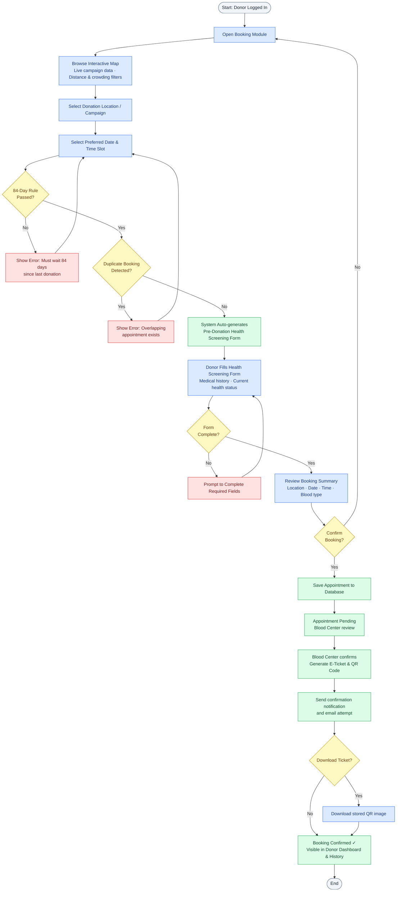
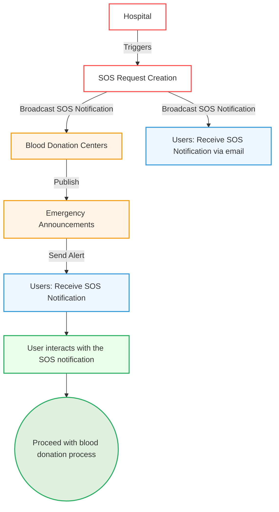

# LifeLine — Comprehensive Blood Donation Platform
> **Document**: Vision Document
> **Course**: CSC13002 - Introduction to Software Engineering
> **Team**: Sanguine (Group 05)  
> **Version**: 1.5 | **Date**: 26/08/2026
---
## Table of Contents
- [LifeLine — Comprehensive Blood Donation Platform](#lifeline--comprehensive-blood-donation-platform)
  - [Table of Contents](#table-of-contents)
  - [Revision History](#revision-history)
  - [1. Introduction](#1-introduction)
  - [2. Positioning](#2-positioning)
    - [2.1 Problem Statement](#21-problem-statement)
    - [2.2 Product Position Statement](#22-product-position-statement)
  - [3. Stakeholder and User Descriptions](#3-stakeholder-and-user-descriptions)
    - [3.1 Stakeholder Summary](#31-stakeholder-summary)
    - [3.2 User Summary](#32-user-summary)
    - [3.3 User Environment](#33-user-environment)
    - [3.4 Summary of Key Stakeholder or User Needs](#34-summary-of-key-stakeholder-or-user-needs)
    - [3.5 Alternatives and Competition](#35-alternatives-and-competition)
  - [4. Project Overview](#4-project-overview)
    - [4.1 Product Perspective](#41-product-perspective)
    - [4.2 Assumptions and Dependencies](#42-assumptions-and-dependencies)
    - [4.3 Platform Requirements](#43-platform-requirements)
  - [5. Product Features](#5-product-features)
    - [5.1. User Features](#51-user-features)
      - [5.1.1. User Account Management](#511-user-account-management)
      - [5.1.2. Donation Booking \& Location Services](#512-donation-booking--location-services)
      - [5.1.3 Donor Guidance and Support (Q\&A AI)](#513-donor-guidance-and-support-qa-ai)
      - [5.1.4 News, Notifications \& Communication](#514-news-notifications--communication)
      - [5.1.5. Donation Impact \& Tracking](#515-donation-impact--tracking)
      - [5.1.6. Community](#516-community)
    - [5.2. Blood Center Features](#52-blood-center-features)
      - [5.2.1. Blood Donation Campaign and Management](#521-blood-donation-campaign-and-management)
      - [5.2.2. Communication and User Engagement Management](#522-communication-and-user-engagement-management)
      - [5.2.3. Blood Inventory and Emergency Coordination Management](#523-blood-inventory-and-emergency-coordination-management)
    - [5.3 Hospital Features](#53-hospital-features)
      - [5.3.1 Emergency Blood SOS Request Management](#531-emergency-blood-sos-request-management)
    - [5.4 System Features (Backend \& Automations)](#54-system-features-backend--automations)
      - [5.4.1. User-Facing Automations](#541-user-facing-automations)
      - [5.4.2. Blood Center-Facing Automations](#542-blood-center-facing-automations)
      - [5.4.3. Notification Service](#543-notification-service)
    - [5.5 Administrator Features](#55-administrator-features)
      - [5.5.1. System and User Management](#551-system-and-user-management)
  - [6. Non-Functional Requirements](#6-non-functional-requirements)
    - [6.1 Performance Requirements](#61-performance-requirements)
    - [6.2 Security Requirements](#62-security-requirements)
    - [6.3 Reliability and Fault Tolerance Requirements](#63-reliability-and-fault-tolerance-requirements)
    - [6.4 Usability Requirements](#64-usability-requirements)
    - [6.5 Applicable Standards](#65-applicable-standards)

## Revision History

| Date       | Version | Description                                                                     | Author        |
| :--------- | :------ | :------------------------------------------------------------------------------ | :------------ |
| 14/06/2026 | 1.0     | FG 1.1 User Account Management, FG 1.2 Donation Booking & Location Services, Workflow Diagram: Donor Booking flow in Mermaid   Features: FG 1.3 Q&A AI, FG 1.4 News & Notifications, Workflow Diagram: AI Feature flow in Mermaid   Features: FG 3.1 SOS Hospital Emergency Request Management, Section 6: Non-Functional Requirements   Features: FG 2.1 Campaign & Donor Management, FG 2.2 Communication & Engagement Management, FG 2.3 Blood Inventory & Emergency Coordination   FG 4.1 User Automations, FG 4.2 BC Automations, Workflow Diagram: SOS Emergency flow in Mermaid   Section 1, 2, 3, 4; Features: FG 1.5 Donation Impact & Tracking, FG 1.6 Community  | Trần Anh Kiệt   Trần Đức Quý   Nguyễn Quốc Dương   Trần Minh Triết   Trần Minh Triết   Trịnh Khánh Linh|
| 23/06/2026 | 1.1     | Refined Headings, Rewrote System Features, Added 5.4.3 Notification Service   Added 6.5 Applicable Standards | Trần Anh Kiệt   Nguyễn Quốc Dương|
| 23/07/2026 | 1.2     | Addressed TA feedback (PA2-2026): Added new Section 4.3 Platform Requirements   Standardized all Section 5 functional descriptions to 5 sentences each | Trần Anh Kiệt|
| 26/08/2026 | 1.3     | Comprehensive synchronization of Vision Document with the entire codebase (Node.js Core modular monolith with 10 domain modules, Python FastAPI AI Service with FAISS and SSE streaming, React 19 SPA frontend, BullMQ background job queues, and MongoDB Atlas database schema). Added Section 5.5 Feature Toggles management and updated Section 6 Non-Functional Requirements. | Trần Anh Kiệt, Nguyễn Quốc Dương, Trần Đức Quý, Trần Minh Triết, Trịnh Khánh Linh |
| 26/08/2026 | 1.4     | Reconciled the document with the implemented `dev` baseline. Corrected multi-role authentication, pending appointment approval and E-Ticket generation, SOS queue/fulfillment behavior, fixed-role RBAC, implemented configuration keys and feature toggles. Removed unimplemented deployment, security, backup, performance and cryptographic-signing claims. | Development Team |
| 26/08/2026 | 1.5     | Re-audited the Blood Center scope against the current campaign, registration, content, notification, and inventory implementation. Integrated the supported parts of `UseCase_BloodCenter_Updated.md` and removed or qualified unsupported code formats, atomicity, authorization, state-machine, and capacity-locking claims. | Development Team |

> **Implementation baseline:** Version 1.5 describes behavior present in the `dev` branch on 26/08/2026. Deployment-provider examples are environmental options, not evidence that production hosting, backups, SLAs, or legal certification have been completed.

## 1. Introduction
*(Author: Trịnh Khánh Linh | Reviewer: Trần Anh Kiệt | Editor: Trịnh Khánh Linh)*

The purpose of this document is to collect, analyze, and define the high-level needs and features of the LifeLine platform. It focuses on the capabilities required by stakeholders and target users, as well as the reasons behind these needs. Detailed specifications of how LifeLine fulfills these requirements are described in subsequent use-case and supplementary documents.

This document provides an overview of the LifeLine project, which aims to develop a modern blood donation management and donor engagement platform. The system is designed to help blood donors, blood donation organizations, and hospitals manage donation activities more effectively while improving donor retention through personalized support, timely communication, and AI-powered assistance.

---

## 2. Positioning
*(Author: Trịnh Khánh Linh | Reviewer: Trần Anh Kiệt | Editor: Trịnh Khánh Linh)*
### 2.1 Problem Statement

|||
| ----------- |---------------------------------------- |
| **The problem of**| fragmented blood donation information, inefficient donor engagement, and difficulties in retaining regular blood donors|
| **affects**| blood donors, blood donation organizations, hospitals, and healthcare staff managing donation activities|
| **the impact of which is**| reduced donor participation, uncertainty regarding donation eligibility, lack of post-donation support, and challenges in maintaining a stable blood supply|
| **a successful solution would be** | a centralized platform that provides reliable donation information, personalized donor support, automated reminders, and effective communication between donors and healthcare organizations |

### 2.2 Product Position Statement
| | |
| :--- | :--- |
| **For** | blood donors, blood donation organizations, and hospitals |
| **Who** | need an efficient and engaging way to manage blood donation activities and maintain long-term donor participation |
| **The LifeLine blood system** | is a blood donation management and donor engagement platform |
| **That** | simplifies donation registration, provides personalized guidance, supports post-donation care, and improves communication between donors and healthcare organizations |
| **Unlike** | existing blood donation platforms that primarily focus on appointment scheduling and donation record management |
| **Our product** | combines AI-powered assistance, donor engagement mechanisms, community interaction, intelligent reminders, and real-time communication tools to improve donor retention and operational efficiency |

## 3. Stakeholder and User Descriptions
*(Author: Trịnh Khánh Linh | Reviewer: Trần Anh Kiệt | Editor: Trịnh Khánh Linh)*

### 3.1 Stakeholder Summary
| Name | Description | Responsibilities |
| :--- | :--- | :--- |
| **Supervisor** | Teaching Assistant overseeing the project | Provide guidance throughout development, review documents, designs, and source code |
| **Development Team** | Team responsible for system development | Design, implement, test, and maintain the LifeLine platform |
| **Blood Donation Organizations** | Organizations responsible for organizing blood donation campaigns | Manage donation events, donor registrations, and communication with donors |
| **Hospitals** | Medical institutions requiring blood supply management | Monitor blood inventory, issue blood requests, and coordinate donation activities |
| **System Administrators** | Personnel responsible for system operation | Manage users, monitor system performance, and maintain platform security |

### 3.2 User Summary
| Name | Description | Responsibilities | Stakeholder |
| :--- | :--- | :--- | :--- |
| **Donor** | Individuals who participate in blood donation activities | Register for donations, manage appointments, track donation history, receive reminders and health guidance | Blood Donation Organizations, Hospitals |
| **Organization Staff** | Staff managing donation campaigns and donor registrations | Manage events, review registrations, communicate with donors | Blood Donation Organizations |
| **Hospital Staff** | Staff operating the hospital portal | Create and monitor SOS requests, confirm received shipments, record direct donations, publish content, and review notifications | Hospitals |
| **Administrator** | Users with full system privileges | Manage users, permissions, platform settings, and reports | System Administrators |

### 3.3 User Environment
**Donor**

* Number of people: Potentially thousands of registered donors.
* Task cycle: Browse donation opportunities, register for appointments, receive reminders, and track donation history periodically.
* Environment: Home, school, workplace, or public locations using internet-connected devices.
* Platforms: Mobile browsers, desktop browsers.
* Integration needs: Email services, push notifications, and location services.

**Organization Staff**

* Number of people: Multiple staff members per organization.
* Task cycle: Manage campaigns daily, review registrations, and communicate with donors.
* Environment: Office-based work with stable internet connectivity.
* Platforms: Desktop and laptop computers.
* Integration needs: Notification services, donor databases, and reporting systems.

**Hospital Staff**

* Number of people: Medical staff and blood bank personnel.
* Task cycle: Monitor blood supply levels, manage emergency requests, and coordinate donation events.
* Environment: Hospital and blood bank facilities.
* Platforms: Desktop computers and tablets.
* Integration needs: Blood inventory systems and hospital databases.

**Administrator**

* Number of people: 1–3 administrators.
* Task cycle: User management, system monitoring, maintenance, and troubleshooting.
* Environment: Office environment with reliable internet access.
* Platforms: Desktop and laptop computers.
* Integration needs: runtime diagnostics and environment-managed security/backup controls outside this repository.

### 3.4 Summary of Key Stakeholder or User Needs

| Need | Priority | Concerns | Current Solution | Proposed Solution |
| :--- | :--- | :--- | :--- | :--- |
| **Centralized donation information** | High | Information is scattered across social media and multiple channels | Social media posts and manual announcements | Centralized information portal and event directory |
| **Donation eligibility guidance** | High | Users are uncertain about donation requirements | FAQ pages and external consultation | AI-assisted eligibility guidance and screening support |
| **Post-donation health support** | High | Donors seek recovery information from external sources | Google searches and healthcare professionals | Personalized health recommendations and follow-up support |
| **Donation reminders** | High | Donors forget future donation opportunities | Manual tracking by donors | Automated reminders and eligibility notifications |
| **Emergency blood request communication** | Medium | Delays in reaching suitable donors | Social media announcements | Targeted notifications and emergency alerts |
| **Long-term donor engagement** | Medium | Low donor retention after first donation | Limited incentive mechanisms | Gamification, achievements, donor tiers, and community features |

### 3.5 Alternatives and Competition
Existing blood donation platforms in Vietnam are identified as LifeLine's primary competitors. These include App Hiến Máu, Giọt Máu Vàng Mobile Application, and Giọt Máu Vàng Website. Through survey analysis and platform evaluation, key characteristics are summarized as follows:

* **Giọt Máu Vàng Mobile Application:** Provides appointment scheduling, donation history tracking, QR identification. However, several functions are incomplete or act as placeholders, navigation is inconsistent, performance issues are frequently reported, and users must manually enter information despite document scanning support.
* **Giọt Máu Vàng Website:** Supports online appointment scheduling, donation history management, certificates, and donor information management. However, the website lacks responsive mobile design, does not provide push notifications, offers limited location visualization, lacks community interaction features, and requires manual data handling for several processes.
* **App Hiến Máu:** Provides blood donation registration, donation history tracking, notifications, and location searching. Nevertheless, the platform mainly functions as a standalone scheduling tool and lacks advanced engagement mechanisms, real-time hospital integration, and personalized donor support.

Survey results further indicate that users face difficulties accessing reliable donation information, are uncertain about donation eligibility, seek trustworthy post-donation health guidance, and show strong interest in reminders, emergency notifications, and AI-powered assistance. These findings reveal opportunities that are not fully addressed by existing platforms.

Through analyzing the limitations of current solutions and understanding user expectations, LifeLine aims to provide a comprehensive donor-centered ecosystem featuring AI-assisted guidance, personalized health support, community engagement, intelligent notifications, donor retention mechanisms, and stronger integration between donors, hospitals, and blood donation organizations.

---
## 4. Project Overview
*(Author: Trịnh Khánh Linh | Reviewer: Trần Anh Kiệt | Editor: Trịnh Khánh Linh)*
### 4.1 Product Perspective

LifeLine is a centralized blood donation management and donor engagement platform designed to connect donors, blood donation organizations, and hospitals within a single ecosystem.

The system enables users to discover donation opportunities, register for donation events, track their donation history, receive personalized health guidance, and stay informed through automated reminders and notifications. Healthcare organizations and hospitals can efficiently manage donor information, monitor donation activities, and communicate urgent blood requests when necessary.

By integrating management, communication, and engagement functionalities into a unified platform, LifeLine aims to improve operational efficiency while encouraging long-term donor participation.

### 4.2 Assumptions and Dependencies

The development team identifies several assumptions regarding system usage:

* Users have access to stable internet connections.
* Blood donation organizations and hospitals are willing to adopt digital management solutions.
* Donors possess basic digital literacy and can operate web or mobile applications.
* Email and notification services are available for communication purposes.
* AI-powered assistance services can be deployed and maintained reliably.

Some dependencies of the LifeLine platform are:

* Cloud-hosted database systems for storing donor and donation information.
* Email and notification services for reminders and alerts.
* Authentication and authorization services.
* AI services supporting donor assistance and eligibility guidance.
* Hospital and blood donation organization data sources for event and inventory management.

### 4.3 Platform Requirements
*(Author: Trần Anh Kiệt | Reviewer: Trịnh Khánh Linh | Editor: Trần Anh Kiệt)*

LifeLine is delivered as a single responsive web application rather than separate native mobile apps, and is built on a modular-monolith core service paired with a companion AI/ML service. The following platform requirements define the technical environments the system must run on and integrate with.

| Category | Requirement |
| :--- | :--- |
| **Client Platform** | A responsive single-page web application built with React 19 (Vite) and TypeScript. It utilizes Tailwind CSS, Recharts, Lucide icons, and semantic HTML5 to ensure usability on desktop, tablet, and mobile screen sizes without a dedicated native app. |
| **Supported Browsers** | Google Chrome, Microsoft Edge, Mozilla Firefox, and Safari, latest two major versions of each. |
| **Application/Server Platform** | The core application is a modular monolith built with Node.js, Express, TypeScript, and Mongoose comprising 10 bounded domain modules. The companion AI/ML service is a separate deployable process built with Python 3.11+, FastAPI, and FAISS for high-performance RAG conversational support with Server-Sent Events (SSE) token streaming.|
| **Database Platform** | MongoDB Atlas / Compass as the primary document store, with `2dsphere` geospatial indexing for location queries and $geoNear radius calculations, and vector embeddings for the AI knowledge base. |
| **Caching and Queueing Platform** | Redis-backed BullMQ job queues (`sosEvaluationQueue`, `notificationQueue`, `scheduledTasksQueue`) for asynchronous SOS evaluation, scheduled task execution, and notification dispatch, alongside BullBoard for queue health monitoring. |
| **Media Storage Platform** | Cloud-based object storage Cloudinary is used as the media and object storage platform for handling avatars, article images, campaign banners, and badge icons. |
| **Third-Party Integration Platforms** | The system integrates with a Maps API (e.g., Goong API, TomTom, or Mapbox) for interactive mapping and geo-radius features. It uses an Email provider (Brevo) and a Web Push provider (Firebase Cloud Messaging / FCM and Web Push API) for notifications. An LLM API (Google Gemini, OpenAI, or Anthropic) powers the multi-turn AI chatbot. |
| **Hosting Infrastructure** | The repository contains independently runnable frontend, Node core, and Python AI services. It does not include verified production-hosting, availability, or backup guarantees; those depend on the chosen deployment environment. |
| **Network and Transport** | The SPA communicates with the core API using JSON over HTTP(S); chatbot responses use Server-Sent Events. TLS termination is a deployment responsibility and is not implemented by the Express application itself. |

---

## 5. Product Features
### 5.1. User Features
#### 5.1.1. User Account Management
*(Author: Trần Anh Kiệt | Reviewer: Trịnh Khánh Linh | Editor: Trần Anh Kiệt)*
| No.    | Feature | Description | Priority |
| :----- | :--- | :--- | :--- |
| **1.1-1** | **Registration via Citizen ID (CCCD)** | This feature allows new users to create a verified donor account by scanning their Citizen Identity Card (CCCD) QR code, with the system automatically extracting and pre-filling personal data such as full name, date of birth, and ID number. The user then enters additional information, including email, phone number, and password, and receives a verification email to activate the account. This significantly reduces manual entry time and minimizes input errors during onboarding. Verification against a national identity document ensures that each donor profile is tied to a real, authenticated individual, eliminating duplicate accounts and maintaining the integrity of donation records. Blood centers benefit from a trustworthy, deduplicated donor registry, donors enjoy a fast and frictionless registration experience, and the platform establishes the foundational identity layer on which bookings, history tracking, and emergency notifications depend. | High |
| **1.1-2** | **Login and Active Portal Selection** | Users authenticate using a CCCD number or email, password, and an assigned portal role. Every account begins with the Donor role and may additionally hold one management role: Blood Center Staff, Hospital Staff, or Administrator. The selected role is embedded in a 30-minute JWT and determines the routes and permissions available for that session. The React client stores the access token and active user information in browser local storage. Password recovery uses an email OTP flow. | High |
| **1.1-3** | **Profile Management** | This feature enables donors to view and update their personal profile at any time, including contact details such as phone number, email address, and residential address. Keeping profile information current is especially important for emergency alert targeting, where the system filters donors by location and blood type, and for appointment confirmations that rely on accurate contact channels. Donors benefit from a sense of ownership over their own data, while blood centers gain higher confidence in the accuracy of their communication outreach. The feature also displays key summary information such as blood type and donation schedule directly on the donor dashboard for quick reference. Overall, it ensures the platform can maintain an up-to-date and reliable donor database throughout the user's lifetime on the platform. | High |

#### 5.1.2. Donation Booking & Location Services
*(Author: Trần Anh Kiệt | Reviewer: Trịnh Khánh Linh | Editor: Trần Anh Kiệt)*
| No. | Feature | Description | Priority |
| :--- | :--- | :--- | :--- |
| **1.2-1** | **Interactive Map and Location Discovery** | This feature integrates an interactive map interface that allows donors to visually explore nearby blood donation points and active campaigns in real time. Users can apply filters such as distance radius and crowding level to identify the most convenient and available donation location without manually browsing multiple information sources. The map pulls live data from the campaign database, ensuring that only currently active events and open venues are displayed. Donors benefit from a significant reduction in search effort and travel uncertainty, especially in urban areas where multiple centers operate simultaneously. Blood centers gain better attendance distribution across their events as donors are guided toward optimal locations. | High |
| **1.2-2** | **Appointment Scheduling and Approval** | Donors select a campaign, date and time slot, complete the health screening form, and submit an appointment. The system enforces the configurable minimum interval between donations and prevents overlapping active bookings. A new appointment is stored as Pending without an E-Ticket. Blood center staff subsequently confirm or reject it; confirmation generates a unique ticket code, QR image and E-Ticket, updates the appointment to Confirmed, and dispatches the confirmation notification/email. | High |

#### 5.1.3 Donor Guidance and Support (Q&A AI) 
*(Author: Trần Đức Quý | Reviewer: Trần Anh Kiệt | Editor:Trần Đức Quý)*
| No. | Feature | Description | Priority |
| :--- | :--- | :--- | :--- |
| **1.3-1** | **AI-Powered Conversational Support & Guidance** | This feature introduces an intelligent AI assistant powered by a Retrieval-Augmented Generation (RAG) pipeline to serve as the primary self-service channel for donors. It handles multi-turn conversations to deliver instant, context-aware answers regarding donation procedures and provides tailored pre- and post-donation guidance. Additionally, the AI intelligently redirects eligible users to relevant platform features, such as appointment booking, to streamline the user journey. This ensures donors receive immediate, 24/7 support while significantly reducing the administrative burden on medical staff. Responses are grounded in a curated medical and procedural knowledge base and include safety disclaimers, helping maintain accuracy and trust in sensitive health-related conversations. | High |

#### 5.1.4 News, Notifications & Communication
*(Author: Trần Đức Quý | Reviewer: Trần Anh Kiệt | Editor:Trần Đức Quý)*
| No. | Feature | Description | Priority |
| :--- | :--- | :--- | :--- |
| **1.4-1** | **Content Management System (CMS) & News Feed** | This feature acts as the platform's centralized engagement hub, equipping administrators with a robust Content Management System (CMS). Staff can seamlessly create and publish blood donation campaigns, health tips, and organizational updates directly to the platform's public feed. This keeps donors consistently informed and actively engaged with local donation activities. By centralizing communication, blood centers can ensure their outreach efforts are consistent, targeted, and widely accessible to the community. This reduces reliance on external social media channels alone, giving the organization direct ownership over how donation-related information reaches its audience. | Medium |
| **1.4-2** | **Automated Routine Notifications** | A multi-channel Notification Engine automatically dispatches time-sensitive routine alerts to donors based on their personalized user preferences. It delivers critical updates such as appointment reminders and 84-day cycle unlocks via email and web push notifications. This automated system minimizes missed appointments and prompts donors to take timely action without requiring manual follow-up from staff. Ultimately, it improves donor retention and engagement while actively preventing notification fatigue. Delivery preferences and channel selection remain configurable per donor, ensuring notifications stay relevant without overwhelming the user. | High |
| **1.4-3** | **SOS Emergency Broadcast System** | Verified hospital staff can submit urgent blood requests that enter the SOS evaluation queue. Matching uses blood compatibility, available blood-center inventory, donor opt-in state, account state, and geospatial radius. The system creates separate notifications for compatible donors and blood-center staff and expands the radius for unresolved requests. Delivery uses the standard notification queue with retry and status tracking. | High |

#### 5.1.5. Donation Impact & Tracking
*(Author: Trịnh Khánh Linh | Reviewer: Trần Anh Kiệt | Editor: Trịnh Khánh Linh)*
| No. | Feature | Description | Priority |
| :--- | :--- | :--- | :--- |
| **1.5-1** | **Donation Timeline** | The Donation Timeline feature enables donors to view a chronological record of their entire blood donation journey within the platform. Users can access the timeline to review important milestones such as appointment registrations, eligibility confirmations, completed donations, recovery follow-ups, and achievement unlocks. The feature helps donors better understand their contribution history, improves transparency, and encourages continued participation in future donation activities. Each entry is automatically generated from underlying system records, so donors do not need to manually log their own donation history. Blood centers also benefit indirectly, as an engaged donor who can see their own impact is more likely to return for future donations. | Medium |
| **1.5-2** | **Milestone Badges & Achievements** | The Milestone Badges & Achievements feature enables the system to reward donors for reaching predefined contribution milestones. Users automatically receive digital badges after completing activities such as their first donation, multiple successful donations, emergency donations, or long-term participation goals. The feature helps recognize donor commitment, strengthen engagement, and encourage recurring donation behavior. Badges are awarded automatically based on donation records, removing the need for manual recognition by staff. This gamified recognition gives donors a visible, shareable sense of accomplishment that reinforces their motivation to donate again. | Medium |
| **1.5-3** | **Gamification Progress Tracking (Donor Levels)** | This feature enables donors to progress through a level-based reward system based on their participation and engagement within the platform. Users earn experience points through activities such as blood donations, campaign participation, profile completion, and community involvement to unlock higher donor levels. The feature helps create long-term motivation and makes the donation experience more engaging and rewarding. Higher donor levels are displayed on the donor dashboard and profile, giving experienced donors visible recognition within the community. This progression system encourages donors to engage with a broader range of platform features beyond donation alone, strengthening overall platform usage. | Medium |

#### 5.1.6. Community
*(Author: Trịnh Khánh Linh | Reviewer: Trần Anh Kiệt | Editor: Trịnh Khánh Linh)*
| No. | Feature | Description | Priority |
| :--- | :--- | :--- | :--- |
| **1.6-1** | **Direct Facebook Fanpage Link** | The Direct Facebook Fanpage Link feature enables users to quickly access the organization's official Facebook fanpage from within the platform. Users can visit the page to view announcements, campaign promotions, educational content, and community interactions. The feature helps organizations improve outreach while allowing donors to stay connected through a familiar communication channel. The link is displayed prominently within the Community section so donors do not need to search externally to find the organization's social presence. This lightweight integration extends the platform's reach into existing social media audiences without requiring the organization to build a separate in-app community feature. | Low |

### 5.2. Blood Center Features
*(Author: Trần Minh Triết | Reviewer: Trần Anh Kiệt | Editor: Trần Minh Triết)*
#### 5.2.1. Blood Donation Campaign and Management
| No. | Feature | Description | Priority |
| :--- | :--- | :--- | :--- |
| **2.1-1** | **Event Creation and Configuration** | Blood Center Staff and Administrators with campaign permissions can create and manage donation campaigns through a centralized interface. Staff configure the venue, address, operational dates, target volume, contact information, priority blood groups, and per-day timeslot capacity; the client validates date order, overlapping slots, and the 30-minute minimum slot duration, while the API also validates date order, positive capacity, and minimum slot duration. The backend calculates aggregate capacity and generates a code in the `CMP-YYYY-NNNN` format. Draft, Upcoming, Active, Completed, and Cancelled states are represented, and ended or cancelled campaigns cannot be edited. Campaigns with usable coordinates can appear in donor-facing discovery views; geocoding and base-map rendering remain dependent on the configured external provider. | High |
| **2.1-2** | **QR Code Scanning and Verification** | The QR Code Scanning and Verification feature allows blood center staff to quickly verify donor registrations at check-in counters using live camera scanning, image ticket uploads, or manual code entry. The system validates the scanned e-ticket QR code against the active campaign schedule, ensuring donors from other campaigns or invalid sessions cannot be checked in mistakenly. Upon successful verification, the system instantly marks the donor status as CheckedIn and displays the donor profile with preliminary survey responses. Staff can click directly to open the clinical screening file, eliminating manual roster searching and paperwork at the donation site. This contactless process minimizes check-in queue times and provides an efficient, error-proof verification workflow for high-attendance campaigns. | High |
| **2.1-3** | **Donor Registration Management** | The Blood Center portal provides campaign and pending-registration views for approval, rejection, check-in, clinical screening, and biochemical-result recording. Batch approval is implemented in the client as a sequence of individual confirmations, so partial success is possible; each successful confirmation creates an E-Ticket and QR record. Four vitals—blood pressure, weight, body temperature, and hemoglobin—are required before an Eligible transition. A biochemical Pass completes the registration and attempts to create or update a linked Available blood bag; failures are logged but are not rolled back with the completed registration. The current registration and appointment mutation endpoints authenticate callers but do not consistently apply role, permission, or Blood Center ownership middleware, which remains a security gap rather than a completed authorization feature. | High |

#### 5.2.2. Communication and User Engagement Management
| No. | Feature | Description | Priority |
| :--- | :--- | :--- | :--- |
| **2.2-1** | **Content Publishing** | This feature provides blood center staff with a built-in Content Management System (CMS) for creating, editing, and publishing news articles, health education guides, and campaign alerts. The article editor features a real-time background autosave mechanism to prevent accidental data loss during drafting. Staff can configure publishing status (Draft or Published), set optional publishing schedules, and target specific audience segments. Published articles feed directly into the donor-facing News Feed and support inline view/edit mode as well as deletion with modal confirmation. This centralized publishing engine ensures accurate, timely, and consistent communication across the entire LifeLine donor community. | Medium |
| **2.2-2** | **Emergency Announcements & Notifications** | The Emergency Announcements and Notification Management feature allows blood center staff to monitor incoming notifications, routine notices, and urgent SOS alerts in real time. Incoming emergency SOS requests from hospitals are visually prioritized with distinctive red borders and pulse indicators, ensuring urgent situations are never overlooked. The system provides deep-link URL navigation (`?id=...`), automatic mark-as-read tracking upon detail modal inspection, and 1-click routing to emergency coordination workflows. Staff can filter notices by type and read status, or perform one-click batch mark-as-read operations. This ensures blood centers can respond instantly to critical blood shortage broadcasts and coordinate emergency dispatches with hospitals. | High |

#### 5.2.3. Blood Inventory and Emergency Coordination Management
| No. | Feature | Description | Priority |
| :--- | :--- | :--- | :--- |
| **2.3-1** | **Blood Inventory, Batch Stock-In, FEFO-Assisted Stock-Out & Analytics** | The inventory portal lists whole-blood bags and exposes search, blood-type/status/date filters, bag details, status history, batch stock-in, batch stock-out, and summary statistics. Available bags are sorted by expiry date and the UI highlights/selects units expiring within seven days to assist FEFO decisions; the API changes only the explicitly submitted bag IDs. Manual stock-in currently generates `BB-2026-NNNN` codes and saves rows sequentially, so uniqueness relies on the database index and a failed row can leave earlier rows saved. Status changes require a reason; Used and Discarded are terminal, while Expired may still transition to Discarded. Statistics report available units, volume by blood group, near-expiry counts, and fixed low-stock bands (Critical below 2 units, Low Stock below 5), rather than configurable safe-reserve thresholds. | High |

### 5.3 Hospital Features
*(Author: Nguyễn Quốc Dương | Reviewer: Trần Anh Kiệt | Editor: Nguyễn Quốc Dương)*
#### 5.3.1 Emergency Blood SOS Request Management
| No. | Feature | Description | Priority |
| :--- | :--- | :--- | :--- |
| **3.1-1** | **Emergency Blood Request Creation** | This feature enables hospital staff to create emergency blood requests when urgent blood supplies are needed for patients. Staff can specify the required blood type, quantity, urgency level, and expected timeframe for fulfillment. The feature provides a standardized process for communicating critical blood needs, reducing delays and misunderstandings during emergencies. Hospitals benefit from faster request submission, while blood centers and donors receive clear and consistent information regarding urgent blood demands. Once submitted, the request immediately enters the automated SOS evaluation pipeline, which identifies and notifies suitable blood centers and donors without requiring manual coordination by hospital staff. | High |
| **3.1-2** | **SOS Request Monitoring and Tracking** | This feature allows hospital staff to monitor the progress of emergency blood requests from creation to completion. Users can view request status, response activity, and overall fulfillment progress in a centralized location. Continuous visibility helps hospitals make informed operational decisions and respond proactively when shortages occur. The feature improves transparency and supports more effective emergency coordination among stakeholders. Status updates are reflected in real time as blood centers and donors respond, so hospital staff always have an accurate picture of request fulfillment. | High |
| **3.1-3** | **Emergency Request Reporting** | This feature provides historical records and summary reports related to emergency blood requests. Hospitals can review request outcomes, response effectiveness, and fulfillment statistics to evaluate operational performance. The information supports future planning and helps organizations identify opportunities for improvement. Both hospitals and blood centers benefit from greater insight into emergency blood coordination activities. These reports draw on the immutable SOS evaluation and delivery logs maintained by the system, ensuring the data used for review is accurate and auditable. | Medium |

### 5.4 System Features (Backend & Automations)
*(Author: Trần Minh Triết | Reviewer: Trần Anh Kiệt | Editor: Trần Minh Triết)*
#### 5.4.1. User-Facing Automations
| No. | Feature | Description | Priority |
| :--- | :--- | :--- | :--- |
| **4.1-1** | **Pre-Donation Screening Form Generation** | This feature automatically generates a digital health screening form as part of the appointment booking flow, triggered immediately after a donor selects a campaign and time slot. The form collects current medical information including health status, medication history, recent travel and activity, and a consent declaration before the booking is finalized. By embedding the screening process directly into the registration workflow, the system ensures that eligibility assessment is completed before the donation day, eliminating the need for paper-based forms at the venue and significantly reducing administrative workload for blood center staff. Donors benefit from a guided, structured experience that surfaces ineligibility warnings in real time, while blood centers benefit from receiving already reviewed, standardized health data for every registered attendee. The system enforces business rules such as the 84-day waiting period and configurable ineligibility criteria, ensuring compliance with medical donation standards without requiring manual staff intervention. | High |
| **4.1-2** | **E-Ticket & QR Generation** | After blood center staff confirms a Pending appointment, the system creates a unique ticket code and QR payload, renders a QR image, uploads it to Cloudinary when available, associates the E-Ticket with the appointment, and sends confirmation through the configured notification channels. Staff check-in resolves the QR payload against the stored ticket and verifies the associated campaign and registration state. The current QR payload uses a recognizable `SIGNED-` prefix but is not cryptographically signed. Cancelled or still-Pending appointments cannot download an E-Ticket. | High |

#### 5.4.2. Blood Center-Facing Automations
| No. | Feature | Description | Priority |
| :--- | :--- | :--- | :--- |
| **4.2-1** | **Digital Donor Record Generation** | Appointment creation stores an initial digital donor record with Pending status and the donor-submitted screening summary in the same transaction. Blood center confirmation changes it to Confirmed and links the appointment's E-Ticket. Staff workflows then update check-in, eligibility, completion, rejection, no-show, clinical notes and blood-bag linkage, while donor cancellation synchronizes the record to Cancelled. A unique appointment link prevents duplicate working records. | High |
| **4.2-2** | **SOS Request Evaluation and Prioritization** | The SOS evaluation worker processes a submitted request against compatible available inventory and opted-in donor profiles. Blood centers are ranked using compatible inventory volume and distance. Donors must have a compatible known blood type, valid geospatial location, active account and SOS opt-in state; ranking uses distance, exact-match weighting and donor level. The initial and maximum search radii come from system configuration, and scheduled evaluation can expand the radius for unresolved requests. The resulting evaluation log stores ranked candidates, radius state and delivery statistics for later inspection. | High |

#### 5.4.3. Notification Service
| No. | Feature | Description | Priority |
| :--- | :--- | :--- | :--- |
| **4.3-1** | **Emergency Alert Broadcasting** | After SOS evaluation ranks compatible blood centers and nearby opted-in donors, the notification module creates distinct in-app, web-push, and email messages for the appropriate audiences. Notification delivery is processed through the Redis-backed BullMQ notification queue with three attempts and exponential backoff. Duplicate notification records for the same SOS request and recipient are suppressed. Feature-toggle checks stop evaluation and dispatch when the SOS module is disabled. Delivery status is recorded for operational review. | High |

### 5.5 Administrator Features
*(Author: Trần Anh Kiệt | Reviewer: Trịnh Khánh Linh | Editor: Trần Anh Kiệt)*
#### 5.5.1. System and User Management
| No. | Feature | Description | Priority |
| :--- | :--- | :--- | :--- |
| **5-1** | **User Account Management** | Administrators can search, filter, export, create Donor accounts, edit contact/status data, grant one additional management role, deactivate and restore accounts, and run a separate personal-data purge. New accounts must start as Donor. Hospital Staff and Blood Center Staff assignments require a valid hospital or blood center association, while CCCD-derived full name and permanent address remain immutable. Self-demotion, self-suspension, deletion of the last active Administrator, and unsafe deletion states are protected. Account lifecycle changes are audited. | High |
| **5-2** | **Fixed Role and Permission Management** | The system implements four protected roles: Donor, BloodCenterStaff, HospitalStaff, and Administrator. Administrators may update the permissions assigned to these existing roles but cannot create, rename, or delete custom roles. The Administrator role must retain the complete permission set. Authorization is evaluated from the active portal role stored in the JWT, preventing a multi-role account from using management permissions while logged in through the Donor portal. | High |
| **5-3** | **System Activity Monitoring** | This feature gives administrators real-time and historical visibility into system events, including user logins, failed authentication attempts, data modifications, and emergency alert broadcasts. Activity logs are searchable and filterable by user, action type, time range, and affected resource, enabling administrators to quickly identify suspicious behavior or operational anomalies. Proactive monitoring helps detect potential security threats such as unauthorized access attempts or unusual data access patterns before they escalate into serious incidents. The monitoring dashboard also provides usage statistics such as active sessions, peak usage periods, and feature adoption rates, supporting informed decisions about system scaling and maintenance. All logs are immutable and retained for audit and compliance purposes. | High |
| **5-4** | **System Configuration Management** | Administrators can edit eight validated runtime settings: donation interval, minimum and maximum donor age, default campaign capacity, initial and maximum SOS radius, appointment reminder lead time, and scheduled-article auto-publishing. Cross-field validation protects minimum/maximum age and SOS radius relationships. Changes are saved to MongoDB and recorded with before/after values in the audit log. External provider credentials, backup schedules, and content moderation rules are not managed by this page. | Medium |
| **5-5** | **Feature Toggle Management** | Administrators can enable or disable four implemented modules without redeployment: AI Chatbot, SOS Emergency Alerts, Gamification & Impact Tracking, and Content & Educational News Feed. The UI displays affected services before confirmation. Frontend feature gates and backend middleware/background checks apply the stored state, and disabled routes return a feature-specific unavailable response. Toggle changes are audited and rolled back if audit persistence fails. | High |

## 6. Non-Functional Requirements
*(Author: Nguyễn Quốc Dương | Reviewer: Trần Anh Kiệt | Editor: Nguyễn Quốc Dương)*

This section records properties that are enforced or directly evidenced by the current implementation. Hosting SLAs, production backup policies, load capacity, TLS versions, complete WCAG conformance, and response-time percentiles are intentionally excluded because they are not implemented or verified by the repository.

### 6.1 Performance Requirements

| ID | Requirement | Priority |
| :--- | :--- | :--- |
| **NFR-P-01** | List APIs use pagination and bounded page sizes; administrative user queries are limited to at most 100 records per page. | High |
| **NFR-P-02** | SOS evaluation and notification delivery execute asynchronously through Redis-backed BullMQ queues so request handling is separated from background work. | High |
| **NFR-P-03** | Chatbot responses are streamed through Server-Sent Events instead of waiting for a complete generated response. | Medium |

### 6.2 Security Requirements

| ID | Requirement | Priority |
| :--- | :--- | :--- |
| **NFR-S-01** | Passwords are hashed with bcrypt and never stored as plaintext. | High |
| **NFR-S-02** | Signed JWT access tokens expire after 30 minutes and are sent in the Authorization header; the current SPA stores them in browser local storage. | High |
| **NFR-S-03** | RBAC combines an active portal role with database-backed permissions for Donor, BloodCenterStaff, HospitalStaff, and Administrator. | High |
| **NFR-S-04** | Protected resources validate authentication, active account state, role, permission, ownership, and organization association where applicable. | High |
| **NFR-S-05** | Administrative mutations and operational inventory/SOS changes create audit records with actor, resource, timestamp and before/after data where supported. | High |
| **NFR-S-06** | E-Tickets contain unique ticket codes and QR payloads that are verified against stored E-Ticket and campaign records. The current implementation does not provide a cryptographic QR signature. | High |

### 6.3 Reliability and Fault Tolerance Requirements

| ID | Requirement | Priority |
| :--- | :--- | :--- |
| **NFR-R-01** | SOS evaluation and notification jobs use up to three attempts with exponential backoff; failed notification jobs are retained for diagnosis. | High |
| **NFR-R-02** | Booking and privacy-purge workflows use MongoDB transactions where configured. Clinical screening updates are not wrapped in a transaction and include notification/stock-in error handling that may allow the clinical state to complete without every side effect; manual batch stock-in is sequential and may partially persist. | High |
| **NFR-R-03** | Notification creation suppresses duplicate recipient/source/channel records and stores delivery status for retries and review. | High |
| **NFR-R-04** | Runtime diagnostics check MongoDB, Redis queues, AI service, Brevo, Firebase readiness, and Cloudinary without treating provider configuration alone as proof of health. | Medium |

### 6.4 Usability Requirements

| ID | Requirement | Priority |
| :--- | :--- | :--- |
| **NFR-U-01** | Main donor and management layouts use responsive breakpoints, flexible grids, mobile navigation, and scroll-safe tables/cards for desktop, tablet, and phone widths. | High |
| **NFR-U-02** | Vietnamese is the primary completed language. An i18next-based Vietnamese/English switch exists, but some operational screens still contain hard-coded text and full bilingual coverage is not claimed. | Medium |
| **NFR-U-03** | SOS alerts, disabled-feature states, validation errors, destructive actions, and medical workflow statuses use distinct labels, colors and explanatory messages. | High |
| **NFR-U-04** | Destructive and medical-state transitions require explicit confirmation and display the resulting status or error to the user. | High |

### 6.5 Applicable Standards

| ID | Requirement | Priority |
| :--- | :--- | :--- |
| **NFR-STD-01** | APIs use JSON, REST-style resources, standard HTTP methods/status codes, and expose Swagger/OpenAPI documentation. | High |
| **NFR-STD-02** | MongoDB timestamps and API date values use JavaScript Date/ISO 8601 representations. | Medium |
| **NFR-STD-03** | The privacy lifecycle supports soft deletion, restoration, and a separate personal-data purge/anonymization workflow. Formal legal compliance certification is outside the implemented scope. | High |
