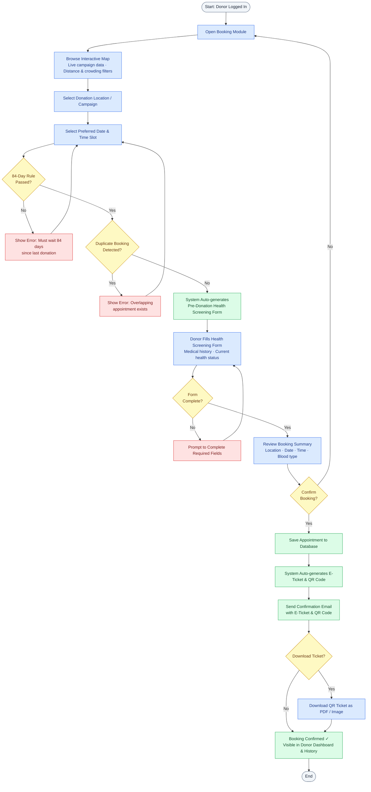
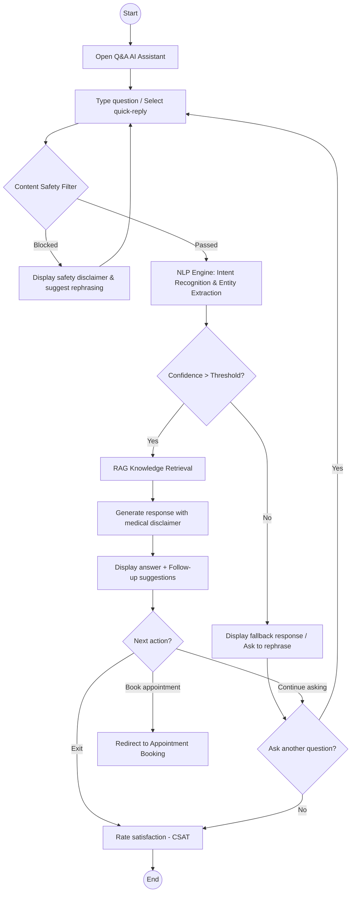
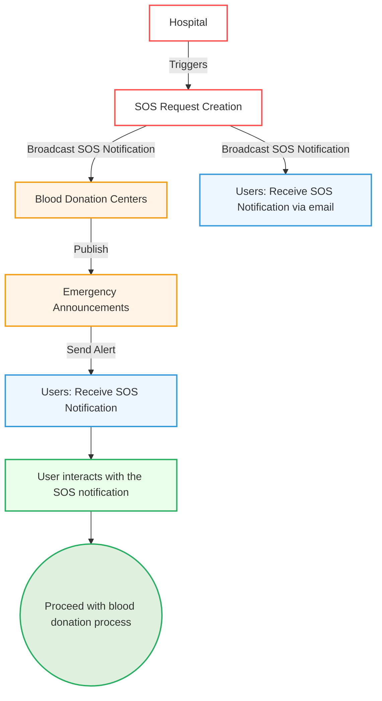

# LifeLine — Comprehensive Blood Donation Platform
> **Document**: Vision Document
> **Course**: CSC13002 - Introduction to Software Engineering
> **Team**: Sanguine (Group 05)  
> **Version**: 1.2 | **Date**: 23/07/2026
---
## Table of Contents
- [LifeLine — Comprehensive Blood Donation Platform](#lifeline--comprehensive-blood-donation-platform)
  - [Table of Contents](#table-of-contents)
  - [Revision History](#revision-history)
  - [1. Introduction](#1-introduction)
  - [2. Positioning](#2-positioning)
    - [2.1 Problem Statement](#21-problem-statement)
    - [2.2 Product Position Statement](#22-product-position-statement)
  - [3. Stakeholder and User Descriptions](#3-stakeholder-and-user-descriptions)
    - [3.1 Stakeholder Summary](#31-stakeholder-summary)
    - [3.2 User Summary](#32-user-summary)
    - [3.3 User Environment](#33-user-environment)
    - [3.4 Summary of Key Stakeholder or User Needs](#34-summary-of-key-stakeholder-or-user-needs)
    - [3.5 Alternatives and Competition](#35-alternatives-and-competition)
  - [4. Project Overview](#4-project-overview)
    - [4.1 Product Perspective](#41-product-perspective)
    - [4.2 Assumptions and Dependencies](#42-assumptions-and-dependencies)
    - [4.3 Platform Requirements](#43-platform-requirements)
  - [5. Product Features](#5-product-features)
    - [5.1. User Features](#51-user-features)
      - [5.1.1. User Account Management](#511-user-account-management)
      - [5.1.2. Donation Booking \& Location Services](#512-donation-booking--location-services)
      - [5.1.3 Donor Guidance and Support (Q\&A AI)](#513-donor-guidance-and-support-qa-ai)
      - [5.1.4 News, Notifications \& Communication](#514-news-notifications--communication)
      - [5.1.5. Donation Impact \& Tracking](#515-donation-impact--tracking)
      - [5.1.6. Community](#516-community)
    - [5.2. Blood Center Features](#52-blood-center-features)
      - [5.2.1. Blood Donation Campaign and Management](#521-blood-donation-campaign-and-management)
      - [5.2.2. Communication and User Engagement Management](#522-communication-and-user-engagement-management)
      - [5.2.3. Blood Inventory and Emergency Coordination Management](#523-blood-inventory-and-emergency-coordination-management)
    - [5.3 Hospital Features](#53-hospital-features)
      - [5.3.1 Emergency Blood SOS Request Management](#531-emergency-blood-sos-request-management)
    - [5.4 System Features (Backend \& Automations)](#54-system-features-backend--automations)
      - [5.4.1. User-Facing Automations](#541-user-facing-automations)
      - [5.4.2. Blood Center-Facing Automations](#542-blood-center-facing-automations)
      - [5.4.3. Notification Service](#543-notification-service)
    - [5.5 Administrator Features](#55-administrator-features)
      - [5.5.1. System and User Management](#551-system-and-user-management)
  - [6. Non-Functional Requirements](#6-non-functional-requirements)
    - [6.1 Performance Requirements](#61-performance-requirements)
    - [6.2 Security Requirements](#62-security-requirements)
    - [6.3 Reliability and Fault Tolerance Requirements](#63-reliability-and-fault-tolerance-requirements)
    - [6.4 Usability Requirements](#64-usability-requirements)
    - [6.5 Applicable Standards](#65-applicable-standards)

## Revision History

| Date       | Version | Description                                                                     | Author        |
| :--------- | :------ | :------------------------------------------------------------------------------ | :------------ |
| 14/06/2026 | 1.0     | FG 1.1 User Account Management, FG 1.2 Donation Booking & Location Services, Workflow Diagram: Donor Booking flow in Mermaid   Features: FG 1.3 Q&A AI, FG 1.4 News & Notifications, Workflow Diagram: AI Feature flow in Mermaid   Features: FG 3.1 SOS Hospital Emergency Request Management, Section 6: Non-Functional Requirements   Features: FG 2.1 Campaign & Donor Management, FG 2.2 Communication & Engagement Management, FG 2.3 Blood Inventory & Emergency Coordination   FG 4.1 User Automations, FG 4.2 BC Automations, Workflow Diagram: SOS Emergency flow in Mermaid   Section 1, 2, 3, 4; Features: FG 1.5 Donation Impact & Tracking, FG 1.6 Community  | Trần Anh Kiệt   Trần Đức Quý   Nguyễn Quốc Dương   Trần Minh Triết   Trần Minh Triết   Trịnh Khánh Linh|
| 23/06/2026 | 1.1     | Refined Headings, Rewrote System Features, Added 5.4.3 Notification Service   Added 6.5 Applicable Standards | Trần Anh Kiệt   Nguyễn Quốc Dương|
| 23/07/2026 | 1.2     | Addressed TA feedback (PA2-2026): Added new Section 4.3 Platform Requirements   Standardized all Section 5 functional descriptions to 5 sentences each | Trần Anh Kiệt|
| 26/08/2026 | 1.3     | Updated Section 5.2 Blood Center Features (Campaign batch approval, QR check-in modes, inline biochemical decisions, FEFO inventory stock-out, multi-row batch stock-in, and inventory analytics) and expanded Section 6 Non-Functional Requirements to cover all platform subsystems based on completed codebase. | Trần Minh Triết & Nguyễn Quốc Dương |

## 1. Introduction
*(Author: Trịnh Khánh Linh | Reviewer: Trần Anh Kiệt | Editor: Trịnh Khánh Linh)*

The purpose of this document is to collect, analyze, and define the high-level needs and features of the LifeLine platform. It focuses on the capabilities required by stakeholders and target users, as well as the reasons behind these needs. Detailed specifications of how LifeLine fulfills these requirements are described in subsequent use-case and supplementary documents.

This document provides an overview of the LifeLine project, which aims to develop a modern blood donation management and donor engagement platform. The system is designed to help blood donors, blood donation organizations, and hospitals manage donation activities more effectively while improving donor retention through personalized support, timely communication, and AI-powered assistance.

---

## 2. Positioning
*(Author: Trịnh Khánh Linh | Reviewer: Trần Anh Kiệt | Editor: Trịnh Khánh Linh)*
### 2.1 Problem Statement

|||
| ----------- |---------------------------------------- |
| **The problem of**| fragmented blood donation information, inefficient donor engagement, and difficulties in retaining regular blood donors|
| **affects**| blood donors, blood donation organizations, hospitals, and healthcare staff managing donation activities|
| **the impact of which is**| reduced donor participation, uncertainty regarding donation eligibility, lack of post-donation support, and challenges in maintaining a stable blood supply|
| **a successful solution would be** | a centralized platform that provides reliable donation information, personalized donor support, automated reminders, and effective communication between donors and healthcare organizations |

### 2.2 Product Position Statement
| | |
| :--- | :--- |
| **For** | blood donors, blood donation organizations, and hospitals |
| **Who** | need an efficient and engaging way to manage blood donation activities and maintain long-term donor participation |
| **The LifeLine blood system** | is a blood donation management and donor engagement platform |
| **That** | simplifies donation registration, provides personalized guidance, supports post-donation care, and improves communication between donors and healthcare organizations |
| **Unlike** | existing blood donation platforms that primarily focus on appointment scheduling and donation record management |
| **Our product** | combines AI-powered assistance, donor engagement mechanisms, community interaction, intelligent reminders, and real-time communication tools to improve donor retention and operational efficiency |

## 3. Stakeholder and User Descriptions
*(Author: Trịnh Khánh Linh | Reviewer: Trần Anh Kiệt | Editor: Trịnh Khánh Linh)*

### 3.1 Stakeholder Summary
| Name | Description | Responsibilities |
| :--- | :--- | :--- |
| **Supervisor** | Teaching Assistant overseeing the project | Provide guidance throughout development, review documents, designs, and source code |
| **Development Team** | Team responsible for system development | Design, implement, test, and maintain the LifeLine platform |
| **Blood Donation Organizations** | Organizations responsible for organizing blood donation campaigns | Manage donation events, donor registrations, and communication with donors |
| **Hospitals** | Medical institutions requiring blood supply management | Monitor blood inventory, issue blood requests, and coordinate donation activities |
| **System Administrators** | Personnel responsible for system operation | Manage users, monitor system performance, and maintain platform security |

### 3.2 User Summary
| Name | Description | Responsibilities | Stakeholder |
| :--- | :--- | :--- | :--- |
| **Donor** | Individuals who participate in blood donation activities | Register for donations, manage appointments, track donation history, receive reminders and health guidance | Blood Donation Organizations, Hospitals |
| **Organization Staff** | Staff managing donation campaigns and donor registrations | Manage events, review registrations, communicate with donors | Blood Donation Organizations |
| **Hospital Staff** | Staff responsible for blood inventory and emergency requests | Monitor blood availability, create urgent donation requests, coordinate with donors | Hospitals |
| **Administrator** | Users with full system privileges | Manage users, permissions, platform settings, and reports | System Administrators |

### 3.3 User Environment
**Donor**

* Number of people: Potentially thousands of registered donors.
* Task cycle: Browse donation opportunities, register for appointments, receive reminders, and track donation history periodically.
* Environment: Home, school, workplace, or public locations using internet-connected devices.
* Platforms: Mobile browsers, desktop browsers.
* Integration needs: Email services, push notifications, and location services.

**Organization Staff**

* Number of people: Multiple staff members per organization.
* Task cycle: Manage campaigns daily, review registrations, and communicate with donors.
* Environment: Office-based work with stable internet connectivity.
* Platforms: Desktop and laptop computers.
* Integration needs: Notification services, donor databases, and reporting systems.

**Hospital Staff**

* Number of people: Medical staff and blood bank personnel.
* Task cycle: Monitor blood supply levels, manage emergency requests, and coordinate donation events.
* Environment: Hospital and blood bank facilities.
* Platforms: Desktop computers and tablets.
* Integration needs: Blood inventory systems and hospital databases.

**Administrator**

* Number of people: 1–3 administrators.
* Task cycle: User management, system monitoring, maintenance, and troubleshooting.
* Environment: Office environment with reliable internet access.
* Platforms: Desktop and laptop computers.
* Integration needs: Monitoring tools, backup systems, and security services.

### 3.4 Summary of Key Stakeholder or User Needs

| Need | Priority | Concerns | Current Solution | Proposed Solution |
| :--- | :--- | :--- | :--- | :--- |
| **Centralized donation information** | High | Information is scattered across social media and multiple channels | Social media posts and manual announcements | Centralized information portal and event directory |
| **Donation eligibility guidance** | High | Users are uncertain about donation requirements | FAQ pages and external consultation | AI-assisted eligibility guidance and screening support |
| **Post-donation health support** | High | Donors seek recovery information from external sources | Google searches and healthcare professionals | Personalized health recommendations and follow-up support |
| **Donation reminders** | High | Donors forget future donation opportunities | Manual tracking by donors | Automated reminders and eligibility notifications |
| **Emergency blood request communication** | Medium | Delays in reaching suitable donors | Social media announcements | Targeted notifications and emergency alerts |
| **Long-term donor engagement** | Medium | Low donor retention after first donation | Limited incentive mechanisms | Gamification, achievements, donor tiers, and community features |

### 3.5 Alternatives and Competition
Existing blood donation platforms in Vietnam are identified as LifeLine's primary competitors. These include App Hiến Máu, Giọt Máu Vàng Mobile Application, and Giọt Máu Vàng Website. Through survey analysis and platform evaluation, key characteristics are summarized as follows:

* **Giọt Máu Vàng Mobile Application:** Provides appointment scheduling, donation history tracking, QR identification. However, several functions are incomplete or act as placeholders, navigation is inconsistent, performance issues are frequently reported, and users must manually enter information despite document scanning support.
* **Giọt Máu Vàng Website:** Supports online appointment scheduling, donation history management, certificates, and donor information management. However, the website lacks responsive mobile design, does not provide push notifications, offers limited location visualization, lacks community interaction features, and requires manual data handling for several processes.
* **App Hiến Máu:** Provides blood donation registration, donation history tracking, notifications, and location searching. Nevertheless, the platform mainly functions as a standalone scheduling tool and lacks advanced engagement mechanisms, real-time hospital integration, and personalized donor support.

Survey results further indicate that users face difficulties accessing reliable donation information, are uncertain about donation eligibility, seek trustworthy post-donation health guidance, and show strong interest in reminders, emergency notifications, and AI-powered assistance. These findings reveal opportunities that are not fully addressed by existing platforms.

Through analyzing the limitations of current solutions and understanding user expectations, LifeLine aims to provide a comprehensive donor-centered ecosystem featuring AI-assisted guidance, personalized health support, community engagement, intelligent notifications, donor retention mechanisms, and stronger integration between donors, hospitals, and blood donation organizations.

---
## 4. Project Overview
*(Author: Trịnh Khánh Linh | Reviewer: Trần Anh Kiệt | Editor: Trịnh Khánh Linh)*
### 4.1 Product Perspective

LifeLine is a centralized blood donation management and donor engagement platform designed to connect donors, blood donation organizations, and hospitals within a single ecosystem.

The system enables users to discover donation opportunities, register for donation events, track their donation history, receive personalized health guidance, and stay informed through automated reminders and notifications. Healthcare organizations and hospitals can efficiently manage donor information, monitor donation activities, and communicate urgent blood requests when necessary.

By integrating management, communication, and engagement functionalities into a unified platform, LifeLine aims to improve operational efficiency while encouraging long-term donor participation.

### 4.2 Assumptions and Dependencies

The development team identifies several assumptions regarding system usage:

* Users have access to stable internet connections.
* Blood donation organizations and hospitals are willing to adopt digital management solutions.
* Donors possess basic digital literacy and can operate web or mobile applications.
* Email and notification services are available for communication purposes.
* AI-powered assistance services can be deployed and maintained reliably.

Some dependencies of the LifeLine platform are:

* Cloud-hosted database systems for storing donor and donation information.
* Email and notification services for reminders and alerts.
* Authentication and authorization services.
* AI services supporting donor assistance and eligibility guidance.
* Hospital and blood donation organization data sources for event and inventory management.

### 4.3 Platform Requirements
*(Author: Trần Anh Kiệt | Reviewer: Trịnh Khánh Linh | Editor: Trần Anh Kiệt)*

LifeLine is delivered as a single responsive web application rather than separate native mobile apps, and is built on a modular-monolith core service paired with a companion AI/ML service. The following platform requirements define the technical environments the system must run on and integrate with.

| Category | Requirement |
| :--- | :--- |
| **Client Platform** | A responsive single-page web application built with React (Vite) and TypeScript. It utilizes Tailwind CSS and semantic HTML5 to ensure usability on desktop, tablet, and mobile screen sizes without a dedicated native app. |
| **Supported Browsers** | Google Chrome, Microsoft Edge, Mozilla Firefox, and Safari, latest two major versions of each. |
| **Application/Server Platform** | The core application is a modular monolith built with Node.js, Express, and TypeScript. The companion AI/ML service is a separate deployable process built with Python and FastAPI.|
| **Database Platform** | MongoDB Compass as the primary document store, with 2dsphere geospatial indexing for location queries and Atlas Vector Search for the AI knowledge base. |
| **Caching and Queueing Platform** | Redis-backed job queue for asynchronous SOS evaluation and notification dispatch, and for caching frequently accessed data. |
| **Media Storage Platform** | Cloud-based object storage Cloudinary is used as the media and object storage platform for handling avatars, article images, campaign banners, and badge icons. |
| **Third-Party Integration Platforms** | The system integrates with a Maps API (e.g., Goong API, TomTom, or Mapbox) for interactive mapping and geo-radius features. It uses an Email provider (Brevo) and a Web Push provider (e.g., Firebase Cloud Messaging or Web Push API) for notifications. An LLM API (e.g., OpenAI, Gemini, or Anthropic) is used to power the multi-turn AI chatbot. |
| **Hosting Infrastructure** | All hosting must rely on free-tier cloud services to comply with the project's zero budget constraint. The frontend is hosted on static SPA hosting with CDN (e.g., Vercel or Netlify). The Node core and Python AI services are hosted on container platforms (e.g., Render, Railway, Fly.io, or Hugging Face Spaces) |
| **Network and Transport Requirements** | All client-server communication shall occur over HTTPS/TLS; a stable internet connection is required to access real-time features such as booking, chat, and emergency alerts. |

---

## 5. Product Features
### 5.1. User Features
#### 5.1.1. User Account Management
*(Author: Trần Anh Kiệt | Reviewer: Trịnh Khánh Linh | Editor: Trần Anh Kiệt)*
| No.    | Feature | Description | Priority |
| :----- | :--- | :--- | :--- |
| **1.1-1** | **Registration via Citizen ID (CCCD)** | This feature allows new users to create a verified donor account by scanning their Citizen Identity Card (CCCD) QR code, with the system automatically extracting and pre-filling personal data such as full name, date of birth, and ID number. The user then enters additional information, including email, phone number, and password, and receives a verification email to activate the account. This significantly reduces manual entry time and minimizes input errors during onboarding. Verification against a national identity document ensures that each donor profile is tied to a real, authenticated individual, eliminating duplicate accounts and maintaining the integrity of donation records. Blood centers benefit from a trustworthy, deduplicated donor registry, donors enjoy a fast and frictionless registration experience, and the platform establishes the foundational identity layer on which bookings, history tracking, and emergency notifications depend. | High |
| **1.1-2** | **Login** | This feature provides donors with a secure and straightforward authentication mechanism using their CCCD number combined with a registered password. It ensures that only verified account holders can access personal donation records, appointment details, and health data stored in the system. A password reset flow via OTP verification through email is also included to help users regain access without requiring staff intervention. This safeguard ensures that long-term users do not lose access to accounts that hold significant history and value to them. Overall, this benefits donors by protecting their sensitive medical information while keeping the login process familiar and accessible. | High |
| **1.1-3** | **Profile Management** | This feature enables donors to view and update their personal profile at any time, including contact details such as phone number, email address, and residential address. Keeping profile information current is especially important for emergency alert targeting, where the system filters donors by location and blood type, and for appointment confirmations that rely on accurate contact channels. Donors benefit from a sense of ownership over their own data, while blood centers gain higher confidence in the accuracy of their communication outreach. The feature also displays key summary information such as blood type and donation schedule directly on the donor dashboard for quick reference. Overall, it ensures the platform can maintain an up-to-date and reliable donor database throughout the user's lifetime on the platform. | High |

#### 5.1.2. Donation Booking & Location Services
*(Author: Trần Anh Kiệt | Reviewer: Trịnh Khánh Linh | Editor: Trần Anh Kiệt)*
| No. | Feature | Description | Priority |
| :--- | :--- | :--- | :--- |
| **1.2-1** | **Interactive Map and Location Discovery** | This feature integrates an interactive map interface that allows donors to visually explore nearby blood donation points and active campaigns in real time. Users can apply filters such as distance radius and crowding level to identify the most convenient and available donation location without manually browsing multiple information sources. The map pulls live data from the campaign database, ensuring that only currently active events and open venues are displayed. Donors benefit from a significant reduction in search effort and travel uncertainty, especially in urban areas where multiple centers operate simultaneously. Blood centers gain better attendance distribution across their events as donors are guided toward optimal locations. | High |
| **1.2-2** | **Appointment Scheduling** | This feature enables donors to select their preferred date, time slot, and blood donation location, with the system automatically validating medical eligibility constraints before confirming the booking. Most critically, the system enforces the mandatory 84-day (12-week) waiting period between donations, blocking invalid bookings and displaying a clear error message if the constraint is violated ensuring full compliance with health and safety regulations. Upon successful scheduling, the system generates a personalized electronic appointment ticket encoded as a QR code and can also be downloaded in PDF or image format. Donors benefit from a streamlined, error-proof booking experience that removes the need for phone calls or in-person registration. Blood center staff benefit from reduced administrative overhead at check-in, as attendee data is pre-recorded and verifiable via QR scan. | High |

#### 5.1.3 Donor Guidance and Support (Q&A AI) 
*(Author: Trần Đức Quý | Reviewer: Trần Anh Kiệt | Editor:Trần Đức Quý)*
| No. | Feature | Description | Priority |
| :--- | :--- | :--- | :--- |
| **1.3-1** | **AI-Powered Conversational Support & Guidance** | This feature introduces an intelligent AI assistant powered by a Retrieval-Augmented Generation (RAG) pipeline to serve as the primary self-service channel for donors. It handles multi-turn conversations to deliver instant, context-aware answers regarding donation procedures and provides tailored pre- and post-donation guidance. Additionally, the AI intelligently redirects eligible users to relevant platform features, such as appointment booking, to streamline the user journey. This ensures donors receive immediate, 24/7 support while significantly reducing the administrative burden on medical staff. Responses are grounded in a curated medical and procedural knowledge base and include safety disclaimers, helping maintain accuracy and trust in sensitive health-related conversations. | High |

#### 5.1.4 News, Notifications & Communication
*(Author: Trần Đức Quý | Reviewer: Trần Anh Kiệt | Editor:Trần Đức Quý)*
| No. | Feature | Description | Priority |
| :--- | :--- | :--- | :--- |
| **1.4-1** | **Content Management System (CMS) & News Feed** | This feature acts as the platform's centralized engagement hub, equipping administrators with a robust Content Management System (CMS). Staff can seamlessly create and publish blood donation campaigns, health tips, and organizational updates directly to the platform's public feed. This keeps donors consistently informed and actively engaged with local donation activities. By centralizing communication, blood centers can ensure their outreach efforts are consistent, targeted, and widely accessible to the community. This reduces reliance on external social media channels alone, giving the organization direct ownership over how donation-related information reaches its audience. | Medium |
| **1.4-2** | **Automated Routine Notifications** | A multi-channel Notification Engine automatically dispatches time-sensitive routine alerts to donors based on their personalized user preferences. It delivers critical updates such as appointment reminders and 84-day cycle unlocks via email and web push notifications. This automated system minimizes missed appointments and prompts donors to take timely action without requiring manual follow-up from staff. Ultimately, it improves donor retention and engagement while actively preventing notification fatigue. Delivery preferences and channel selection remain configurable per donor, ensuring notifications stay relevant without overwhelming the user. | High |
| **1.4-3** | **SOS Emergency Broadcast System** | This feature provides a dedicated SOS Emergency Broadcast system that empowers verified hospitals to rapidly trigger urgent blood supply requests. The emergency system utilizes intelligent audience segmentation and dynamic geographic radius expansion to pinpoint the most suitable candidates. It instantly alerts these compatible, nearby donors during critical blood shortages. This highly targeted approach accelerates donor mobilization and streamlines life-saving emergency coordination between hospitals and blood centers. By bypassing standard notification queues for these alerts, the system ensures emergency messages are delivered within the required response time. | High |

#### 5.1.5. Donation Impact & Tracking
*(Author: Trịnh Khánh Linh | Reviewer: Trần Anh Kiệt | Editor: Trịnh Khánh Linh)*
| No. | Feature | Description | Priority |
| :--- | :--- | :--- | :--- |
| **1.5-1** | **Donation Timeline** | The Donation Timeline feature enables donors to view a chronological record of their entire blood donation journey within the platform. Users can access the timeline to review important milestones such as appointment registrations, eligibility confirmations, completed donations, recovery follow-ups, and achievement unlocks. The feature helps donors better understand their contribution history, improves transparency, and encourages continued participation in future donation activities. Each entry is automatically generated from underlying system records, so donors do not need to manually log their own donation history. Blood centers also benefit indirectly, as an engaged donor who can see their own impact is more likely to return for future donations. | Medium |
| **1.5-2** | **Milestone Badges & Achievements** | The Milestone Badges & Achievements feature enables the system to reward donors for reaching predefined contribution milestones. Users automatically receive digital badges after completing activities such as their first donation, multiple successful donations, emergency donations, or long-term participation goals. The feature helps recognize donor commitment, strengthen engagement, and encourage recurring donation behavior. Badges are awarded automatically based on donation records, removing the need for manual recognition by staff. This gamified recognition gives donors a visible, shareable sense of accomplishment that reinforces their motivation to donate again. | Medium |
| **1.5-3** | **Gamification Progress Tracking (Donor Levels)** | This feature enables donors to progress through a level-based reward system based on their participation and engagement within the platform. Users earn experience points through activities such as blood donations, campaign participation, profile completion, and community involvement to unlock higher donor levels. The feature helps create long-term motivation and makes the donation experience more engaging and rewarding. Higher donor levels are displayed on the donor dashboard and profile, giving experienced donors visible recognition within the community. This progression system encourages donors to engage with a broader range of platform features beyond donation alone, strengthening overall platform usage. | Medium |

#### 5.1.6. Community
*(Author: Trịnh Khánh Linh | Reviewer: Trần Anh Kiệt | Editor: Trịnh Khánh Linh)*
| No. | Feature | Description | Priority |
| :--- | :--- | :--- | :--- |
| **1.6-1** | **Direct Facebook Fanpage Link** | The Direct Facebook Fanpage Link feature enables users to quickly access the organization's official Facebook fanpage from within the platform. Users can visit the page to view announcements, campaign promotions, educational content, and community interactions. The feature helps organizations improve outreach while allowing donors to stay connected through a familiar communication channel. The link is displayed prominently within the Community section so donors do not need to search externally to find the organization's social presence. This lightweight integration extends the platform's reach into existing social media audiences without requiring the organization to build a separate in-app community feature. | Low |

### 5.2. Blood Center Features
*(Author: Trần Minh Triết | Reviewer: Trần Anh Kiệt | Editor: Trần Minh Triết)*
#### 5.2.1. Blood Donation Campaign and Management
| No. | Feature | Description | Priority |
| :--- | :--- | :--- | :--- |
| **2.1-1** | **Event Creation and Configuration** | This feature enables blood center staff to create and manage blood donation campaigns through a centralized interface. Staff can configure important event details including organizing venue, operational date range, target blood volume in milliliters, contact person info, priority blood groups, and daily timeslot donor capacities. The feature enforces schedule validation rules, locks the Start Date once appointments are booked to protect donor schedules, and calculates total registration capacity automatically. It benefits blood center staff by streamlining event organization and preventing overbooking, while donors receive reliable registration opportunities with real-time capacity tracking. Once published, campaign details immediately sync to the donor-facing interactive map and public event listings across the platform. | High |
| **2.1-2** | **QR Code Scanning and Verification** | The QR Code Scanning and Verification feature allows blood center staff to quickly verify donor registrations at check-in counters using live camera scanning, image ticket uploads, or manual code entry. The system validates the scanned e-ticket QR code against the active campaign schedule, ensuring donors from other campaigns or invalid sessions cannot be checked in mistakenly. Upon successful verification, the system instantly marks the donor status as CheckedIn and displays the donor profile with preliminary survey responses. Staff can click directly to open the clinical screening file, eliminating manual roster searching and paperwork at the donation site. This contactless process minimizes check-in queue times and provides an efficient, error-proof verification workflow for high-attendance campaigns. | High |
| **2.1-3** | **Donor Registration Management** | This feature provides blood center medical staff with a comprehensive dual-tab dashboard to manage donor registrations and execute clinical workflows. Staff can monitor campaign registration metrics, perform batch approvals with automated E-Ticket issuance, and conduct full pre-donation clinical screenings. During medical examination, staff records 4 mandatory physical vitals (blood pressure, weight, temperature, hemoglobin) and evaluates eligibility before proceeding with blood collection. For laboratory testing, staff can make fast inline biochemical decisions (Pass/Rejected) or resolve unknown blood types directly within the system. Approving a biochemical test as Passed automatically triggers the stock-in process to create a blood bag in the inventory, guaranteeing seamless clinical-to-inventory traceability. | High |

#### 5.2.2. Communication and User Engagement Management
| No. | Feature | Description | Priority |
| :--- | :--- | :--- | :--- |
| **2.2-1** | **Content Publishing** | This feature provides blood center staff with a built-in Content Management System (CMS) for creating, editing, and publishing news articles, health education guides, and campaign alerts. The article editor features a real-time background autosave mechanism to prevent accidental data loss during drafting. Staff can configure publishing status (Draft or Published), set optional publishing schedules, and target specific audience segments. Published articles feed directly into the donor-facing News Feed and support inline view/edit mode as well as deletion with modal confirmation. This centralized publishing engine ensures accurate, timely, and consistent communication across the entire LifeLine donor community. | Medium |
| **2.2-2** | **Emergency Announcements & Notifications** | The Emergency Announcements and Notification Management feature allows blood center staff to monitor incoming notifications, routine notices, and urgent SOS alerts in real time. Incoming emergency SOS requests from hospitals are visually prioritized with distinctive red borders and pulse indicators, ensuring urgent situations are never overlooked. The system provides deep-link URL navigation (`?id=...`), automatic mark-as-read tracking upon detail modal inspection, and 1-click routing to emergency coordination workflows. Staff can filter notices by type and read status, or perform one-click batch mark-as-read operations. This ensures blood centers can respond instantly to critical blood shortage broadcasts and coordinate emergency dispatches with hospitals. | High |

#### 5.2.3. Blood Inventory and Emergency Coordination Management
| No. | Feature | Description | Priority |
| :--- | :--- | :--- | :--- |
| **2.3-1** | **Blood Inventory, Batch Stock-In, FEFO Stock-Out & Analytics** | This feature equips blood center staff with an end-to-end inventory management and analytical platform for whole blood units and components. Staff can monitor stock levels with FEFO (First-Expired, First-Out) warning badges, perform dynamic multi-row batch stock-in with auto-generated Blood Bag IDs (`BB-YYYYMMDD-XXXX`), and execute FEFO-prioritized stock-outs with 1-click selection of units expiring within 7 days. Blood bag status updates follow strict finite-state-machine rules, requiring staff to enter a mandatory reason for audit logging while permanently locking terminal states (Expired, Used, Discarded). Furthermore, the integrated statistical dashboard provides real-time unit count and milliliter volume distribution charts alongside critical low-stock alerts. This robust inventory pipeline minimizes blood wastage, guarantees complete donor-to-patient traceability, and supports data-driven emergency distribution. | High |

### 5.3 Hospital Features
*(Author: Nguyễn Quốc Dương | Reviewer: Trần Anh Kiệt | Editor: Nguyễn Quốc Dương)*
#### 5.3.1 Emergency Blood SOS Request Management
| No. | Feature | Description | Priority |
| :--- | :--- | :--- | :--- |
| **3.1-1** | **Emergency Blood Request Creation** | This feature enables hospital staff to create emergency blood requests when urgent blood supplies are needed for patients. Staff can specify the required blood type, quantity, urgency level, and expected timeframe for fulfillment. The feature provides a standardized process for communicating critical blood needs, reducing delays and misunderstandings during emergencies. Hospitals benefit from faster request submission, while blood centers and donors receive clear and consistent information regarding urgent blood demands. Once submitted, the request immediately enters the automated SOS evaluation pipeline, which identifies and notifies suitable blood centers and donors without requiring manual coordination by hospital staff. | High |
| **3.1-2** | **SOS Request Monitoring and Tracking** | This feature allows hospital staff to monitor the progress of emergency blood requests from creation to completion. Users can view request status, response activity, and overall fulfillment progress in a centralized location. Continuous visibility helps hospitals make informed operational decisions and respond proactively when shortages occur. The feature improves transparency and supports more effective emergency coordination among stakeholders. Status updates are reflected in real time as blood centers and donors respond, so hospital staff always have an accurate picture of request fulfillment. | High |
| **3.1-3** | **Emergency Request Reporting** | This feature provides historical records and summary reports related to emergency blood requests. Hospitals can review request outcomes, response effectiveness, and fulfillment statistics to evaluate operational performance. The information supports future planning and helps organizations identify opportunities for improvement. Both hospitals and blood centers benefit from greater insight into emergency blood coordination activities. These reports draw on the immutable SOS evaluation and delivery logs maintained by the system, ensuring the data used for review is accurate and auditable. | Medium |

### 5.4 System Features (Backend & Automations)
*(Author: Trần Minh Triết | Reviewer: Trần Anh Kiệt | Editor: Trần Minh Triết)*
#### 5.4.1. User-Facing Automations
| No. | Feature | Description | Priority |
| :--- | :--- | :--- | :--- |
| **4.1-1** | **Pre-Donation Screening Form Generation** | This feature automatically generates a digital health screening form as part of the appointment booking flow, triggered immediately after a donor selects a campaign and time slot. The form collects current medical information including health status, medication history, recent travel and activity, and a consent declaration before the booking is finalized. By embedding the screening process directly into the registration workflow, the system ensures that eligibility assessment is completed before the donation day, eliminating the need for paper-based forms at the venue and significantly reducing administrative workload for blood center staff. Donors benefit from a guided, structured experience that surfaces ineligibility warnings in real time, while blood centers benefit from receiving already reviewed, standardized health data for every registered attendee. The system enforces business rules such as the 84-day waiting period and configurable ineligibility criteria, ensuring compliance with medical donation standards without requiring manual staff intervention. | High |
| **4.1-2** | **E-Ticket & QR Generation** | This feature automatically generates a personalized electronic appointment ticket encoded with a cryptographically signed, unique QR code immediately after a donation appointment is confirmed and saved to the database. The e-ticket compiles full appointment details such as donor name, blood type, donation date and time, location name and address, and a unique ticket ID which is showed to the donor on the website with the ticket attached as a PDF/Image, and a booking confirmation email will also be delivered to the donor's email to announce, the ticket is also accessible through the donor's appointment detail page. The QR code payload is digitally signed using asymmetric cryptography to prevent forgery, ensuring that only legitimate tickets can be verified at the donation venue by blood center staff using the QR scanning feature. Donors benefit from a contactless, paperless check-in experience that removes the need to bring printed documentation, while blood center staff benefit from faster, more accurate donor verification during high-attendance campaign events. This automation is tightly integrated with the downstream digital donor record generation and the staff QR scanning workflow, making it a foundational link in the end-to-end donation day pipeline. | High |

#### 5.4.2. Blood Center-Facing Automations
| No. | Feature | Description | Priority |
| :--- | :--- | :--- | :--- |
| **4.2-1** | **Digital Donor Record Generation** | This feature automatically creates a comprehensive digital donor registration record on the blood center side immediately after a donor's appointment is confirmed, consolidating data from the donor's profile, the completed pre-donation screening form, and the generated e-ticket into a single centralized document. The record includes a donor identity section, appointment details, all health screening responses with an auto-computed preliminary eligibility flag (Eligible / Requires Review), a real-time updatable donation status field (Registered -> Checked In -> Eligible -> Donation Completed / Ineligible), and a cross-linked QR ticket reference enabling instant record retrieval via the staff's QR scanning workflow. By generating this record automatically, the system eliminates manual data entry for blood center staff and ensures that a complete, organized donor roster is available before the campaign begins, covering every registered attendee. Blood center staff benefit from a structured, staff facing interface that supports the full donation day workflow from eligibility review at arrival to post-donation status updates and clinical note annotations without relying on paper forms or manual data compilation. The record is immediately visible in the campaign's donor roster view and remains stored in the database for lasting donor history tracking and audit purposes. | High |
| **4.2-2** | **SOS Request Evaluation and Prioritization** | This feature automatically evaluates an incoming emergency blood request submitted and approved by hospital staff, performing real-time analysis across blood inventory records and the donor registry to identify the most suitable blood centers and eligible donors who can respond to the crisis. For blood center matching, the system ranks candidates by a composite score that considers available inventory volume of the required blood type, geographic proximity to the requesting hospital, and current dispatch capacity, ensuring that the most capable and accessible center is contacted first. For donor matching, the system queries the donor registry for compatible blood type, currently eligible donors within a configurable initial search radius, ranking them by proximity, time since last donation, and donor engagement tier; if insufficient donors are found, the radius is automatically expanded in increments until an adequate pool is identified. Emergency notifications are dispatched to the top ranked blood centers and donors within one minute of request approval via email and in-app push notification, bypassing standard rate limits to prioritize urgent outreach. Hospital staff benefit from rapid, coordinated mobilization of resources without manual coordination overhead, while blood centers and donors receive targeted, relevant alerts that minimize unnecessary notification volume and support the fastest possible emergency response. | High |

#### 5.4.3. Notification Service
| No. | Feature | Description | Priority |
| :--- | :--- | :--- | :--- |
| **4.3-1** | **Emergency Alert Broadcasting** | This feature operates as the automated distribution engine for critical emergency blood requests, triggered immediately after the SOS Request Evaluation and Prioritization process identifies the most suitable responders. Upon receiving the prioritized list of candidate blood centers and eligible donors, the system prepares urgent, highly visible alert payloads and dispatches them across multiple communication channels, including email, and in-app push notifications. To ensure immediate action during life-threatening shortages, these emergency broadcasts bypass standard notification queues and are delivered within one minute of request approval. By decoupling the evaluation logic from the notification delivery, the system guarantees a robust, highly available broadcasting mechanism. Ultimately, hospitals benefit from instantaneous, targeted mobilization without manual effort, while eligible donors and blood center staff receive distinct, high-priority alerts that cut through routine noise, empowering them to respond swiftly to critical community needs. | High |

### 5.5 Administrator Features
*(Author: Trần Anh Kiệt | Reviewer: Trịnh Khánh Linh | Editor: Trần Anh Kiệt)*
#### 5.5.1. System and User Management
| No. | Feature | Description | Priority |
| :--- | :--- | :--- | :--- |
| **5-1** | **User Account Management** | This feature provides administrators with full authority to view, create, update, suspend, or permanently delete user accounts across all roles within the platform. Administrators can search and filter accounts by role (Donor, Organization Staff, Hospital Staff), status (Active, Suspended), or registration date to efficiently locate specific users. The ability to manually activate or deactivate accounts ensures that access control remains reliable, particularly in cases where automated verification fails or accounts require corrective action. This feature is essential for maintaining a clean, trustworthy user database and preventing unauthorized or fraudulent access to the system. All account modification actions are logged with timestamps and administrator identity for full auditability. | High |
| **5-2** | **Role and Permission Management** | This feature allows administrators to define, assign, and revoke roles and their associated permissions for all system users. Administrators can configure which actions each role (Donor, Organization Staff, Hospital Staff) is authorized to perform, ensuring that users can only access functionality relevant to their responsibilities. Role-based access control is critical for protecting sensitive data such as blood inventory records and personal donor information from unauthorized modification or disclosure. When organizational changes occur, such as a staff member changing position, administrators can update role assignments immediately without system downtime. This centralized permission layer underpins the security architecture of the entire platform. | High |
| **5-3** | **System Activity Monitoring** | This feature gives administrators real-time and historical visibility into system events, including user logins, failed authentication attempts, data modifications, and emergency alert broadcasts. Activity logs are searchable and filterable by user, action type, time range, and affected resource, enabling administrators to quickly identify suspicious behavior or operational anomalies. Proactive monitoring helps detect potential security threats such as unauthorized access attempts or unusual data access patterns before they escalate into serious incidents. The monitoring dashboard also provides usage statistics such as active sessions, peak usage periods, and feature adoption rates, supporting informed decisions about system scaling and maintenance. All logs are immutable and retained for audit and compliance purposes. | High |
| **5-4** | **System Configuration Management** | This feature enables administrators to manage platform-wide configuration settings, including notification parameters, eligibility rule thresholds (such as the 84-day donation interval), campaign registration limits, and integration endpoints for external services such as email providers and mapping APIs. Centralizing configuration through an admin interface rather than requiring code changes allows the platform to adapt quickly to evolving operational requirements or regulatory updates without system redeployment. Administrators can also manage content moderation settings, toggle feature availability, and configure backup schedules to ensure system reliability. This feature reduces dependency on technical development resources for routine operational adjustments and improves the platform's long-term maintainability. As a result, both technical and non-technical staff can respond quickly to changing operational needs without depending on a full development and deployment cycle. | Medium |

## 6. Non-Functional Requirements
*(Author: Nguyễn Quốc Dương | Reviewer: Trần Anh Kiệt | Editor: Nguyễn Quốc Dương)*

The following non-functional requirements apply across all functional groups and subsystems within the LifeLine platform.

### 6.1 Performance Requirements

| ID | Requirement | Priority |
| :--- | :--- | :--- |
| **NFR-P-01** | The system shall process an emergency blood request submission within 5 seconds under normal operating conditions. | High |
| **NFR-P-02** | The system shall complete SOS matching and candidate ranking (blood centers and donors) within 30 seconds after request approval. | High |
| **NFR-P-03** | Emergency notifications shall be dispatched to recipients across email and web push channels within 1 minute after SOS request submission. | High |
| **NFR-P-04** | The system shall support at least 10,000 registered users and 10 concurrent active users without degradation in response quality on free-tier cloud infrastructure. | High |
| **NFR-P-05** | User-facing pages and API responses shall load within 3 seconds for 95% of requests under standard 4G/Wi-Fi network conditions. | Medium |
| **NFR-P-06** | The AI Chatbot shall begin streaming response tokens via Server-Sent Events (SSE) within 2.5 seconds of user query submission. | Medium |

### 6.2 Security Requirements

| ID | Requirement | Priority |
| :--- | :--- | :--- |
| **NFR-S-01** | All user authentication and API communications shall be encrypted in transit using HTTPS/TLS 1.3. | High |
| **NFR-S-02** | The system shall enforce strict Role-Based Access Control (RBAC) across Donor, Blood Center Staff, Hospital Staff, and Administrator roles. | High |
| **NFR-S-03** | Personal health information, CCCD national identity details, and screening records shall only be accessible to authorized users. | High |
| **NFR-S-04** | All administrative actions, data modifications, and SOS broadcasts shall be recorded in immutable audit logs. | High |
| **NFR-S-05** | User authentication sessions shall utilize secure, signed HTTP-only JWT cookies and expire automatically upon token invalidation or after 30 minutes of inactivity. | Medium |
| **NFR-S-06** | Electronic appointment ticket QR codes shall be cryptographically signed using asymmetric HMAC signatures to prevent forgery and unauthorized reproduction. | High |

### 6.3 Reliability and Fault Tolerance Requirements

| ID | Requirement | Priority |
| :--- | :--- | :--- |
| **NFR-R-01** | The system shall maintain at least 99.5% service availability excluding scheduled maintenance windows. | High |
| **NFR-R-02** | MongoDB database instances shall perform automated daily backups with point-in-time recovery capabilities. | High |
| **NFR-R-03** | The system shall recover critical services within 30 minutes following a container or server instance restart. | High |
| **NFR-R-04** | Emergency SOS request records, inventory transactions, and donor bookings shall be durably persisted to prevent data loss during unexpected crashes. | High |
| **NFR-R-05** | Background job queues (BullMQ) shall support automatic retries with exponential backoff for failed notification dispatches. | Medium |

### 6.4 Usability Requirements

| ID | Requirement | Priority |
| :--- | :--- | :--- |
| **NFR-U-01** | The system shall provide a fully responsive user interface that adapts seamlessly across desktop, tablet, and mobile screen sizes. | High |
| **NFR-U-02** | The user interface shall provide full bilingual support for both Vietnamese and English with instant runtime language switching. | Medium |
| **NFR-U-03** | Emergency SOS alerts and high-priority banners shall be visually distinct from standard routine notifications. | High |
| **NFR-U-04** | The system shall be accessible and fully functional across modern web browsers including Google Chrome, Microsoft Edge, Mozilla Firefox, and Apple Safari. | High |
| **NFR-U-05** | The pre-donation booking and screening flow shall be intuitive, allowing a donor to complete a booking within 3 minutes. | Medium |

### 6.5 Applicable Standards

| ID | Requirement | Priority |
| :--- | :--- | :--- |
| **NFR-STD-01** | The system shall comply with the Vietnamese Personal Data Protection Decree (Decree 13/2023/ND-CP) regarding the collection, storage, and processing of citizen identity (CCCD) and health screening data. | High |
| **NFR-STD-02** | All web communications shall conform to HTTPS/TLS 1.3 security standards. | High |
| **NFR-STD-03** | Date, time, and timestamp representations shall adhere strictly to ISO 8601 international standards. | Medium |
| **NFR-STD-04** | System APIs shall follow RESTful architectural principles, standard HTTP response status codes, and JSON data exchange formats with Swagger OpenAPI specifications. | Medium |
| **NFR-STD-05** | User interface components shall follow WCAG 2.1 Level AA accessibility guidelines where applicable. | Medium |