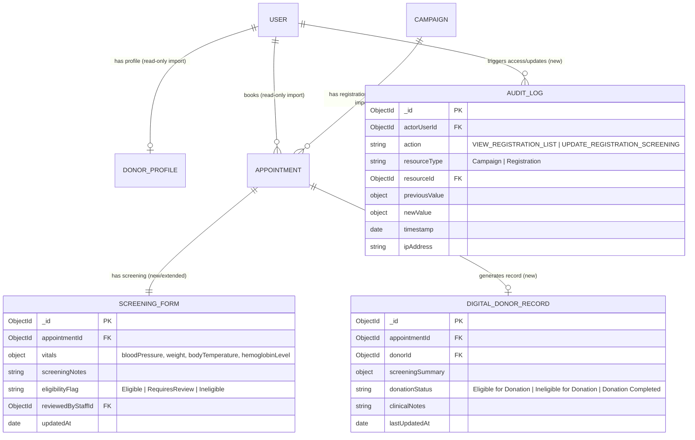

# Data Model Specification: Donor Registration & Health Screening Module (BC-UC-04, BC-UC-05)

**Feature Branch**: `feature/BC-UC-04-to-05-donor-registration` | **Date**: 2026-07-25  
**Spec**: [spec.md](../spec.md)

---

## 1. Primary Collections & Entities



---

## 2. Model Definitions & Validation Schemas

### 2.1 Reused Models (Read-Only Imports from `auth-account` and `booking`)

- **`User`** (`users` collection):
  - `_id`: ObjectId
  - `idDocumentNumber`: string (CCCD)
  - `email`: string
  - `phone`: string
  - `role`: `'Donor' | 'BloodCenterStaff' | 'HospitalStaff' | 'Administrator'`
- **`DonorProfile`** (`donor_profiles` collection):
  - `_id`: ObjectId
  - `userId`: ObjectId FK → `User`
  - `fullName`: string
  - `dateOfBirth`: Date
  - `bloodType`: `'A+' | 'A-' | 'B+' | 'B-' | 'AB+' | 'AB-' | 'O+' | 'O-' | 'Unknown'`
  - `permanentAddress`: string
  - `lastDonationDate`: Date (optional)
  - `totalDonations`: number
- **`Appointment`** (`appointments` collection):
  - `_id`: ObjectId (Acts as `registrationId`)
  - `donorId`: ObjectId FK → `User`
  - `campaignId`: ObjectId FK → `Campaign`
  - `appointmentDate`: Date
  - `timeSlot`: string
  - `status`: `'Scheduled' | 'CheckedIn' | 'Eligible for Donation' | 'Ineligible for Donation' | 'Donation Completed' | 'Cancelled'`
  - `screeningFormId`: ObjectId FK → `ScreeningForm`

---

### 2.2 New Models & Entities

#### 1. `DigitalDonorRecord` (`digital_donor_records` collection)
- `_id`: ObjectId (PK)
- `appointmentId`: ObjectId (FK → `Appointment`, indexed)
- `donorId`: ObjectId (FK → `User`, indexed)
- `screeningSummary`: Mixed / Object (`{ bloodPressure, weight, bodyTemperature, hemoglobinLevel, screeningNotes }`)
- `donationStatus`: string (enum: `'Eligible for Donation'`, `'Ineligible for Donation'`, `'Donation Completed'`)
- `clinicalNotes`: string (optional)
- `lastUpdatedAt`: Date (default: `Date.now`)

#### 2. `AuditLog` (`audit_logs` collection)
- `_id`: ObjectId (PK)
- `actorUserId`: ObjectId (FK → `User`, required, indexed)
- `action`: string (enum: `'VIEW_REGISTRATION_LIST'`, `'UPDATE_REGISTRATION_SCREENING'`, indexed)
- `resourceType`: string (enum: `'Campaign'`, `'Registration'`)
- `resourceId`: ObjectId (required, indexed)
- `previousValue`: Mixed / Object (optional)
- `newValue`: Mixed / Object (optional)
- `timestamp`: Date (default: `Date.now`, indexed)
- `ipAddress`: string (optional)

---

## 3. Fixed Enum Vocabularies

### Status Enum (`status` field on Registration & Update payload):
- `Eligible for Donation`
- `Ineligible for Donation`
- `Donation Completed`

---

## 4. State Transitions (Registration Status Lifecycle)

```
[ Scheduled ] ──> [ CheckedIn ] ──> [ Eligible for Donation ] ──> [ Donation Completed ]
                                └──> [ Ineligible for Donation ]
```

- **Validation Rule**: Status updates submitted via `PUT /api/v1/registrations/:registrationId/screening` must belong strictly to `{ "Eligible for Donation", "Ineligible for Donation", "Donation Completed" }`. Any other value will fail Zod validation and return HTTP 400.
