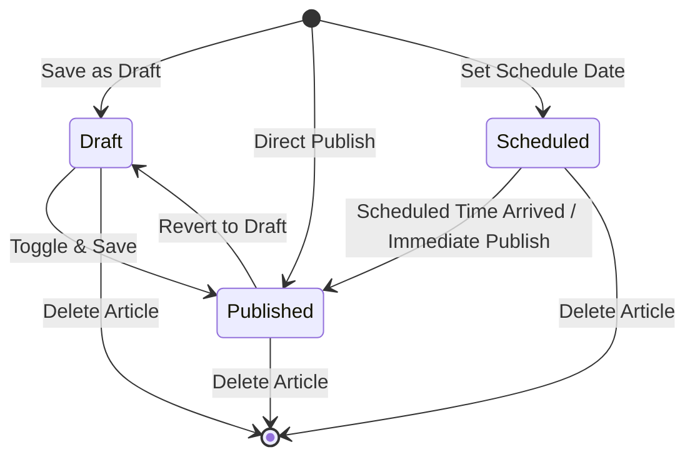

# Data Model: Article Management (BC-UC-08, BC-UC-09, Delete Article)

**Feature Path**: `specs/BC-UC-08-09-content-management`

---

## 1. Entities & MongoDB Schema

### 1.1 `Article` Entity (`articles` collection)

```typescript
export type ArticleCategory = 'News' | 'Alert' | 'Educational' | 'Campaign';
export type ArticleStatus = 'Draft' | 'Published' | 'Scheduled';
export type TargetAudience = 'Donors' | 'Staff' | 'Hospitals';

export interface IArticle extends Document {
  title: string;
  bodyContent: string;
  category: ArticleCategory;
  status: ArticleStatus;
  coverImageUrl?: string;
  publishedAt?: Date;
  scheduledAt?: Date;
  targetAudience: TargetAudience[];
  authorStaffId: mongoose.Types.ObjectId;
  viewsCount: number;
  publicReachCount: number;
  sharesCount: number;
  readTimeMinutes: number;
  createdAt: Date;
  updatedAt: Date;
}
```

#### Fields Description & Constraints:
- `title`: String, required, min length 1, max 200 chars. Index: text.
- `bodyContent`: String (sanitized HTML), required for status `Published`.
- `category`: String enum (`News`, `Alert`, `Educational`, `Campaign`), required, default `News`.
- `status`: String enum (`Draft`, `Published`, `Scheduled`), required, default `Draft`.
- `coverImageUrl`: String (HTTPS Cloudinary URL), optional.
- `publishedAt`: Date, set when status becomes `Published`.
- `scheduledAt`: Date, optional future publication date.
- `targetAudience`: Array of strings (`Donors`, `Staff`, `Hospitals`), default `['Donors']`.
- `authorStaffId`: ObjectId (ref `User`), required.
- `viewsCount`: Number, default 0, min 0.
- `publicReachCount`: Number, default 0, min 0.
- `sharesCount`: Number, default 0, min 0.
- `readTimeMinutes`: Number, computed automatically as `Math.ceil(words / 200)`.

#### Indexes:
- `{ status: 1, category: 1, publishedAt: -1 }`
- `{ authorStaffId: 1 }`
- `{ title: 'text' }`

---

## 2. Validation Rules (Zod Schemas)

### 2.1 Create Article Schema (`CreateArticleSchema`)
- `title`: `z.string().min(1, 'Title is required').max(200)`
- `bodyContent`: `z.string().optional()` (required if `status === 'Published'`)
- `category`: `z.enum(['News', 'Alert', 'Educational', 'Campaign'])`
- `status`: `z.enum(['Draft', 'Published', 'Scheduled']).default('Draft')`
- `coverImageUrl`: `z.string().url().optional()`
- `scheduledAt`: `z.string().or(z.date()).optional()`
- `targetAudience`: `z.array(z.enum(['Donors', 'Staff', 'Hospitals'])).optional().default(['Donors'])`

### 2.2 Update Article Schema (`UpdateArticleSchema`)
- All fields from `CreateArticleSchema` are optional for partial updates.

---

## 3. State Transitions


