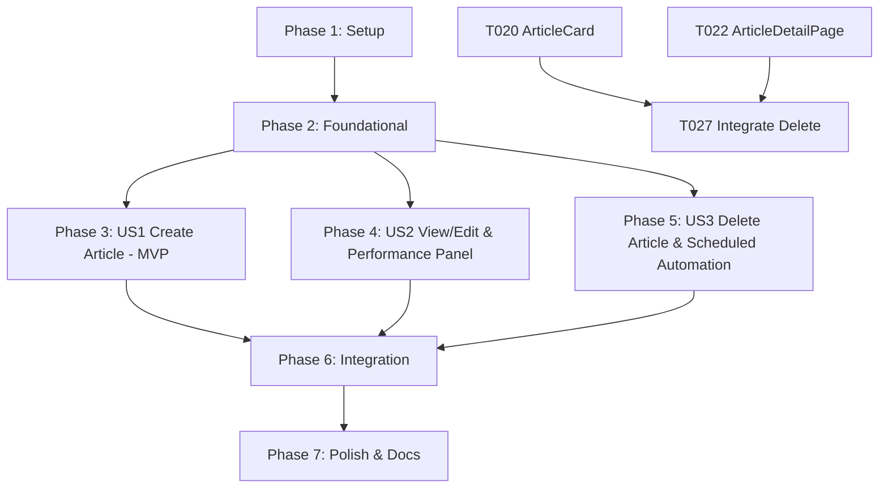

# Tasks: Article Management (BC-UC-08, BC-UC-09, Delete Article)

**Input**: Design documents from `specs/BC-UC-08-09-content-management/` (`spec.md`, `plan.md`, `research.md`, `data-model.md`, `contracts/`, `quickstart.md`)

**Module Paths**:
- Backend: `src/backend-core/src/modules/content/`
- Frontend: `src/frontend/src/modules/content-mgmt/`

---

## Shared Infrastructure Reuse Notes

- **Cloudinary Asset Storage**: Reuses existing backend utility in `src/backend-core/src/utils/cloudinary.util.ts`.
- **Audit Logging**: Reuses immutable audit logging pattern (`actorUserId`, `action`, `resourceType`, `resourceId`, `timestamp`, `ipAddress`) defined in `src/backend-core/src/modules/registration/models/audit-log.model.ts`.

---

## Phase 1: Setup (Shared Infrastructure)

**Purpose**: Module structure initialization for backend and frontend

- [x] T001 [P] Create backend content module directory structure at `src/backend-core/src/modules/content/`
- [x] T002 [P] Create frontend content management directory structure at `src/frontend/src/modules/content-mgmt/`

---

## Phase 2: Foundational (Backend Models, Schemas & Upload)

**Purpose**: Core Mongoose models, Zod validation schemas, API clients, and image upload endpoint

- [x] T003 [P] Create Mongoose model and schema for `Article` in `src/backend-core/src/modules/content/models/article.model.ts`
- [x] T004 [P] Create AuditLog schema/model in `src/backend-core/src/modules/content/models/audit-log.model.ts`
- [x] T005 [P] Create TypeScript interfaces and Zod validation schemas in `src/backend-core/src/modules/content/schemas/article.schema.ts`
- [x] T006 [P] Create frontend article types in `src/frontend/src/modules/content-mgmt/types/article.types.ts`
- [x] T007 [P] Create Axios frontend API service client in `src/frontend/src/modules/content-mgmt/services/articleApi.ts`
- [x] T008 [P] Implement image upload endpoint `POST /api/v1/bc/articles/upload-image` (Multer + Cloudinary, PNG/JPG max 5MB) in `src/backend-core/src/modules/content/controllers/upload.controller.ts` & `src/backend-core/src/modules/content/routes/article.routes.ts`
- [x] T009 [P] Create cover image upload component `FeaturedMediaUpload.tsx` (drag & drop / click upload, preview) in `src/frontend/src/modules/content-mgmt/components/FeaturedMediaUpload.tsx`

---

## Phase 3: User Story 1 - Create Article (BC-UC-08) 🎯 MVP

**Goal**: Enable staff to create, auto-save drafts, select target audience, set publishing schedule, and publish articles with unsaved changes exit protection.

**Independent Test**: Navigate to `/bc/content/create`, fill form fields, verify auto-save indicator, save as Published, and confirm article appears in the list.

- [x] T010 [US1] Implement backend service method `createArticle` with read-time calculation and audit logging (`action: "CREATE_ARTICLE"`) in `src/backend-core/src/modules/content/services/article.service.ts`
- [x] T011 [US1] Implement backend controller and route handler `POST /api/v1/bc/articles` in `src/backend-core/src/modules/content/controllers/article.controller.ts` & `src/backend-core/src/modules/content/routes/article.routes.ts`
- [x] T012 [P] [US1] Create target audience selector component `TargetAudienceSelector.tsx` in `src/frontend/src/modules/content-mgmt/components/TargetAudienceSelector.tsx`
- [x] T013 [P] [US1] Create publishing schedule picker component `PublishingSchedulePicker.tsx` in `src/frontend/src/modules/content-mgmt/components/PublishingSchedulePicker.tsx`
- [x] T014 [P] [US1] Create custom frontend autosave hook `useAutosave.ts` (3s idle debounce + 60s periodic autosave, `hasUnsavedChanges` dirty flag, timestamp indicator) in `src/frontend/src/modules/content-mgmt/hooks/useAutosave.ts`
- [x] T015 [US1] Implement main article creation page `CreateArticlePage.tsx` with `hasUnsavedChanges` exit confirmation dialog ("Continue Editing / Discard Changes") and browser `beforeunload` listener in `src/frontend/src/modules/content-mgmt/pages/CreateArticlePage.tsx`

---

## Phase 4: User Story 2 - View / Edit Article & Performance Panel (BC-UC-09)

**Goal**: Display article details with Performance Panel (views, reach, shares) and engagement insights, dashboard summary stats cards, and enable inline editing with autosave.

**Independent Test**: Click an article card from `/bc/content`, view performance metrics, click Edit Article, modify title/category, save, and verify updated details.

- [x] T016 [US2] Implement backend service methods `getArticleList`, `getArticleById`, `updateArticle`, and `getContentStats` (Total Articles, Active Alerts, Public Reach) with audit logging in `src/backend-core/src/modules/content/services/article.service.ts`
- [x] T017 [US2] Implement backend controllers & routes for `GET /api/v1/bc/articles`, `GET /:articleId`, `PUT /:articleId`, and `GET /stats/summary` in `article.controller.ts` & `article.routes.ts`
- [x] T018 [P] [US2] Create dashboard summary cards component `ContentStatsCards.tsx` (Total Articles, Public Reach, Active Alerts) in `src/frontend/src/modules/content-mgmt/components/ContentStatsCards.tsx`
- [x] T019 [P] [US2] Create performance panel & engagement insight component `PerformancePanel.tsx` in `src/frontend/src/modules/content-mgmt/components/PerformancePanel.tsx`
- [x] T020 [P] [US2] Create article card component `ArticleCard.tsx` in `src/frontend/src/modules/content-mgmt/components/ArticleCard.tsx`
- [x] T021 [US2] Implement content dashboard list page `ArticleListPage.tsx` integrating `ContentStatsCards` in `src/frontend/src/modules/content-mgmt/pages/ArticleListPage.tsx`
- [x] T022 [US2] Implement article detail & inline edit page `ArticleDetailPage.tsx` integrating `useAutosave` and `hasUnsavedChanges` exit confirmation in `src/frontend/src/modules/content-mgmt/pages/ArticleDetailPage.tsx`

---

## Phase 5: User Story 3 - Delete Article & Scheduled Publication Automation

**Goal**: Provide modal confirmation to permanently delete draft or published articles (un-publishing immediately) and run background scheduled publication automation.

**Independent Test**: Click Delete action from article card or detail page, confirm warning modal, verify immediate removal from list and reduction in total article counts.

- [x] T023 [US3] Implement backend service method `deleteArticle` with audit logging (`action: "DELETE_ARTICLE"`) in `src/backend-core/src/modules/content/services/article.service.ts`
- [x] T024 [US3] Implement backend controller & route handler `DELETE /api/v1/bc/articles/:articleId` in `article.controller.ts` & `article.routes.ts`
- [x] T025 [P] [US3] Implement scheduled publication automation job (periodically checks `status: 'Scheduled'` and `scheduledAt <= now()`, transitioning to `status: 'Published'`) in `src/backend-core/src/modules/content/jobs/scheduled-publisher.job.ts`
- [x] T026 [P] [US3] Create modal confirmation component `DeleteConfirmationModal.tsx` in `src/frontend/src/modules/content-mgmt/components/DeleteConfirmationModal.tsx`
- [x] T027 [US3] Integrate delete action into `ArticleCard.tsx` and `ArticleDetailPage.tsx` *(Explicitly dependent on T020 ArticleCard.tsx and T022 ArticleDetailPage.tsx)*

---

## Phase 6: Module Integration & App Router Mounting

**Purpose**: Export module barrel, mount backend routes and scheduled publisher into `app.ts`, and mount frontend routes in `App.tsx`.

- [x] T028 Export backend content module barrel in `src/backend-core/src/modules/content/index.ts`
- [x] T029 Mount backend content routes and start `scheduled-publisher` job in `src/backend-core/src/app.ts` (`app.use('/api/v1/bc/articles', contentRoutes)`)
- [x] T030 Mount frontend content routes into `src/frontend/src/App.tsx` under `/bc/content/*`

---

## Phase 7: Polish & Documentation

**Purpose**: OpenAPI documentation and end-to-end quickstart validation

- [x] T031 [P] Add `@openapi` Swagger JSDoc annotations to `src/backend-core/src/modules/content/routes/article.routes.ts`
- [x] T032 Execute end-to-end quickstart validation scenarios defined in `quickstart.md`

---

## Dependencies & Execution Order

