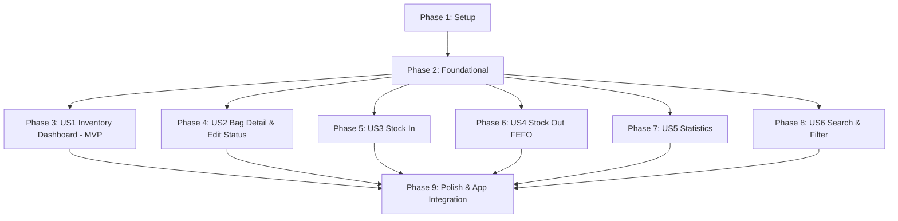

# Tasks: Blood Inventory Management (BC-UC-12 → BC-UC-17)

**Input**: Design documents from `specs/BC-UC-12-17-blood-inventory/` (`spec.md`, `plan.md`, `research.md`, `data-model.md`, `contracts/`, `quickstart.md`)

**Module Paths**:
- Backend: `src/backend-core/src/modules/blood-inventory/`
- Frontend: `src/frontend/src/modules/blood-inventory/`

---

## Phase 1: Setup (Shared Infrastructure)

**Purpose**: Module structure initialization for backend and frontend

- [x] T001 [P] Create backend module directory structure at `src/backend-core/src/modules/blood-inventory/`
- [x] T002 [P] Create frontend module directory structure at `src/frontend/src/modules/blood-inventory/`

---

## Phase 2: Foundational (Backend Model & Core Infrastructure)

**Purpose**: Data schemas, types, and API infrastructure that ALL user stories depend on

- [x] T003 [P] Create Mongoose model and schema for `BloodBag` in `src/backend-core/src/modules/blood-inventory/models/blood-bag.model.ts`
- [x] T004 [P] Create TypeScript interfaces & Zod validation schemas in `src/backend-core/src/modules/blood-inventory/schemas/inventory.schema.ts`
- [x] T005 [P] Create frontend inventory types in `src/frontend/src/modules/blood-inventory/types/inventory.types.ts`
- [x] T006 [P] Create Axios frontend API service client in `src/frontend/src/modules/blood-inventory/services/inventoryApi.ts`
- [x] T007 [P] Create reusable status badge component `BloodBagStatusBadge.tsx` in `src/frontend/src/modules/blood-inventory/components/BloodBagStatusBadge.tsx`
- [x] T008 [P] Create reusable blood type badge component `BloodTypeBadge.tsx` in `src/frontend/src/modules/blood-inventory/components/BloodTypeBadge.tsx`
- [x] T009 [P] Create days remaining progress bar component `DaysRemainingProgressBar.tsx` in `src/frontend/src/modules/blood-inventory/components/DaysRemainingProgressBar.tsx`

---

## Phase 3: User Story 1 - View Blood Inventory Dashboard (BC-UC-12) 🎯 MVP

**Goal**: Allow Blood Center Staff to view real-time inventory summary cards and browse paginated blood bag table.

**Independent Test**: Navigate to `/bc/inventory` and verify summary stats, table rows, and status badges.

- [x] T010 [US1] Implement backend service method `getInventoryList` with pagination & summary calculation in `src/backend-core/src/modules/blood-inventory/inventory.service.ts`
- [x] T011 [US1] Implement backend controller & route handler `GET /api/v1/bc/inventory` in `src/backend-core/src/modules/blood-inventory/inventory.controller.ts` & `src/backend-core/src/modules/blood-inventory/inventory.routes.ts`
- [x] T012 [P] [US1] Create React Query hook `useInventory` in `src/frontend/src/modules/blood-inventory/hooks/useInventory.ts`
- [x] T013 [P] [US1] Create summary cards component `InventorySummaryCards.tsx` in `src/frontend/src/modules/blood-inventory/components/InventorySummaryCards.tsx`
- [x] T014 [US1] Implement main inventory list page `InventoryListPage.tsx` in `src/frontend/src/modules/blood-inventory/pages/InventoryListPage.tsx`

---

## Phase 4: User Story 2 - View / Update Blood Bag Status (BC-UC-13)

**Goal**: Display comprehensive details of a blood bag (medical screening, storage, donor ref) and allow status updates with audit trail.

**Independent Test**: Click a bag row, view screening results, and update status to `Reserved` with a mandatory reason.

- [x] T015 [US2] Implement backend service methods `getBloodBagById` and `updateBagStatus` in `src/backend-core/src/modules/blood-inventory/inventory.service.ts`
- [x] T016 [US2] Implement backend controllers & routes for `GET /:bagId` and `PUT /:bagId/status` in `inventory.controller.ts` & `inventory.routes.ts`
- [x] T017 [P] [US2] Create status update modal `StatusEditModal.tsx` in `src/frontend/src/modules/blood-inventory/components/StatusEditModal.tsx`
- [x] T018 [US2] Implement blood bag detail page `BloodBagDetailPage.tsx` in `src/frontend/src/modules/blood-inventory/pages/BloodBagDetailPage.tsx`

---

## Phase 5: User Story 3 - Stock In Blood Bags (BC-UC-14)

**Goal**: Enable staff to batch receive new blood bags into active inventory with collection & expiry validation.

**Independent Test**: Open `/bc/inventory/stock-in`, fill multi-row form, and submit to verify new bags are saved.

- [x] T019 [US3] Implement backend service method `stockInBatch` with validation & unique `bagCode` generation in `src/backend-core/src/modules/blood-inventory/inventory.service.ts`
- [x] T020 [US3] Implement backend controller & route `POST /api/v1/bc/inventory/stock-in` in `inventory.controller.ts` & `inventory.routes.ts`
- [x] T021 [US3] Implement Stock In multi-row form page `StockInPage.tsx` in `src/frontend/src/modules/blood-inventory/pages/StockInPage.tsx`

---

## Phase 6: User Story 4 - Stock Out Blood Bags with FEFO (BC-UC-15)

**Goal**: Dispatch or discard selected blood bags with FEFO recommendation panel (highlighting bags expiring in ≤ 7 days).

**Independent Test**: Open `/bc/inventory/stock-out`, check FEFO recommendations, select reason, and confirm stock out.

- [x] T022 [US4] Implement backend service method `stockOutBatch` in `src/backend-core/src/modules/blood-inventory/inventory.service.ts`
- [x] T023 [US4] Implement backend controller & route `POST /api/v1/bc/inventory/stock-out` in `inventory.controller.ts` & `inventory.routes.ts`
- [x] T024 [P] [US4] Create FEFO recommendation panel component `FefoRecommendationPanel.tsx` in `src/frontend/src/modules/blood-inventory/components/FefoRecommendationPanel.tsx`
- [x] T025 [US4] Implement Stock Out selection page `StockOutPage.tsx` in `src/frontend/src/modules/blood-inventory/pages/StockOutPage.tsx`

---

## Phase 7: User Story 5 - View Blood Inventory Statistics (BC-UC-16)

**Goal**: Provide Chief Hematologists with visual analytics charts and stock threshold indicators.

**Independent Test**: Navigate to `/bc/inventory/stats` and verify Recharts bar chart, donut chart, and summary status table.

- [x] T026 [US5] Implement backend service method `getInventoryStatistics` in `src/backend-core/src/modules/blood-inventory/inventory.service.ts`
- [x] T027 [US5] Implement backend controller & route `GET /api/v1/bc/inventory/statistics` in `inventory.controller.ts` & `inventory.routes.ts`
- [x] T028 [P] [US5] Create Recharts analytics component `InventoryAnalyticsChart.tsx` in `src/frontend/src/modules/blood-inventory/components/InventoryAnalyticsChart.tsx`
- [x] T029 [US5] Implement Statistics dashboard page `InventoryStatsPage.tsx` in `src/frontend/src/modules/blood-inventory/pages/InventoryStatsPage.tsx`

---

## Phase 8: User Story 6 - Filter & Search Inventory Records (BC-UC-17)

**Goal**: Provide a reusable filter and search component across inventory screens.

**Independent Test**: Enter Bag ID in search bar, select blood type dropdown, and verify filtered results update instantly.

- [x] T030 [P] [US6] Create reusable filter bar component `BloodBagSearchFilter.tsx` in `src/frontend/src/modules/blood-inventory/components/BloodBagSearchFilter.tsx`
- [x] T031 [US6] Wire search and filter params into `InventoryListPage.tsx` and `StockOutPage.tsx`

---

## Phase 9: Polish & App Integration

**Purpose**: Mount routes into application router and perform quickstart validation

- [x] T032 Mount backend inventory routes into `src/backend-core/src/app.ts` (`app.use('/api/v1/bc/inventory', inventoryRoutes)`)
- [x] T033 Mount frontend page routes into `src/frontend/src/App.tsx` under `/bc/inventory/*`
- [x] T034 Execute end-to-end quickstart validation scenarios defined in `quickstart.md`

---

## Dependencies & Execution Order

